# Create and Configure Action in the process flow
<!-- description --> Create an action project from Open API specification.

## You will Learn
- To create and configure action project based on the API specification
- To release and publish action project to be consumed in the business process modelling
- To add action to the business process
- To map input fields of the action to the actual process content
- To release and deploy business process with actions

## Prerequisites
- You have created a Business Project and Process in SBPA as described [here](https://developers-qa-blue.wcms-nonprod.c.eu-de-2.cloud.sap/tutorials/abap-environment-sbpa-workflow-bp.html).
- You have created a process trigger as described [here](https://developers-qa-blue.wcms-nonprod.c.eu-de-2.cloud.sap/tutorials/abap-environment-sbpa-workflow-trigger.html).
- You have created a configured an Approval form as described [here](https://developers-qa-blue.wcms-nonprod.c.eu-de-2.cloud.sap/tutorials/abap-environment-sbpa-workflow-form.html).

## Intro
Action is a feature in SAP Build Process Automation to connect processes with external systems, be it SAP or non-SAP systems. This is an important piece of the puzzle especially if you want to automate or extend your business processes for any available LoB processes like S/4HANA, `SAP BTP ABAP Platform`, SuccessFactors etc.  These extensions can be easily built using SAP Build Process Automation, and using actions you can connect to your given S/4HANA, `SAP BTP ABAP Platform`, `Ariba` or other SAP LoB systems for any kind of GET, POST, PATCH, and other calls. 

In this tutorial, you will create an action project based on Open API.  The **Workflow Notification API** is an OData V4 service available to send the notification at the completion of a workflow step back to the calling system.  You will use the **POST** call from SBPA to BTP ABAP environment to notify if the travel request has been **Approved** or **Rejected** on completion of workflow.


### Create an Action Project
 1. Open **SAP Build Lobby** with your username and password, then do the following:

     - Under **Connectors**, select **Actions**.
     

 2. **Save** the below **Open API Specification** file as local `.edmx file`.
    
    
    ``` Sample Code
    {
       <?xml version="1.0" encoding="utf-8"?>
   <edmx:Edmx Version="4.0" xmlns:edmx="http://docs.oasis-open.org/odata/ns/edmx" xmlns="http://docs.oasis-open.org/odata/ns/edm">
     <edmx:DataServices>
       <Schema Namespace="com.sap.gateway.default.api_workflow_notification.v0001" Alias="SAP__self">
         <ComplexType Name="CT_NOTIFICATION_RESULT">
         </Action>
         <EntityContainer Name="Container">
           <ActionImport Name="ProcessCompleted" Action="com.sap.gateway.default.api_workflow_notification.v0001.ProcessCompleted"/>
           </EntityContainer>
       </Schema>
     </edmx:DataServices>
   </edmx:Edmx>
       <Property Name="notificationProcessed" Type="Edm.Boolean" Nullable="false"/>
         </ComplexType>
         <Action Name="ProcessCompleted">
       <Parameter Name="workflowInstanceId" Type="Edm.String" Nullable="false" MaxLength="36"/>
       <Parameter Name="outcome" Type="Edm.String" Nullable="false" MaxLength="255"/>
       <ReturnType Type="com.sap.gateway.default.api_workflow_notification.v0001.CT_NOTIFICATION_RESULT" Nullable="false"/>
    }                  
    ```
 3. Choose **Create**

     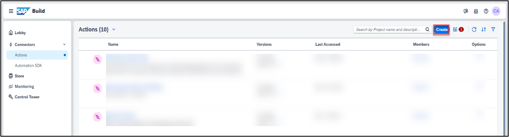

 4. In the **Choose an API Source popup**, under **API Specification**, select **Upload API Specification**.

     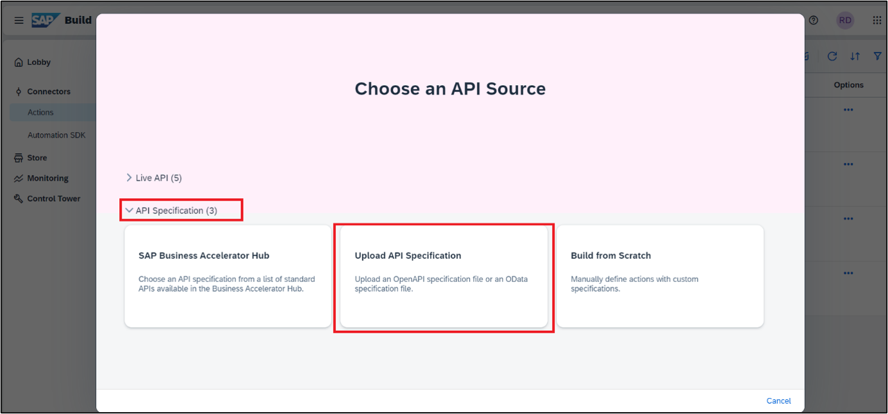

 5.	Drag and drop or click **Browse Files** to upload open specification file saved in step above.

 6. Choose **Next**.

     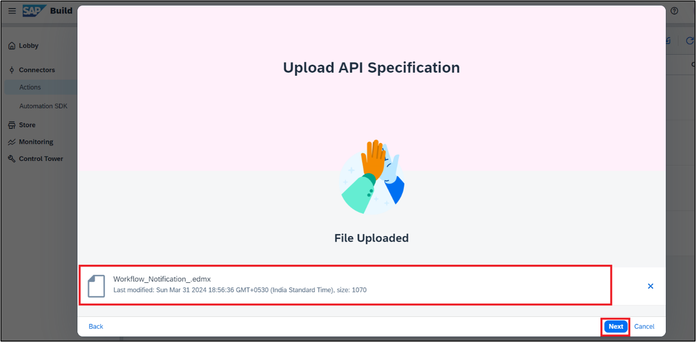

 7. In the **Create an Action Project Popup** do the following:  

     Enter the **Project Name** as **Workflow Notification**.  

     Enter the **Description** as **Workflow Completion Notification**.  

     Click **Create**.  

     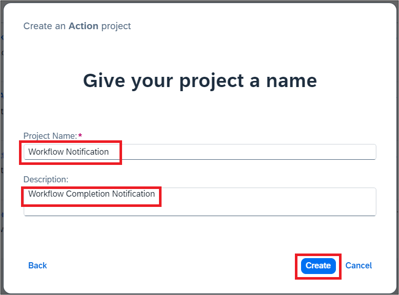

     As soon as the **Workflow Notification** Action gets created, SAP Build Actions will automatically open and the **Add Actions to Workflow Notification** pop up will appear.


 8. **Select** Service Operation **Post**. Click on **Add**

     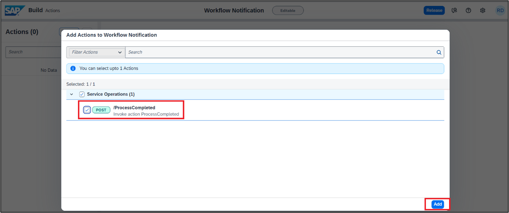
     
 9. SAP Build Actions will open with the selected APIs which can be further configured based on the requirements.

     - To update the project name, click on the pencil icon next to the project name.

     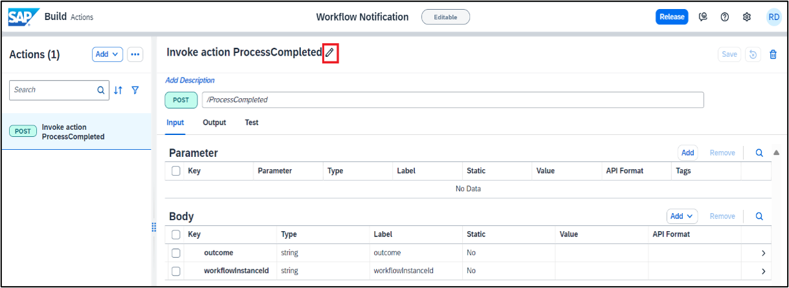

    >This action project name will help you search your action project from your API list,once published in action repository.   
 
     - Change the name to **Workflow Completion Notification**.
     - Once done, Select **Update** to submit the changes.  
 
      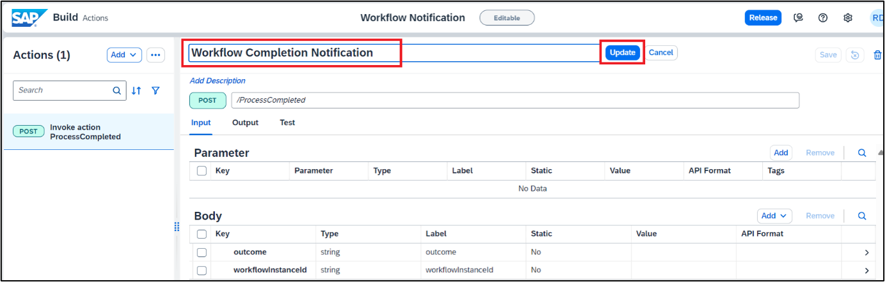

     - Enter the default value for **outcome** Input field by clicking on it.  
       **Set** the value for **outcome** to **Approved**.  

      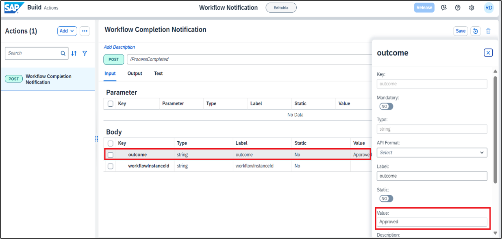

     It is also possible to change the field labels and update the input/output fields of the action project to keep only the mandatory fields that are needed.

     - As BTP ABAP environment APIs need CSRF token, you need to enable it. Select **Settings** icon.

      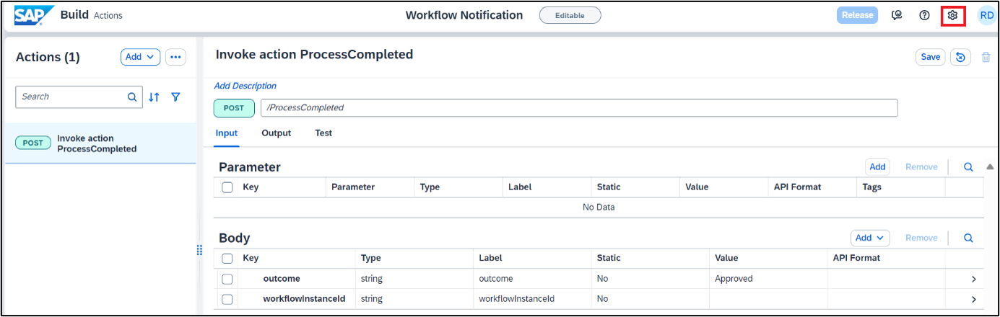

     - In the **Project Settings** window select **CSFR** and do the following:

        - **Enable CSFR** by selecting **YES**.
        - Under the **Token Fetch End Point** enter: `/`

      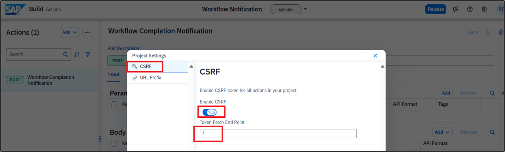

     - In the **Project Settings** Window, Select **URL prefix** and do the following 

        - **Enter Resource Path** /sap/opu/odata4/sap/api_workflow_notification/default/sap/api_workflow_notification/0001.
        - Choose **Save**.

    >Resource Path is required to create the **Final Action URL** by combining `{Destination URL} + {Resource Path} + {API Endpoint}`.  
     If you're exposing multiple services from the same system, you don't have to create different destinations to access those services. By configuring the resource path, you can set only one destination. 
     Resource paths must begin with `/` and can't end with `/`.  
 
      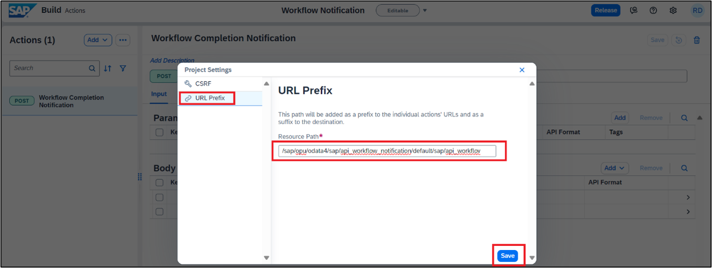

    >If you get Gateway Timeout issue while saving, then close the error dialog and refresh the browser.  
     If you see that changes are not saved, then try saving again and refreshing the browser.  

 10. **Save** the Action Project.  

      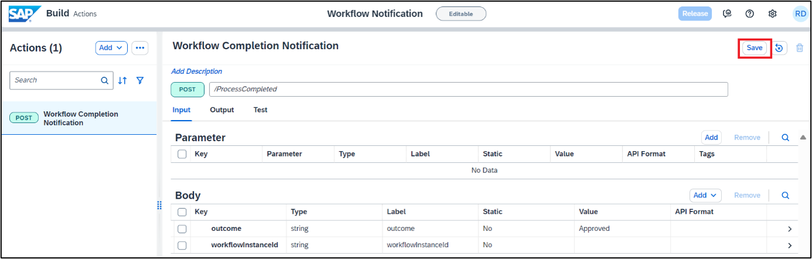

 11. **Release** the action project.

     You will now release the action project to create version(s) and then publish a selected version in the action repository. It is then these published actions that can be used in different processes and applications to connect to external systems.

       - To release a version of the action project click Release from top-right corner.
       - Enter the **Release Notes**: `Workflow Completion Notification V1`.  

    >Notice the version of the project. It is in `majorVersionNumber.minorVersionNumber.patchNumber` format.   

       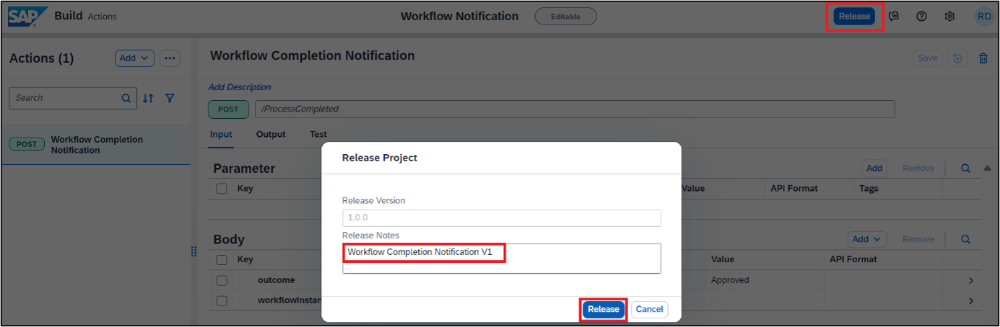

 12. **Publish** Action Project 

      Once the action project is released, you can then publish any release version of the action by clicking Publish to Library from top-right corner.

       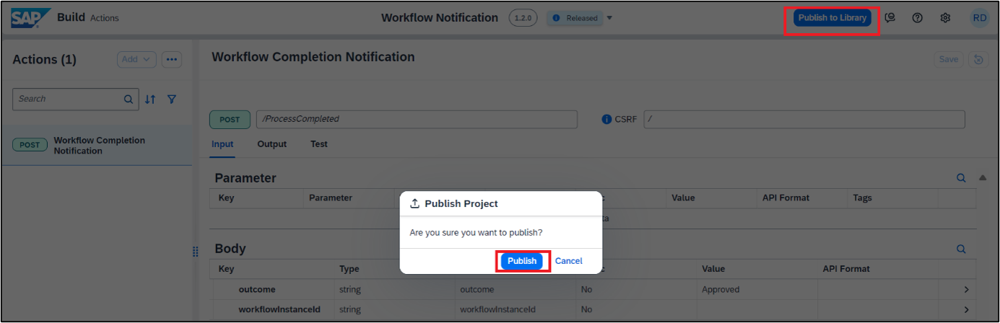

      With this you have successfully completed creating, configuring, releasing, and publishing of action project. Now you will use this published action to connect workflow business process to external systems via API.

### Add Action Project to Business Process

>Add the action in the business process to connect and send the workflow completion notification back to the system that triggered the workflow. You can do this by choosing the relevant action from the actions library and then configuring the actions parameters.

 1. Go to **lobby** and **open project**  `RAP110_Travel_Workflow`. Navigate to open the process builder canvas for **Travel Approval Processing** and click on **expand** `>` for the **Approval form**.

     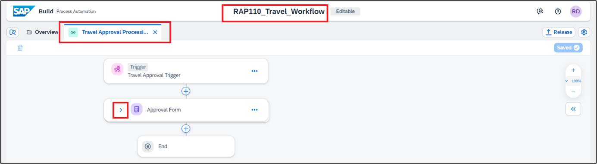

 2. To **add** the callback **action** once the form is Approved, click on the `+` on the **Approve** branch.

     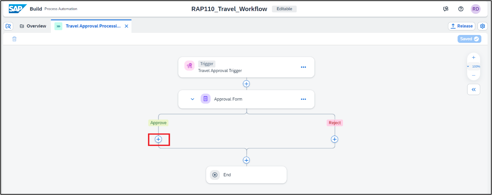

 3. From the options select **Action**.

     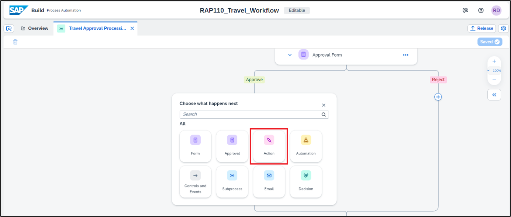

 4. In the **Browse Action** library pop up, enter the action name that you just   created like in this case **'Workflow Notification'** in the **Search** field, to find the actions published by you in the library. Once you find your action project click on **Add**.  

      This will add the action to your business process.

     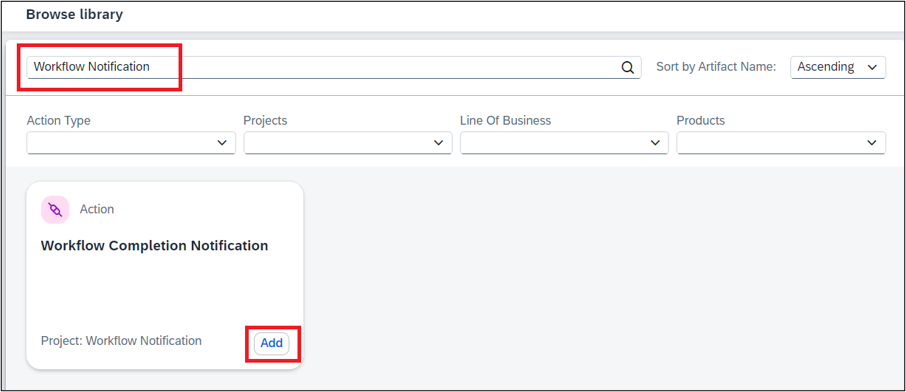

 5. Configure action for approval.

      On clicking the add button your action will be added to the business flow and a  **pop-up window** will open to **configure the action settings** for Destination,  input and output parameter mapping.

      In **General tab** of action parameters, expand **Destination** variable and choose **`+`Create Destination Variable**.  

      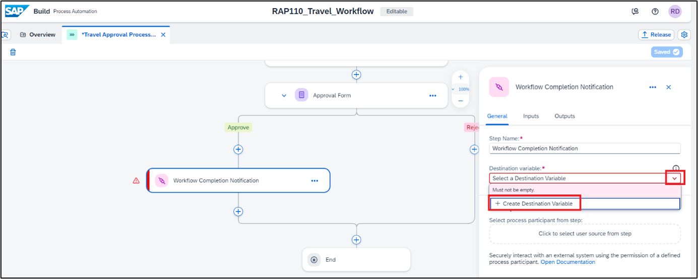

 6. In the pop-up window for **Create Destination Variable**, fill in the below **values** and choose **create**.

    | Input Field |    Value
    | :---------- |    :----- 
    | Identifier  |   `CallBack_Destination`   
    | Description |   `CallBack Destination`  

     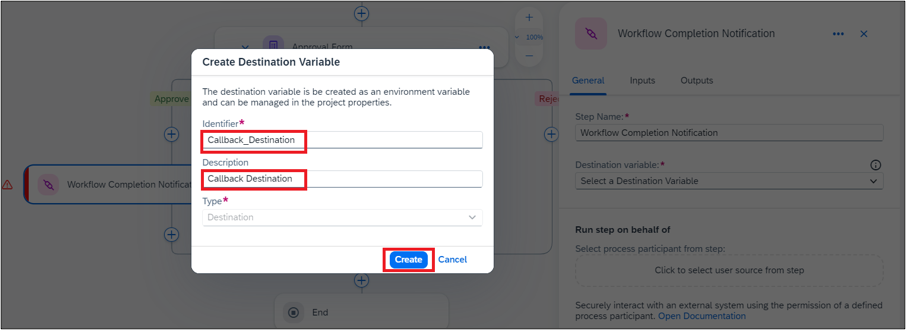

    >A Destination variable is required to connect the action to a configured system. The actual destination value is selected on the deployment of the Business Process.

 7. Click **Inputs** tab and map each input to the actual process content.
      
      Please note that since the **default** value for **Outcome** is set to **Approved** in the Action project we will not be setting it here.  

      To set the value for **WorkflowInstanceId** click on the field and select **Process Instance ID**    from the **Process Metadata**.  
 
      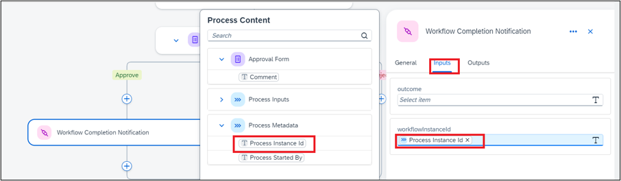

 8. To call the action in case the **Approval form** is Rejected, click on the `+` on  the **Reject** branch and follow all the steps described above for the Approve branch to add the action.

 9. Once the **Action** is added to the **Reject branch**.  In **General tab** of  action parameters, expand **Destination** variable and choose the destination **Callback_Destination** you already created.

      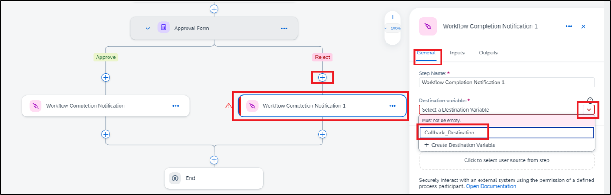

 10. Click **Inputs** tab and map each input to the actual process content for the   **Reject branch** action trigger. 

      As the **default Outcome** is Approved, we will have to change the value in case of Approval form **rejection**. 
 
    | Input Field |   Value
    | :---------- |   :------
    | Outcome |    Map it to the Approval Form output field **comment**
    | Workflowinstanceid |    Map it to the field **process instance id** under process Metadata

      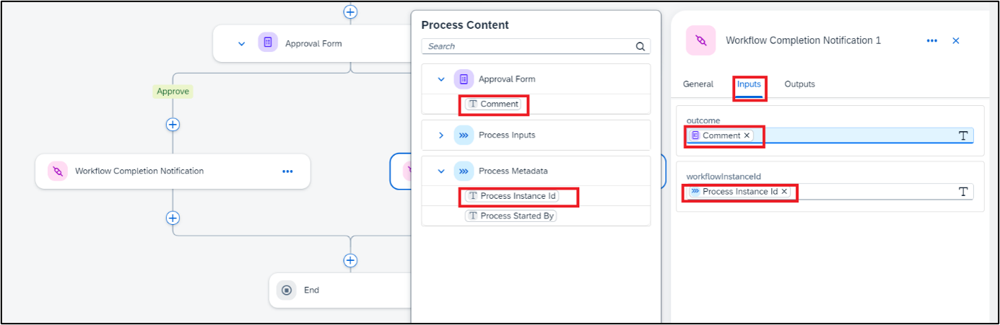

 11. **Save** the business process.

      The final process should be same as shown below.

      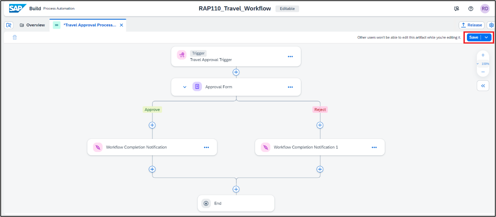

### Test Yourself


 


 
 
     