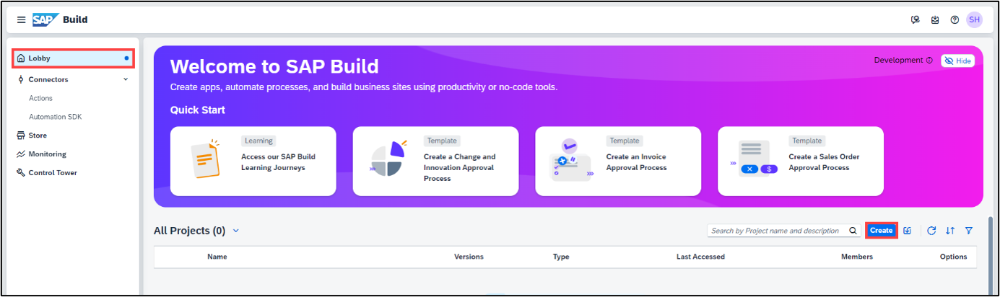
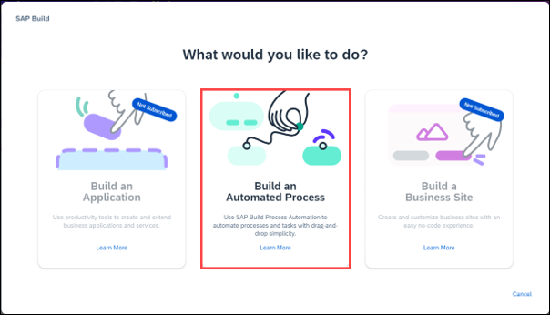
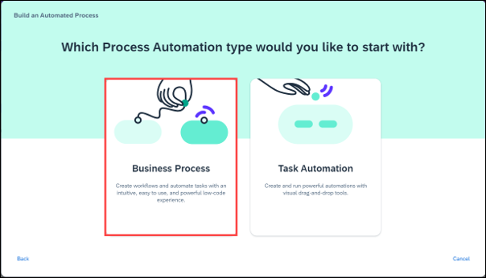
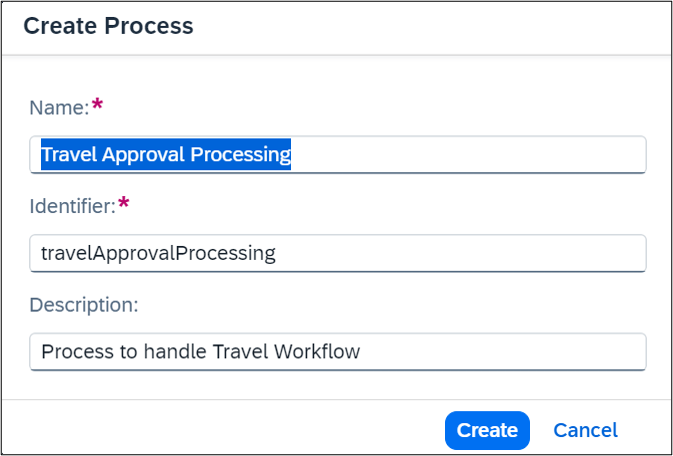

# Create a Business Process Workflow in SBPA.
<!-- description --> Create a Business Project and Process to build and extend business processes.

## You will learn
- How to create an SAP Build Process Automation project.
- How to create a process that automates travel approval.

## Prerequisites
- Access to a SAP BTP tenant with SAP Build Process Automation

### Create a Business Process Project

1. In the **Lobby** choose **Create**.
 
    >The lobby is a central page for creating, accessing, and managing your projects in SAP Build. You can access business application processes, company configured templates, and other resources for your end-to-end business process.

         

2. Build an **Automated Process**.
 
        

3. Select **Business Process**.

    >Business Process Projects are a collection of skills in SAP Build Process Automation. Projects are part of the internal business processes of a company and are defined based on business scenarios. A project can contain a set of processes, forms, automations, and decisions, which are reusable artifacts.

       

4. In the **Create a Business Process Project** dialog box, do the following:

     - Enter a **Project Name**: `RAP110_Travel_Workflow`
     - Enter a **Short Description**: RAP 110 Travel Workflow
     - Choose **Create**

      

### Create a business process.

 1. A new tab opens with the newly created project.

 2. In the Create Process dialog box, provide the following:
	 - Enter a **Name**: Travel Approval Processing
     - Enter a **Description** for your process: Process to handle Travel        Workflow 
     - Choose **Create**

>Inside a project, you can create a process. This process is equivalent to a  workflow in any business scenario. As part of the process flow, you could create various artifacts such as forms, decisions, automations.
 
   

>The Identifier field is auto filled.

### Test yourself

