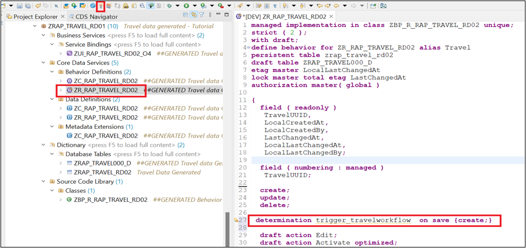
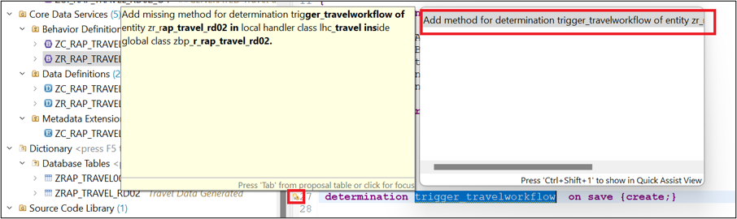
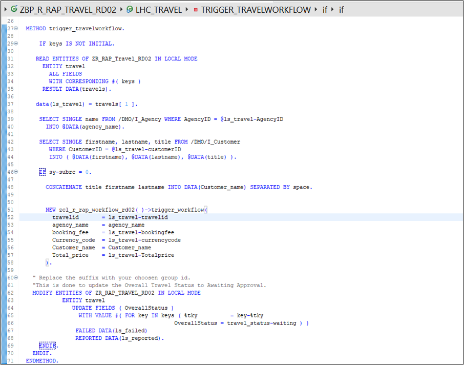
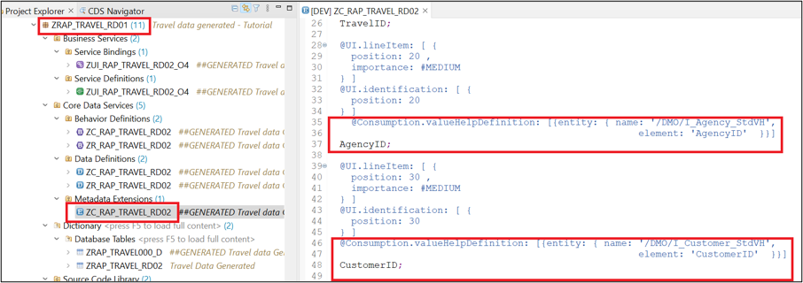

# Extend the RAP Travel Application to integrate workflow capability
<!-- description --> Enhance the business object behavior using determination to add workflow functionality. 

## You will learn
- How to define determinations
- How to implement determination
- How to use EML in Local Mode


## Prerequisites
- You need to have access to an SAP BTP, ABAP environment, or SAP S/4HANA Cloud, ABAP environment or SAP S/4HANA (release 2022 or higher) system.
- Latest Version of ADT with [abapGit plugin](https://eclipse.abapgit.org/updatesite/)
- You have created the Travel App with workflow handler class as explained [here](https://developers-qa-blue.wcms-nonprod.c.eu-de-2.cloud.sap/tutorials/abap-environment-sbpa-workflow-handler-class.html#449f0c32-02ac-44f1-9036-f969a8d553c6)

## Intro
As part of this tutorial, you would extend the Managed Business Object behaviour by defining and implementing a **Determination on Save** `trigger_travelworkflow` during action **Create** (trigger condition). You will use the Entity Manipulation Language *to implement the transactional behavior of the Travel business object*. 

On **Creation** of the travel booking, during save event Determination on Save `trigger_travelworkflow` will be called. `trigger_travelworkflow`  will intern **trigger workflow** for travel approval and set the overall status of the travel to **awaiting approval.**

*Reminder: Do not forget to replace the suffix placeholder #### with your chosen or assigned group ID in the exercise steps below.*

>A determination is an optional part of the business object behavior that modifies instances of business objects based on trigger conditions. Determinations are implemented when we need to calculate values of few fields based on trigger conditions.

>A determination is implicitly invoked by the RAP framework if the trigger condition of the determination is fulfilled. Trigger conditions can be CRUD operations or fields. Determinations can be created On modify or On save based on if we want to display the value of a calculated field to the user before save or after save.

>Please refrain from writing fields which needs to be determined / calculated in the trigger conditions of that determination as it might lead to infinite loop since we are specifying the calculated field in the trigger condition and changing the field inside that determination which is resulting in application dumps.

### Define Determination.

**Extend** the Business Object Behaviour definition with **Determination On Save**.

1. Go to behaviour definition of the Travel root entity   `ZR_RAP_TRAVEL_####` and define the determination  `trigger_travelworkflow`. For that, insert the following code as shown in the screenshot below.

```ABAP Code

    determination trigger_travelworkflow on save `{create;}`

```
  
   

   **Short explanation:** This statement specifies that the determination would be triggered during the save event of the operation Create. The determined values would be visible after save.

 2. **Activate**  the changes

 3. **Click** on the **Quick Assist**  besides the newly added line of code and the **Add method for determination** to declare the required method in behavior implementation class.

     

 4. As a result, you can see the method `trigger_travelworkflow` for determination is added in the local handler class LHC_TRAVEL of Behaviour implementation class `ZBP_R_RAP_TRAVEL_RD02`

     

     **Short Explanation:**

       - The addition **FOR DETERMINE** indicates that the method provides the implementation of a determination and the addition **ON SAVE** indicates the **specified trigger time** (during save event).

       - **IMPORTING** parameter **keys** – is an internal table containing the **keys of the instances** the determination will be executed on. Includes all entities for which keys must be assigned.

       - Implicit CHANGING parameter **reported** - used to return messages in case of failure.

 5. Activate  the changes

### Implement Determination

You will now implement the determination to call trigger workflow method created as part of the previous tutorial and update the overall status of Travel to **(W)** Awaiting Approval using **(EML)** Entity Manipulation Language In **Local Mode**.

>Calling EML statements in the local mode - by using the addition IN LOCAL MODE –excludes feature controls and authorization checks. This addition can thus be used to change a BO Instance locally by the same RAP business object itself, i. e. not for other RAP business objects.

 1.	Define the **local constant** `travel_status` to store the allowed value of the **overall status** of a Travel instance. Insert the following code snippet in the definition part of the local handler class `lhc_travel` in **Private section** as shown on the screenshot below.

     Insert the following code snippet.

    ```ABAP Code:
       CONSTANTS
         "Travel Status:
         BEGIN OF travel_status
           open TYPE c Length 1 Value 'O', "Open
           accepted TYPE c Length 1 Value 'A', "Accepted
           rejected TYPE c Length 1 Value 'R', "Rejected
           waiting TYPE c Length 1 Value 'W', "Awaiting Approval
       End of travel_status 
    ```
       
     Your code should look like

     

 2. Implement the method `trigger_travelworkflow` in the local class `lhc_travel` of the Business Object Behaviour Implementation Class `ZBP_R_RAP_TRAVEL_####`.

	  Insert the following code snippet in the method and replace all occurrences of the 	placeholder `####` with your group ID. You can use the F1 help to get detailed information 	on each EML statement

    
    ```ABAP Code:
       METHOD trigger_travelworkflow.

           IF keys IS NOT INITIAL.

           READ ENTITIES OF ZR_RAP_Travel_RD02 IN LOCAL MODE
           ENTITY travel
               ALL FIELDS
               WITH CORRESPONDING #( keys )
               RESULT DATA(travels).

            data(ls_travel) = travels[ 1 ].

           SELECT SINGLE name FROM /DMO/I_Agency WHERE AgencyID = @ls_travel-AgencyID
           INTO @DATA(agency_name).

           SELECT SINGLE firstname, lastname, title FROM /DMO/I_Customer
           WHERE CustomerID = @ls_travel-customerID
           INTO ( @DATA(firstname), @DATA(lastname), @DATA(title) ).

          IF sy-subrc = 0.

          CONCATENATE title firstname lastname INTO DATA(Customer_name) SEPARATED BY space.


           NEW zcl_r_rap_workflow_rd02( )->trigger_workflow(
             travelid       = ls_travel-travelid
             agency_name    = agency_name
             booking_fee    = ls_travel-bookingfee
             Currency_code  = ls_travel-currencycode
             Customer_name  = Customer_name
             Total_price    = ls_travel-Totalprice
           ).

           " Replace the suffix with your choosen group id.
           "This is done to update the Overall Travel Status to Awaiting Approval.
           MODIFY ENTITIES OF ZR_RAP_TRAVEL_RD02 IN LOCAL MODE
                 ENTITY travel
                    UPDATE FIELDS ( OverallStatus )
                    WITH VALUE #( FOR key IN keys ( %tky          = key-%tky
                                               OverallStatus = travel_status-waiting ) )
                   FAILED DATA(ls_failed)
                   REPORTED DATA(ls_reported).
             ENDIF.
            ENDIF.
           ENDMETHOD.
    ```

      your code should look like

      

      **Short Explanation**

       - **Read** the travel instance(s) data with the transferred keys (**keys**) using the EML statement **READ ENTITIES IN Local MODE**.
       - **Enrich** the data by getting Agency Name and Customer name, by reading from the CDS Views.
       - **Call** the method **trigger_workflow** from workflow handler class **zcl_r_rap_workflow_####** to **trigger workflow** by passing all the required data retrieved in the previous steps.
       - As a final step update the **Overall Travel Status** to `Awaiting Approval` by EML statement MODIFY ENTITIES `IN Local Mode` using the transferred keys (keys).
 
 3. **Activate**  the changes     

    >**Where** to trigger the workflow from, in case of **Unmanaged Numbering?**  
    The actions required to trigger a workflow instance are defined as save actions and can thus only be called during the **early or late save phase** of a RAP Business Object.  
    Choosing between early or late phase totally depends on how you are generating the numbering for the key field like in this case **Travel ID**.  As the key would be required for your identifying the entry during callback processing.  

    >**Early Numbering:** Trigger the workflow instance in a determination on save with the required methods.      
    
    >**Late Numbering:** Trigger the workflow in a determination on save. To get the generated key field , you can set the payload with the setPayload method even later in the adjust_numbers method.
     
### Add Value Help to enrich Travel Application UI.

Without proper values for Customer ID and Agency ID the read on the CDS views to get Customer Name and Agency Name would not work. Thus, add value help to the fields to select values.

 1. Go to metadata extensions for your RAP application

     

 2. Using the below annotation add value help for Agency ID.
    Insert this code above the field name AgencyID in Metadata Extension.

    ```ABAP Code:
       @Consumption.valueHelpDefinition: 
        [{entity: { name: ' /DMO/I_Agency_StdVH', 
          element: ' AgencyID'  }}]`
    ```

 3.	Using the below annotation add value help for Customer ID.
    Insert this code above the field name CustomerID in Metadata Extension.

    ```ABAP Code:
      @Consumption.valueHelpDefinition: 
       [{entity: { name: '/DMO/I_Customer_StdVH', 
         element: 'CustomerID'  }}]
    ```
    
       **Short explanation:** Here entity name is the Value help CDS View for field and element name in the corresponding field name in Value Help CDS View for which the Value help is being provisioned.

     **Value Help** should now be **available** for the fields.

    With this you are done with the implementation part, further we will see how to Preview, run, monitor, and troubleshoot the Travel App.

    >In case your value help shows no data try to clear your browser cache or try previewing the application with browser in Inprivate or Incognito mode.

### Test yourself   


    
    


 
 