# Create and Configure Approval Form.
<!-- description --> Create approval form to send tasks for approvals to business users.

## You will learn  
- How to design the form with layout and input fields using drag-and-drop approach
- How to configure the forms as a process steps

## Prerequisites
- You have created a Business Project and Process in SBPA as described [here](https://developers-qa-blue.wcms-nonprod.c.eu-de-2.cloud.sap/tutorials/abap-environment-sbpa-workflow-bp.html).
- You have created a process trigger as described [here](https://developers-qa-blue.wcms-nonprod.c.eu-de-2.cloud.sap/tutorials/abap-environment-sbpa-workflow-trigger.html).

## Intro
Tasks are a part of any business process. SAP Build Process Automation helps you to create forms that are made available to the business users in their inboxes to take relevant action.  

These interactive forms can be created by dragging and dropping the text elements and input fields into the canvas. Once a form has been created, it can then be used as an approval step in the business process.  

Let us now explore how to create an Approval Form.

### Create an Approval Form

 >The approval form will be used to get faster and easier approvals from the business users to take informed decisions and get rid of sending emails. These approval forms could be about approving or rejecting sales orders, invoices, IT requests etc. The forms are then converted into tasks in an automated workflow which will appear in approvers inbox and can be accessed using `My Inbox` integrated with SAP Build Process Automation.

You can create these different forms using the Form Builder embedded in the process builder using different form field options. You can design and modify them without any coding.

 1. Go to process **Travel Approval Processing** and choose `+` below the Trigger.

    

 2. Choose **Approval** from the available options.

    

 3. Choose **Blank Approval**

     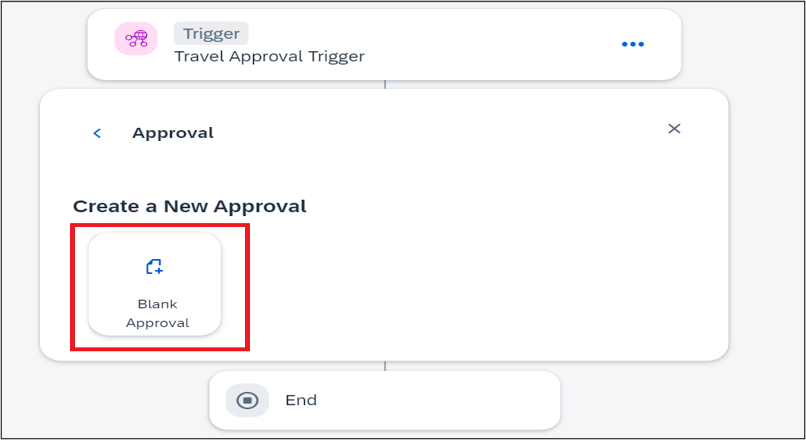

 4. In the **Create Approval** dialog box, do the following:

    - In the Name field enter: **Approval Form**.
    - In the Description field enter: **Form to approve or reject Travel**.
    - Choose **Create**.

     

 5. Choose **Open Editor** of the Approval Form.  
    
    Two ways to open editor are marked in the below screen shot.

     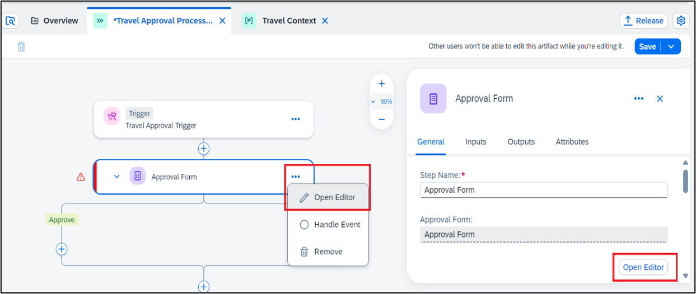

 6. Design the Approval Form in the form builder by dragging-and-dropping fields into the form editor and configuring respective field settings.
     
    | Form Field |   Field Setting with Label |
    | :-------- |    :----------------------- |
    | Headline 1 |    Travel Approval |
    | Paragraph |    A new travel request has been received. Please review and confirm whether it can be fulfilled or not. |
    | Paragraph |     Travel Details: |

     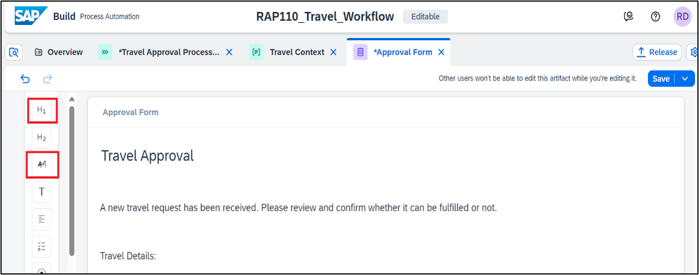

 7. Add **Input Fields**, enter the labels and select the **Read Only** checkbox.  

    These fields will take value from the input of the process i.e., fields sent from the external system.

    | Form Field |   Field Setting with Label |
    | :-------- |   :----------------------- |
    | Text |   Travel ID |
    | Text |   Agency Name |
    | Text |   Booking Fees |
    | Text |   Currency Code |
    | Text |   Customer Name |
    | Text |   Total Price |

    Drag and drop the text boxes to create the fields:

     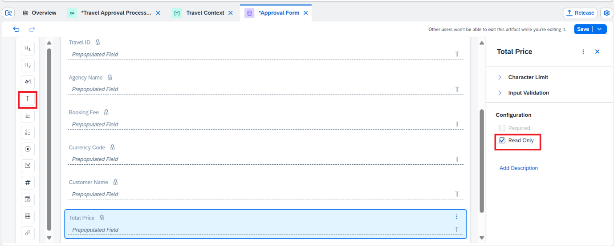

 8. Add **Input Fields** and enter only the labels. These will be fields which approver  can fill while evaluating the approval form. They can be made Required depending upon the scenario.
 

    | Form Field |    Field Setting with Label |
    | :-------- |     :----------------------- |
    | Text |    Comment|
    | Required |   Set Required |

     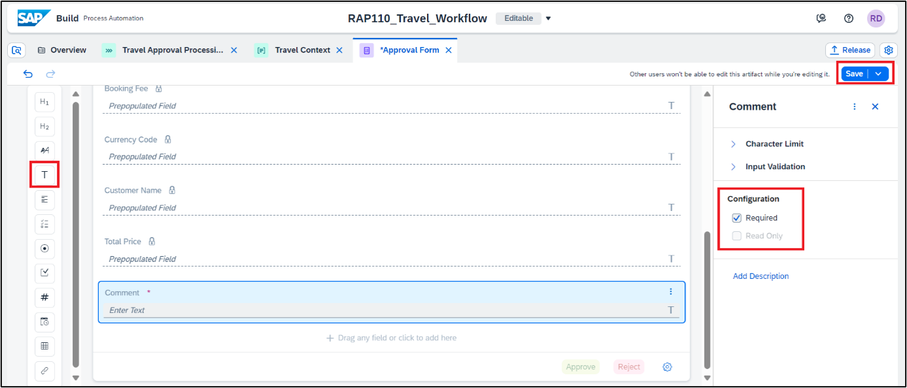

 9. **Save** the Form.

### Configure the Approval Form in the Process Flow.

Once the approval form is created its time to include it in the process flow and configure it to take the read only field values from Process Input.

 1. Go to process **Travel Approval Processing** and choose `+` below the Trigger.

    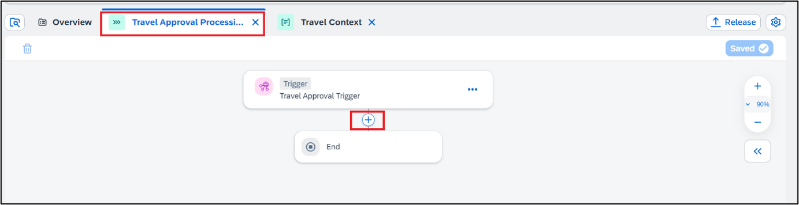

 2. Choose **Approval** from the available options.

    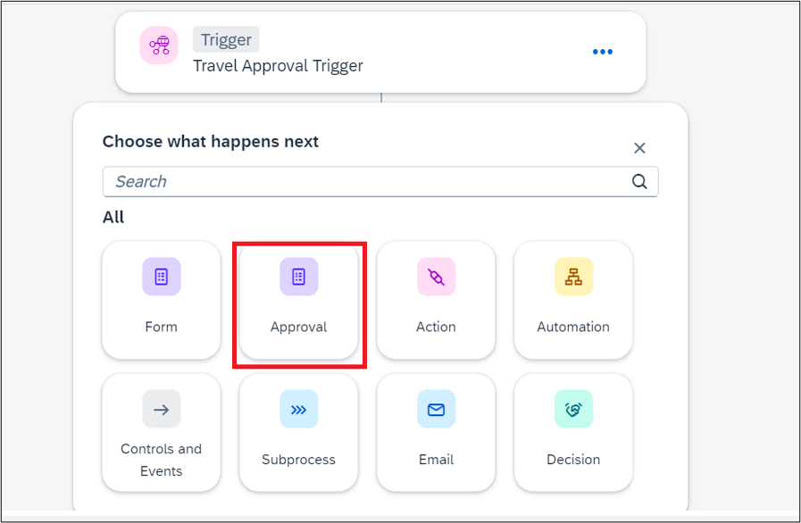

 3. Select the Approval form Created.

     

 4. Select the **Approval Form** to configure the **General** Information Section

    a. Set the title of the **task** that will be displayed in the **Inbox**, enter the below details.
 
    | Field |    Values |
    | :-------- |    :----------------------- |
    | Subject |    Review and approve travel Travel id [Select **Travel ID** from Process Input] for customer   [Select **Customer Name** from Process Input]|
    | Description |    Travel Approval |
    | Priority |    High |

      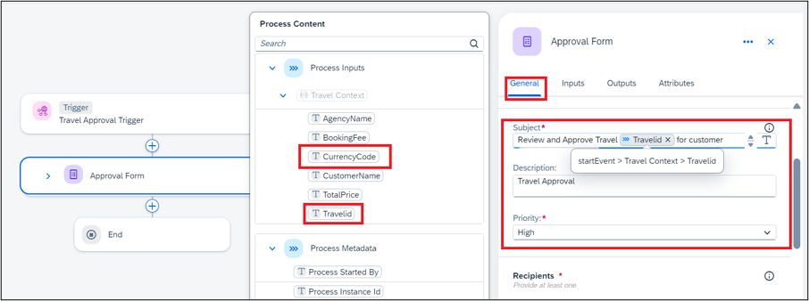

    b. Set the **Recipient**, detail of the user who would receive the approval form in their inbox for approval. 
    Multiple valid email addresses can be added separated by commas in the below fields. 
    It is mandatory to fill one of the fields users or groups. We are filling Users field here.

    | Field |    Values |
    | :-------- |   :----------------------- |
    | Users |   **Process Started By** [Select Process Started by from Process    Metadata], abc.xyz@sap.com

      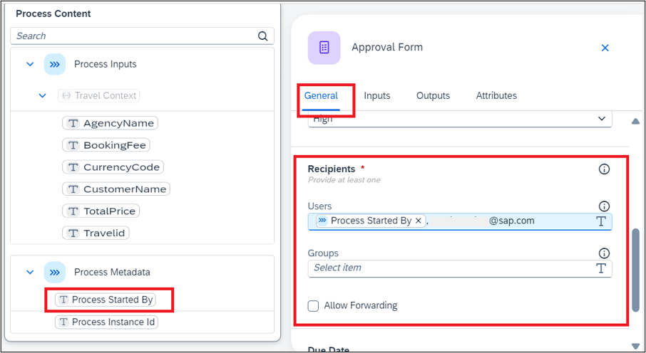

 5. In the Due Date section:   
    
    Select Static Duration as type of due date.

    Enter 2 Days as the duration.

    >As the task appears in the My Inbox, there will be duration information shown to the recipients like Overdue if the task was not completed in 2 days or within 1 day if the task is supposed to be completed in 1 day etc.  
    >This means that the due date to approve or reject the form will be set to 2 days.

       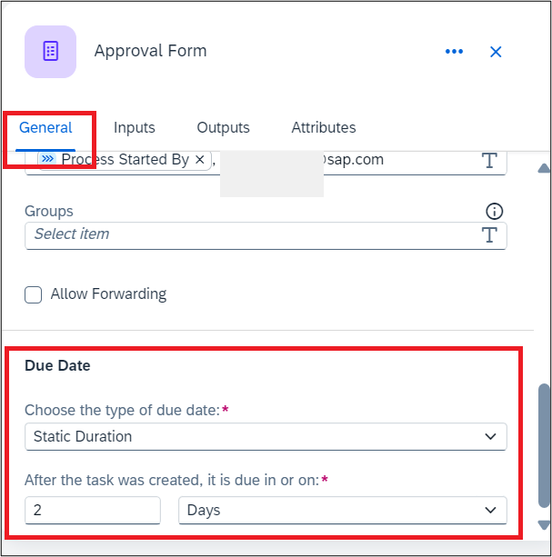

 6. Similarly, go to the Inputs section and map the different input fields, which were marked as read-only in the approval form, by selecting the respective Process Content entry. 

    | Form Input Field |    Process Content Entry |
    | :-------- |    :--------------------------- |
    | Travel ID |     Travel ID |
    | Agency Name |   Agency Name |
    | Booking Fees  | Booking Fees |
    | Currency Code | Currency Code |
    | Customer Name | Customer Name |
    | Total Price | Total Price |
     
      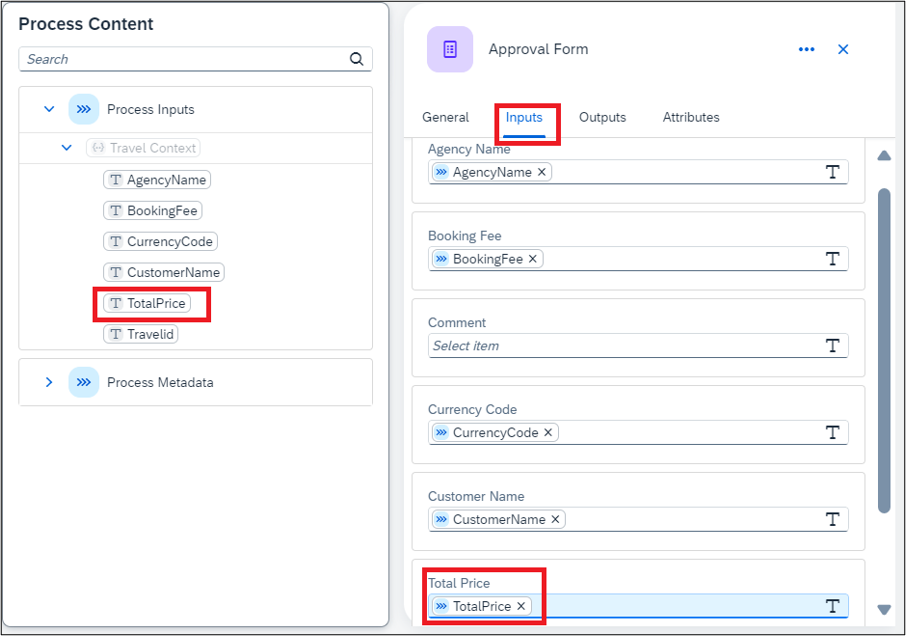

    
    >The  Process Content will highlight the entries with the same data type of the input field. For example: if the input field is of Number type, then Process Content will show only number-type entries.

 7. Save the process.  

    The process should look like below:

     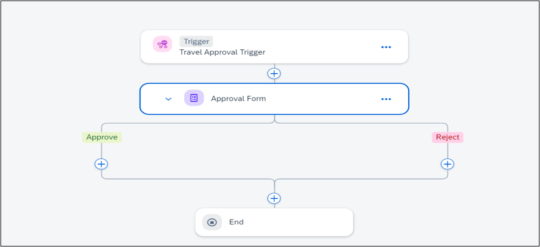

### Test yourself

