# Create and Implement the Workflow Handler Class
<!-- description --> Create and implement the workflow handler class to trigger the workflow and handle callbacks from  SAP Build Process Automation to receive workflow completion notifications and outcome.

## You will learn
- How to create a workflow handler class.
- How to enable it to receive callbacks.
- How to call RAP Façade for SBPA workflow trigger.
- Methods to use to get trigger data and process callbacks.

## Prerequisites
- You have bought a licensed version of SAP BTP ABAP Environment.
- Latest Version of ADT with [abapGit-plugin] (https://eclipse.abapgit.org/updatesite/) 
 - Make sure, your system has the ABAP flight reference scenario by searching for package **/DMO/FLIGHT. If your system does not have this scenario. You can download it [here] ([https://eclipse.abapgit.org/updatesite/]). 
- Follow the tutorial [Rap-Generator] (https://developers.sap.com/tutorials/abap-environment-rap-generator.html#fc3f99be-39fc-41f8-9251-8647ef04434b) to create a travel App.

## Intro
Once you have created a basic RAP Travel Application by following steps in tutorial [Generate a RAP Business Service](https://developers.sap.com/tutorials/abap-environment-rap-generator.html#fc3f99be-39fc-41f8-9251-8647ef04434b)  with the wizard. You would now create a new class in the application package to handle workflow related implementations i.e., method to **create workflow trigger** and method to **handle callbacks** to receive outcome of workflow from SAP Build Process Automation once the process is completed. 

In case of **Travel Approval Workflow**, the callback applies the accept / reject decision of the workflow to the Accept Travel /Reject Travel statuses of the related travel instance.


### Create a workflow handler class

The workflow handler class will contain all the method implementations, constants, interface data types to exchange information with SAP Build Process Automation for workflow.

To create the class, follow the below steps:

 1. Right click on your **Package** and select **New > ABAP Class**

    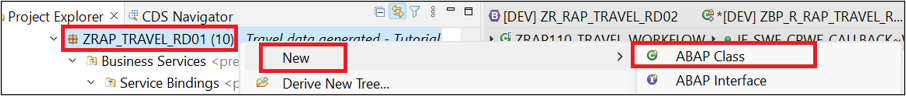

 2. Enter the below values to create the class.

    Name: `ZCL_R_RAP_WORKFLOW_####`

    Description: Workflow Handler Class

 3.	Click **Add** to enter Interface and search for callback Interface     `IF_SWF_CPWF_CALLBACK`. 
 
    Click **OK** once found.

    

 4. Click **Next**. Select the **transport request** for your application and click **Finish**.
 
 5. Class is now **created**. You can see that the interface addition came with the method  **workflow_instance_completed** which would be triggered during callback post completion of workflow in SAP Build Process Automation.  

    In the later steps we would implement this method to receive workflow decision/notification. 

      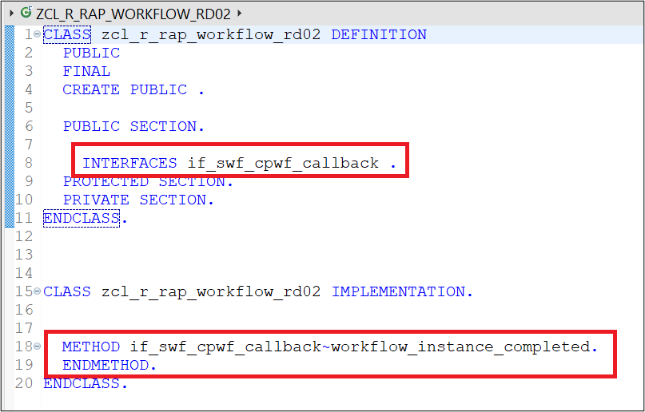

    Thus to enable a class to be callback class we need to add Interface `IF_SWF_CPWF_CALLBACK` to it.

    >`IF_SWF_CPWF_CALLBACK` is the interface required to handle callbacks. The method `WORKFLOW_INSTANCE_COMPLETED` of this interface is triggered in background once the Action Workflow Completion Notification is triggered in SAP Build Process Automation Post Approval Form is acted upon by the Approver (Accepted/Rejected).  
       
    > To troubleshoot/debug this method you would use the Background workflow user `SAP_WFRT`.

  ### Enrich the class definition with Constants and Data Types and Methods

 Define the class artifacts required for workflow processing.

 1.	Define Context (Interface) Data type in the private section of the class. **Insert** the below code.

 
    This should be same as the data type context structure declare in SAP Build Process Automation.

    ```ABAP Code:
    Interface data type for information exchange.
      TYPES: BEGIN OF context,
             travelid      TYPE string,
             agency_name   TYPE string,
             booking_fee   TYPE string, 
             Currency_code TYPE string,
             Customer_name TYPE string,
             Total_price   TYPE string,
           END OF context,
           BEGIN OF type_context,
             travel_context TYPE context,
           END OF type_context.
    ```

     
    Since the Datatype identifier name created in SAP Build Process Automation is `TravelContext` thus we have also declared the structure name as `travel_context`. How the name conversion works when we convert from ABAP data to JSON format will be explained in detail as we go through the tutorial.  

      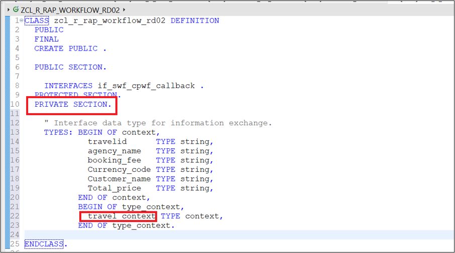

    >Please note, Context (Interface Data) must have the same field data types and names on both sides of the Interface. Context is case sensitive, so any deviation would lead to error.   
     `HTTP request for use case START_WI failed (HTTP code 422, Reason 'Unprocessable  Entity')`

 2.	Get the workflow definition ID from SAP Build Process Automation.  

      a. Login to SAP Build Process Automation.  

      b. Navigate to Monitoring > Processes and Workflows  

       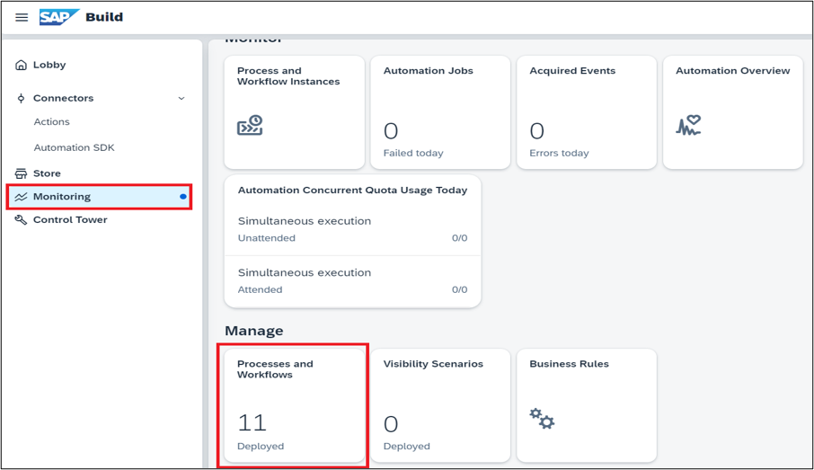

      c. **Choose** your project name from the drop down > **Select** the project name. 

       **Copy** the entire text in **ID** highlighted below, that is your **Workflow Definition ID**.

       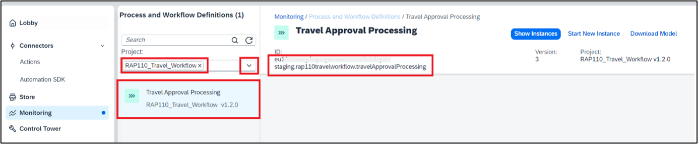

 3. Define Constants in the private section of the class. Insert the below code. 


       
    ``` ABAP Code:
        Constants for workflow,
        CONSTANTS:
           BEGIN OF travel_status, 
             open     TYPE c LENGTH 1 VALUE 'O', "Open,
             accepted TYPE c LENGTH 1 VALUE 'A', "Accepted,
             rejected TYPE c LENGTH 1 VALUE 'X', "Rejected,
             waiting  TYPE c LENGTH 1 VALUE 'W', "Awaiting Approval,
           END OF travel_status,
           travel_wf_defid      TYPE if_swf_cpwf_api=>cpwf_def_id_long  VALUE 'euXX-XXXX.XXXX-XXXXX-XXXX-XXXXXXX-					XXXX.rap110travelworkflow.travelApprovalProcessing', " Replace this value with your workflow definition id.
           wf_retention_days    TYPE if_swf_cpwf_api=>retention_time VALUE '30',
           callback_class       TYPE if_swf_cpwf_api=>callback_classname VALUE  'ZCL_R_RAP_WORKFLOW_XXXX', " Replace this with your callback class
           consumer             TYPE string VALUE 'DEFAULT'.
    ```    

    >Do not forget to replace the values for **workflow definition ID & Callback class** values for your implementation.


    |Constant Name |Use |Values
    | :-------- | :------ | :------
    | Travel_status |    To store the allowed value of the overall status of a Travel instance | Possible values can be Open (O), Approved (A), rejected (R) and Awaiting Approval (W).   
    | wf_retention_days |   Retention time is the time we keep the database entry post completion of Workflow instance. After the retention days are passed the database entry will be deleted automatically.  
    |                     |   In case the retention time is set to 0 the entry would not be deleted automatically but would require an API call for deletion |    Set the retention days to `30`
    | callback_class |   Class we created with callback interface to be used while Registering the SAP Build Process Automation Workflow using RAP Facade |  Set the Value to  ZCL_R_RAP_WORKFLOW_XXXX
    | Consumer |   Tells the information on where to trigger the workflow. |    Set the Value to `DEFAULT`
    |    |   In the Communication Arrangement for SAP Build Process Automation we have set the consumer type (Workflow) as default |    As we need to execute the workflow in SBPA
    | travel_wf_defid |    Is the Definition ID of the workflow we created in SBPA |     Set the value to the Workflow definition ID retrieved from SAP Build Process Automation.


     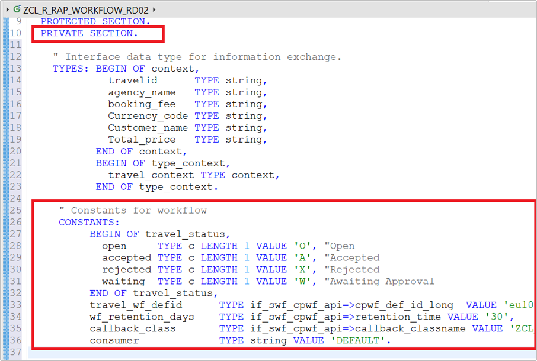

 4. Define Method to trigger workflow in public section. 

    The method interface will consist of all the **`travel_context`** fields declared in the datatype.

    It is declared in the public section of the class so that it can be called from the behaviour definition class of the RAP Business Object.

     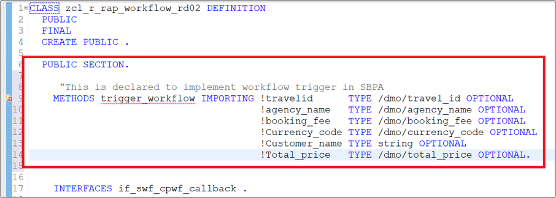

 5. **Click** on **Quick Assist** available on the left side of the newly defined  method > **Click Add implementation for trigger workflow** 

     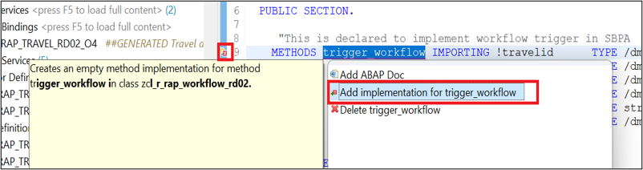

 6. This will create the method in the implementation section of the class as shown below.

      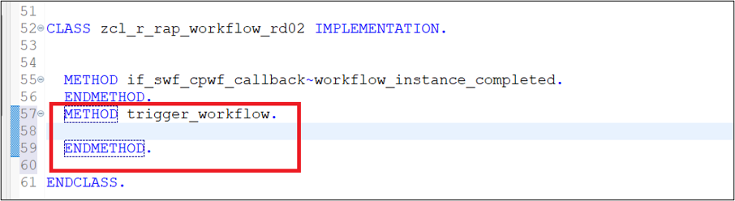

 7. Activate  the class.

### Implement methods to trigger workflow in the Class Implementation Section.

 Implement the method  `trigger_workflow` to call the RAP façade  `I_CPWF_INST` using EML (Entity Manipulation language).

 With the released Business Object Interface, `I_CPWF_INST` you can trigger workflow out of your BTP ABAP environment like in this case in SAP Build Process automation

>The Entity Manipulation Language (EML) is an extension of the ABAP language which offers an API-based access to RAP business objects. EML is used to implement the transactional behavior of RAP business objects and, also to access existing RAP business objects from outside the RAP context.

 Insert the following code snippet in the method. You can use the F1 help to get detailed information on each EML statement.
 
```ABAP Code:
         METHOD trigger_workflow.
         *register the workflow
         TRY.
             MODIFY ENTITIES OF i_cpwf_inst
                ENTITY CPWFInstance "Changed#RD
                EXECUTE registerWorkflow
                FROM VALUE #( ( %key-CpWfHandle      = ''     "cl_system_uuid=>create_uuid_x16_static( )
                             %param-RetentionTime = wf_retention_days
                             %param-PaWfDefId     = travel_wf_defid 
                             %param-CallbackClass = callback_class
                             %param-Consumer      = consumer ) )
                MAPPED   DATA(mapped_wf)
                FAILED   DATA(failed_wf)
                REPORTED DATA(reported_wf).

         IF mapped_wf IS NOT INITIAL.

          "Map the fields to the outgoing context.
          DATA(context)   = VALUE type_context(

                      travel_context-travelid      = travelid
                      travel_context-agency_name   = agency_name
                      travel_context-booking_fee   = booking_fee
                      travel_context-Currency_code = currency_code
                      travel_context-Customer_name = customer_name
                      travel_context-Total_price   = total_price
          ).
          CONDENSE: context-travel_context-Total_price, context-travel_context-travelid.

          " Set the workflow context for the new workflow instances
          TRY.
              DATA(lo_cpwf_api) = cl_swf_cpwf_api_factory_a4c=>get_api_instance( ).
              DATA(json_conv) = lo_cpwf_api->get_json_converter(  ).
              DATA(context_json) = json_conv->serialize( data = context ).
            CATCH cx_swf_cpwf_api.
          ENDTRY.

      *pass the Payload to workflow
           MODIFY ENTITIES OF i_cpwf_inst
            ENTITY CPWFInstance
            EXECUTE setPayload
            FROM VALUE #( ( %key-CpWfHandle = mapped_wf-cpwfinstance[ 1 ]-CpWfHandle
                           %param-context  = context_json ) )
                 MAPPED   mapped_wf
                 FAILED   failed_wf
                 REPORTED reported_wf ##NO_LOCAL_MODE.

          ENDIF.
         CATCH cx_uuid_error.
          "handle exception
        ENDTRY.
 
       ENDMETHOD
```
   
  Your method would look like this.

   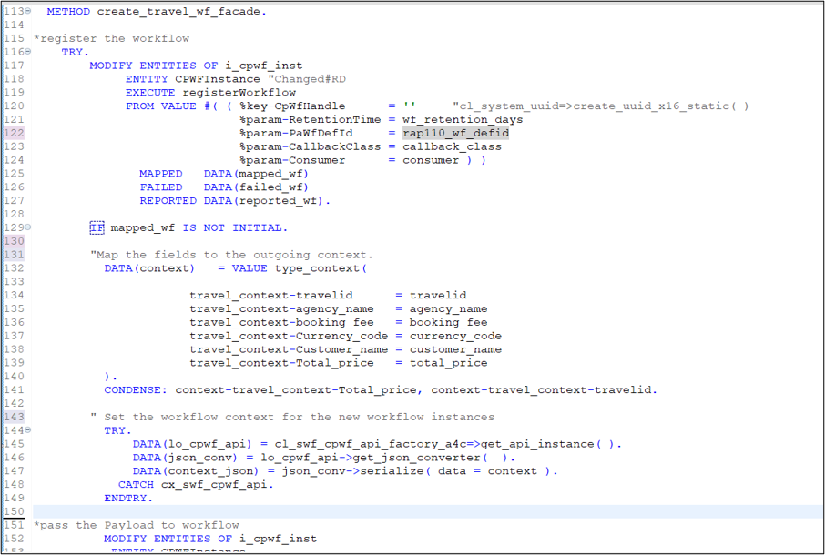 

 **Short explanation of the flow logic:**

 1. First step is to **Register the workflow**.  
    This is done by using the **EML** Operation **MODIFY ENTITIES** on RAP Business Object Interface (RAP Façade) `I_CPWF_INST`, Entity  `CPWFInstance` to execute Register Workflow action of the BO interface  `I_CPWF_INST` with the below input parameters.

      - `%key-CpWfHandle:` UUID to uniquely identify each travel instance. Can be generated by using method `cl_system_uuid=>create_uuid_c32_static ()`. 

    >In this case we are leaving it blank as we are processing only one travel instance at a time thus the unique id would be generated by the BO Interface `I_CPWF_INST`. 
      
      Other fields defined as **Class Constants**.   

       - %param-RetentionTime = `wf_retention_days`
       - %param-PaWfDefId = `travel_wf_defid`
       - %param-CallbackClass = `callback_class`
       - %param-Consumer = `consumer` 

    >In case of bulk trigger of workflow for example if you have more than 1 travel instance to trigger workflow, the key `CpWfHandle` of interface `I_CPWF_INST` needs to be specified externally. A UUID with 32 characters is expected as input parameter. If the action `registerWorkflow` is called repeatedly with the same `CpWfHandle` and an identical payload, this results in a short dump.     
    It is recommended to use the method `cl_system_uuid >create_uuid_c32_static( )` to create the required UUIDs.
 
 2. Second step is to map the internal data and convert it to **JSON format**.
    `cl_swf_cpwf_api_factory_a4c` is used as a helper class to get access to the **JSON  converter**. 

   
     Method `SERIALIZE` used for JSON Conversion. It will by default do the mapping as under.  

       - Removes **`_`** from the field names.  
       - First letter in Field name would be converted to capital letter.  
       - In case of **`_`** the first letter of each word separated by `_` will be converted to capital. 

      Please see field conversion below for your application.   

    | SBPA Field Name |    ABAP Field Name |    
    | :-------------- |    :-------------- |
    | Travel ID |    `travel_id` |
    | Agency Name |    `agency_name` |
    | Booking Fee |    `booking_fee` |
    | Currency Code |    `currency_code` |
    | Customer Name |    `customer_name` |
    | Total Price |    `total_price` |

    In case you want to follow other format please investigate other options available in the method `GET_JSON_CONVERTER`.

      


3. At last, you would call **`SetPayload`** action of the BO interface `I_CPWF_INST` Entity  `CPWFInstance` using **EML** Operation **MODIFY ENTITIES**. This would provide the input data for the workflow instance in **JSON** format using input parameters **Workflow Handler ID** and **Context data in JSON format**.

4. Activate   the class.
 
### Implement methods to handle callback in the Class Implementation Section.

Implement the method  `if_swf_cpwf_callback~workflow_instance_completed` to handle callback from SAP Build Process automation on workflow process completion.  

**Insert** the following code snippet in the method and replace all occurrences of the 	placeholder `####` with your **group ID**. You can use the F1 help to get detailed information.

 on each EML statement

```ABAP Code:
        METHOD if_swf_cpwf_callback~workflow_instance_completed.

    TYPES: BEGIN OF callback_context,
             start_event TYPE type_context,
           END OF callback_context.

    DATA: callback_context TYPE callback_context.
    DATA: travelid TYPE /dmo/travel_id.

    TRY.

*       Get the API of workflow.
        DATA(cpwf_api) = cl_swf_cpwf_api_factory_a4c=>get_api_instance( ).

*       Get the Context of workflow using workflow handler ID in jason format
*       Convert it into internal data format callback_context.
        DATA(context_xstring) = cpwf_api->get_workflow_context( iv_cpwf_handle = iv_cpwf_handle ).
        DATA(outcome) = cpwf_api->get_workflow_outcome( iv_cpwf_handle = iv_cpwf_handle ).

        cpwf_api->get_context_data_from_json(
          EXPORTING
            iv_context      = context_xstring
            it_name_mapping = VALUE #( ( abap = 'start_event' json = 'startEvent' ) )
          IMPORTING
            ev_data         = callback_context
        ).

      CATCH cx_swf_cpwf_api INTO DATA(exception).
    ENDTRY.


    IF outcome IS INITIAL.
      DATA(status)    = 'X'.
    ELSE.
      status = 'A'.
    ENDIF.

* Since Travel ID is not key we would not be able to use EML to update status using it.
* Ideally Travel ID in real time scenario would be a unique key
* derived by Late or early numbering and you would be able to use EML to udate status.
* For this scenario we would have to get the travel UUID as that's the key.

    travelid  = callback_context-start_event-travel_context-travelid.

    " Replace the suffix (last 4 digits) with your choosen group id.
    SELECT SINGLE traveluuid FROM zr_rap_travel_rd02 WHERE travelid = @travelid
    INTO @DATA(traveluuid).

    IF sy-subrc = 0.
      " Update the status of the travel based on the workflow outcome.

      MODIFY ENTITIES OF zr_rap_travel_rd02 " Replace the suffix with your choosen group id.
                ENTITY travel
                   UPDATE FIELDS ( OverallStatus )
                      WITH VALUE #( ( traveluuid    = traveluuid
                                      OverallStatus = status
                                    ) )
                    FAILED DATA(ls_failed)
                    REPORTED DATA(ls_reported).
      COMMIT ENTITIES.
    ENDIF.

  ENDMETHOD.
```

 Your method would look like this

   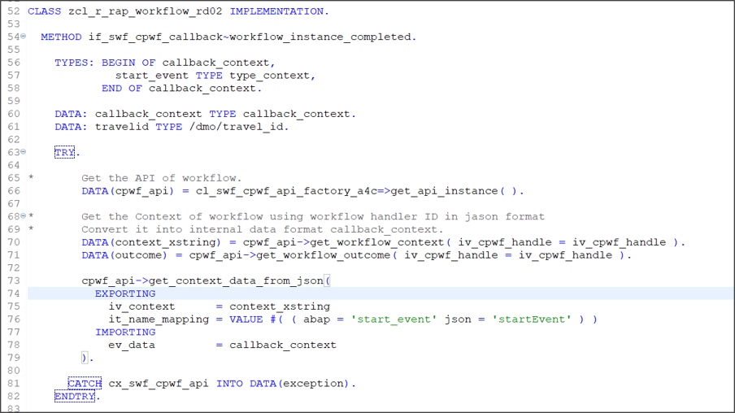

   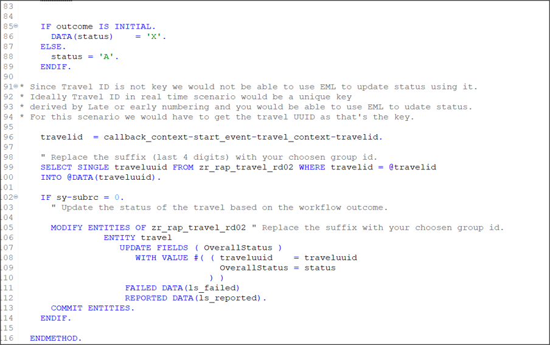

 
 **Short explanation of the flow logic**

1. Class `cl_swf_cpwf_api_factory_a4c` is used as a helper class to get access to the Workflow APIs.

2. With the **Workflow API Instance**  `cpwf_api`  you would call method `get_workflow_context`  using **Workflow Handler Id** sent by SAP Build Process Automation during callback to get the **Context data in xstring format**.

3. Method call `get_workflow_outcome`  is used to get the outcome of Workflow sent by SBPA.

4. Next there is further method call to format the Context data received and deserialize it into internal data format. 

5. **EML Operations** can be triggered with **key** values only, get the key for Business Object using root CDS View  `zr_rap_travel_####`.

6. Once we have the data, call the EML Operation MODIFY ENTITIES for Travel Business Object `zr_rap_travel_XXXX`, entity `travel` to update the overall status of the travel instance as per the outcome of workflow sent by SAP Build Process Automation.

7. Activate   the class.

  Your Implementation for the Workflow Class is now complete. In the further tutorial you will see how we can call the workflow trigger method from the RAP Business Object. 

### Test yourself  


 
 
 


