# Integration of BTP ABAP environment with SAP Build Process Automation

<!-- description -->  Configure connection between BTP ABAP environment (Steampunk) and SAP Build Process Automation.

## Prerequisites

- You have a **licensed version** of SAP BTP ABAP environment
- SAP BTP ABAP environment instance with the **Administrator role**
- SAP BTP tenant with SAP Build Process Automation **subscription Instance** and **service key** must be created for SAP Build Process Automation. You can use the **Booster** for subscription as described [here](https://developers.sap.com/tutorials/spa-subscribe-booster.html)

## You will learn

- SAP Build Process Automation Integration with SAP BTP ABAP environment
- Creation of a Communication Arrangement for SAP Build Process Automation Workflows
- Creation of callback destination from SAP Build Process Automation to SAP BTP ABAP environment
- Properties to be used in the callback destination to enable it for SAP Build Process Automation
- Adding the callback destination in SAP Build Process Automation

## Scenario

Basic Travel Application will be created in SAP BTP ABAP Environment. On Creating a Travel entry, a workflow will trigger in SAP Build Process Automation and the status of the Travel entry will be set to “Awaiting Approval”.
This workflow process in SAP Build Process Automation will create a task in the approver’s Inbox, which can be accessed from “My Inbox” Application integrated in SAP Build Process Automation. 
Once the Approver actions the task i.e. (Accepts/ Rejects) a callback will be made to SAP BTP ABAP Environment notifying the Outcome of workflow completion.
BTP ABAP Environment will use the Notification to further set the status of Travel to Accepted/ Rejected in the Travel Application.

 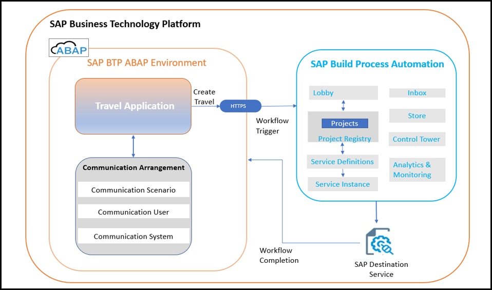

### Overview

To integrate SAP BTP ABAP environment with External Systems or Services like **SAP Build Process Automation** you create a **Communication Arrangement**.

A Communication Arrangement describes which communication partners communicate with each other in the scenario, and how they communicate. Communication Arrangement is formed by combining the below artifacts.

- **Communication Scenario**: Communication Scenario is a design time description of how two communication partners communicate with each other. It consists of technical information like inbound and/or outbound services example OData or SOAP as well as supported authentication methods. There are various **standard communication scenarios** provided by SAP which are ready to use, like in this tutorial we would be using `SAP_COM_0863`.

- **Communication System**: The communication system represents the communication partner within a communication e.g., **SAP Build Process Automation** in this case.

- **Communication User**: Communication users are used by Communication Systems to authenticate themselves to be able to connect to your system in BTP ABAP Environment.

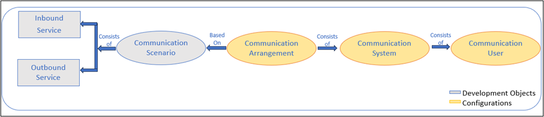

### Create Communication Arrangement

You will now create a communication arrangement in the **ABAP system** on BTP ABAP Environment using **service key of SAP Build Process Automation** Instance.

>Communication Arrangement is not transported between systems but created locally by the system administrator.

 1. Get SAP Build Process Automation Service Key.

    - In the BTP Cockpit **navigate** to your development **subaccount**.

    

    - Click **Services** and **Instances**.

    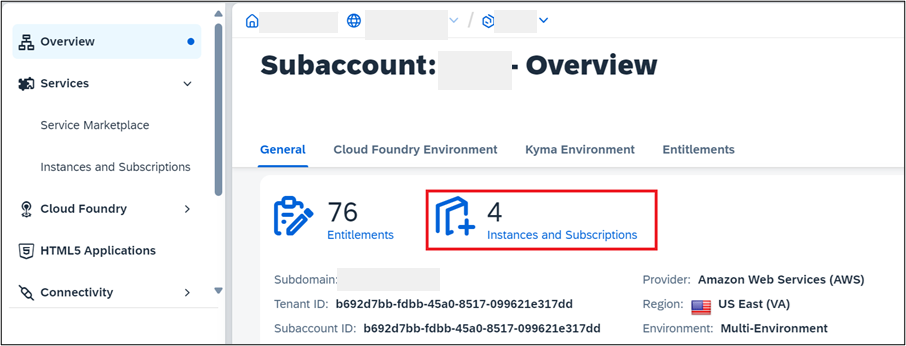

    - Click **Instances**.

    

    - Click the name of your **SAP Build Process Automation instance**.

    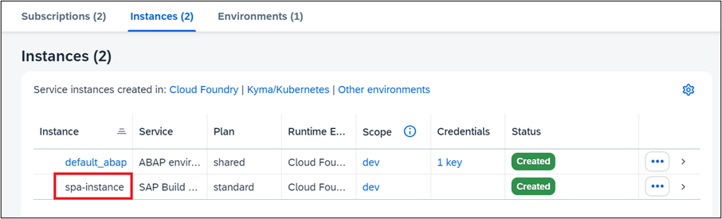

    - From the **navigation pane** choose, **Service keys**.  
   
    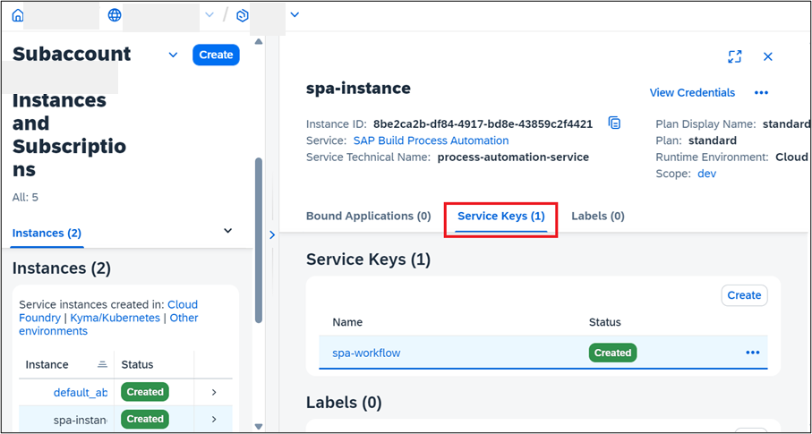

    - Select one entry and **copy the service key**.

    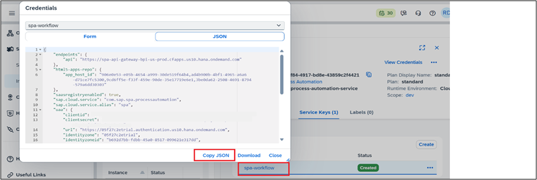

 2. Open the Communication Arrangement app in your SAP BTP ABAP Environment.

    - Click on the BTP ABAP environment instance in your BTP sub account to **navigate** to the **Fiori launchpad**.

    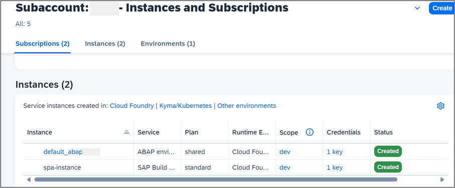

    - In the Fiori launchpad **Open Communication Arrangement**.

    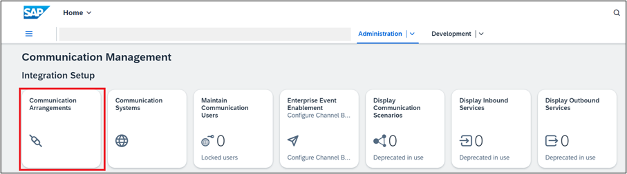

 3. Click on **New** to create communication arrangement.

    

 4. Communication Scenario `SAP_COM_0863`.

    Communication Scenario `SAP_COM_0863` is a **ready-to-use** communication scenario provided by SAP for integration with SAP Build Process Automation.

    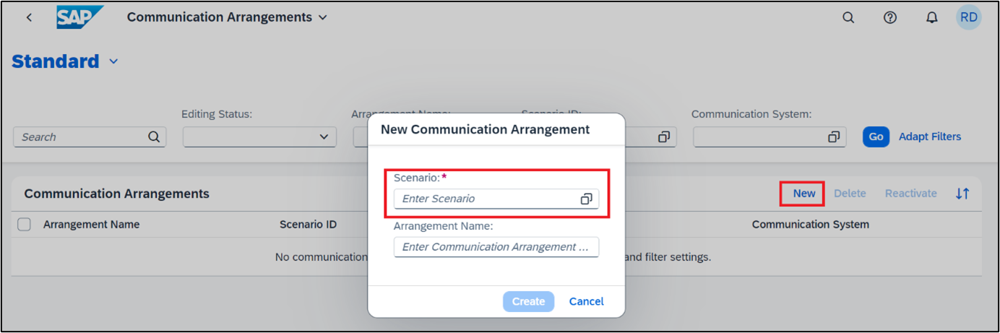

 5. Set **Additional Properties**.

    Once the scenario is selected pop-up window extends with pre-filled Communication Arrangement name and option to set additional properties, enter, or create Communication User and to enter service key.  

    **Click** on Additional Properties, **set given value**, and click **Close**.

    Consumer Type (Workflow) - `DEFAULT`

    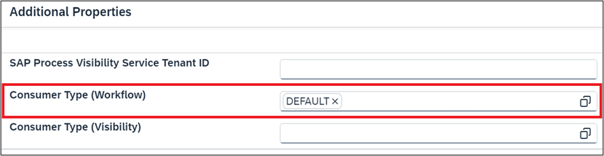

    >The consumer type is used to identify the **default communication arrangement** i.e., if the SAP Build Process Automation Communication Arrangement has **Consumer Type (Workflow)** set to **`DEFAULT`** then the system will try to trigger all workflows in SBPA by default. Therefore, default assignment can be done only on one Communication arrangement for a Consumer Type.

 6. Create a **New Communication User**.

    Select a Communication User (of which you know the password) or create a new one to use for **inbound communication** (from SAP Build Process Automation to your BTP ABAP environment).

    - Click **New** to create a communication user.

    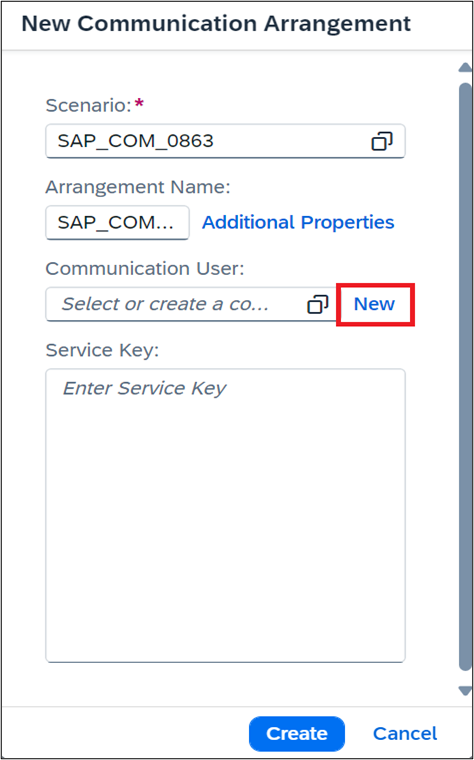

    - Clicking on new navigates to the **Create Communication User App**. 
    Enter the below info and click on **Create**.

       User Name:   `ZTEST_USER_SBPA`
       Description:  `SBPA User`
       Password: Click on Propose Password (Save the password for later use)

    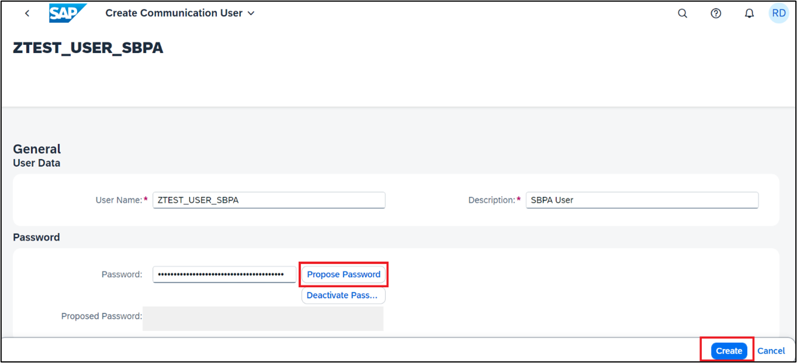

    >Save the proposed **password** and **user name** as that would be required during creation of **callback destination**.  

 7. In the field **Service key** paste the **SAP BUild Process Automation** instance service key that we retrieved as part of   'Get SAP Build Process Automation Service Key' and click **Create**.

    

 8. Communication Arrangement is saved.

    >Save the highlighted API-URL for later use while creating callback destination.

    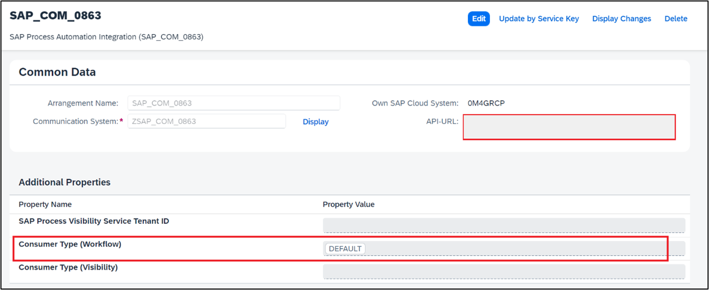

### Create Callback Destination

**Create** a destination in the SAP BTP subaccount, to enable the **inbound communication** to the BTP ABAP environment. In addition, the destination **must be enabled** for use in SAP Build Process Automation.

The destination will be used for the **callback** to the SAP BTP ABAP environment from SAP Build Process Automation. The callback is triggered on the completion of workflow process on SAP Build Process Automation.

 1. In the BTP Cockpit **navigate** to your development **subaccount**.

    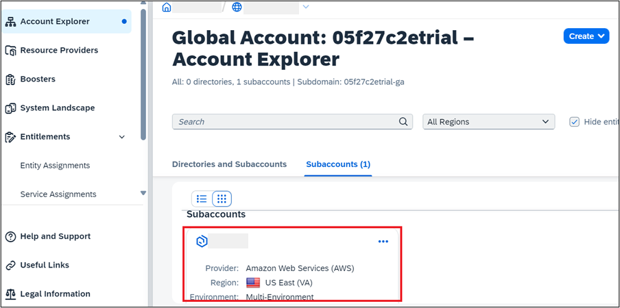

 2. **Choose** Connectivity>Destination>Create Destination.

    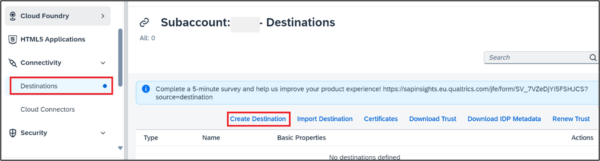

 3. Choose **Blank Template** and enter the following data and click on **Save**.

    - **Name:**  `abap-cloud-dev-steampunk-canary` (Any Name)

    - **Type:**  HTTP

    - **Description:**  SBPA to ABAP Callback Destination

    - **URL:** Enter the `API-URL` saved during Communication Arrangement creation. If not saved    access the communication arrangement and copy the API URL displayed     under Common Data > `API-URL`. It is the API URL for **BTP** ABAP Environment instance.

    - **Proxy Type:** Internet

    - **Authentication:** `BasicAuthentication`

    - **User:** Enter the Inbound Communication User created during Communication Arrangement creation.

    - **Password:** Enter the Password of the (inbound) communication user in the Communication Arrangement.

    - **Additional Properties:** Click on New Properties and add Additional Properties.
      `sap.applicationdevelopment.actions.enabled` → true.
      `sap.processautomation.enabled` → true

    

    >The addition of Additional Properties `sap.applicationdevelopment.actions.enabled`and `sap.processdevelopment.enabled`enables the destination for use in SAP Build Process Automation.

### Add callback destination in SAP Build Process Automation

 1. **Open** the SAP Build Process automation from your subaccount.

     Subaccount > Instances and Subscriptions > Subscriptions > SAP Build Process Automation.

    - **Click** on SAP Build Process Automation to **open** the Application.
    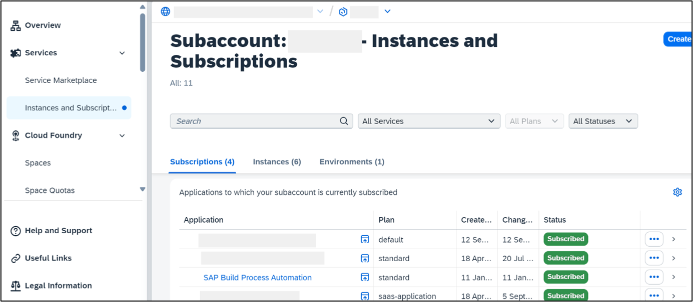

 2. Navigate to **Control Tower > Destinations**.

    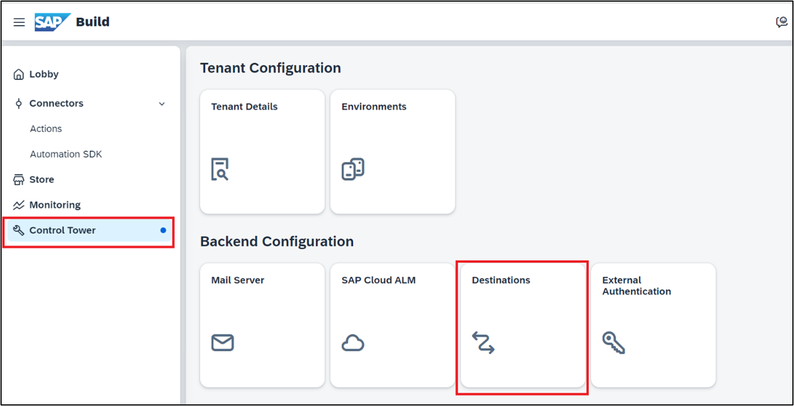

 3. Choose **Destinations > New Destination**.

    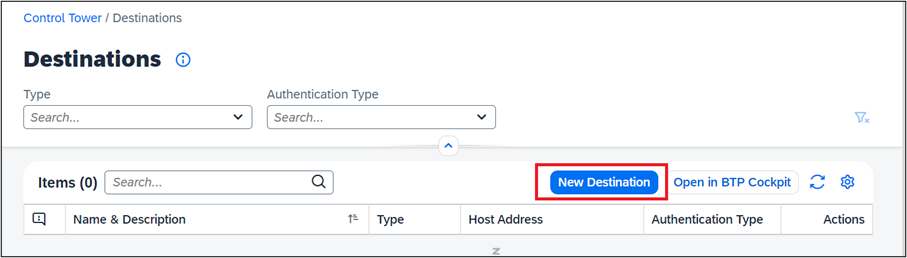

 4. Select the destination that you have **created in SAP BTP cockpit** and click **Add**.

    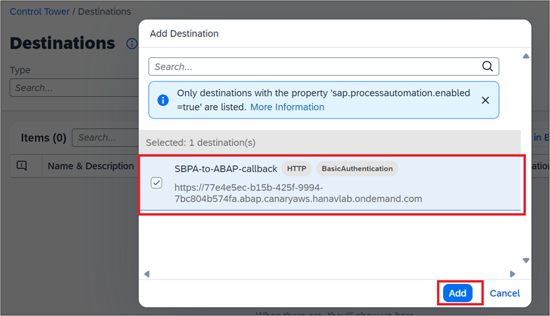

### Test Yourself

---
