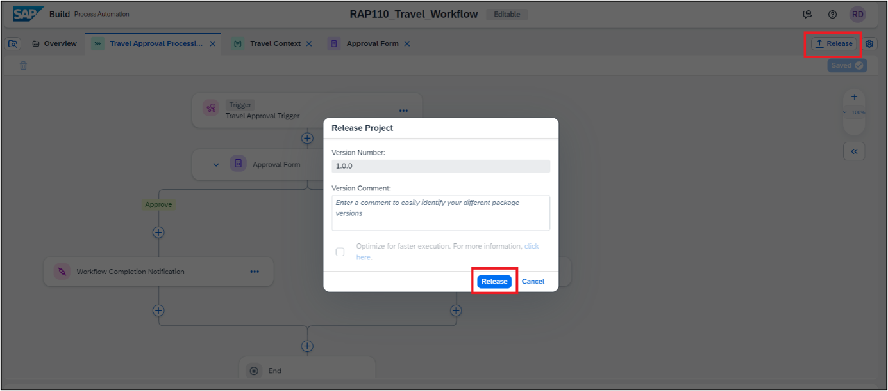
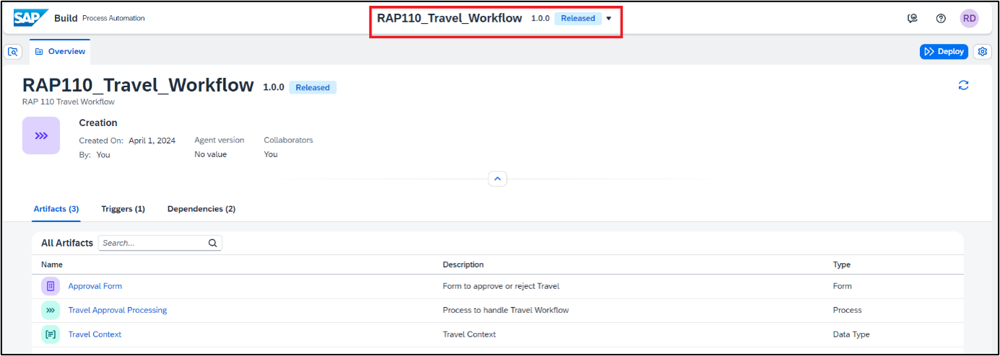
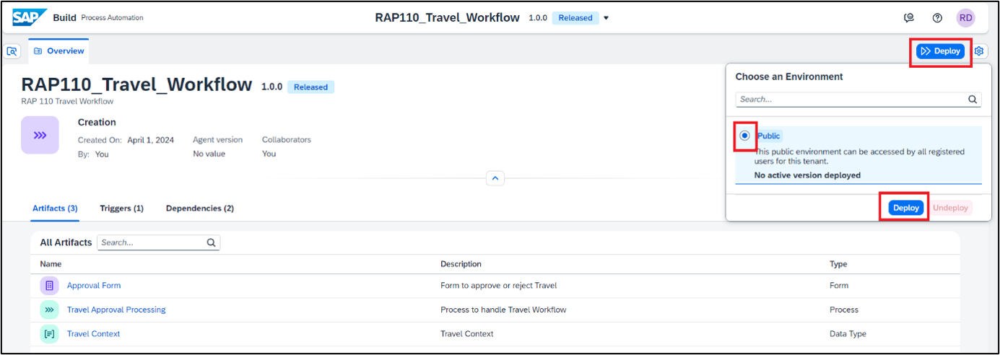
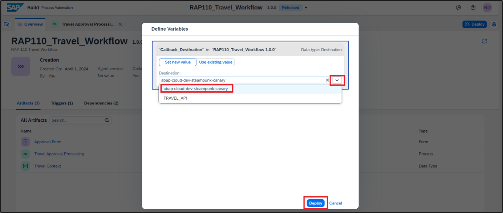

# Release and Deploy Business Process Project. 

<!-- description --> To Run the Business Process Project, you need to first release and deploy it 

Till now you have created and saved your business process project along with the callback action. You will now **release** and deploy your project. The release process allows for **semantic version control** with format X.Y.Z. **Deploying** your project will allow you to **set the proper parameters** like destination, if necessary, to allow for project execution.  

There are two possible situations during Release:

 - When you are releasing a **new** business process project, enter a summary of the changes in the Release Notes (optional) then choose Release.

 - When you are releasing a **modified** version of a business process project that is already released, in the release Version Contains dialogue, select one of the following:

    - Select **Bug Fix** to indicate bug fixes. It updates the third **digit (Z)** of the version number.
    - Select **Minor Changes** to indicate small modifications. It updates the second **digit (Y)** of the version number.
    - Select **Major Changes** to indicate important modifications potentially leading to incompatibility between versions. It updates the first **digit (X)** of the version number. 

## Prerequisites

- You have created a Business Project and Process in SBPA as described [here](https://developers-qa-blue.wcms-nonprod.c.eu-de-2.cloud.sap/tutorials/abap-environment-sbpa-workflow-bp.html).
- You have created a process trigger as described [here](https://developers-qa-blue.wcms-nonprod.c.eu-de-2.cloud.sap/tutorials/abap-environment-sbpa-workflow-trigger.html).
- You have created a configured an Approval form as described [here](https://developers-qa-blue.wcms-nonprod.c.eu-de-2.cloud.sap/tutorials/abap-environment-sbpa-workflow-form.html).
- You have created an Action and included it in the process flow as described [here](https://developers-qa-blue.wcms-nonprod.c.eu-de-2.cloud.sap/tutorials/abap-environment-sbpa-workflow-action.html).

## You will learn

- How to release, deploy the Process.

### Release Business Process Project

Releasing a project creates a version or snapshot of the changes.

 1. In the Process Builder choose **Release** on the top right corner. 

    Add a Version Comment if needed and choose **Release**. 

    >You are releasing the Project for the first time thus the version starts with 1.0.0. The next time you release there will be options to choose from – i.e if the new version is a major, minor, or patch update; version numbers will be automatically updated.

     

 2. The project released successfully and is ready to be deployed.

     

### Deploy the Released Business Process Project

 You can deploy Business Process projects from each released version of the project in the Process Builder or through the Lobby. Deploying the project makes it available for others to use it. Please note that you can only deploy a released version of the project.

 1. From the released version of the Business Process project in the Process Builder,   
    
    Choose **Deploy** > Select Environment **Public** > choose **Deploy**

       

     Deploy will take a couple of seconds/minutes depending upon how big your project is and how many different skills it has. Any errors during the deployment will be shown in the Design Console.

 2. You will now set the **runtime variables**. From the drop-down select the destination **abap-cloud-dev-steampunk-canary** and click **Deploy**. 

    >This is the callback destination that we created in BTP Subaccount and pulled in SAP Build Process Automation as part of **Tutorial** [Integration of BTP ABAP environment with SAP Build Process Automation](https://developers-qa-blue.wcms-nonprod.c.eu-de-2.cloud.sap/tutorials/abap-environment-sbpa-workflow-integration.html)

       

    >Variables allow you to reuse certain information for a given business process project deployment. 
         
    >You use variables to pass parameters to automations. You can create variables in the Process Builder for which you can later set values when deploying the business process project. For example, in the current use case, you have created a Destination variable.

 3.	The successfully deployed project is ready for running and monitoring

     

  ### Test yourself

