# Run end to end Business Process Workflow, Monitor and Troubleshoot
<!-- description --> Run end to end business process starting for previewing RAP Travel Application, creating a Travel, Checking the Inbox in SBPA for triggered workflow process, Actioning the Approval form. Also check for Travel Overall Status Update during workflow trigger and call back.

## You will learn
- How to run the process.
- Monitor and trouble shoot in BTP ABAP Environment.
- How to access integrated Inbox in SAP Build Process Automation to work on the task.
- Monitor and troubleshoot in SAP Build Process Automation.

## Prerequisites
- You have bought a licensed version of SAP BTP ABAP Environment
- SAP BTP tenant with SAP Build Process Automation subscription and Instance.
 [Link here](https://developers.sap.com/tutorials/spa-subscribe-booster.html)
- You have completed all previous steps of the mission. 

 
 ### Run the Travel Application to Create Travel.

 Run the travel applicaton to trigger workflow

 1. Goto **Service Binding** of your application > Choose **Entity > Preview**.   
   
    Open Preview in **Browser** with **InPrivate or Incognito mode**.  

    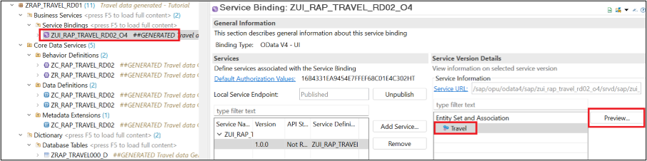

 2.	The service will appear in a **Fiori Elements preview**.  

      The table does not yet contain any data to preview.  

      **Choose Create** to create new Travel entries.

    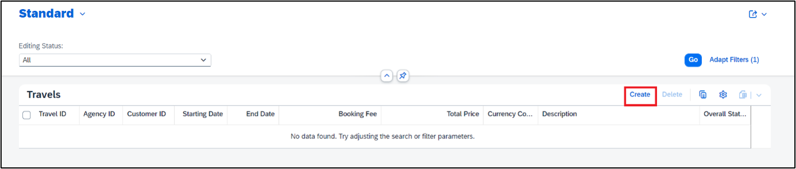

 3. **Enter Values** and choose **Create**.

    As currently there is no validation in place enter any values.

    At least enter the below fields to the see complete functionality.

    | Field Name |    Values |    
    | :--------- |    :----- |
    | Travel ID | Enter **any number e.g., `1234`**.  Ideally you would implement early or late numbering. |
    | Customer ID |    Select from the  **F4 help** |
    | Agency ID |    Select from the &#8232; **F4 help** |
    | Booking Fee |    Enter any Fee e.g., **20.00** |
    | Currency Code |    Enter any value e.g., **EUR** |
    | Total Price |    Enter any Price e.g., **500.00** |

    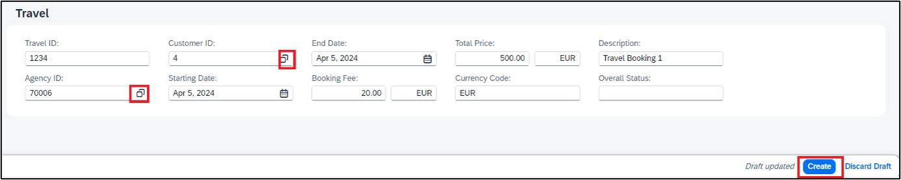

    Please note that the **workflow is triggered** in SAP Build Process Automation as you clicked on **Create**.

 4. Travel is now created.

    Please note that the **status of the travel** is set to **W** (Awaiting Approval)

    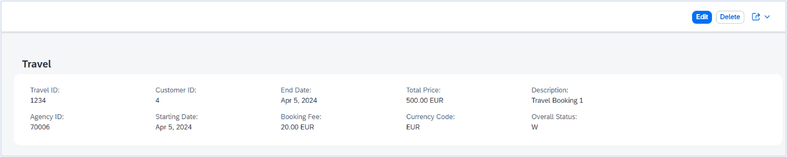

### Go to SAP Build Process Automation to Action the workflow.

 1. From the SAP Build Process Automation **Lobby**, choose **My Inbox** 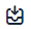 to access the **Approval Form**.

     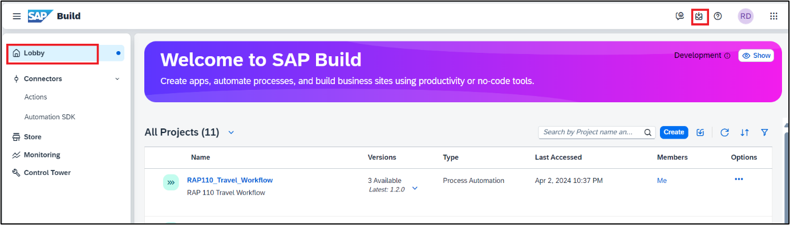

 2. Here you can see the **Workflow Task** created.
     Please note the **Description** of the **Task**. It is coming from the Approval form you Created.

       a. **Choose** the **Task** for Travel ID that you created e.g., **`1234`**.  
           This will display the Approval Form with the Travel Details. 

       b. Enter **Approved** in **Comments**. 

       c. Choose **Approved**.

     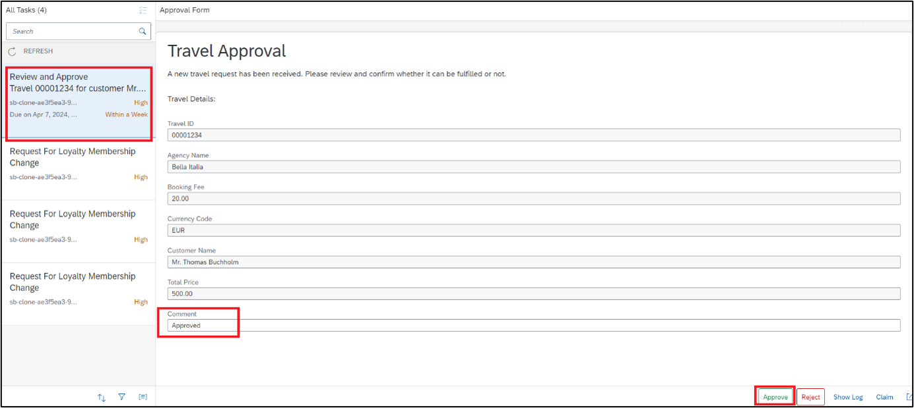 

     Your travel task in now **Approved**. 

### Go back to the Travel Application Preview.

Refresh the page to see the updates. Overall Travel should now be set to **Approved** (A).

   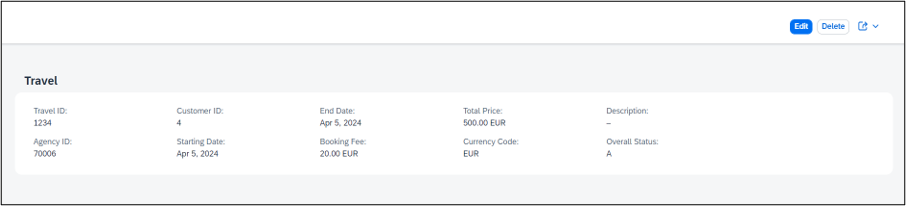

### Monitor and troubleshoot in BTP ABAP Environment

The **Application Interface Framework** (AIF) Monitoring tools enable you to monitor and troubleshoot communication between BTP ABAP Environment and SAP Build Process Automation.

 1. **Enable** your **User** for monitoring. (Administrator **User required for this enablement**).

       - Click on the **BTP ABAP environment instance** in your BTP sub account to navigate to the Fiori launchpad using **Administrator User**. 

          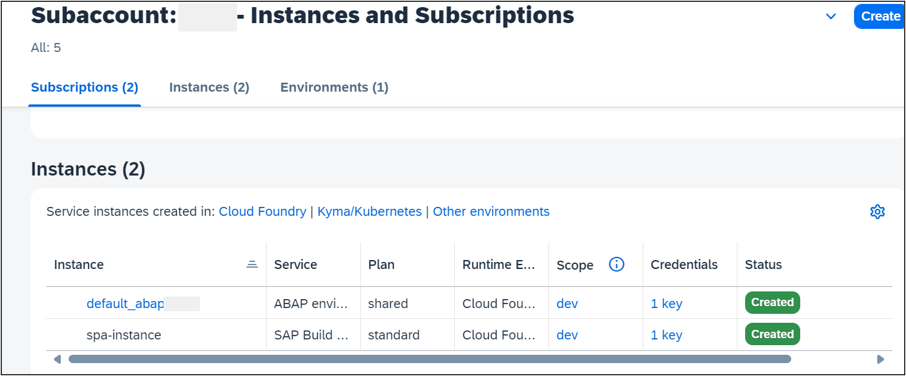

       - Go to Maintain Business Roles App. Choose **New** > Enter **Name** & **Description** >  Choose **Create**.

          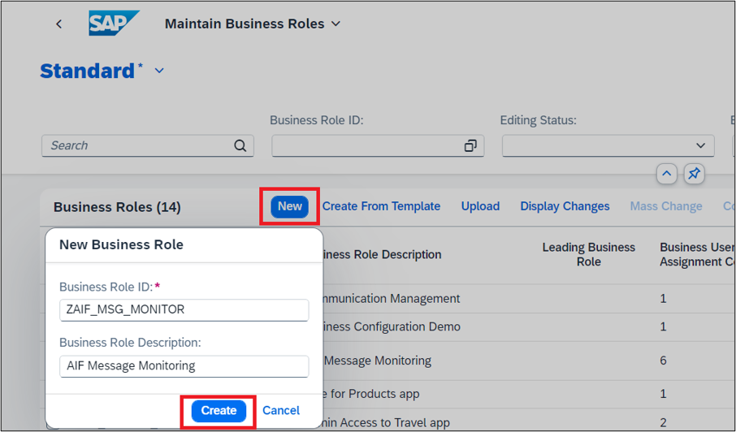

       - Navigate to **Business Catalogs** > Choose **Add**. 

         Add the below 3 Communication Management Business Catalogs.  
         
         - SAP_CA_BC_COM_CONF_PC    
         - SAP_CA_BC_COM_ERR_PC   
         - SAP_CA_BC_COM_OP_ERR_PC

          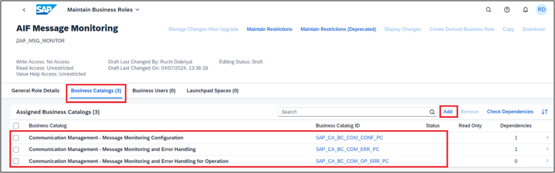

       - Navigate to **Users** > Choose **Add** to select add your User > Choose **Save**.  

          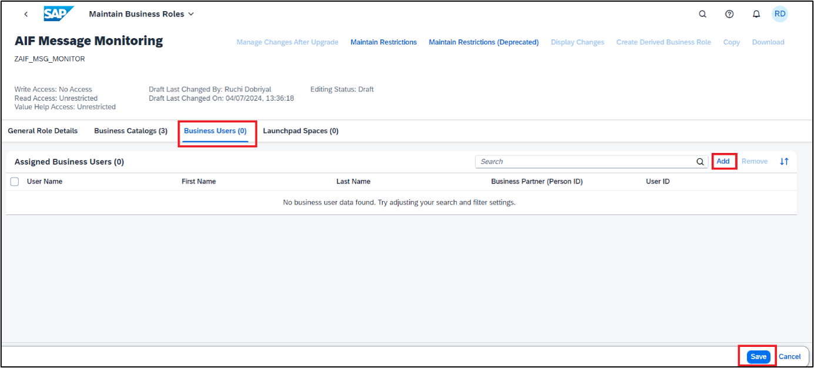

 2.	Go to **Assign Recipients to User** App > Choose your **User** > Select **Assign**.

      Assign Recipients (Processes) to your User. This is to make sure that the user can monitor only the processes assigned. 

      Depending upon users roles and responsibilities, Recipients (processes) can be assigned.

    For monitoring workflow communication with SAP Build Process Automation **Assign** the below **Recipients**:

    | Name Space |    Recipient |    
    | :--------- |    :-------- |
    | /SWFCP (for workflow capability) |    REC_PROC_BGRFC (process bgRFC) |
    |                                  |    REC_RAISE_EVT (Recipient for raise of event) |

     Repeat the process and **assign** each **Recipient**. 

     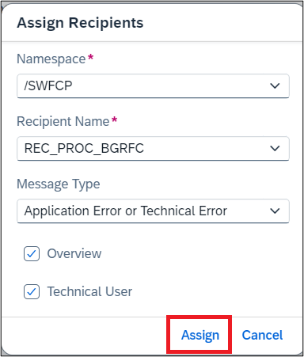

    Your User is now **Enabled** for Workflow Communication **Monitoring** with SAP Build Process Automation via. AIF Communication Management Applications.

 3. Open **Message Monitoring Overview** app or Message **Dashboard** app to monitor   processes and check messages in case of failures/errors for troubleshooting.

    Navigate Message Monitoring Overview > Choose /SWFCP – PROC_BGRFC – 1 > Choose the process you triggered > Check the message log and other details.

     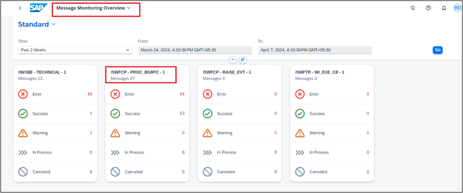

    **Select > on** the line item to display further details.

    Below error usually comes when the **interface fields do not match**.

      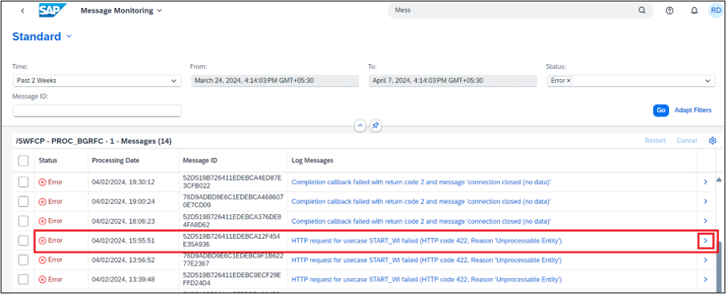

 4. Debugging your code.

    In case you are not able to figure out why the call is failing using the monitoring tools you might want to troubleshoot by debugging the code. Note the below users you are debugging.
     
    | Process       |    Debugger User |    
    | :------------ |    :------------ |
    | Workflow Trigger **(Outgoing Call)** |    **User Performing the action** `Create Travel` |
    | Process Completion Notification Method if_swf_cpwf_callback~workflow_instance_completed **(Inbound call)** |     Activate the breakpoint for **`SAP_WFRT`** user |

    In case the call is successful in BTP ABAP Environment but fail in SAP Build Process Automation causing the below issues. You would have to check if the process on the SAP Build Process Automation side is successful or not. The same have been explained in the next step.

      a.	You still do not see your approval form in SAP Build Process Automation.

      b.	You can see the Approval form but post actioning the form (Reject/Approve), you do not see a status update to (A) in BTP ABAP Environment

### Monitor and troubleshoot in SAP Build Process Automation.

  You have monitoring tools available on the SAP Build Process Automation side which show detailed log for each step in your Business Process as no debugging is possible here.
    
  1. Navigate to the Monitor tab and choose Process and Workflow Instances.     
    
     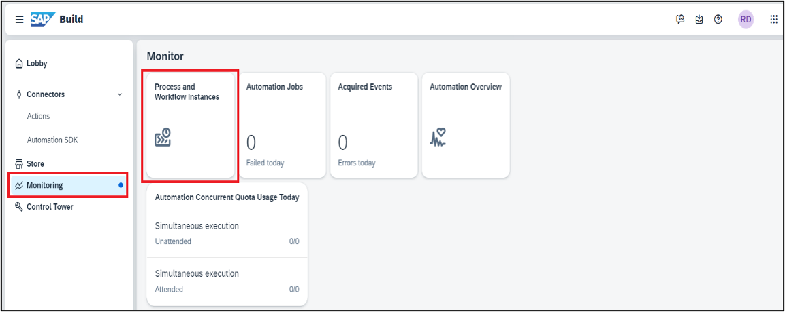

  2. Choose ALL **status** > Choose your **Project** > Choose the workflow instance and click >.    

     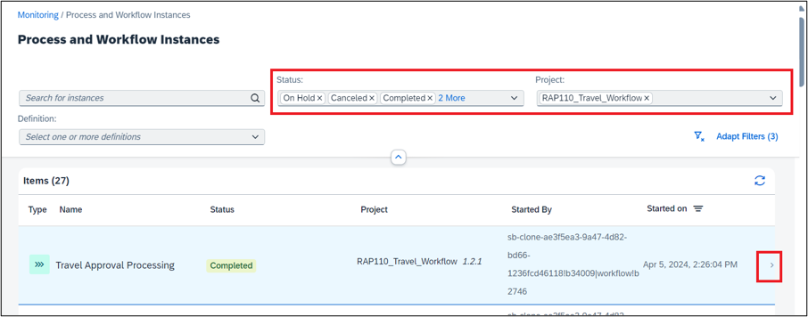

   3. Choose **Logs** to see the messages at each step.  
   Choose **Context** to see the data transformation at each step and finally the outgoing  context during the callback to BTP ABAP environment.

       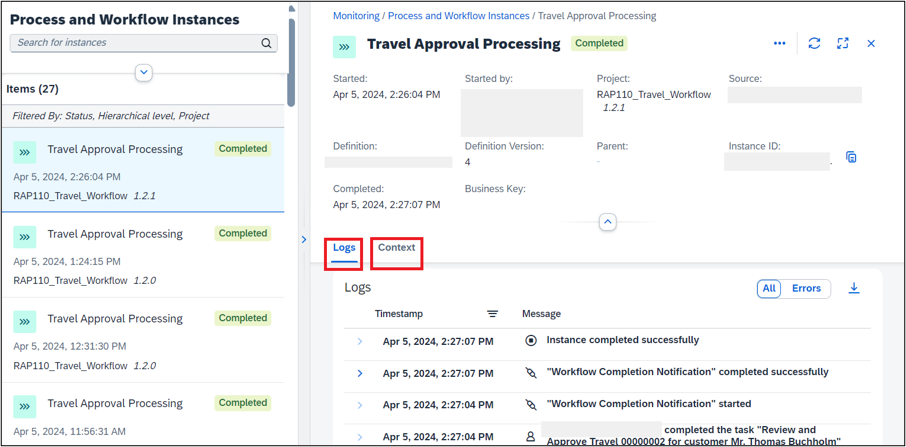

### Test yourself

