# Create a Process Trigger
<!-- description --> Create an API trigger for the business process to be called from external system.

## Prerequisites

- You have created a Business Project and Process in SBPA as described [here](https://developers-qa-blue.wcms-nonprod.c.eu-de-2.cloud.sap/tutorials/abap-environment-sbpa-workflow-bp.html)
 

## You will learn

- How to create an API trigger to start an instance of a business process from any service, like SAP Build Apps

A business process is started by defining a **trigger**, an event that indicates to your SAP Build Process Automation tenant to **start a process instance**.

Process triggers can be a form, such as a request form, an API call, where an external system starts the process or an Event. You may also start the instance with an event trigger which on-boards and listens to back-end events emitted from an external source system and reacts to such events by triggering artifacts such as processes and automations.

As part of this tutorial, we will start an instance of the process using an API call, with the inputs for the call configured from the process builder. These inputs will then be used as input fields in your process.

### Create the data type for the API Trigger.

>A **data type** is an artifact describing a **data structure** that can be used as an **input** and/or an **output parameter** in automations or processes. You have two options to create the fields in data type. You can either import an excel file or define the fields manually.

As part of this tutorial, we would be creating data type defining each field with field name and type of field manually.

 1. Go to your project and click on **Create > Data Type**.

     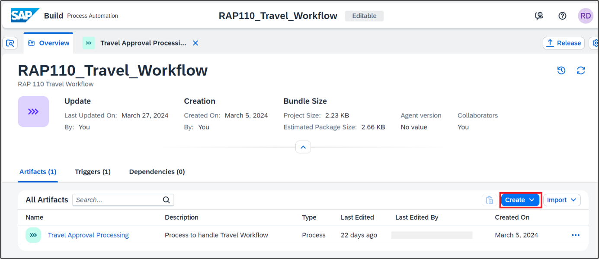

     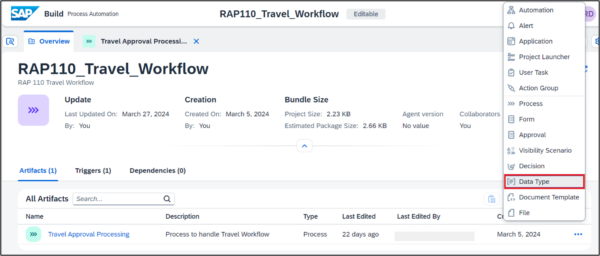

 2. Name the data type **Travel Context** and click on **Create**.
   
     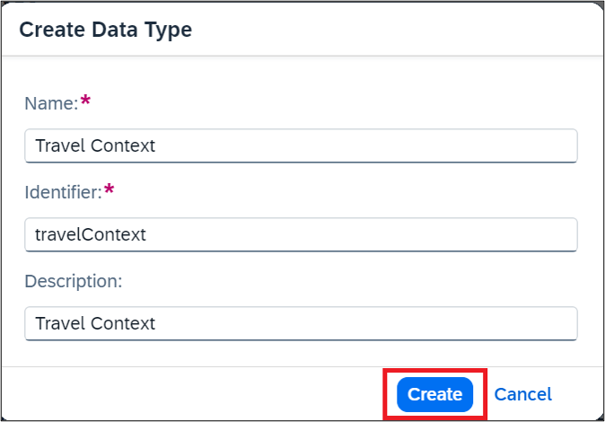

 3. Click on **New Field** to add new fields to the data type **Travel Context**.

     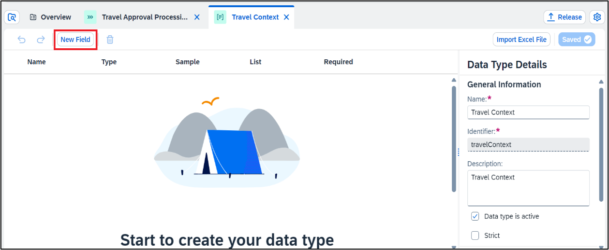
    
     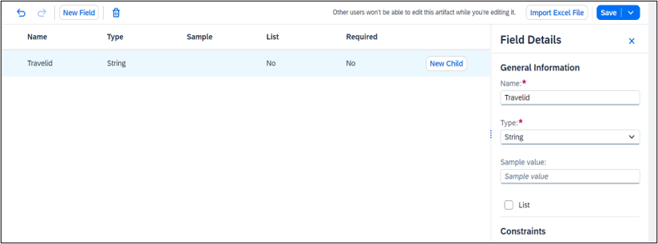

 4. **Repeat** the process to add all the fields of the type as shown below

    | Field Name |     Type 
    | :---------- |   :----- 
    | Travel id  |     `String`   
    | Agency Name |    `String`   
    | Booking fee |    `String`   
    | Currency Code |  `String`  
    | Customer Name |  `String`   
    | Total price |    `String`   

>The spelling and casing of the fields, as well as any extra spaces, is crucial because the API to trigger the process will require the fields exactly as written.  
 For the tutorial we are keeping a format as first letter of all words in the field name capital and without underscore. 

The final data type looks as below. Click **Save** to save the data type
      
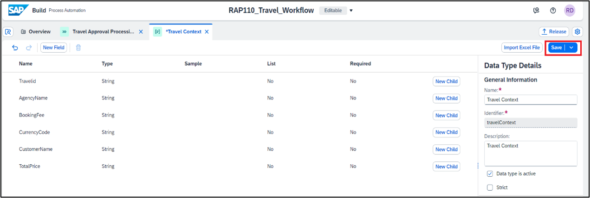

### Create an API Trigger for the process.

 1. **Open** process Travel Approval Processing.

     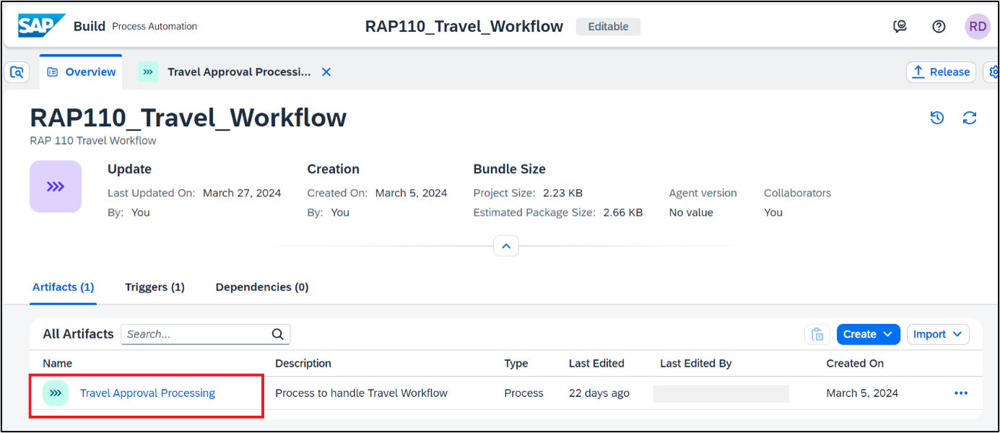

 2. To add an API trigger for the process, click on the **Add API trigger**.

     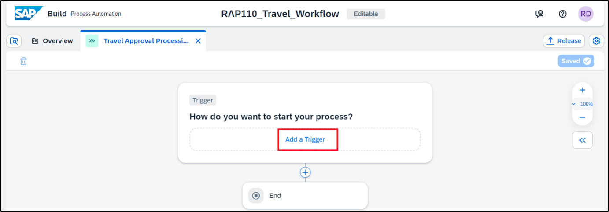

 3. Choose **Call an API** as we are creating an API based trigger so that we can  **trigger the process from external system** like S/4 HANA or BTP ABAP Environment

     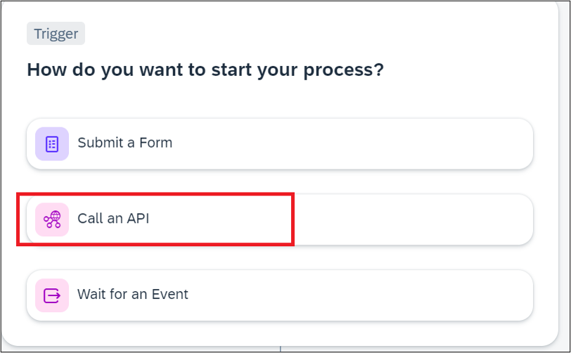
    
 4.  **Enter** the below details for the trigger. Choose Create.    
     **Name**:Travel Approval Trigger  
     **Description**:Travel Approval Trigger  

     *Please note that the identifier will be filled by itself* 

     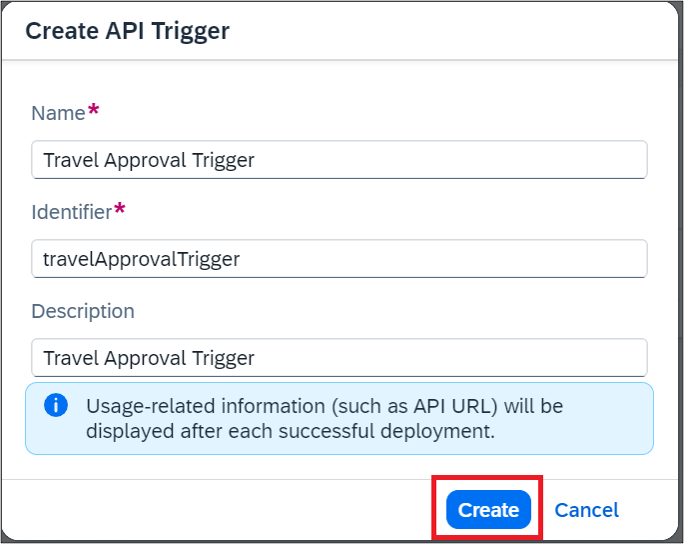

### Create Input for the process.

 1. Open the Process Details by cliking on the Canvas

     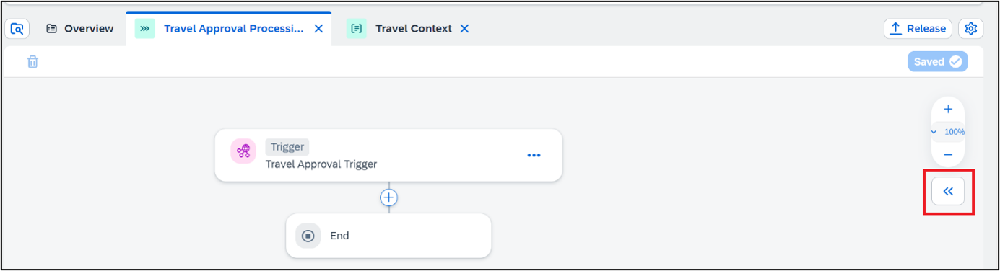

 2. Choose **Variables**. Then choose **Configure** to configure process inputs.

     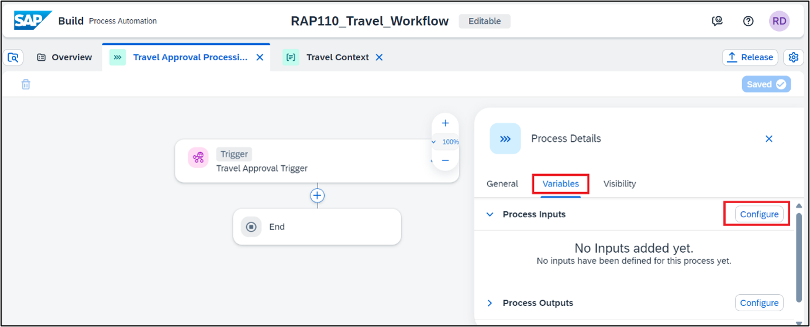

 3. In the Configure Process Inputs window, choose **Add Input** to add parameters.  
    Add the following parameter and click on **Apply**.

    | Field  | Identifier |  Type  |
    :------- | :--------- | :---- | 
    | Travel Context | Travel Context | Select the data type you created in Step 1 Travel Context |

     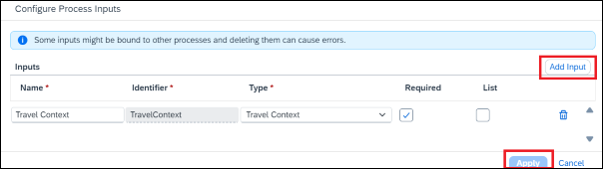

    Process Input fields are now visible in the Process Details. 

     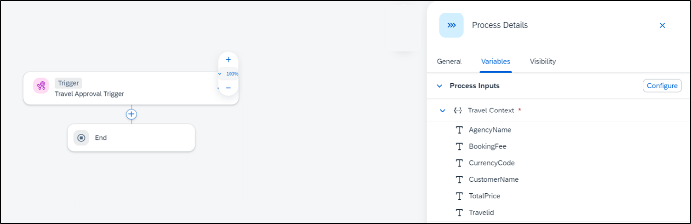

     
 4. Save the Project.

 5. Once the trigger is created successfully, you can view the trigger under the Triggers Section in the Overview page.

     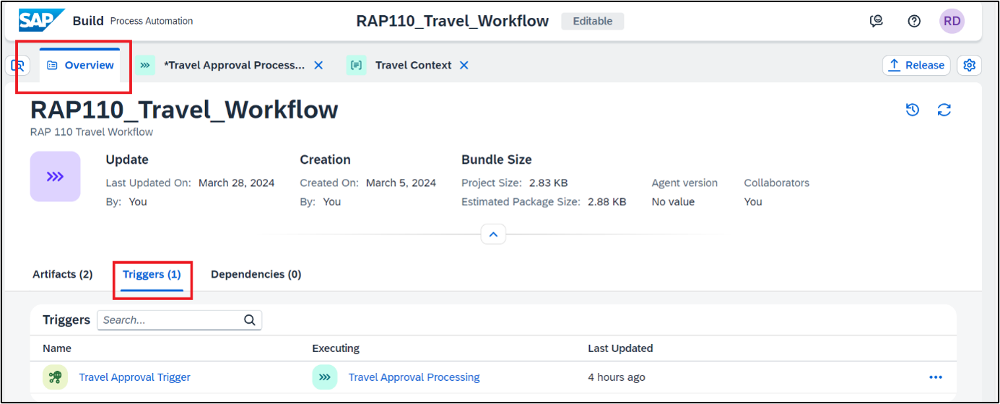

>You can edit, deactivate, or delete the API trigger properties from Triggers tab in the respective process builder overview.  
Deactivate means that while the trigger exists in design-time, you cannot consume it in runtime.  
Delete will permanently delete the trigger from design-time, but for already deployed processes the trigger will still exist at runtime.  
In general, any changes in the trigger will be effective only when the process is released and deployed.  
All the API triggers that are created in that project will be shown.

### Test Yourself

 