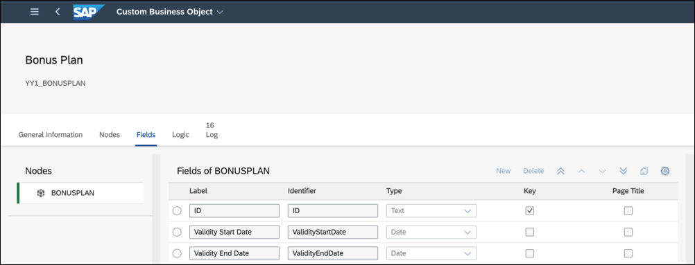

<!-- DONE with FYZ/100 -->
<!-- SAP S/4HANA Extensibility Tutorial: https://community.sap.com/t5/enterprise-resource-planning-blog-posts-by-sap/sap-s-4hana-extensibility-tutorial/ba-p/13293080 -->
# Create a Custom Business Object

<!-- description -->Define the data structure and create the database persistence of a custom business object.

## You will learn

- How to define a custom business object and its simple data structure
- How to create the database table for the custom business object

## Prerequisites  

- **Authorizations:** Your user needs a business role with business catalog **Extensibility – Custom Business Objects** (ID: `SAP_CORE_BC_EXT_CBO`) in your **SAP S/4HANA Cloud** system

#### Our Example

A several tutorials spanning example will show extensibility along custom Bonus Management applications.

As applications are based on business objects, it all starts with custom business object creation.

In the first parts a manager wants to define business objects "Bonus Plan" for employees. A Bonus Plan is used to save employee specific rules for bonus entitlement.

>- Tutorial last checked for feasibility with SAP S/4HANA Cloud Release 2508

---

### Start Custom Business Objects application

1. Enter your SAP S/4HANA Cloud system's Fiori Launchpad.

2. Start typing **Custom Business Objects** in the Launchpad search and open the App from the results.

    

### Create a custom business object

1. Press **New** to start the creation of a custom business object.

    
    A pop up opens.

2. Enter the **Name** **`Bonus Plan`**. The other editable fields will be filled up  automatically with suggested values, but can be changed.

    

3. Press **Create**.

    The details view of the custom business object opens.

### Define the data structure

1. In the details view for editing the custom business object switch to **Fields** Section.

    

2. Create following fields by pressing **New**

| Field Label                       | Field Identifier               | Field Type                | Key Field | Field Properties                                                                                            |
| :---------------------------------| :----------------------------- | :------------------------ | :-------- | :---------------------------------------------------------------------------------------------------------- |
| **`ID`**                          | **`ID`**                       | **`Text`**                | **`X`**   | Length: **`10`** field                                                                                      |
| **`Validity Start Date`**         | **`ValidityStartDate`**        | **`Date`**                |           |                                                                                                             |
| **`Validity End Date`**           | **`ValidityEndDate`**          | **`Date`**                |           |                                                                                                             |
| **`Target Amount`**               | **`TargetAmount`**             | **`Amount with Currency`**|           |                                                                                                             |
| **`Low Bonus Assignment Factor`** | **`LowBonusAssignmentFactor`** | **`Number`**              |           | Length: **`4`**, Decimals: **`2`**, Tooltip: **`Actual revenue must meet target more than that many times`**|
| **`High Bonus Assignment Factor`**| **`HighBonusAssignmentFactor`**| **`Number`**              |           | Length: **`4`**, Decimals: **`2`**, Tooltip: **`Actual revenue must meet target more than that many times`**|
| **`Low Bonus Percentage`**        | **`LowBonusPercentage`**       | **`Quantity with Unit`**  |           |                                                                                                             |
| **`High Bonus Percentage`**       | **`HighBonusPercentage`**      | **`Quantity with Unit`**  |           |                                                                                                             |
| **`Is Consistent`**               | **`IsConsistent`**             | **`Checkbox`**            |           | Read Only: **`X`**                                                                                          |
| **`Employee ID`**                 | **`EmployeeID`**               | **`Text`**                |           | Length: **`12`**                                                                                            |
| **`Employee Name`**               | **`EmployeeName`**             | **`Text`**                |           | Length: **`40`**, Read Only: **`X`**                                                                        |

The UI for maintaining fields looks as follows.

### Add standard data to the structure

1. In the details view for editing the custom business object switch to  **General Information** Section.

2. Check the **System Administrative Data** box to add standardized fields for `Created On`, `Created By`, `Last Changed On` and `Last Changed By`.

    
    >By checking this box the four fields also appear in the field list. The fields are not editable and will be filled and updated automatically, so that you do not need to implement logic for them. Logic implementations for these fields are even ignored.

### Create database persistence

**Publish** the business object `Bonus Plan`.

This creates the database persistence of the business object.

### Test yourself

---
