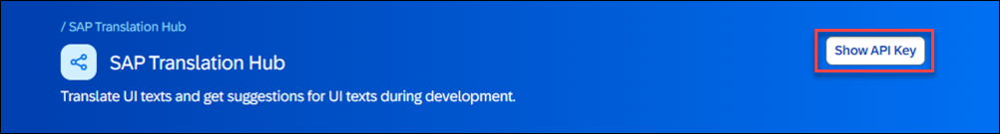
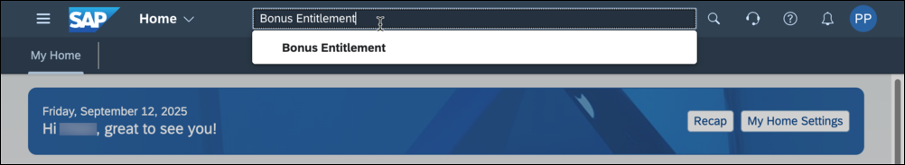

<!--DONE in E1Y-->
# Execute an Outbound Service from Custom Business Object Logic
<!-- description --> Call an external service of SAP Business Accelerator Hub from inside the logic implementation of a custom business object.

## Prerequisites  
**Authorizations:** Your user needs
- (a) business role(s) with business catalogs **Extensibility - Custom Business Objects** (ID: `SAP_CORE_BC_EXT_CBO`), **Communication Management** (ID: `SAP_CORE_BC_COM`) and **Extensibility - Custom Communication Scenarios** (ID: `SAP_CORE_BC_EXT_CCS`) in your **SAP S/4HANA Cloud** system
- access to **[SAP Business Accelerator Hub](https://api.sap.com)**.
**Example Objects:** Existence of custom business object `Bonus Entitlement` as described in this [tutorial](https://blogs.sap.com/2017/02/20/part-iv-associated-business-objects-bonus-entitlement-with-plan-sales-order/) (Blog), but without any special `bonusplan-releasestatus` logic.
**Knowledge:** (optional) [Tutorial: Tour the SAP Business Accelerator Hub](https://developers.sap.com/tutorials/hcp-abh-getting-started.html)

## You will learn
- How to get needed service data from SAP Business Accelerator Hub Sandbox
- How to configure outbound service connection in SAP S/4HANA Cloud system
- How to call and process an outbound service in custom business object logic

## Intro
The example application of `Bonus Entitlement` will be enhanced by a feedback functionality. The manager's feedback will be translated automatically into English by calling the externally available service **SAP Translation Hub** of SAP.
> Be aware that the example is done with the SAP Business Accelerator Hub Sandbox system only. This shall only give an idea on how it works and cannot be used productively.

>Tutorial last updated with SAP S/4HANA Cloud Release 2302
  
---
### Excursus - Try out the service in SAP Business Accelerator Hub

To get to know the SAP Translation Hub service first, you can try it out in SAP Business Accelerator Hub.

1. Go to [Try out of SAP Translation Hub on SAP Business Accelerator Hub](https://api.sap.com/api/translationhub/tryout)

    

2. Expand the **Translate** operations section .

3. Choose the POST operation **/translate**.

4. Switch to **Body** section of **REQUEST**.

5. Exchange the default body with this simplified example.

    ```json
    {
      "sourceLanguage": "en",
      "targetLanguages": [
        "es"
      ],
      "units": [
        {
          "value": "Your text to be translated"
        }
      ]
    }
    ```

6. Hit the **Run** button.
   
7. The **RESPONSE** to the service call will appear.


### Get service end point and API Key

To configure the connection to the system and the outbound scenario you will need the service's end point.

After trying out the service in SAP Business Accelerator Hub, the response appears. Copy the Request URL - which is the end point - from the response section and paste it into a text editor for later use.


In order to authenticate during service call later you'll need an API Key of SAP Business Accelerator Hub.

1. Still in SAP Business Accelerator Hub, scroll to top and press **Show API Key**

    
    A pop up opens.

2. Press **Copy Key and Close** to save the key to your clipboard.

    

3. Paste the application key into a text editor for later use.


### Create Communication System for Sandbox

In order to allow communication with the SAP Business Accelerator Hub Sandbox you have to create a communication system for it in your SAP S/4HANA Cloud System.

1. Enter your SAP S/4HANA Cloud system's Fiori Launchpad.

2. Start typing **Communication Systems** in the Launchpad search and open the App from the results.

    

3. Execute the action to create a **New** Communication System.

4. Enter following Data into the input fields.

    | Field Label | Field Value |
    | :------------- | :--------------------------- |
    | System ID | **`SANDBOX_API_SAP_COM`** |
    | System Name | **`SANDBOX_API_SAP_COM`** |

    

5. Press **Create**

    The Details screen of the new Communication System opens.

6. Enter as **Host Name** `sandbox.api.sap.com`, which is the domain part of the service's end point that you got in the previous step. 

7. Scroll down to the **Outbound Users** section and  press the **+** button to add an outbound user.

    Select the **Authentication Method** option **`None`** as authentication will be done via the API Key directly in coding.

    

8. Press **Create** to finish the outbound user creation. The pop up closes.

9. Press **Save** to finish the communication system creation.


### Create custom communication scenario for outbound service

Define the external SAP Business Accelerator Hub service as an available Communication Scenario.

1. Start typing **Custom Communication Scenario** in the Launchpad search and open the App from the results.

    

2. Execute the action to create a **New** Custom Communication Scenario.

    A pop up opens.

3. Enter following data into the input fields and press the **New** button

    | Field Label | Field Value |
    | :------------- | :--------------------------- |
    | Communication Scenario ID | **`SAP_TRANSLATION_HUB`** (prefix `YY1_` is added automatically) |
    | Description | **`Scenario for SAP Translation Hub`** |

    

    The details UI for the scenario opens.

4. Switch to the **Outbound Service** section

    

5. Press **Add** to start outbound service creation. A pop up opens.
   
    

    Enter following data into the input fields

    | Field Label | Field Value |
    | :------------- | :--------------------------- |
    | Description | **`Outbound Service for SAP Translation Hub`** |
    | Outbound Service ID | **`OS_SAP_TRANSLATION_HUB`** (prefix `YY1_` and suffix `_REST` are added automatically)|
    | URL Path | **`/sth/translate`** (service specific part of before gotten service's end point)|

6. Press **Create** to finish the outbound service creation.
   
7. Another pop up opens and tells that only one instance of this communication scenario per client will be supported. Confirm with **OK**.
   Both pop ups close.

8.  Press **Save**.
   
9.  Press **Publish** to finish the custom communication scenario creation.


### Create communication arrangement for outbound service

Create a Communication Arrangement to link the scenario with the communication system.

1. Start typing **Custom Communication Arrangements** in the Launchpad search and open the App from the results.

    

2. Execute the action to create a **New** Custom Communication Arrangement.

    A pop up opens.

3. **Select** or **Enter** following data.

    | Field Label | Field Value |
    | :------------- | :--------------------------- |
    | Scenario | **`YY1_SAP_TRANSLATION_HUB`** |
    | Arrangement Name | **`YY1_SAP_TRANSLATION_HUB_SANDBOX_API_SAP_COM`** |

4. Press **Create**.

    

    The pop up closes and the Arrangement's Detail Page opens.

5. Select Communication System `SANDBOX_API_SAP_COM`

    

6. **Save** the Arrangement.


### Extend custom business object data structure

Add fields to persists feedback at the custom business object `Bonus Entitlement`.

1. Start typing **Custom Business Objects** in the Launchpad search and open the App from the results.

    

2. Open the business object `Bonus Entitlement`.
   
3. Start Edit Mode by executing the **Edit Draft** action.

4. Switch to **Fields** section.

5. Add following **New** fields

    | Field Label | Field Identifier | Field Type | Field Properties |
    | :---------- | :--------------- | :----------| :----------------|
    | **`Feedback`**| **`Feedback`** | **`Text`** | Length: **`255`** |
    | **`Feedback's language`** | **`FeedbacksLanguage`** | **`Text`** | Length: **`2`** |
    | **`Feedback in english`** | **`FeedbackInEnglish`** | **`Text`** | Length: **`255`** |

6. **Publish** the business object.


### Enhance custom business object logic

Now as the business object has just been published, the logic can be enhanced by the translation functionality. ABAP for key users was enhanced by the classes `CL_BLE_HTTP_CLIENT`, `CL_BLE_HTTP_REQUEST` and `CX_BLE_HTTP_EXCEPTION` to enable you to work with HTTP requests.

1. Switch to **Logic** section.

2. Enter the **After Modification** Event Logic.

    

3. Code HTTP client creation
   
    In order to call an external service from there you need to create an HTTP client in your custom business object logic.

    - In the already existing coding go to the end but stay in front of the last ENDIF
  
    - Implement a check if the outbound service is available

        ```abap
        * Check if the outbound service is available
        CHECK cl_ble_http_client=>is_service_available(
            communication_scenario = 'YY1_SAP_TRANSLATION_HUB'
            outbound_service       = 'YY1_OS_SAP_TRANSLATION_HUB_REST'
        ) = abap_true.
        ```

    - Implement creation of HTTP client

        ```abap
        * Create HTTP client to access the outbound service
        DATA(lo_client) = cl_ble_http_client=>create(
            communication_scenario = 'YY1_SAP_TRANSLATION_HUB'
            outbound_service       = 'YY1_OS_SAP_TRANSLATION_HUB_REST'
        ).
        ```

4. Code request body string

    Implement the creation of the Request Body.
    
    As the aim is to translate every other language than english into english, the target language is set to english. The source language and the to be translated feedback are gotten from the corresponding fields of the custom business object.
    
    The request body in JSON format looks this way.

    ```json
    {
        "sourceLanguage": "es",
        "targetLanguages": [
            "en"
        ],
        "units": [
            {
            "value": "Su texto a traducir"
            }
        ]
    }
    ```

    In the custom business object logic you have to supply this request as string. The `sourceLanguage` and `value` values have to be replaced with variables by string concatenation.

    ```abap
    DATA lv_request_body TYPE string.
    CONCATENATE '{"sourceLanguage": "' bonusentitlement-feedbackslanguage '","targetLanguages": ["en"],"units": [{"value": "' bonusentitlement-feedback '"}]}' INTO lv_request_body.
    ```
    
5. Code service request creation

    Create the service request and set several properties

    ```abap
    * Creation of the service request
    DATA(request) = cl_ble_http_request=>create(
    * method that is used for the service call
    )->set_method(
        if_ble_http_request=>co_method-post
    )->set_body( lv_request_body
    )->set_header_parameter(
    EXPORTING
        name  = 'APIkey'
        value = '< YOUR API KEY >' "the key you got with Step 2
    )->set_header_parameter(
    EXPORTING
        name  = 'Content-Type' "Content type the bodies of request and response are formatted as
        value = 'application/json; charset=utf-8'
        ).
    ```

6. Code request sending and response processing

    1. Implement sending the request by the use of the before created HTTP client and receive the response.

        ```abap
        * Send a request and receive a response.
	        DATA(response) = lo_client->send( request ).
        ```
    
    2. Implement getting the response body from the response.

        ```abap
        * Get the body of the response.
    	    DATA(lv_body) = response->get_body( ).
        ```
    
    3. The response body in JSON format will look like this

        ```json
        {
            "units": [
                {
                    "value": "Su texto a traducir",
                    "translations": [
                        {
                            "language": "en",
                            "value": "Your text to translate"
                        }
                    ]
                }
            ]
        }
        ```

    4. Implement getting the translation part from the JSON string by the help of string operations.

        ```abap  
        * Get translation from response
            DATA(lv_translation) = substring_before( val = substring_after( val = lv_body sub = '"en","value":"') sub = '"' ).

            bonusentitlement-feedbackinenglish = lv_translation.
        ```

    5. Implement error handling
        
        Consider a proper error handling by putting a TRY and CATCH block around the service call logic.

        ```abap
        TRY .

        " < CODING PARTS OF THIS STEP FROM BEFORE TO BE PLACED HERE >

    	    CATCH cx_ble_http_exception INTO DATA(lx).
        * The http status code can be checked.
    	    CASE lx->status_code.
    	    WHEN 404.
        * Error handling
    	    WHEN OTHERS.
        * Error handling
    	    ENDCASE.
        ENDTRY.
        ```

7. Publish the After Modification logic.


### Test the application

1. Start typing **Bonus Entitlements** in the Launchpad search and open the App from the results.

    

3. Open a `Bonus Entitlement`.

4. Enter following data

    | Field Label | Field Value |
    | :------------- | :--------------------------- |
    | Feedback | **`Su texto a traducir`** |
    | Feedback's Language | **`es`** |

5. **Save** the Bonus Entitlement. The translation will get filled.


### Test yourself


---
