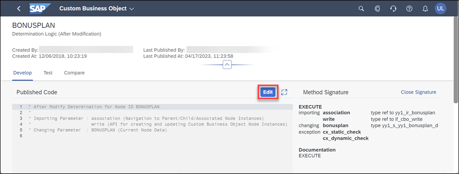
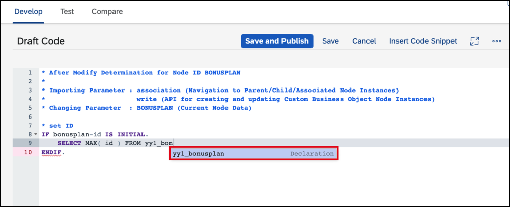
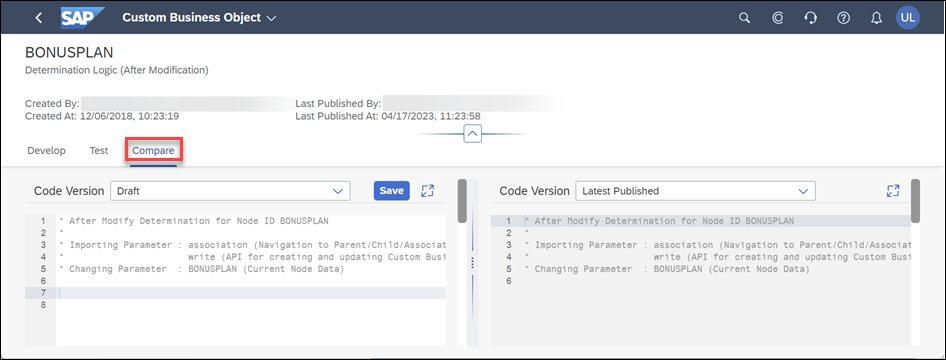
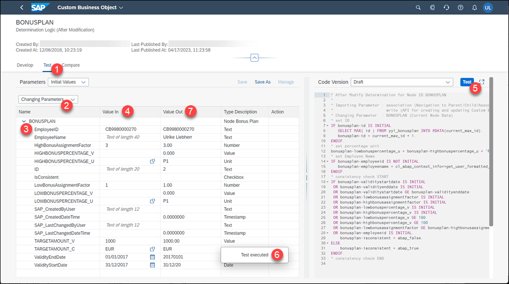
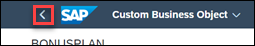

# Implement Logic for a Custom Business Object
<!-- description -->Control your custom business object application with ABAP logic

## Prerequisites  
- **Authorizations:** Your user needs a business role with business catalog **Extensibility – Custom Business Objects** (ID: `SAP_CORE_BC_EXT_CBO`) and **Extensibility - Custom Logic** (ID: `SAP_CORE_BC_EXT_BLE`) in your **S/4HANA Cloud** system


## You will learn  
- How to enable logic implementation for a custom business object
- How to implement changing custom business object database
- How to implement checking a custom business object before save
- How to implement saving or reject saving of a custom business object
- How to implement informing the end user about save
- How to ease development and test already while doing it

## Intro
At the end your application will set some data automatically and reject a save with an error message for the causing inconsistencies.

**Our Example**

A several tutorials spanning example will show extensibility along custom Bonus Management applications.

In the first parts a Manager wants to define business objects **Bonus Plan** for employees. A Bonus Plan is there to save employee specific rules for bonus entitlement.
## Additional Information
- **SAP S/4HANA Cloud Release** (tutorial's last update): 2302

---
### Make key field Read-Only

As there was no backend implementation to set the mandatory key field **`ID`** so far, we were forced to set it from the UI to be able to save instances. Now, as we will implement the logic to set the ID in backend and nowhere else, we will set that key field to Read-Only for the UI.

1. Enter your SAP S/4HANA system's Fiori Launchpad.

2. Start typing **Custom Business Objects** in the Launchpad search and open the App from the results.

    
    
3. Select the business object **Bonus Plan** in Custom Business Objects application
   
4. Start Edit Mode by executing the **Edit Draft** action.

5. Switch to **Fields** section.

6. **Check** the Read-Only box for key field **`ID`**.

    


### Enable logic development


1. Switch to **General Information** section.

2. **Check** the box for **Determination and Validation**

    

3. **Publish** the business object.

Now you are enabled to implement **Determination** logic which is called **after each modification** to a Bonus Plan instance from the UI, as well as **Validation** logic which is called **before each save** of an instance. Only in Determination logic you are able to change custom business object data. Validation logic is intended to check the business object, decide whether a save can be performed and provide the end user a message with helpful information like successful save or the reason for which a save had to be rejected.  


### Implement After Modification logic

For **published** Custom Business Objects **without a Draft version** you can implement logic.

1. Switch to **Logic** section.
   
    

2. Enter the After Modification Event Logic which is a Determination Logic.
   
    

3. In the **Develop** section click on **Edit** to change the currently published logic (which is empty still).

    

4. Determine and set static values:

    - Set the key field `ID` if still initial.

        >**Hint:** Changing Parameter `bonusplan` enables you to read current node data and change it.
        >
        >**Hint:** You can read existing Bonus Plan data via the CDS View that is named as the Business Object's Identifier (here: `YY1_BONUSPLAN`).
        >
        >**Hint:** With the key combination **CTRL + Space** you can access the very helpful code completion.
        >
        >

        ```ABAP
        * set ID
        IF bonusplan-id IS INITIAL.
            SELECT MAX( id ) FROM yy1_bonusplan INTO @DATA(current_max_id).
            bonusplan-id = current_max_id + 1.
        ENDIF.
        ```

    - Set the Unit of Measure for the Bonus Percentages to `P1` which is the code for % (percent)

        ```ABAP
        * set percentage unit
        bonusplan-lowbonuspercentage_u = bonusplan-highbonuspercentage_u = 'P1'.
        ```

    - Set the Employee Name from the Employee ID
        >**Hint:** Extensibility offers Helper class `CL_ABAP_CONTEXT_INFO` with method `GET_USER_FORMATTED_NAME` that needs a user ID to return its formatted name

        ```ABAP
        * set Employee Name
        IF bonusplan-employeeid IS NOT INITIAL.
            bonusplan-employeename = cl_abap_context_info=>get_user_formatted_name( bonusplan-employeeid ).
        ENDIF.
        ```

5. Check user input to determine the `isconsistent` property.

    - Check that `ValidityStartDate` and `ValidityEndDate` are set and that `ValidityStartDate` is earlier in time than `ValidityEndDate`.

    - Check that Factors and Percentages are set correctly (all > 0, Percentages < 100, `LowBonusAssignmentFactor` < `HighBonusAssignmentFactor`)

    - Check that Employee ID is set

        ```ABAP
        * consistency check START
        IF bonusplan-validitystartdate IS INITIAL
        OR bonusplan-validityenddate IS INITIAL
        OR bonusplan-validitystartdate GE bonusplan-validityenddate
        OR bonusplan-lowbonusassignmentfactor IS INITIAL
        OR bonusplan-highbonusassignmentfactor IS INITIAL
        OR bonusplan-lowbonuspercentage_v IS INITIAL
        OR bonusplan-highbonuspercentage_v IS INITIAL
        OR bonusplan-lowbonuspercentage_v GE 100
        OR bonusplan-highbonuspercentage_v GE 100
        OR bonusplan-lowbonusassignmentfactor GE bonusplan-highbonusassignmentfactor
        OR bonusplan-employeeid IS INITIAL.
            bonusplan-isconsistent = abap_false.
        ELSE.
            bonusplan-isconsistent = abap_true.
        ENDIF.
        * consistency check END
        ```

6. **Save** the logic.

    


Alternatively you can also change the logic in the **Compare** section which allows you to see for example the Draft Version and Latest Published Version next to each other.



### Test during development and publish the logic

In the **Test** section you can test the draft or latest published version of the logic with example runtime data. This data can also be saved as variant for later use.

1. Switch to **Test** section

2. Switch from **Importing Parameters** to **Changing Parameters** view, this will add the **Value Out** column.

3. Expand the `BONUSPLAN` node

4. Enter following data to the **Value In** column

    | Field	Name | Field Value |
    |------------|-------------|
    | `validitystartdate` | `2017-01-01` |
    | `validityenddate` | `2017-12-31` |
    | `targetamount_v` | `1000` |
    | `targetamount_c` | `EUR` |
    | `lowbonusassignmentfactor` | `1` |
    | `highbonusassignmentfactor` | `3` |
    | `lowbonuspercentage_v` | `10` |
    | `highbonuspercentage_v` | `20` |
    | `employeeid` | `<any>` |

    `employeeid` `<any>` shall be the one of a sales person that created sales orders with a Net Amount of more than 3000.00 EUR in 2017 and that are completed.

5. Execute the **Test** action

6. A message toast appears telling that the test was executed

7. You can see the node data after your logic was executed in the **Value Out** column.

    You can see that your logic works as `id`, `*percentage_u` fields and `employename` are filled as expected and `isconsistent` is 'X'.



Go back to **Develop** section and **Publish** the After Modification Logic.


### Implement Before Save logic

1. Being in After Modification logic you can get to Before Save Logic this way:

    - Go Back in application
     
        

    - In Tab "Logic", go to section "Determination and Validation"

2. **Implement** Before Save event with following functionality

    - If the bonus plan is consistent, it can be continued to save, if not save shall be rejected. In case of save no further processing is needed and logic can be left.
        >**Hint:** Exporting parameter valid must be set to true for save and to false for save rejection

        ```ABAP
        * decide about save rejection
        IF bonusplan-isconsistent EQ abap_true.
            valid = abap_true.
            RETURN.
        ELSE.
            valid = abap_false.
        ENDIF.
        ```

    - If the bonus plan is not consistent, write the first found error into the message and end the logic processing.
    These are the possible errors in detail:
        - `ValidityStartDate` and `ValidityEndDate` must be set
        - `ValidityStartDate` must be earlier in time than `ValidityEndDate`
        - Factors and Percentages must be > 0
        - Percentages must be < 100
        - LowBonusAssignmentFactor must be < HighBonusAssignmentFactor
        - Employee ID must be set

        ```ABAP
        * consistency error message START
        IF bonusplan-validitystartdate IS INITIAL OR bonusplan-validityenddate IS INITIAL.
            message = 'Validity Period must not be empty.'.
            RETURN.
        ELSEIF bonusplan-validitystartdate GE bonusplan-validityenddate.
            CONCATENATE 'Validity End Date' bonusplan-validityenddate 'must be later than Validity Start Date' bonusplan-validitystartdate '!' INTO message SEPARATED BY space.
            RETURN.
        ENDIF.

        IF bonusplan-targetamount_v IS INITIAL.
            message = 'Target Amount must be over 0!'.
            RETURN.
        ENDIF.

        IF bonusplan-targetamount_c IS INITIAL.
            message = 'Target Amount Currency must be set!'.
            RETURN.
        ENDIF.

        IF bonusplan-lowbonusassignmentfactor IS INITIAL
         OR bonusplan-highbonusassignmentfactor IS INITIAL.
            message = 'Assignment Factors must be over 0!'.
            RETURN.
        ENDIF.

        IF bonusplan-lowbonuspercentage_v IS INITIAL
         OR bonusplan-highbonuspercentage_v IS INITIAL.
            message = 'Percentages must be over 0!'.
            RETURN.
        ENDIF.

        IF bonusplan-lowbonuspercentage_v GE 100
         OR bonusplan-highbonuspercentage_v GE 100.
            message = 'Percentage must be below 100!'.
            RETURN.
        ENDIF.

        IF bonusplan-lowbonusassignmentfactor GE bonusplan-highbonusassignmentfactor.
            message = 'Low Bonus Factor must be smaller than High Bonus Factor!'.
            RETURN.
        ENDIF.

        IF bonusplan-employeeid IS INITIAL.
            message = 'Employee ID must be set!'.
            RETURN.
        ENDIF.
        * consistency error message  END
        ```

3. **Test** and **Publish** the Before Save Logic


### Test via the UI

Once ensured that both logic implementations were successfully published you can start testing the Application like an end user via the UI.

1. **Open** the Bonus Plan application
2. **Open** the Bonus Plan with ID `1`
3. **Edit** this Bonus Plan
4. **Enter** value `10` into field **Low Bonus Percentage**
5. **Save** the Bonus plan. You can see that your business logic works as the Percentage Units and the Employee Name get filled, but save fails due to the validation error messages for missing percentages.
6. **Enter** value `20` into field **High Bonus Percentage**
7. **Save** the Bonus Plan. Now it will not be rejected.


### Test yourself


---
