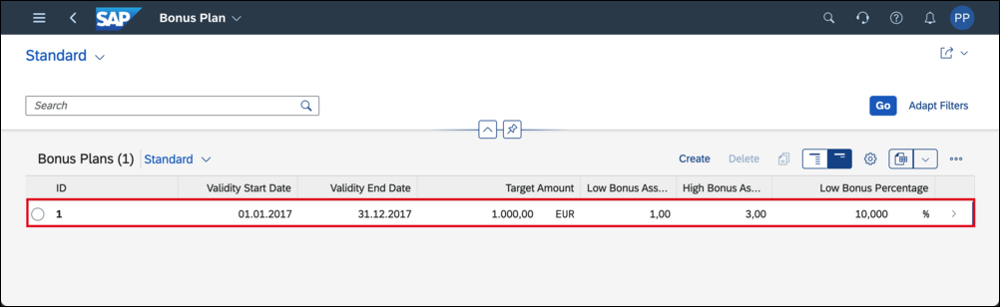
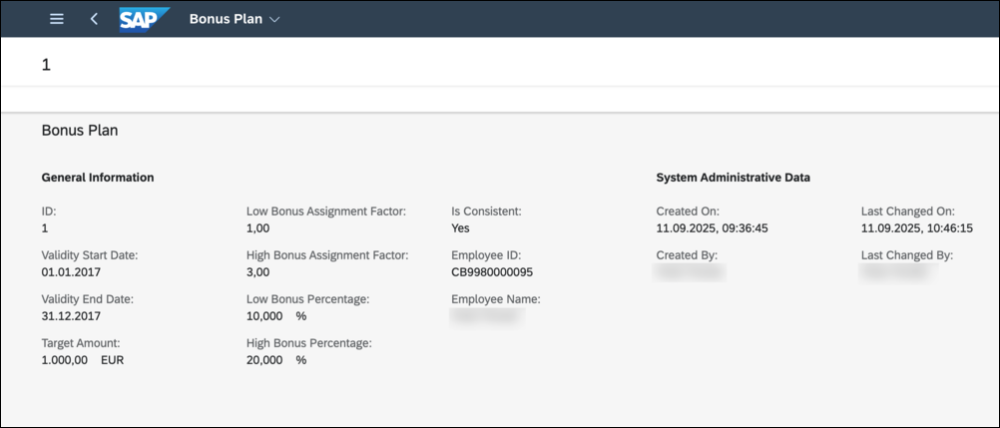

# Adapt the UI of a Business Object
<!-- description -->Adapt the UI of a business object inside SAP S/4Hana Cloud, shown at the generated UI of a Custom Business Object

## Prerequisites  
- **Authorizations:** Your user needs a business role with business catalogs **Extensibility - Custom Business Objects** (ID: `SAP_CORE_BC_EXT_CBO`) and **Extensibility - Key User Adaptation** (ID: `	SAP_CORE_BC_EXT_FLEX`) in your **SAP S/4HANA Cloud** system

## You will learn  
 - How to adapt an UI for all users in a system

**Additional Info**

In the preceding tutorials you created a custom business object with a simple data structure and its persistence. Afterwards you generated an UI for this business object and exposed it as a Fiori Launchpad application. As the generated User Interfaces only lists all fields of a business object node, adapting the UI might be necessary to improve usability of it.

> - Before done **UI Generation** and here shown **UI Adaptation** are so called **In-App Extensibility** features done completely inside a S/4HANA Cloud system. They are key user functionality with limited possibilities. Alternatively to UI Generation and Adaptation a UI with all SAPUI5 options can be developed with **SAP Business Application Studio** (see tutorial group [Create an SAP Fiori App and Deploy it to SAP S/4HANA Cloud](group.abap-custom-ui-s4hana-cloud)).
> - Tutorial last updated with SAP S/4HANA Cloud Release 2302

**Our Example**

A several tutorials spanning example will show extensibility along custom Bonus Management applications.

In the first parts a Manager wants to define business objects "Bonus Plan" for employees. A Bonus Plan is there to save employee specific rules for bonus entitlement.

### Open the UI to be adapted

Start typing **Bonus Plans** in the Launchpad search and open the App from the results.

Press **Go** to get the list of all Bonus Plans. **Open** a bonus plan's detail view by clicking its list item.

This is the screen that will be adapted.

### Switch to Adaptation mode

1. Open User Profile via the corresponding application's menu action
2. Open the adaptation mode via **Adapt UI**.

### Create an UI group

Editable UI elements can be recognized by getting a border when hovering over them.

By right clicking onto them you get options to adapt the UI. As these options are partly type dependent you might need to find the right element first to get the option you need.

**Hover** over the **General Information** area until it gets the border and open the context menu via **Right Click**.

**Create Group** and give it the title "Bonus Data".

### Move UI elements

Editable fields can simply be dragged and dropped as well. **Drag** the Validity Start Date field.

**Drop** it to the Bonus Data group.

Repeat **Drag & Drop** into Bonus Data group for the fields:

- Validity End Date
- Target Amount
- Low Bonus Assignment Factor
- High Bonus Assignment Factor
- Low Bonus Percentage
- High Bonus Percentage
- Employee ID
- Employee Name

### Apply UI changes

Last you make the UI adaptations available to all users in the system.

Click the activation button (wand icon).

In the opening pop up give a name for the new version and **Confirm** that.

Click the Publishing button (truck icon).

Finally you only need to **Save & Exit** to make the last published layout version available to all users in the system.

### Test yourself

