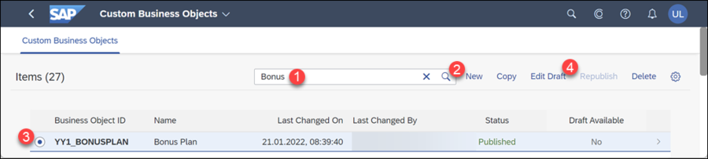
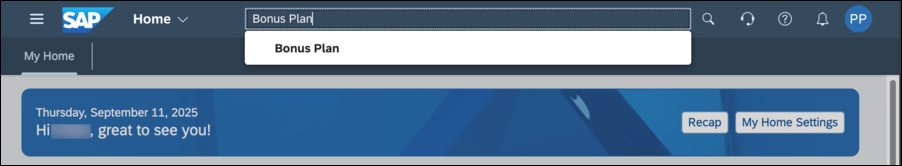

# Create the UI for a Custom Business Object
<!-- description -->Create an own application based on a Custom Business Object and a Custom Catalog Extension

## Prerequisites  
- **Authorizations:** Your user needs a business role with business catalogs **Extensibility - Custom Business Objects** (ID: `SAP_CORE_BC_EXT_CBO`) and **Extensibility - Custom Catalog Extensions** (ID: `SAP_CORE_BC_EXT_CCE`) in your **SAP S/4HANA Cloud** system

## You will learn
In the preceding tutorial you created a custom business object with a simple data structure and its persistence.
To be able to work with a business object you need a user interface. In this tutorial you will
<ul>
  <li>generate an User Interface (UI)
  <li>expose that UI as an application with the use of Custom Catalog Extensions
</ul>
At the end you will have a running application that you can create, update and delete custom business object entities with.

## Intro
>**UI Generation** and later done **UI Adaptation** are so called **In-App Extensibility** features done completely inside a S/4HANA system. They are key user functionality with limited possibilities.
>
>Alternatively the more powerful **Side-By-Side Extensibility** via **SAP Cloud Platform** could be done to develop an UI with all SAPUI5 options (see tutorial group [Create a SAP Fiori App and Deploy it to SAP S/4HANA Cloud](group.abap-custom-ui-s4hana-cloud)).

**Our Example**

A several tutorials spanning example will show extensibility along custom Bonus Management applications.

In the first parts a Manager wants to define business objects "Bonus Plan" for employees. A Bonus Plan is there to save employee specific rules for bonus entitlement.
## Additional Information
- **SAP S/4HANA Cloud Release** (tutorial's last update): 2302

---
### Generate UI

Start typing **Custom Business Objects** in the Launchpad search and open the App from the results.

**Search** for Custom Business Object "Bonus Plan" (1+2) and **Select** its list item in the search result list (3) and execute the **Edit Draft** action (4).

**Check** the two boxes for User Interface and Back End Service.

**Publish** the business object to trigger the generation of UI (Master and Detail) and OData Service.

### Grant Access to Application

Now you grant access to the generated UI by assigning it to a Business Catalog. Ensure not to be in edit mode which is the case just after publishing. From the Business Object's overview go to Custom Catalog Extension application by clicking the **Maintain Catalogs** link.

A new window will open.

Start adding a catalog with the **Add** action.

In the opening value help narrow down the result list by searching for `Custom Business`, select the Catalog with role ID `SAP_CORE_BC_EXT_CBO` and press **OK**.

>You could also choose another Catalog, but be aware that your user must have a Business Role containing that catalog to be able to access the created application.

**Select** the just added Catalog and **Publish** it.

This step takes some minutes, the screen refreshes automatically and once the status switches from unpublished to published, you can close this application's window and proceed.

### Test Bonus Plan application

Start typing **Bonus Plans** in the Launchpad search and open the App from the results.

**Create** an object.

**Enter** following data

| Field | Value |
| :------------- | :--------------------------- |
| ID | 1 |
| Validity Start Date | 01/01/2017 |
| Validity End Date | 31/12/2017 |
| Target Amount | 1000.00 EUR |
| Low Bonus Assignment Factor | 1 |
| High Bonus Assignment Factor | 3 |
| Employee ID | `<any>` |

Employee ID <any> shall be the one of a sales person that created sales orders with a Net Amount of more than 3000.00 EUR in 2017 and that are completed.

**Save** the Bonus Plan. The UI will automatically return from Bonus Plan Detail to Master, where you can see one entry in the list of bonus plans now.

### Test yourself

---
