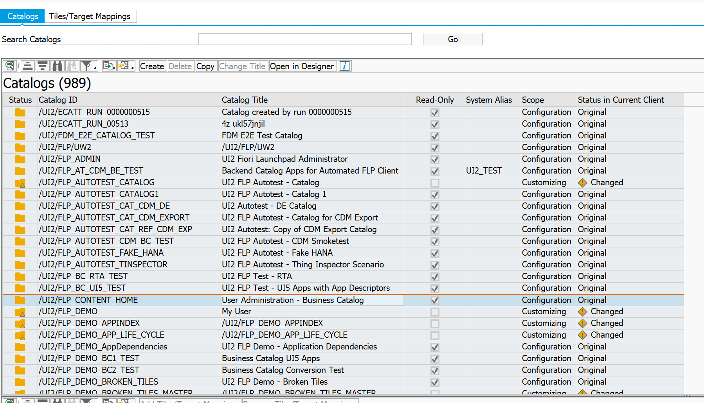
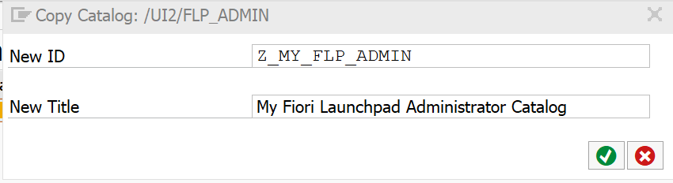

# Set up Catalogs for the Launchpad
<!-- description --> Set up catalogs for the launchpad using the launchpad content manager

## Prerequisites
## You will learn
  - How to copy a catalog
  - How to change the catalog title
  - How to remove apps you don't need
  - How to add apps

## Intro
In this tutorial, you will learn how to copy an SAP business catalog and adjust it to your needs by adding and removing apps.

For more information, see [Help Portal](https://help.sap.com/viewer/DRAFT/d4650bf68a9f4f67a1fda673f09926a9/753.04/en-US/936ab6034c5f4a56aa090e245136f002.html).

> this is a note

### Launch the launchpad content manager

In your ABAP system, open transaction `/UI2/FLPCM_CUST`.


header | header | header |
--------- | -------- |
item | item | item |

```ABAP
This is a codeblock.
```


### Search for an SAP business catalog

Search for the catalog with the ID `/UI2/FLP_ADMIN`.
In the **Search Catalogs** field, enter `/UI2/FLP_ADMIN`. This will search all visible columns of the catalogs list.
The catalog with the ID is displayed in the upper table and its content in the lower table.


### Copy the catalog

1. Choose **Copy**.
2. In the dialog window that appears, enter `Z_MY_FLP_ADMIN` in the **New ID** field and `My FLP Admin Catalog` in the **New Title** field.



### XXXXX


### XXXXX


### XXXXX


### XXXXX


### XXXXX


### XXXXX


### XXXXX


### XXXXX


### XXXXX


### XXXXX


### XXXXX


### XXXXX


### XXXXX


### XXXXX


### XXXXX


### XXXXX


### XXXXX


### XXXXX


### XXXXX


### XXXXX


### XXXXX


### XXXXX


---
