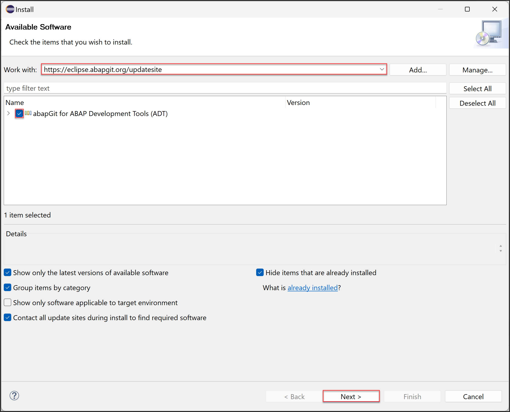
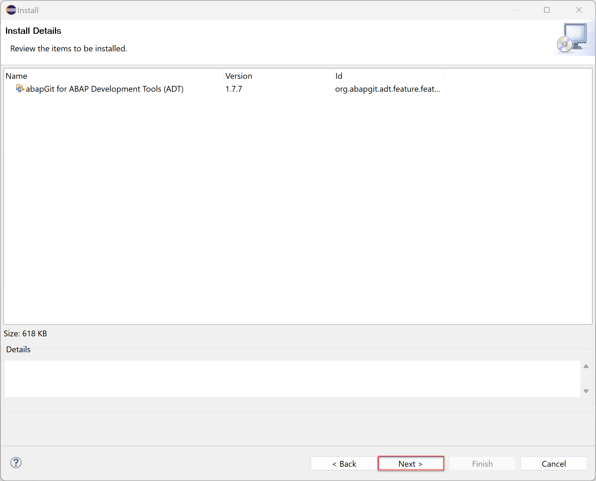
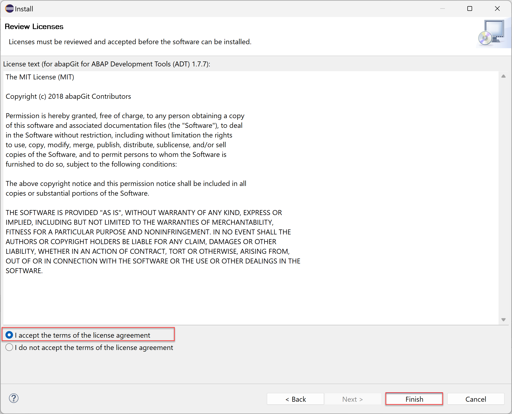
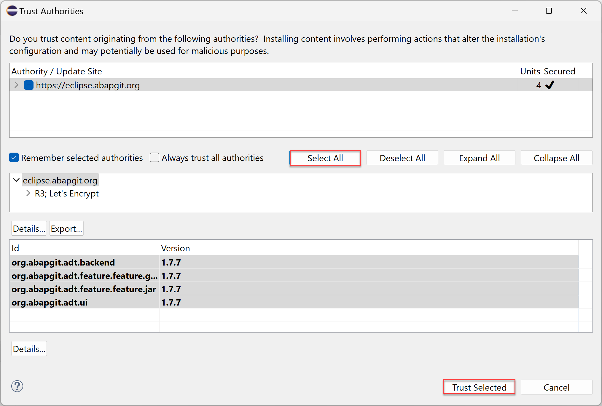
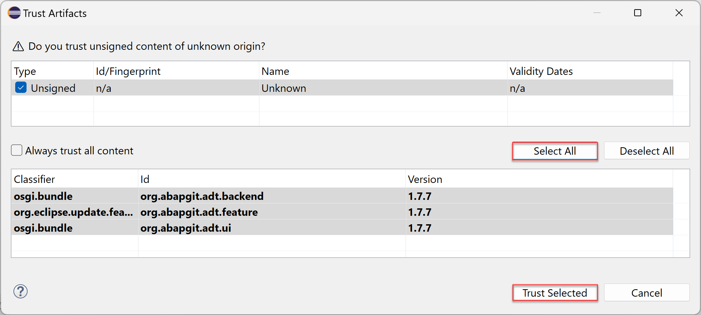

# Install the abapGit Plugin
<!-- description --> Install the abapGit plugin for ADT.

## You will learn
- How to install `abapGit` plugin

## Prerequisites
- You finished the [Download the Eclipse IDE and add the ABAP Development Tools (ADT) Plugin](abap-install-adt) tutorial.

This tutorial is only required to transfer ABAP development objects between a Git repository and an SAP S/4HANA Cloud, ABAP Environment instance or an SAP BTP, ABAP Environment instance.

---

### Install abapGit plugin

To transfer your ABAP development objects from on-premise SAP systems to an SAP BTP, ABAP Environment instance, you can use the `abapGit` plugin.

  1.  Open **Eclipse** and select **Help** > **Install New Software**.

      .

  2. Enter the `abapGit` URL **`https://eclipse.abapgit.org/updatesite/`** in the **Work with** section, press enter,  select **`abapGit` for ABAP Development Tools (ADT)** and click **Next >**.

      

  3. Click **Next >**.

      

  4. Accept the **license agreement** and click **Finish**.

      

  6. Click **Select All** and **Trust Selected**.

      
  
  7. Click **Select All** and **Trust Selected**.

      
  
  8. Click **Restart Now**.

      

  9. Now `abapGit` for ADT is installed.

      

### Test yourself

