# Implement a Custom ABAP AI Scenario including Grounding Capabilities in Your SAP S/4HANA System

<!-- description -->Learn how to implement an Intelligent Scenario including Grounding capabilities using the ABAP AI SDK powered by Intelligent Scenario Lifecycle Management (ISLM)

## Prerequisites

You have successfully configured your system as described in [Set Up Your SAP S/4HANA System for Custom AI Scenarios](group.abap-islm-setup).

## You will learn

- How to create an Intelligent Scenario in the Intelligent Scenarios Application, including an Execution Flow Template, and upload grounding documents
- How to deploy and activate the Intelligent Scenario in the Intelligent Scenario Management Application 
- How to use the Intelligent Scenario in a simple ABAP class

## Pre-Read
SAP AI Core's orchestration service including its consumption in ABAP has already been introduced in the previous tutorial, i.e. [Implement a Custom ABAP AI Scenario Consuming SAP AI Core Orchestration Service in Your SAP S/4HANA System](abap-islm-orchestration-service-consumption). To further improve results in large language model (LLM) interactions, the LLM can be grounded using additional information. Such additional information could be e.g. company-specific or organisation-specific policies, custom- or user-defined rules, etc. In the orchestration service pipeline, the query on existing grounding documents is executed before the actual prompt is handed over to the large language model.

Want to learn more? Please see the [Orchestration documentation](https://help.sap.com/docs/sap-ai-core/generative-ai/orchestration) for more information.


---

### Prepare the Execution Flow Template (optional)

Usage of SAP AI Core orchestration service requires the configuration of the orchestration service pipeline. In order to create a custom configuration, you may e.g. use the SAP AI Launchpad as explained in tutorial [Implement a Custom ABAP AI Scenario Consuming SAP AI Core Orchestration Service in Your SAP S/4HANA System](abap-islm-orchestration-service-consumption). The consumption of the orchestration service pipeline in ABAP requires an intelligent scenario (INTS) including an execution flow template in the enclosed intelligent model (INTM). 

You may use the above mentioned tutorial for obtaining your own `JSON` file, which can subsequently be uploaded later in this tutorial. Alternatively, you may use the `JSON` provided in a later step in this tutorial. The file provided in this tutorial slightly differs from the one created in the above mentioned tutorial, i.e. it omits the usage of the output translation module.

> **NOTE:** In case you use the `JSON` file copied from your SAP AI Core Launchpad Orchestration configuration, make sure you adapt to remove the outermost layer, hence the file should start with `{ "modules"` and adapt to `"masking_providers"` (instead of `"providers"`).

> **NOTE:** If you would like to dive deeper into SAP AI Core's orchestration service grounding module, please also check tutorial [Orchestration(V2) with Grounding Capabilities in SAP AI Core](ai-core-orchestration-grounding-v2).


### Create an Intelligent Scenario

**Goal:** Create and publish the intelligent scenario, including the consumption of SAP AI Core's Orchestration Service modules.

1. In the SAP Fiori launchpad of your SAP S/4HANA system, choose the Intelligent Scenarios Fiori Application tile as shown below. Alternatively, you can start from SAP GUI using transaction ```F4469```.
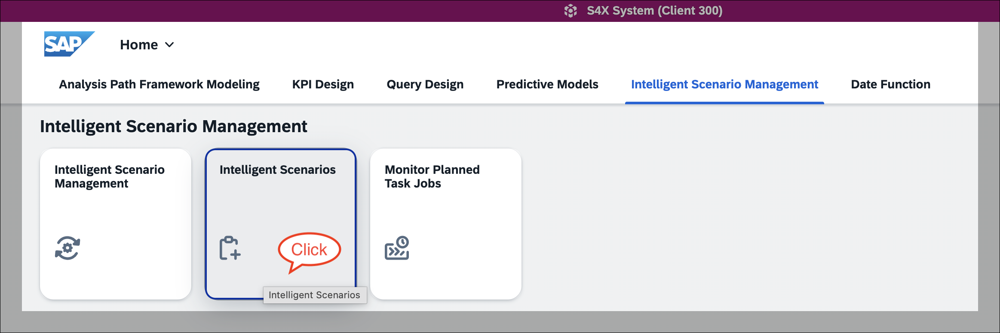
2. Create a ```Side-by-Side``` intelligent scenario
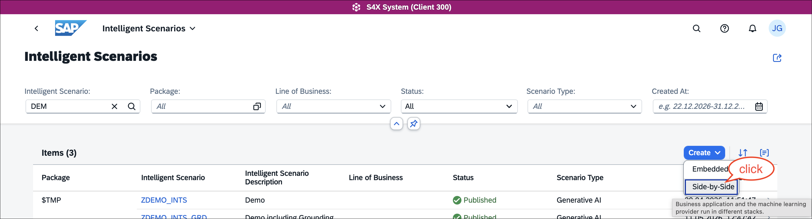

3. On the creation screen, first set the intelligent scenario type to `Generative AI`, which updates the SAP Fiori creation screen accordingly. You can now fill in the mandatory fields for the Intelligent scenario, e.g. INTS name `ZDEMO_INTS_GROUNDING`. Make sure to also provide the `Usage Type`.
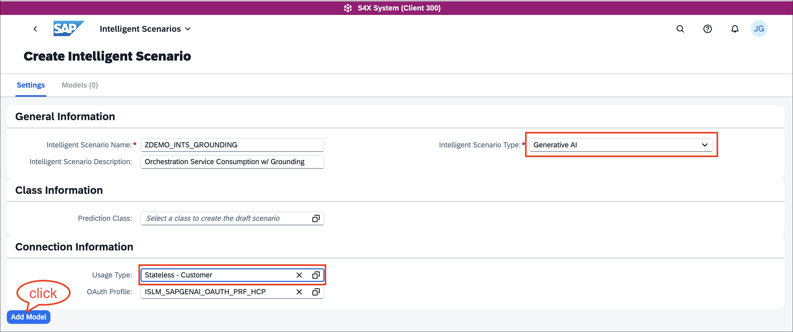

4. Click ```Add Model``` (see screenshot above) to open the configuration of the Intelligent Scenario Model (INTM), which will be named `ZDEMO_INTM_GROUNDING` in this tutorial. This model holds the details of the large language model. Choose from the list of supported providers and available models. Ensure you select the same model configured in the orchestration service, i.e. `antropic--claude-4-sonnet` when using the provided `JSON` file. 
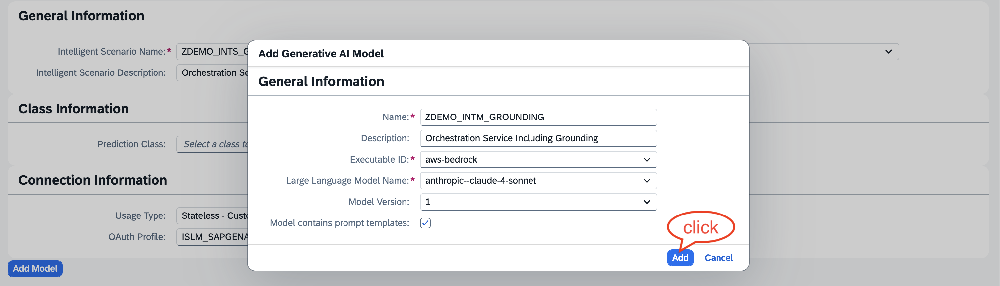

5. Navigate to the `Execution Flow Template` tab and click on `Upload`. 
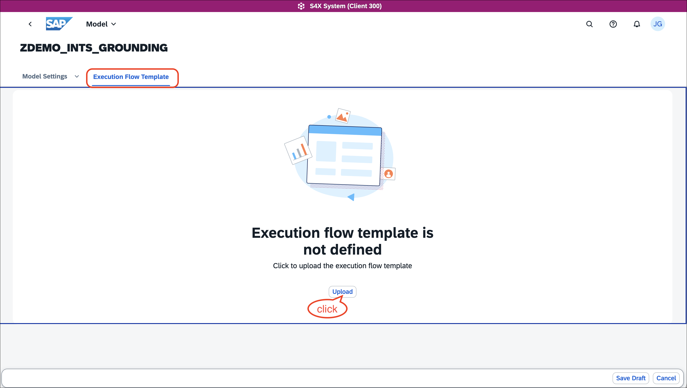

1. Use the `JSON` file from [this repository](https://github.com/SAP-samples/abap-islm-tutorial-samples/blob/main/abap-islm-orchestration-grounding-consumption/execution_flow_template.json) and upload it into the intelligent scenario model
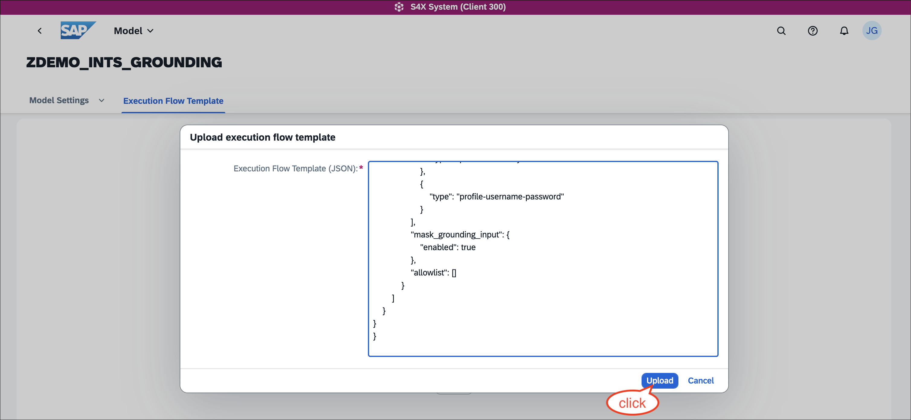 

1. In order to use grounding, add a data repository of type `Vector`, which enables the option to add grounding templates to the INTM.
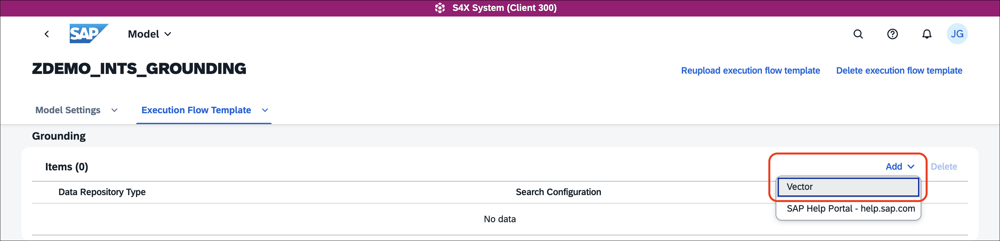

1. Configure the grounding item, i.e. set the search configuration to `1` and use `Max Document Count`. 
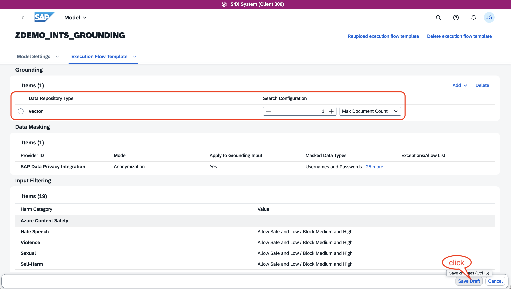

1. Navigate to the `Model Settings` tab and add two prompt templates 
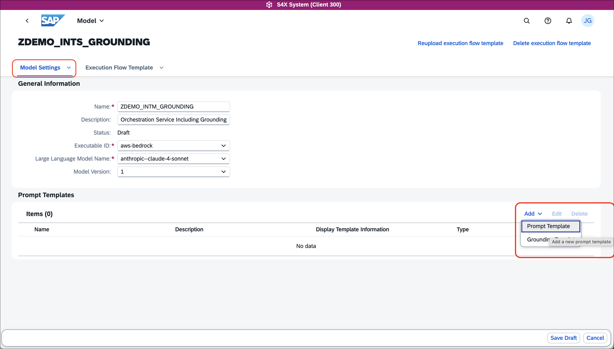 

    a. Add a prompt template for the user prompt `USERPROMPT`, choose `Display Template Information` to `Yes`, and add the prompt specification as:
    `Based on {ISLM_UserInput}, briefly summarize, i.e. give a personal description, summarize and rate if this person fits into our team of AI enthusiats.`
    The default value will remain empty.
    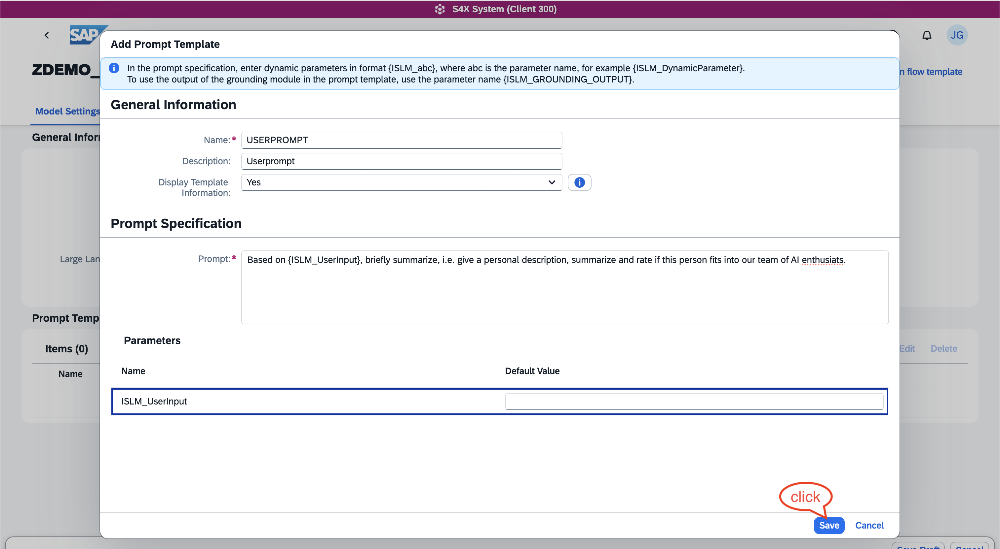 

    b. Add a prompt template for the system prompt `SYSTEMPROMPT`, choose `Display Template Information` to `Yes`, and add the prompt specification as
    `Respect the guidelines given from {ISLM_GROUNDING_OUTPUT}.`
    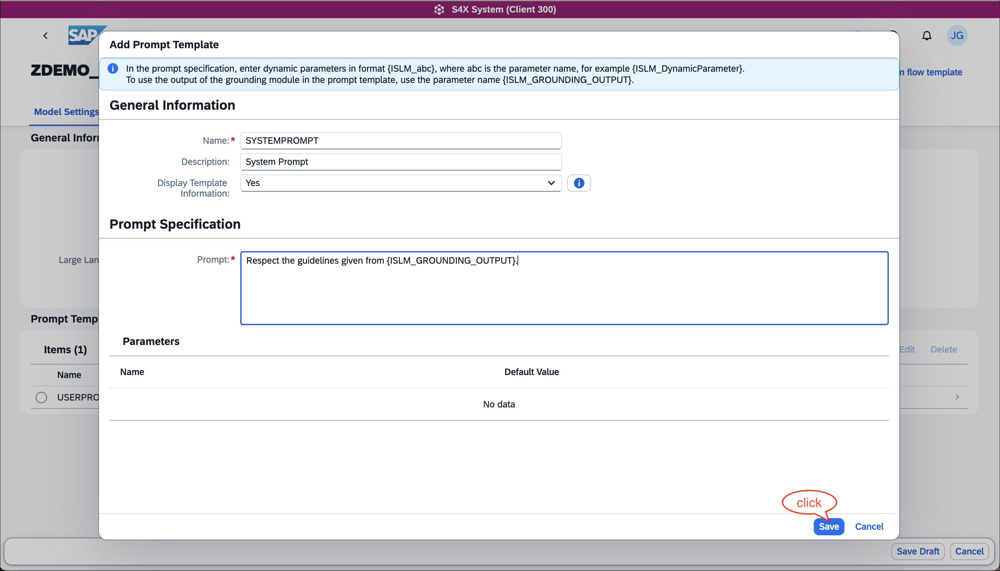 
1.  Add a grounding template, which is used as input for the grounding module, i.e. adds a query for the grounding documents
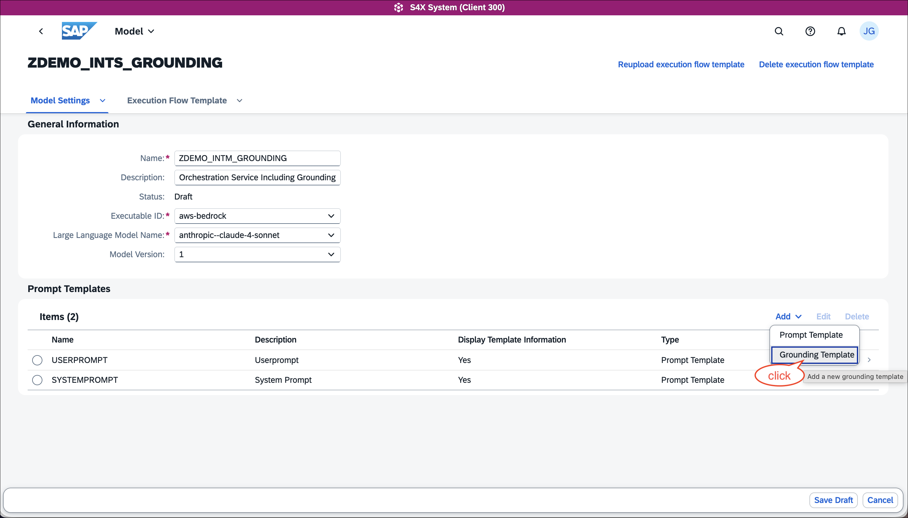 

1.  Configure the `GROUNDING_QUERY`, choose `Display Template Information` to `Yes`, and specify the prompt as `Select the right grounding document for application evaluation based on the organization type {ISLM_OrgType}.`. You may leave the default value for `ISLM_OrgType` empty
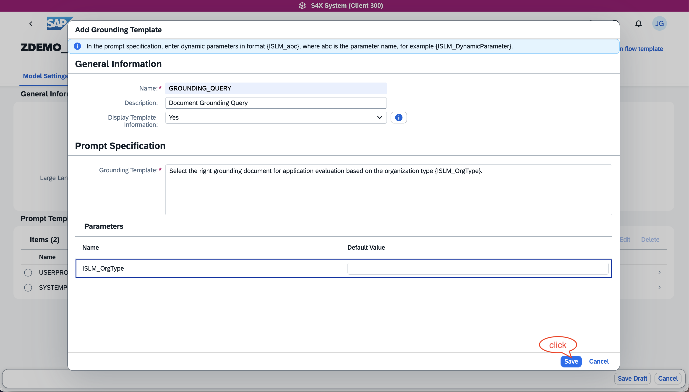 
> **NOTE:** There are pre-defined variables like `ISLM_GROUNDING_OUTPUT` and pre-defined dynamic parameters formatted like `ISLM_abc`, where `abc` can be chosen (case-sensitive) according to custom needs. The usage of `ISLM_GROUNDING_OUTPUT` in one of the prompts is mandatory, leading to orchestration execution errors if omitted.
1.   Safe the intelligent scenario model draft and **navigate back** to the intelligent scenario `ZDEMO_INTS_GROUNDING`. In the scenario covered in this tutorial, the application will be used to rate a job application given to organisation-specific ratings. The guidelines for these ratings are given by documents (`txt` files in our example), which are used to ground the large language model response. The files can be obtained from [this repository](https://github.com/SAP-samples/abap-islm-tutorial-samples/tree/main/abap-islm-orchestration-grounding-consumption). Navigate to the document tab, upload the grounding documents, and publish the INTS:

     a. `SW_DEV_CONSULTING`: `Gudilelines for Software Development Consulting`
   
     b. `CONTROLLING`: `Guidelines for Controlling`

     c. `HR`: `Guidelines for Human Ressources`

     d. `SW_DEV_AI`: `Guidelines for Software Development focus on Artificial Intelligence`

     e. `SW_DEV`: `Guidelines for Software Development (general)`
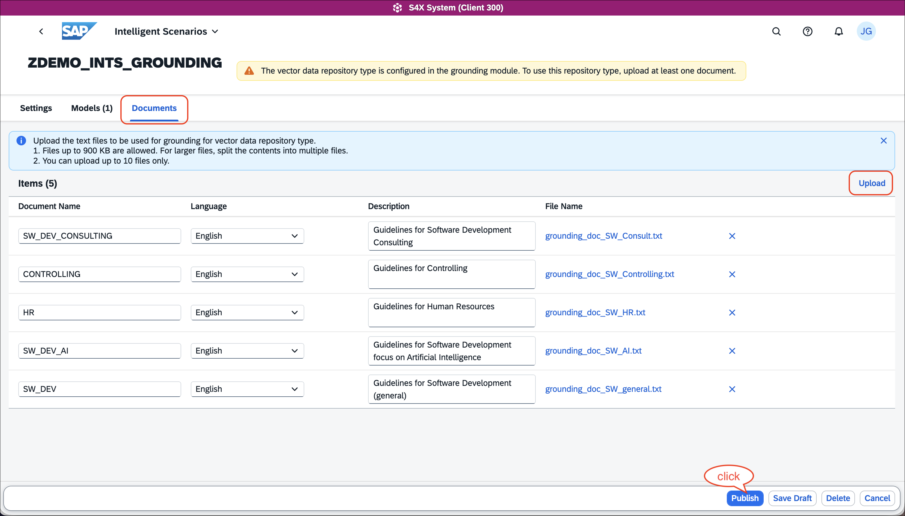 
1.  Choose an ABAP development package, e.g. `$TMP`, for the intelligent scenario and intelligent model
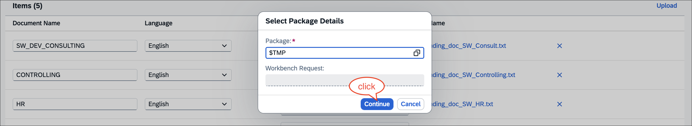
1.  Confirm the intelligent scenario to be published


### Deploy and Activate the Intelligent Scenario

**Goal:** Continue with the deployment and activation of the newly created intelligent scenario to enable interactions with the SAP AI Core orchestration service pipeline comprising the grounding capabilities as well as the LLM deployment.

1. Open the Intelligent Scenario Management tile in your SAP Fiori launchpad as shown below. Alternatively, you can start from SAP GUI using transaction ```F4470```
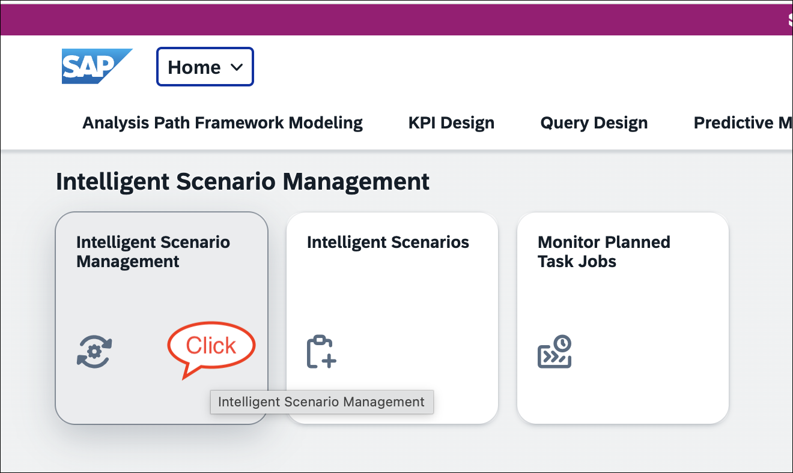

2. Choose the previously created and published intelligent scenario `ZDEMO_INTS_GROUNDING`. Open its detail screen by clicking the ```>``` icon.
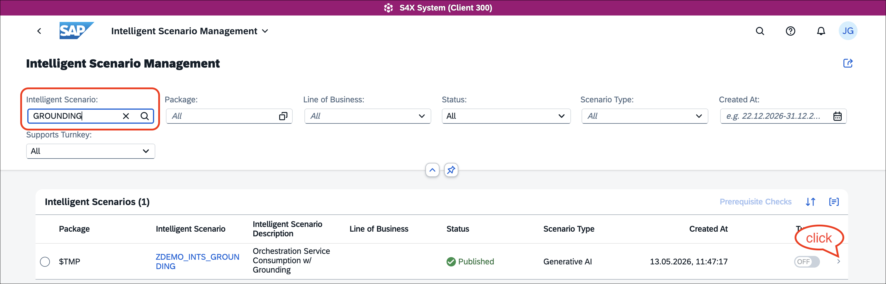 
> **NOTE:** If you see a message about missing synchronization, this is expected and depends on your system configuration. There may be a delay before the required information is synced with your BTP AI Core instance (default: 5 minutes). You may need to wait up to 5 minutes for synchronization to complete.

3. Choose the model entry and navigate to its detail screen by clicking the `>` icon.
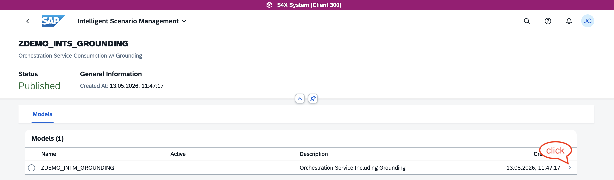

4. Deploy the intelligent scenario via the `Deploy` option.
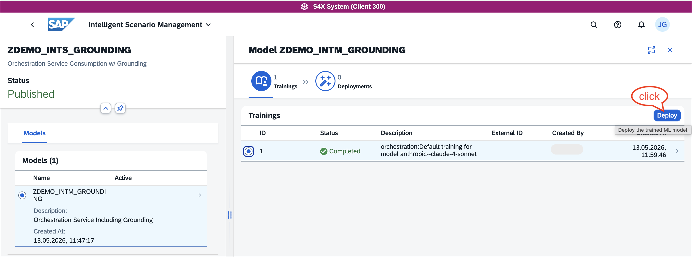 

5. Check the deployment details displayed, you may change the deployment description or just accept the proposed text
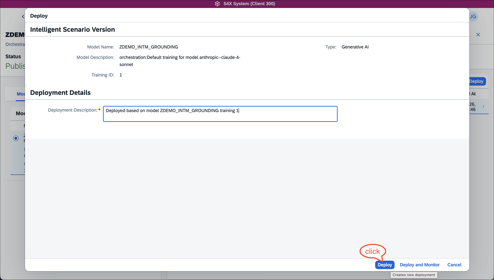
 

6. The deployment status will first change to a pending state, then to ```Deployed```. You can then activate the deployment for all users via the ```For All``` option
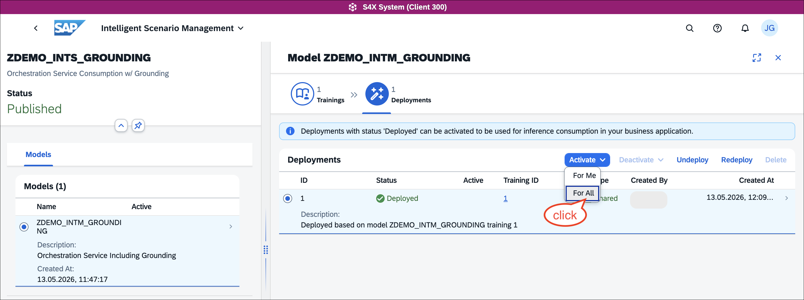
 

7. You'll be asked to confirm the activation method 
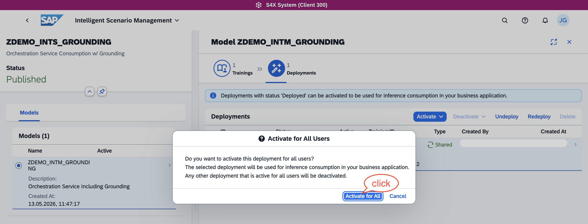

8. Finally, the deployment is activated
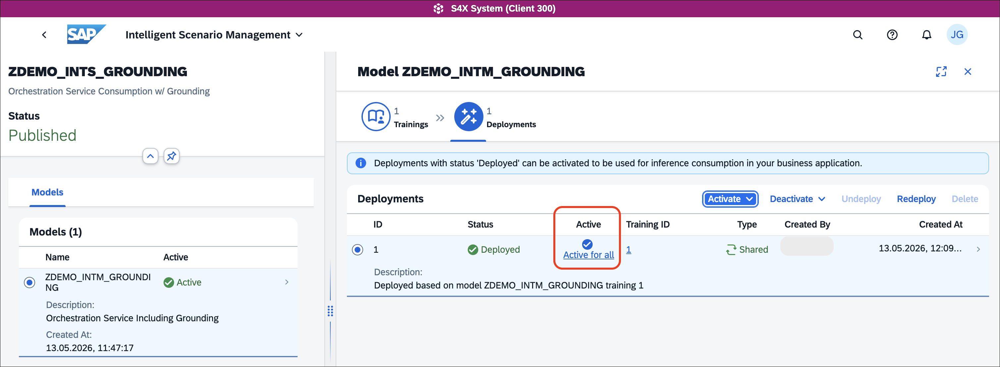

**Conclusion:** Well done! You are now ready to consume the intelligent scenario and interact with an LLM via SAP AI Core's Orchestration Service — let's do that in the next step!

### Consume the Intelligent Scenario in a Simple ABAP Class

**Goal:** Now that you have successfully published and activated the intelligent scenario, it is time to consume it in your ABAP code. For clarity, this tutorial uses a simple ABAP class with console output, but you can of course apply more complex ABAP logic.

1. Use ABAP Development Tools in Eclipse to create an ABAP class with the following code. Please ensure to adapt the INTS name `ZDEMO_INTS_GROUNDING` in case you've chose a different one. Same holds for the prompt templates names `SYSTEMPROMPT` and `USERPROMPT` in case you have chosen a different naming. In case you would like to see how a different grounding influences the result, please modify the value for constant `grounding_hint`.

```ABAP
CLASS zdemo_islm_grounding DEFINITION
  PUBLIC
  FINAL
  CREATE PUBLIC .

  PUBLIC SECTION.
  INTERFACES if_oo_adt_classrun.
  PROTECTED SECTION.
  PRIVATE SECTION.
    DATA: user_message TYPE string,
          system_role  TYPE string.

    CONSTANTS:
      ints           TYPE islm_de_sbs_is_name VALUE 'ZDEMO_INTS_GROUNDING',
      grounding_hint TYPE string VALUE 'Software Development (AI Focus)'.
ENDCLASS.


CLASS zdemo_islm_grounding IMPLEMENTATION.
  METHOD if_oo_adt_classrun~main.
    user_message = |Dear Joe, I'm Jane Doe, and I'm interested in joining your AI team. I have a basic understanding of computers | &&
                   |and I'm excited about AI.| &&
                   |Key highlights of my profile:| &&
                   |Completed an online course on basic computer skills (2015)| &&
                   |Familiar with Microsoft Office and Google Suite | &&
                   |Enjoy working with people and have experience in customer service | &&
                   |Willing to learn and take on new challenges | &&
                   |I'm looking for a new opportunity and think your team might be a good fit. Please find my resume attached. | &&
                   |Best regards,| &&
                   |Jane Doe | &&
                   |(jane.doe@email.com, 555-901-2345)|.

    TRY.

        DATA(api) = cl_aic_islm_orch_api_factory=>get( )->create_instance( islm_scenario = ints ).

        " Use the 'SYSTEMPROMPT' template as system prompt
        api->configure_templating( )->add_prompt_template( template_id  = 'SYSTEMPROMPT'
                                                           message_type = aic_prompt_message_type=>system_role ).

        " Use the 'USERPROMPT' template as user prompt and add the user_massage as input parameter
        api->configure_templating( )->add_prompt_template( template_id  = 'USERPROMPT'
                                                           message_type = aic_prompt_message_type=>user_message ).
        api->set_input_parameter( name  = 'ISLM_UserInput'
                                  value = user_message ).

        " configure the grounding, i.e. enable it and provide the input for the grounding query 
        api->configure_grounding( )->add_grounding_template(
            template_id         = 'GROUNDING_QUERY'
            template_parameters = VALUE #( ( name  = 'ISLM_OrgType'
                                             value = grounding_hint ) ) ).

        FINAL(execute) = api->execute( ).
        " For demo purpose only: check the grounding module's output, i.e. check
        " which document has been retrieved by the grounding query
        FINAL(grounding_output) = execute->grounding_result( )->output( ).

        " run the LLM request using the full orchestration service pipeline
        FINAL(response) = execute->orchestration_result( )->completion( ).

        " provide results as console output
        out->write( '***Grounding result:***' ).
        out->write( grounding_output ).

        out->write( '***AI Response:***' ).
        out->write( response ).

      CATCH cx_aic_api_factory INTO DATA(cx_factory).
        out->write( cx_factory->get_longtext( ) ).
      CATCH cx_aic_orchestration_api INTO DATA(cx_orch).
        out->write( cx_orch->get_longtext( ) ).
    ENDTRY.
  ENDMETHOD.

ENDCLASS.
```

2. Activate and run the ABAP class using `Run as > ABAP Application (Console)`. The ABAP console output will look similar to the following

```Text
***Grounding result:***
{
  "organization_type": "Software Development (AI Focus)",
  "rating_scale": {
    "min": 1,
    "max": 5,
    "definitions": {
      "1": "Very weak / insufficient evidence",
      "2": "Below average",
      "3": "Meets expectations",
      "4": "Above average",
      "5": "Exceptional"
    }
  },
  "overall_rating_calculation": "Weighted average of all aspect scores",
  "aspects": [
    {
      "name": "AI & Machine Learning Expertise",
      "description": "Knowledge of ML algorithms, deep learning, data modeling, and AI theory.",
      "weight": 0.40
    },
    {
      "name": "Applied Research & Experimentation",
      "description": "Ability to design experiments, evaluate models, and iterate based on results.",
      "weight": 0.25
    },
    {
      "name": "Engineering AI Systems",
      "description": "Skills in deploying, scaling, and maintaining AI models in production systems.",
      "weight": 0.20
    },
    {
      "name": "Ethical & Critical Awareness",
      "description": "Understanding of AI risks, bias, limitations, and responsible usage.",
      "weight": 0.15
    }
  ]
}

***AI Response:***
## Candidate Summary: MASKED_PERSON

**Personal Description:**
MASKED_PERSON is a career changer with basic computer literacy and customer service background, seeking to transition into AI. Shows enthusiasm and willingness to learn but lacks technical foundation in AI/ML.

**Key Strengths:**
- Strong interpersonal skills from customer service experience
- Demonstrated willingness to learn new technologies
- Collaborative mindset ("enjoy working with people")

**Key Gaps:**
- No AI/ML technical knowledge or experience
- Limited programming background
- 9-year gap since last technical training (2015)

## Ratings Assessment:

**AI & Machine Learning Expertise:** 1/5 (Weight: 40%)
- No evidence of ML algorithms, data modeling, or AI theory knowledge

**Technical Implementation & Experimentation:** 1/5 (Weight: 25%)
- No experience with model development, testing, or experimentation

**Production & Deployment Skills:** 1/5 (Weight: 20%)
- No systems experience or technical deployment capabilities

**Ethical & Critical Awareness:** 2/5 (Weight: 15%)
- Shows basic awareness through interest in joining AI team, but no demonstrated understanding

**Overall Rating: 1.2/5**

**Recommendation:** Not suitable for current AI team roles. Would require extensive training/education before contributing meaningfully. Consider for non-technical AI-adjacent positions or suggest pursuing formal AI education first.
```

**Conclusion:** Congratulations! You implemented an intelligent scenario using the SAP AI Core orchestration service including the grounding capabilities. You're now well equipped to build you own Custom ABAP GenAI scenario!


### Test yourself

---