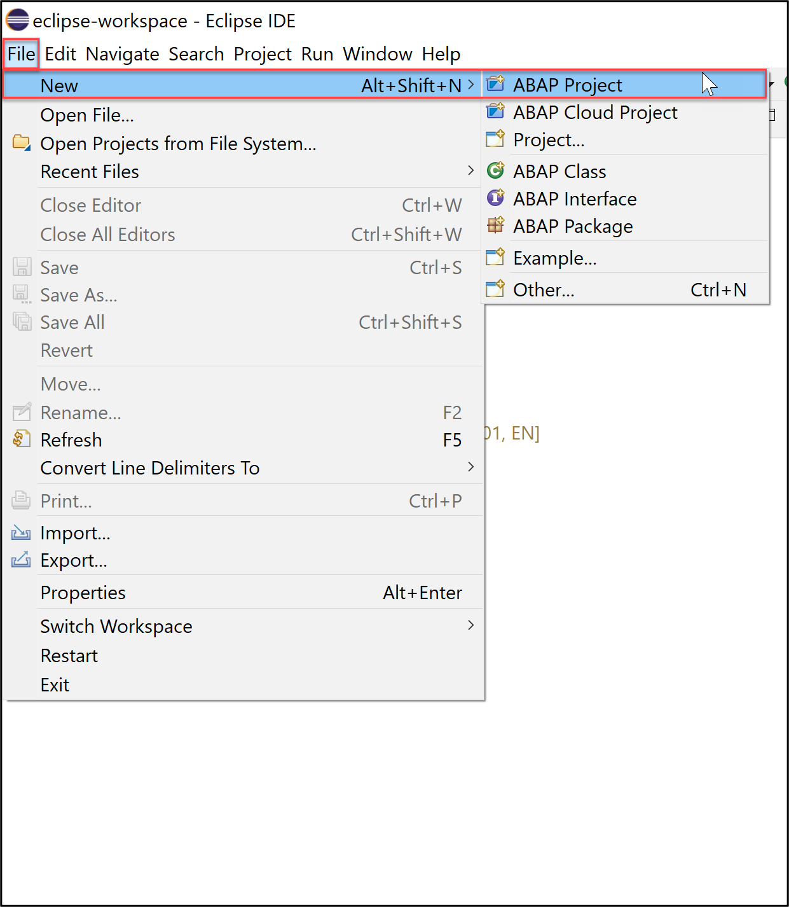
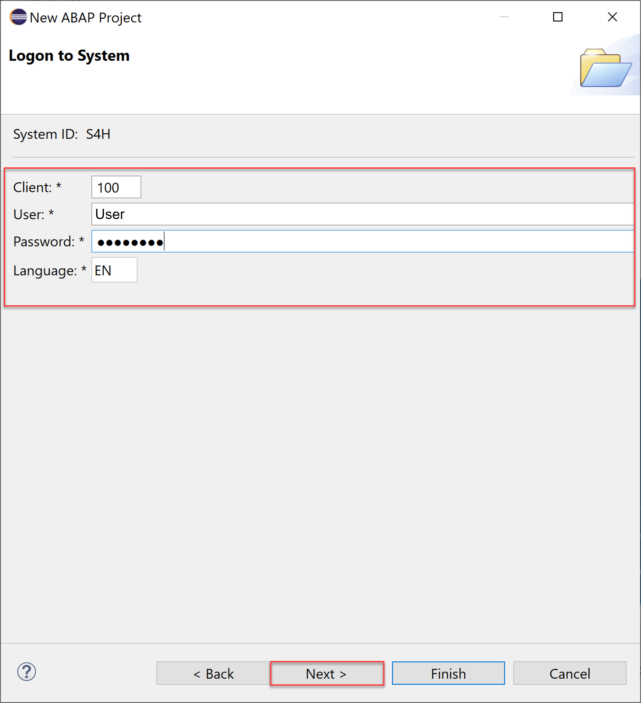
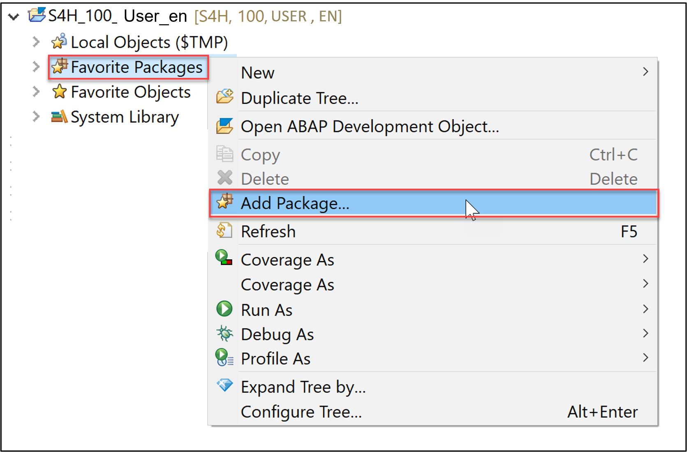
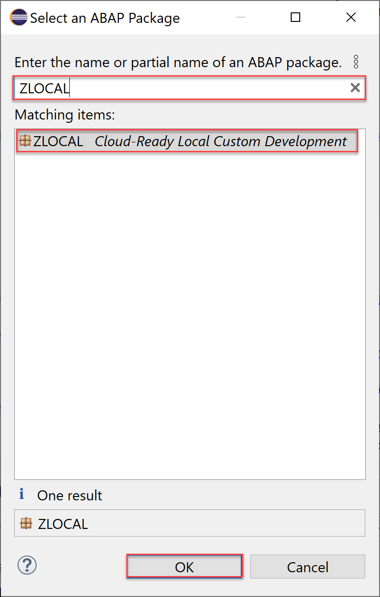

# Log into SAP S/4HANA Cloud, ABAP Environment or SAP S/4HANA On-Premise 
<!-- description --> Learn how to log into an SAP S/4HANA Cloud, ABAP Environment or SAP S/4HANA on-premise system.

 
## Prerequisites  
- You have installed the latest [Eclipse with ADT](abap-install-adt). For the installation process, please follow [this tutorial](abap-install-adt).

## You will learn  
- How to log into SAP S/4HANA Cloud, ABAP Environment
- How to log into SAP S/4HANA on-premise

---

### Log into your system

Choose between the tabs **SAP S/4HANA Cloud, ABAP Environment** and **SAP S/4HANA on-premise** and follow the login process.

  [OPTION BEGIN [SAP S/4HANA Cloud, ABAP Environment]] 

  1. Open Eclipse, select **File** > **New** > **Other**.

      

  2. Search **ABAP Cloud Project**, select it and click **Next >**.

      

  3. Select **SAP S/4HANA Cloud, ABAP Environment**, enter the ABAP service instance URL and click **Next >**.

      

  4. Click **Open Logon Page in Browser** to log in.

      

      **HINT**: The administrator receives an welcome e-mail after provisioning. This e-mail includes the system URL. By removing `/ui` you can log into the SAP S/4HANA Cloud, ABAP Environment system. Further information can be found [here](https://help.sap.com/docs/SAP_S4HANA_CLOUD/6aa39f1ac05441e5a23f484f31e477e7/4b962c243a3342189f8af460cc444883.html?locale=en-US&state=DRAFT).

  5. Click **Next >**.

      

  6. Check your ABAP service instance connection and click **Finish**.

      

  7. Now your project will be available in the project explorer.

      

  [OPTION END]

  [OPTION BEGIN [SAP S/4HANA on-premise]] 

  **For S/4HANA on premise:**
   - Remark that SAP S/4HANA 2022 `(FPS01)` [Fully-Activated Appliance](https://blogs.sap.com/2018/12/12/sap-s4hana-fully-activated-appliance-create-your-sap-s4hana-1809-system-in-a-fraction-of-the-usual-setup-time/) can be used.
   - The steps for fully-Qualified Domain Name & SSL Certificates can be found [here](https://www.sap.com/documents/2020/06/109b1be0-9e7d-0010-87a3-c30de2ffd8ff.html).

  **Hint:** Remark for Set Up Developer Extensibility, if CAL instance is not used but bare-minimum [S/4HANA on-premise](https://help.sap.com/docs/ABAP_PLATFORM_NEW/ed0e11412f9841e7ac5cd9a6799368d4/31367ef6c3e947059e0d7c1cbfcaae93.html?state=DRAFT&version=202210.latest). Please follow these steps, if you don't use a CAL instance.
   - For SAP S/4HANA on-premise, create developer user with full development authorization.

  1. Open Eclipse, select **File** > **New** and **ABAP Project**.

      

  2. In the System Connection dialogue click on the link **new system connection**.

      

  3. In the Connection Settings dialogue choose the connection type Custom Application Server. Then enter the following connection information:

      - System ID: `S4H`
      - Application Server: `xxx.xxx.xxx.xxx`
      - Instance Number: 00
      - and **deactivate** the check box **Activate Secure Network Communication (SNC)**

      Click **Next >**.

      

  4. Enter your credentials:
    
      - Client: `xxx`
      - User: `XXX`
      - Password: `xxxxxxxx`
      - Language: `xx`
      
      Click **Next >**.

      

  5. You can change the ABAP project name if you want. Click **Finish**.

      

  6. Add `ZLOCAL` to your favorites packages. Right click on **Favorite Packages** in your newly created ABAP project.

      

  7. Search for `ZLOCAL`. Select the entry and press **OK**.

      

  [OPTION END]

### Test yourself
 
