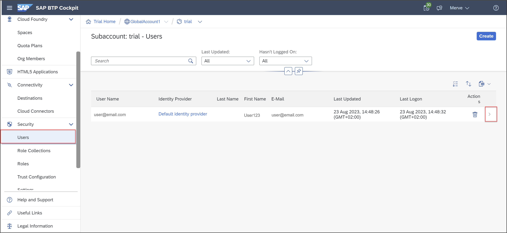

# Connect SAP Business Application Studio and SAP S/4HANA Cloud, ABAP Environment

<!-- description --> Connect SAP Business Application Studio and SAP S/4HANA Cloud, ABAP Environment system using SAML assertion authentication to develop custom UIs.

## Prerequisites

- You have a license for SAP S/4HANA Cloud and have a developer user in it
- **Trial:** You need an SAP BTP [trial user](hcp-create-trial-account)
- Business Catalog `SAP_CORE_BC_COM` must be assigned to business user

## You will learn

- How to assign role collections
- How to configure destinations
- How to create communication systems

## Intro

>**Hint:** The administrator receives an welcome e-mail after provisioning. This e-mail includes the system URL. By removing `/ui` you can log into the SAP S/4HANA Cloud ABAP Environment system. Further information can be found [here](https://help.sap.com/docs/SAP_S4HANA_CLOUD/6aa39f1ac05441e5a23f484f31e477e7/4b962c243a3342189f8af460cc444883.html?locale=en-US&state=DRAFT).

---

### Assign role collection to user

  1. Login to [SAP BTP Trial cockpit](https://cockpit.hanatrial.ondemand.com/) and click **Enter Your Trial Account**.

      

  2. Select your subaccount **trial**.

      

  3. Now you are in the trial overview page. Click **Users** and **>**.

      

  4. Select the menu and click **Assign Role Collection**.

      

      **Hint:** If you are using a licensed system, make sure you have the trust administrator role assigned to your user.

  5. Select **`Business_Application_Studio_Developer`** and click **Assign Role Collection**.

      

  6. Check your result. Now your user should have the **`Business_Application_Studio_Developer`** role collection assigned.

      

### Configure destination

  1. Select your subaccount **trial**.

     

  2. In the navigation pane expand the **Connectivity** section and select **Destinations**. Click **New Destination**.

      

      Configure the new destination with the following standard field values.

    |  Field Name     | Value
    |  :------------- | :-------------
    |  Name           | **`System_###_SAML_ASSERTION`**
    |  Type           | **`HTTP`**
    |  Description    | **`SAML Assertion Destination to SAP S/4HANA ABAP Environment system_###`**
    |  URL          | In the SAP S/4HANA Cloud tenant, navigate to the **Communication Systems** app and copy the **Host Name** from **Own System** = `Yes`
<!-- border -->
 and paste it with prefix `https://` for example `https://my12345-api.s4hana.ondemand.com.`
    |  Proxy Type   | **`Internet`**
    |  Authentication | **`SAMLAssertion`**
    |  Audience   | Enter the URL of your system and remove `-api`, for example `https://my12345.s4hana.ondemand.com`.
    |  `AuthnContextClassRef` | **`urn:oasis:names:tc:SAML:2.0:ac:classes:PreviousSession`**

    Select **New Property** and maintain the following **Additional Properties** and values.

    |  Field Name     | Value          | Remark
    |  :------------- | :------------- | :-------------
    |  HTML5.DynamicDestination           | **`true`**   |&nbsp;
    |  HTML5.Timeout           | **`60000`**   | value stated in milliseconds. 60000 equals 1 minute. Required as deployment needs longer than the standard of 30 seconds.
    |  `WebIDEEnabled`    | **`true`**   |&nbsp;
    |  `WebIDEUsage`          | **`odata_abap,dev_abap`**   |&nbsp;
    |  `nameIDFormat`     | **`urn:oasis:names:tc:SAML:1.1:nameid-format:emailAddress`**  | Required in case your subaccount sends mail address as SAML Name ID for authentication ( **Subject Name Identifier** in Identity Authentication tenant ), although SAP S/4HANA Cloud tenant expects user login by default. **That is the case with a trial Account.** This also requires the mail address to be maintained for SAP S/4HANA Cloud tenant business users.

    Make sure that the **Use default JDK truststore** checkbox is ticked.

      

    Click **Save**.

  3. Click **Download Trust**.

     

### Create communication system

  
  1. Open SAP Fiori launchpad and select **Communication Systems** under Communication Management.

      

  2. Click **New**.

      

  3. Create a new communication system:
       - System ID: **``BAS_TRIAL_###``**
       - System Name: **``BAS_TRIAL_###``**

       Click **Create**.

     

  4. Click the arrow and select **Technical Data**.

      

  5. Check **Inbound Only** in the general section. Set `SAML Bearer Assertion Provider` **ON** and click **Upload Signing Certificate**.

      

  6. Click **Browse** and select your trust configuration, then click **Upload**.

      

  7. Copy everything after **`CN=` of your signing certificate subject** and past it in **`SAML Bearer Issuer`**. Click **Save**.

      

      Now your communication system is set up.

### Test yourself
