# Implement a Wrapper for the "Create Purchase Requisition" (BAPI_PR_CREATE) function module
<!-- description --> Learn how to wrap the BAPI_PR_CREATE in your SAP S/4HANA system and release it for consumption in tier 1.

## Prerequisites
- You have completed the previous tutorials in this group to [learn about the 3-tier extensibility model](abap-s4hanacloud-purchasereq-understand-scenario) and connect to your SAP S/4HANA system.

## You will learn
- How to create a wrapper interface and implement a wrapper class for the `BAPI_PR_CREATE`.
- How to release the wrapper for consumption in tier 1.

## Intro
>In this tutorial, wherever X/XXX/#/### appears, use a number (e.g. 000).

In a previous tutorial of this group, you learned about the 3-tier extensibility model and got an overview of the sample scenario used for this tutorial group, which will include a online shop Business Object with purchase requisition creation capability.

In this tutorial we show how to deal with the case in which no convenient released API is available to create purchase requisitions. The [ABAP Cloud API Enablement Guidelines for SAP S/4HANA Cloud, private edition, and SAP S/4HANA](https://www.sap.com/documents/2023/05/b0bd8ae6-747e-0010-bca6-c68f7e60039b.html) documentation recommends to use a BAPI as an alternative to a released API, wrap it and then release the wrapper for consumption in tier 1. In a later tutorial you will then create a RAP Business Object for the online shop application and integrate this wrapper to create purchase requisitions.

### Get to know the BAPI_PR_CREATE via the BAPI Explorer

The first step is to look for a suitable unreleased API to create purchase requisitions. You can use the BAPI Explorer for this purpose. Connect to the backend of your SAP S/4HANA system and start transaction `BAPI`. For the purpose of this tutorial, we will use the unreleased BAPI `BAPI_PR_CREATE`: switch to the **Alphabetical** view (1), look for the Business Object `PurchaseRequisition` (2), find and click on the method `CreateFromData1` (3). You can see that its function module is the `BAPI_PR_CREATE` (4).

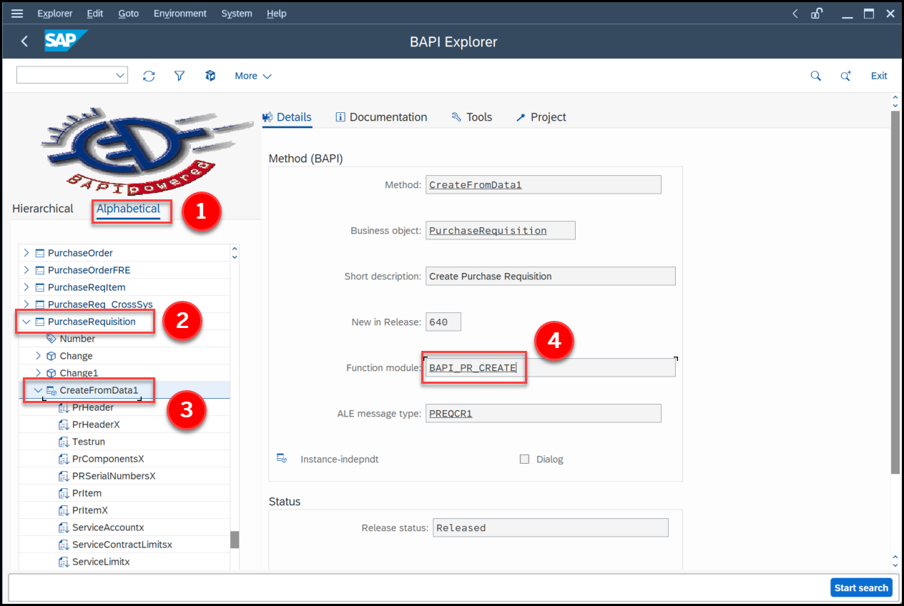

In the **Documentation** tab you can find more information on what the BAPI is used for (in this case: to create purchase requisitions) and you can find examples for various scenarios and how to fill the respective parameter values.

In the **Tools** section you can click on the **Function Builder** and then click on **Display** to see the required parameters:

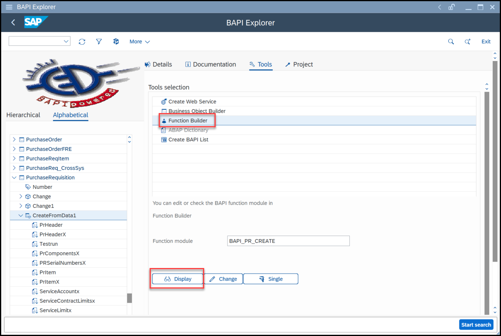

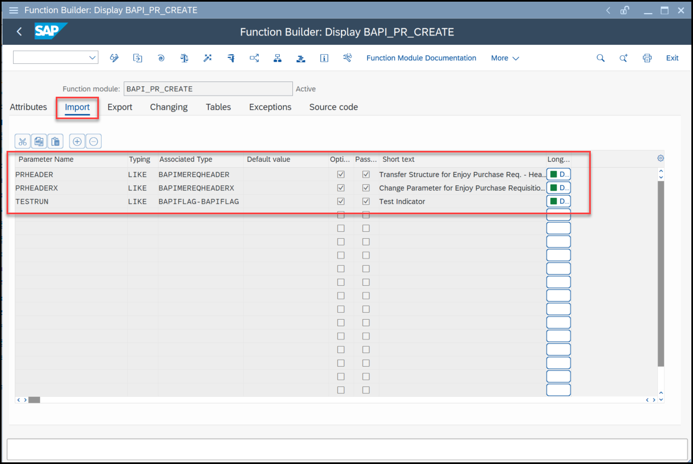

>The `BAPI_PR_CREATE` has a `TESTRUN` parameter that can be used to call the BAPI in validation mode. Some BAPI have a similar test mode that can be used to validate input data. It is best practice to make use of this test mode, if available, as we will address in more details in a later [tutorial](abap-s4hanacloud-purchasereq-integrate-wrapper) of this group.

### Create a development package

You will develop the wrapper in a dedicated package under the package `$TMP` in your SAP S/4HANA system.

In ADT, open your SAP S/4HANA system project folder, right click on it and select **New** > **ABAP Package** and input the Name `$Z_PURCHASE_REQ_TIER2_XXX` and a Description:

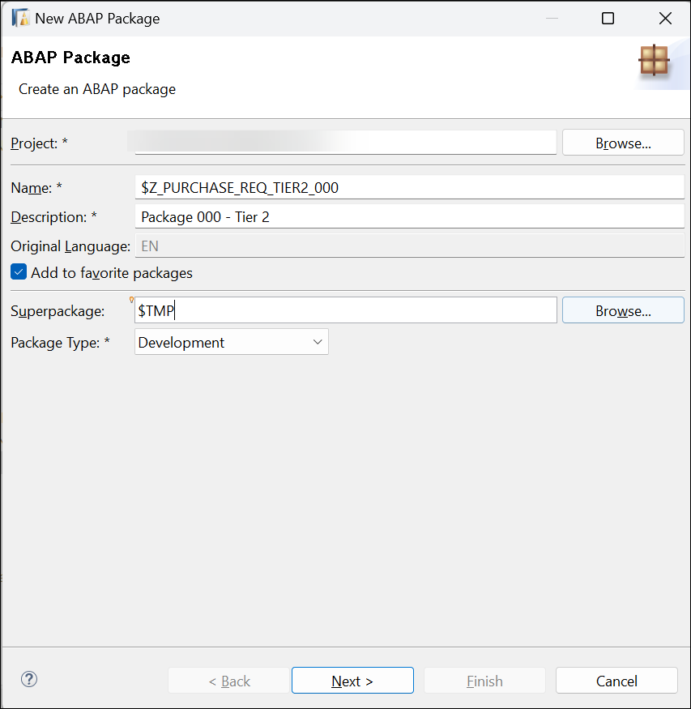

Select **Add to favorite packages** for easy access later on. Keep the Package Type as **Development** and click on **Next**. Do not change anything in the following wizard window, and click on **Next**, then click on **Finish**. The package will be created.

### Create a wrapper interface

You now want to wrap the API `BAPI_PR_CREATE`. Depending on your specific use-case, you normally would need to access only certain specific functionalities and methods of the BAPI you want to expose. An ABAP Interface is the perfect development object for this purpose: the interface simplifies and restricts the usage of the underlying BAPI for the specific use-case, by exposing only the parameters that are needed. As a consequence, non-wrapped functionalities are forbidden.

To create the interface for your BAPI wrapper right click on the newly created package and select **New** > **ABAP Interface**. Input the Name `ZIF_WRAP_BAPI_PR_CREATE_XXX` and a Description:

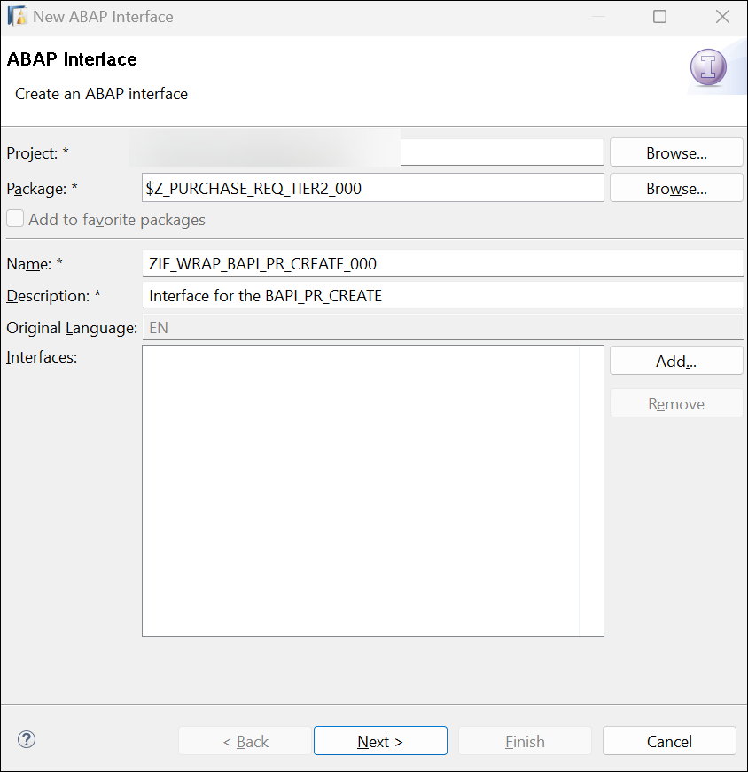

Click on **Next** and then click on **Finish**.

Implement your ABAP Interface to expose only the parameters that are needed in your specific use-case. For the purpose of this tutorial, we propose the following ABAP Interface implementation for the `BAPI_PR_CREATE`:

``` ABAP
"! <h1>BAPI_PR_CREATE wrapper</h1>
"! <p>This interface offers functionality related to ABAP class wrapper for Purchase Requisition BAPI for BAPI_PR_CREATE function module.</p>
"! <p>Instances of this interface are created using method {@link zcl_bapi_wrap_factory_xxx.METH:create_instance}
INTERFACE zif_wrap_bapi_pr_create_xxx
  PUBLIC .
  "! Purchase Requisition Number
  TYPES pr_number             TYPE banfn.
 
  TYPES:
    "! Purchase Req. - Header
    BEGIN OF pr_header,
      pr_type TYPE bsart,
    END OF pr_header,
 
    "! Purchase Req. - Item
    BEGIN OF pr_item,
      preq_item TYPE bnfpo,
      plant     TYPE ewerk,
      acctasscat TYPE knttp,
      currency  TYPE waers,
      deliv_date TYPE eindt,
      material  TYPE matnr18,
      matl_group TYPE matkl,
      preq_price TYPE bapicurext,
      quantity  TYPE bamng,
      unit      TYPE bamei,
      pur_group TYPE ekgrp,
      purch_org TYPE ekorg,
      short_text TYPE txz01,
    END OF pr_item,
 
    "! Purchase Req. - Acct Assignment
    BEGIN OF pr_item_account,
      preq_item  TYPE bnfpo,
      serial_no  TYPE dzekkn,
      costcenter TYPE kostl,
      gl_account TYPE saknr,
    END OF pr_item_account,
 
    "! Purchase Req. - Item Text
    BEGIN OF pr_item_text,
      preq_item TYPE bnfpo,
      text_line TYPE tdline,
      text_id  TYPE tdid,
    END OF pr_item_text,
 
    "! Purchase Req. - Header Text
    BEGIN OF pr_header_text,
      preq_item TYPE bnfpo,
      text_line TYPE tdline,
      text_id   TYPE tdid,
    END OF pr_header_text.
 
  TYPES:
    "! Purchase Req. - Item
    pr_items        TYPE STANDARD TABLE OF pr_item WITH KEY preq_item,
    "! Purchase Req. - Acct Assignment
    pr_item_accounts TYPE STANDARD TABLE OF pr_item_account WITH KEY preq_item,
    "! Purchase Req. - Item Text
    pr_item_texts   TYPE STANDARD TABLE OF pr_item_text WITH KEY preq_item,
    "! Purchase Req. - Header Text
    pr_header_texts  TYPE STANDARD TABLE OF pr_header_text WITH KEY preq_item,
    "! Table of BAPI return information
    pr_returns      TYPE bapirettab.
 
  "! <p>This method creates purchase requisitios for all the data that has been added, using BAPI_PR_CREATE.
  "! Purchase Requisition Number will be returned as result of successful purchase requisition creation.</p>
  "! <p>Purchase requisitions that have been validated with error return, will not be created.</p>
  "! <p>Purchase requisitions that have been validated without error return, will be created</p>
  "! <strong>Note</strong>: Using this method requires write authorization for authorization objects M_BANF_BSA, M_BANF_EKG, M_BANF_EKO, M_BANF_WRK
  "! @parameter pr_header | Purchase Req. - Header
  "! @parameter pr_items | Purchase Req. - Item
  "! @parameter pr_item_accounts | Purchase Req. - Acct Assignment
  "! @parameter pr_item_texts | Purchase Req. - Item Text
  "! @parameter result | Purchase Requisition Number
  METHODS create
    IMPORTING pr_header       TYPE pr_header
              pr_items        TYPE pr_items
              pr_item_accounts TYPE pr_item_accounts
              pr_item_texts   TYPE pr_item_texts
              pr_header_texts TYPE pr_header_texts
    EXPORTING pr_returns      TYPE pr_returns
    RETURNING VALUE(result)   TYPE pr_number.
 
 
 
  "! <p>This method checks purchase requsisitions data for validity, using BAPI_PR_CREATE test mode.
  "! Entries in purchase requisitions that have already been created, will not be checked again.
  "! BAPI return information will be provided as result in case of successful or faulty purchase requisition validation.</p>
  "! <strong>Note</strong>: Using this method requires write authorization for authorization objects M_BANF_BSA, M_BANF_EKG, M_BANF_EKO, M_BANF_WRK
  "! @parameter pr_header | Purchase Req. - Header
  "! @parameter pr_items | Purchase Req. - Item
  "! @parameter pr_item_accounts | Purchase Req. - Acct Assignment
  "! @parameter pr_item_texts | Purchase Req. - Item Text
  "! @parameter result | Table of BAPI return information
  METHODS check
    IMPORTING pr_header       TYPE pr_header
              pr_items        TYPE pr_items
              pr_item_accounts TYPE pr_item_accounts
              pr_item_texts   TYPE pr_item_texts
              pr_header_texts TYPE pr_header_texts
    RETURNING VALUE(result)   TYPE pr_returns.
 
 
ENDINTERFACE.
```
Save and activate it.

>As already said, you will expose only the parameters that are needed in your specific use-case. In this case you want to create a purchase requisition item (for which you expose the parameter `pr_item`) and given the underlying BAPI signature, the `pr_item` always requires an header, which is why you are also exposing the parameter `pr_header`.

### Create a wrapper class

You now need to create a class to wrap the BAPI (implementing the interface you created in the previous step) and implement its methods.

Right click on your package and select **New** > **ABAP Class**. Input the Name `ZCL_BAPI_PR_WRAPPER_XXX` and a Description:

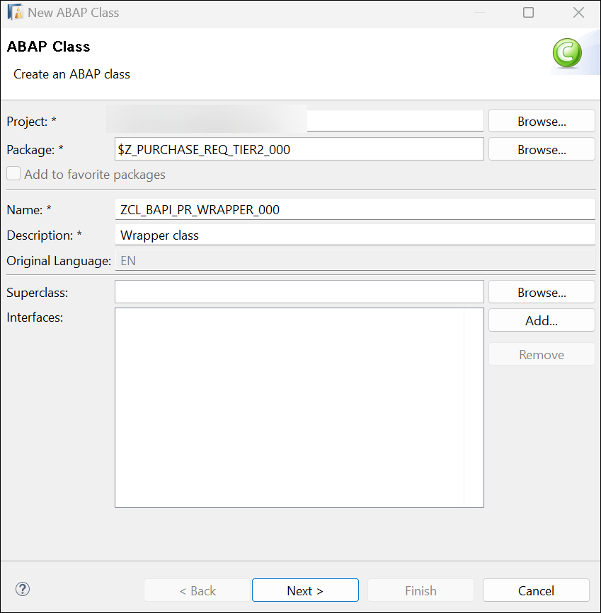

Click on **Next** and then click on **Finish**.

The implementation of the wrapper class depends on the specific use-case and BAPI signature. For the purpose of this tutorial, we suggest to implement the wrapper class in the following way:

>The wrapper class has a method defined in the private section, `call_bapi_pr_create`, which has access to all the parameters of the underlying BAPI. Having this type of central private method is best practice: internally, the wrapper class has access to all the parameters and then the interface has virtual access to all of these parameters and exposes publicly only the ones that are needed depending on the specific use-case.

``` ABAP
"! <h1>Purchase Requisition BAPIs Wrapper</h1>
"! <p>This class offers functionality to wrap Purchase Requisition related BAPI calls (e.g. BAPI_PR_CREATE).<br/>
"! Instances of this class are created using factory class {@link zrap620_cl_bapi_wrap_factory}.<br/>
"! For a description and usage of the available functionality,
"! see the method documentation in interface {@link zif_wrap_bapi_pr_create_xxx}.</p>
CLASS zcl_bapi_pr_wrapper_xxx DEFINITION
  PUBLIC
  FINAL
  CREATE PUBLIC .

  PUBLIC SECTION.

    INTERFACES zif_wrap_bapi_pr_create_xxx .
  PROTECTED SECTION.
  PRIVATE SECTION.

    "! <p>This method calls function modukle BAPI_PR_CREATE with given parameters.</p>
    "! <p>Note: Only this private method shall be used in wrapper to call BAPI_PR_CREATE.</p>
    "!
    "! @parameter prheader | Purchase Req. - Header
    "! @parameter prheaderx | Purchase Requisition - Header
    "! @parameter testrun | Test Indicator
    "! @parameter number | Purchase Requisition Number
    "! @parameter prheaderexp | Purchase Req. - Header
    "! @parameter return | Return Parameters
    "! @parameter pritem | Purchase Req. - Item Data
    "! @parameter pritemx | Purchase Requisition - Item Data
    "! @parameter pritemexp | Purchase Req. - Item Data
    "! @parameter pritemsource | Purchase Req. - Source of Supply
    "! @parameter praccount | Purchase Req. - Acct Assignment
    "! @parameter praccountproitsegment | Reservation Event Object: BAPI_PROFITABILITY_SEGMENT
    "! @parameter praccountx | Purchase Req. - Account Assignment
    "! @parameter praddrdelivery | PO Item: Address Structure BAPIADDR1 for Inbound Delivery
    "! @parameter pritemtext | Purchase Req. - Item Text
    "! @parameter prheadertext | Purchase Req. - Header Text
    "! @parameter extensionin | Reference Structure for BAPI Parameters EXTENSIONIN/EXTENSIONOUT
    "! @parameter extensionout | Reference Structure for BAPI Parameters EXTENSIONIN/EXTENSIONOUT
    "! @parameter prversion | Version Data for Purchase Requisition Item (BAPI)
    "! @parameter prversionx | Version Data for Purchase Requisition Item (BAPI)
    "! @parameter allversions | Version Management - All Version Data
    "! @parameter prcomponents | BAPI Structure for Components
    "! @parameter prcomponentsx | Update Information for Components in BUS2012 API
    "! @parameter serialnumber | Serial Numbers in Purchase Requisition BAPI
    "! @parameter serialnumberx | Change Parameter: Serial Numbers in Purch. Requisition BAPI
    METHODS call_bapi_pr_create
      IMPORTING
        VALUE(prheader)        TYPE bapimereqheader OPTIONAL
        VALUE(prheaderx)       TYPE bapimereqheaderx OPTIONAL
        VALUE(testrun)         TYPE bapiflag-bapiflag OPTIONAL
      EXPORTING
        VALUE(number)          TYPE bapimereqheader-preq_no
        VALUE(prheaderexp)     TYPE bapimereqheader
      CHANGING
        return                 TYPE bapirettab OPTIONAL
        pritem                 TYPE ty_bapimereqitemimp
        pritemx                TYPE ty_bapimereqitemx OPTIONAL
        pritemexp              TYPE ty_bapimereqitem OPTIONAL
        pritemsource           TYPE ty_bapimereqsource OPTIONAL
        praccount              TYPE ty_bapimereqaccount OPTIONAL
        praccountproitsegment  TYPE ty_bapimereqaccountprofitseg OPTIONAL
        praccountx             TYPE ty_bapimereqaccountx OPTIONAL
        praddrdelivery         TYPE ty_bapimerqaddrdelivery OPTIONAL
        pritemtext             TYPE ty_bapimereqitemtext OPTIONAL
        prheadertext           TYPE ty_bapimereqheadtext OPTIONAL
        extensionin            TYPE bapiparextab OPTIONAL
        extensionout           TYPE bapiparextab OPTIONAL
        prversion              TYPE ty_bapimereqdcm OPTIONAL
        prversionx             TYPE ty_bapimereqdcmx OPTIONAL
        allversions            TYPE bbpt_if_bapimedcm_allversions OPTIONAL
        prcomponents           TYPE ty_bapimereqcomponent OPTIONAL
        prcomponentsx          TYPE ty_bapimereqcomponentx OPTIONAL
        serviceoutline         TYPE bapi_srv_outline_tty OPTIONAL
        serviceoutlinex        TYPE bapi_srv_outlinex_tty OPTIONAL
        servicelines           TYPE bapi_srv_service_line_tty OPTIONAL
        servicelinesx          TYPE bapi_srv_service_linex_tty OPTIONAL
        servicelimit           TYPE bapi_srv_limit_data_tty OPTIONAL
        servicelimitx          TYPE bapi_srv_limit_datax_tty OPTIONAL
        servicecontractlimits  TYPE bapi_srv_contract_limits_tty OPTIONAL
        servicecontractlimitsx TYPE bapi_srv_contract_limitsx_tty OPTIONAL
        serviceaccount         TYPE bapi_srv_acc_data_tty OPTIONAL
        serviceaccountx        TYPE bapi_srv_acc_datax_tty OPTIONAL
        servicelongtexts       TYPE bapi_srv_longtexts_tty OPTIONAL
        serialnumber           TYPE bapimereq_t_serialno OPTIONAL
        serialnumberx          TYPE bapimereq_t_serialnox OPTIONAL.

    "! <p class="shorttext synchronized" lang="en">This method prepares headerx control structure</p>
    "!
    "! @parameter pr_header | Purchase Req. - Header
    "! @parameter prheaderx | Purchase Requisition - Header
    METHODS prepare_headerx IMPORTING pr_header        TYPE zif_wrap_bapi_pr_create_xxx=>pr_header
                            RETURNING VALUE(prheaderx) TYPE bapimereqheaderx.

    "! <p class="shorttext synchronized" lang="en">This method prepares itemx control structure</p>
    "!
    "! @parameter pr_items | Purchase Req. - Item
    "! @parameter pritemx | Purchase Requisition - Item Data
    METHODS prepare_itemx IMPORTING pr_items       TYPE zif_wrap_bapi_pr_create_xxx=>pr_items
                          RETURNING VALUE(pritemx) TYPE ty_bapimereqitemx.

    "! <p class="shorttext synchronized" lang="en">This method prepares accountx control structure</p>
    "!
    "! @parameter pr_item_accounts | Purchase Req. - Acct Assignment
    "! @parameter praccountx | Purchase Req. - Account Assignment
    METHODS prepare_accountx IMPORTING pr_item_accounts  TYPE zif_wrap_bapi_pr_create_xxx=>pr_item_accounts
                             RETURNING VALUE(praccountx) TYPE ty_bapimereqaccountx.

ENDCLASS.


CLASS ZCL_BAPI_PR_WRAPPER_XXX IMPLEMENTATION.


  METHOD call_bapi_pr_create.
    CALL FUNCTION 'BAPI_PR_CREATE'
      EXPORTING
        prheader               = prheader
        prheaderx              = prheaderx
        testrun                = testrun
      IMPORTING
        number                 = number
        prheaderexp            = prheaderexp
      TABLES
        return                 = return
        pritem                 = pritem
        pritemx                = pritemx
        pritemexp              = pritemexp
        pritemsource           = pritemsource
        praccount              = praccount
        praccountproitsegment  = praccountproitsegment
        praccountx             = praccountx
        praddrdelivery         = praddrdelivery
        pritemtext             = pritemtext
        prheadertext           = prheadertext
        extensionin            = extensionin
        extensionout           = extensionout
        prversion              = prversion
        prversionx             = prversionx
        allversions            = allversions
        prcomponents           = prcomponents
        prcomponentsx          = prcomponentsx
        serviceoutline         = serviceoutline
        serviceoutlinex        = serviceoutlinex
        servicelines           = servicelines
        servicelinesx          = servicelinesx
        servicelimit           = servicelimit
        servicelimitx          = servicelimitx
        servicecontractlimits  = servicecontractlimits
        servicecontractlimitsx = servicecontractlimitsx
        serviceaccount         = serviceaccount
        serviceaccountx        = serviceaccountx
        servicelongtexts       = servicelongtexts
        serialnumber           = serialnumber
        serialnumberx          = serialnumberx.
  ENDMETHOD.


  METHOD prepare_accountx.
    FIELD-SYMBOLS <fieldx> TYPE any.
    DATA(pr_item_account_struct) = CAST cl_abap_structdescr( cl_abap_typedescr=>describe_by_data( VALUE zif_wrap_bapi_pr_create_xxx=>pr_item_account(  ) ) ).

    LOOP AT pr_item_accounts INTO DATA(pr_item_account).
      DATA(praccountx_line) = VALUE  bapimereqaccountx( preq_item = pr_item_account-preq_item serial_no = pr_item_account-serial_no ).

      LOOP AT pr_item_account_struct->components INTO DATA(component).
        ASSIGN COMPONENT component-name OF STRUCTURE praccountx_line TO <fieldx>.

        CASE component-name.
          WHEN 'PREQ_ITEM'.
          WHEN 'SERIAL_NO'.
          WHEN OTHERS.
            <fieldx> = abap_true.
        ENDCASE.
      ENDLOOP.

      APPEND praccountx_line TO praccountx.
    ENDLOOP.
  ENDMETHOD.


  METHOD prepare_headerx.
    FIELD-SYMBOLS <fieldx> TYPE any.

    DATA(pr_header_struct) = CAST cl_abap_structdescr( cl_abap_typedescr=>describe_by_data( pr_header ) ).

    LOOP AT pr_header_struct->components INTO DATA(component).
      ASSIGN COMPONENT component-name OF STRUCTURE prheaderx TO <fieldx>.
      <fieldx> = abap_true.
    ENDLOOP.
  ENDMETHOD.


  METHOD prepare_itemx.
    FIELD-SYMBOLS <fieldx> TYPE any.
    DATA(pr_item_struct) = CAST cl_abap_structdescr( cl_abap_typedescr=>describe_by_data( VALUE zif_wrap_bapi_pr_create_xxx=>pr_item(  ) ) ).

    LOOP AT pr_items INTO DATA(pr_item).
      DATA(pritemx_line) = VALUE bapimereqitemx( preq_item = pr_item-preq_item ).

      LOOP AT pr_item_struct->components INTO DATA(component).
        ASSIGN COMPONENT component-name OF STRUCTURE pritemx_line TO <fieldx>.

        CASE component-name.
          WHEN 'PREQ_ITEM'.
          WHEN OTHERS.
            <fieldx> = abap_true.
        ENDCASE.
      ENDLOOP.

      APPEND pritemx_line TO pritemx.
    ENDLOOP.
  ENDMETHOD.


  METHOD zif_wrap_bapi_pr_create_xxx~check.
    DATA(prheader) = CORRESPONDING bapimereqheader( pr_header ).
    DATA(pritem) = CORRESPONDING ty_bapimereqitemimp( pr_items ).
    DATA(pritemtext) = CORRESPONDING ty_bapimereqitemtext( pr_item_texts ).
    DATA(prheadertext) = CORRESPONDING ty_bapimereqheadtext( pr_header_texts ).
    DATA(praccount) = CORRESPONDING ty_bapimereqaccount( pr_item_accounts ).

    DATA(prheaderx) = me->prepare_headerx( pr_header ).
    DATA(pritemx) = me->prepare_itemx( pr_items ).
    DATA(praccountx) = me->prepare_accountx( pr_item_accounts ).

    me->call_bapi_pr_create(
      EXPORTING
        prheader               = prheader
        prheaderx              = prheaderx
        testrun                = abap_true
      CHANGING
        return                 = result
        pritem                 = pritem
        pritemx                = pritemx
        praccount              = praccount
        praccountx             = praccountx
        pritemtext             = pritemtext
        prheadertext           = prheadertext
    ).
  ENDMETHOD.


  METHOD zif_wrap_bapi_pr_create_xxx~create.
    DATA(prheader) = CORRESPONDING bapimereqheader( pr_header ).
    DATA(pritem) = CORRESPONDING ty_bapimereqitemimp( pr_items ).
    DATA(pritemtext) = CORRESPONDING ty_bapimereqitemtext( pr_item_texts ).
    DATA(prheadertext) = CORRESPONDING ty_bapimereqheadtext( pr_header_texts ).
    DATA(praccount) = CORRESPONDING ty_bapimereqaccount( pr_item_accounts ).

    DATA(prheaderx) = me->prepare_headerx( pr_header ).
    DATA(pritemx) = me->prepare_itemx( pr_items ).
    DATA(praccountx) = me->prepare_accountx( pr_item_accounts ).

    me->call_bapi_pr_create(
      EXPORTING
        prheader               = prheader
        prheaderx              = prheaderx
        testrun                = abap_false
      IMPORTING
        number                 = result
      CHANGING
        return                 = pr_returns
        pritem                 = pritem
        pritemx                = pritemx
        praccount              = praccount
        praccountx             = praccountx
        pritemtext             = pritemtext
        prheadertext           = prheadertext
    ).
  ENDMETHOD.
ENDCLASS.
```
Save and activate it.

>Since we plan to access the wrapped BAPI in a different tier, it is good to provide the possibility to test it, and to keep wrapping-specific coding in tier 1 to a minimum. For this reason, the interface approach is recommended, and the wrapper class will not be released directly for consumption in tier 1, but rather will be accessible via a factory class that you will create in the next step.

>In this tutorial we follow the [clean code best practices](https://blogs.sap.com/2022/05/05/how-to-enable-clean-code-checks-for-abap/) for ABAP development. For example: the wrapper class is ready for ABAP Unit Tests and [ABAP Doc](https://blogs.sap.com/2013/04/29/abap-doc/) is implemented.

### Create a wrapper factory class

In the scope of this tutorial group, our recommended approach is to create a factory class to control the instantiation of the wrapper class. This factory class will then be released for consumption in tier 1. This approach has the advantage of a clear control of when and where an instance of the wrapper class is created, and in the event in which several wrapper classes are needed all their instantiations could be handled inside one single factory class. Also, in case of wrapper classes this has the advantage that in case the wrapper class is changed throughout it's software lifecycle, at a later point in time a different class could be initialized, without changes to the consumer implementation.

To create the factory class right click on your package and select **New** > **ABAP Class**. Input the Name `ZCL_BAPI_WRAP_FACTORY_XXX` and a Description:

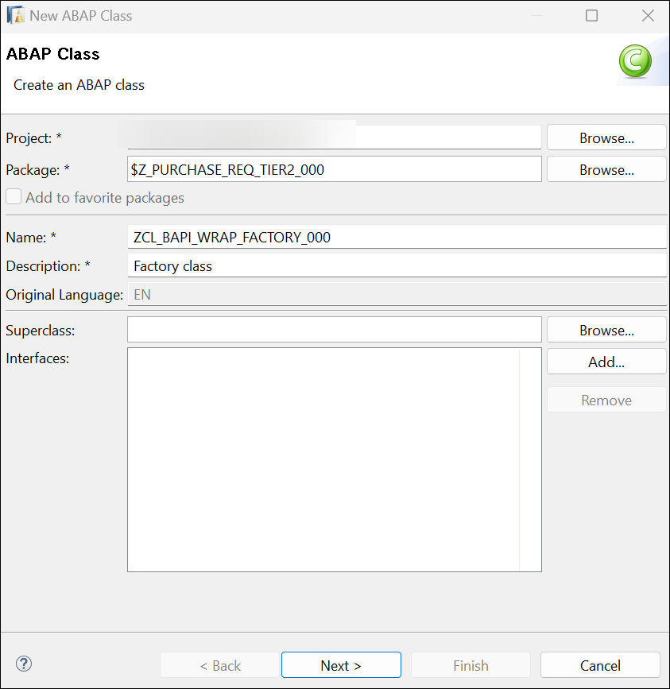

Click on **Next** and then click on **Finish**.

We suggest to implement the ABAP Class with the following code:

``` ABAP
"! <h1>BAPI wrapper factory class</h1>
"! <p>This factory class provides instances of BAPI wrapper classes, e.g. for purchase requisition BAPIs.<br/>
"! For a description and usage of the available functionality, see the method documentation in wrapper class.</p>
CLASS zcl_bapi_wrap_factory_xxx DEFINITION
  PUBLIC
  FINAL
  CREATE PRIVATE .
 
  PUBLIC SECTION.
 
    "! <p>This method creates an instance of the Purchase Requisition BAPI wrapper implementation.</p>
    "! @parameter result | Wrapper implementation instance
    CLASS-METHODS create_instance
      RETURNING VALUE(result) TYPE REF TO zif_wrap_bapi_pr_create_xxx.
  PROTECTED SECTION.
  PRIVATE SECTION.
    METHODS constructor.
ENDCLASS.
 
CLASS zcl_bapi_wrap_factory_xxx IMPLEMENTATION.
 
  METHOD create_instance.
 
    result = NEW zcl_bapi_pr_wrapper_xxx(  ).
  ENDMETHOD.
 
  METHOD constructor.
  ENDMETHOD.
 
ENDCLASS.
```
Save and activate it.

### Test unreleased wrapper with console application in tier 1

The wrapper you just created is currently not released for consumption in tier 1. You can test this by creating a console application in tier 1 to call the (unreleased) wrapper. We suggest to create a dedicated package under the tier 1 `ZLOCAL` package in your SAP S/4HANA System for this test.

In ADT, open your SAP S/4HANA system project folder, navigate to the `ZLOCAL` structure package, right click on it and select **New** > **ABAP Package** and input the Name `Z_PURCHASE_REQ_TEST_XXX` and a Description:

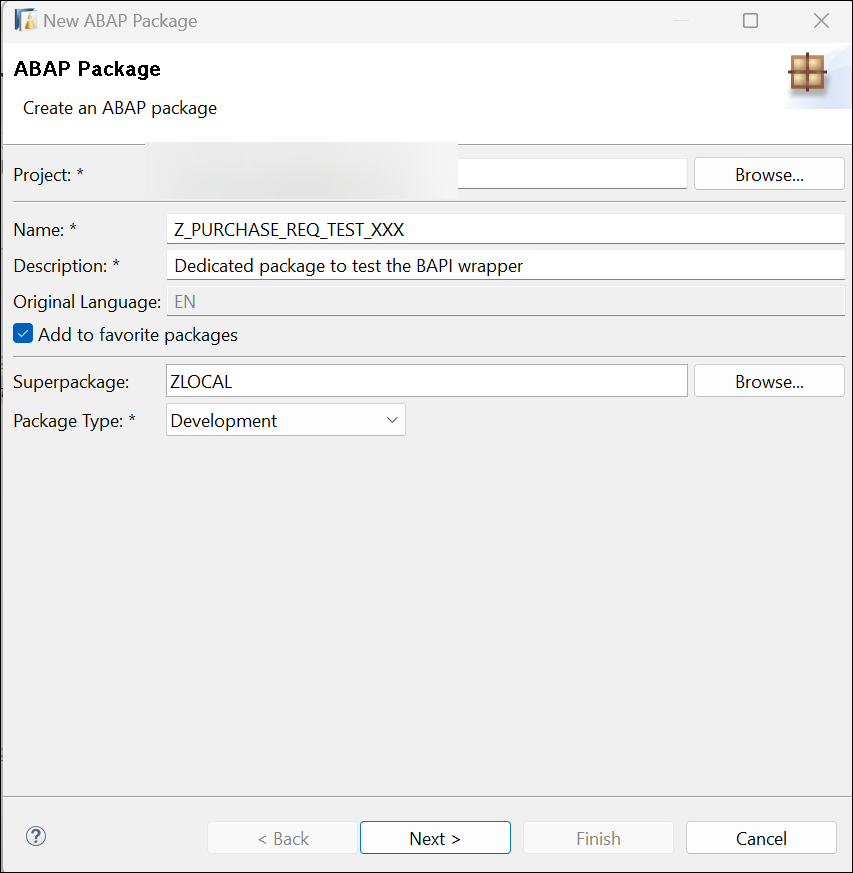

Click on **Next** and then **Next** again. Select a suitable transport request (or create a new one if needed) and then click on **Finish**. Now you can create the class for the console application. Right click on the newly created package and select **New** > **ABAP Class** and input the Name `ZCL_BAPI_WRAP_TEST_XXX` and a Description:

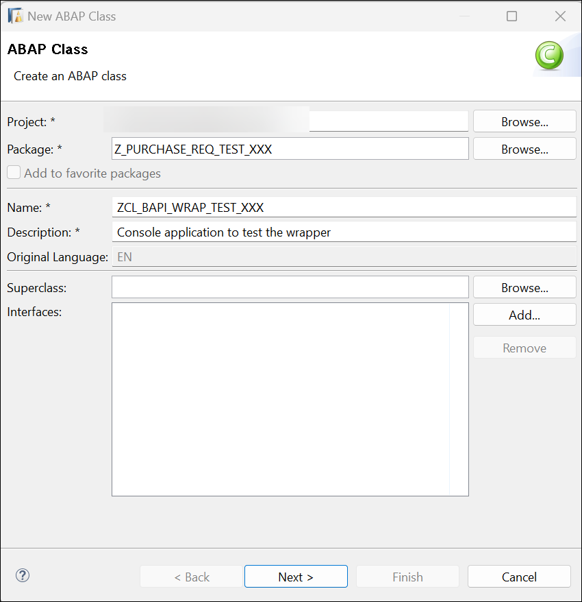

Click on **Next**, select a suitable transport request (or create a new one if needed) and then click on **Finish**.

You can check that the newly created class is a tier 1 class by checking that the **ABAP Language Version** is `ABAP Language for Cloud Development` in the **Properties** > **General** tab:

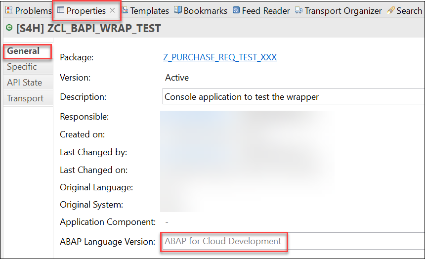

Implement the newly created class as follows:

```ABAP
CLASS zcl_bapi_wrap_test_xxx DEFINITION
  PUBLIC
  FINAL
  CREATE PUBLIC .

  PUBLIC SECTION.
    INTERFACES if_oo_adt_classrun .

  PROTECTED SECTION.
  PRIVATE SECTION.
ENDCLASS.


CLASS zcl_bapi_wrap_test_xxx IMPLEMENTATION.
  METHOD if_oo_adt_classrun~main.

DATA pr_returns TYPE bapirettab.
DATA(purchase_requisition) = zcl_bapi_wrap_factory_xxx=>create_instance( )->create(
          EXPORTING
            pr_header        = VALUE zif_wrap_bapi_pr_create_xxx=>pr_header( pr_type = 'NB' )
            pr_items         = VALUE zif_wrap_bapi_pr_create_xxx=>pr_items( (
              preq_item  = '00010'
              plant      = '1010'
              acctasscat = 'U'
              currency   = 'EUR'
              deliv_date = cl_abap_context_info=>get_system_date(  ) + 14   "format: yyyy-mm-dd (at least 10 days)
              material   = 'ZPRINTER01'
              matl_group = 'A001'
              preq_price = '100.00'
              quantity   = '1'
              unit       = 'ST'
              pur_group = '001'
              purch_org = '1010'
              short_text = 'ZPRINTER01'
            ) )
            pr_item_accounts = VALUE zif_wrap_bapi_pr_create_xxx=>pr_item_accounts( (
                preq_item = '00010'
                costcenter = 'jwt-cost'
                gl_account = '0000400000'
                serial_no = '01'
            ) )
            pr_item_texts    = VALUE zif_wrap_bapi_pr_create_xxx=>pr_item_texts( (
              preq_item = '00010'
              text_line = ' '
              text_id   = 'b01'
            ) )
            pr_header_texts  = VALUE zif_wrap_bapi_pr_create_xxx=>pr_header_texts( (
              preq_item = '00010'
              text_line = | { sy-uname } - { '00000001'  } |
              text_id   = 'B01'
            ) )
          IMPORTING
            pr_returns      = pr_returns
        ).

  out->write( pr_returns ).

  ENDMETHOD.

ENDCLASS.
```
Save it.

The class calls the wrapper factory class and, given some input parameter values like the delivery date and the item price, creates a purchase requisition for that specific item and prints the information to the console. Since the wrapper is not released for consumption in tier 1, when you try to activate the class you will get an error message.

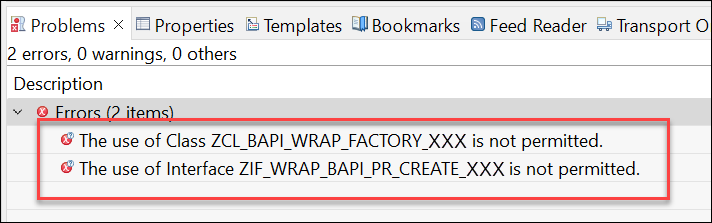

### Release the wrapper interface and factory class

Now you need to release the wrapper interface and wrapper factory class for consumption in tier 1. To do this, you need to add a Release Contract (C1) to both objects for use system-internally and use in Cloud Development.

In your Project Explorer open the ABAP Interface you created. In the **Properties** tab click on the **API State** tab and then click on the green plus icon next to the **Use System-Internally (Contract C1)**.

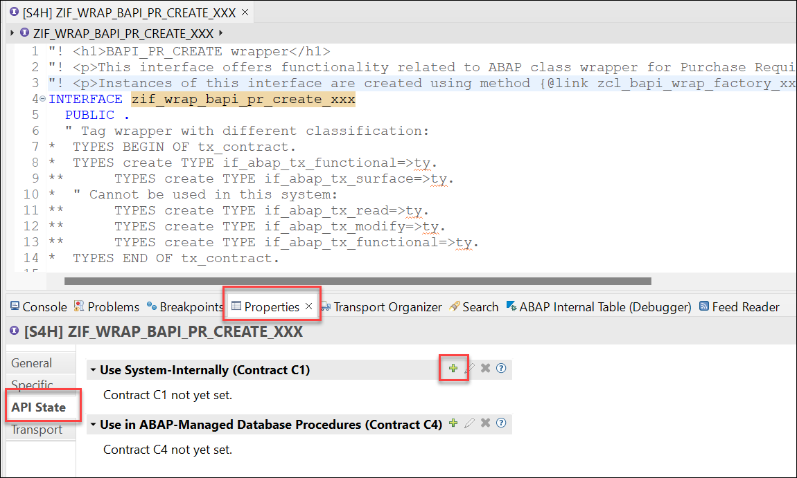

Make sure the **Release State** is set to **Released** and check the option **Use in Cloud Development**:


Click on **Next**. The changes will be validated. No issues should arise:

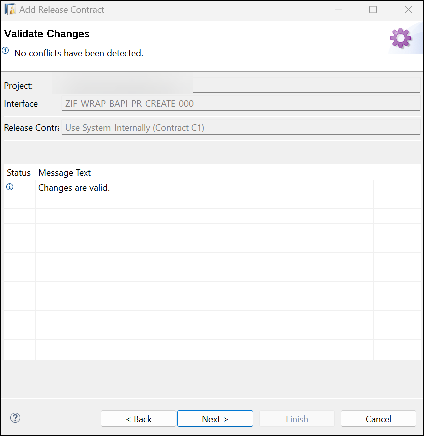

Click on **Next**.

The API State tab will now show the new Release State:

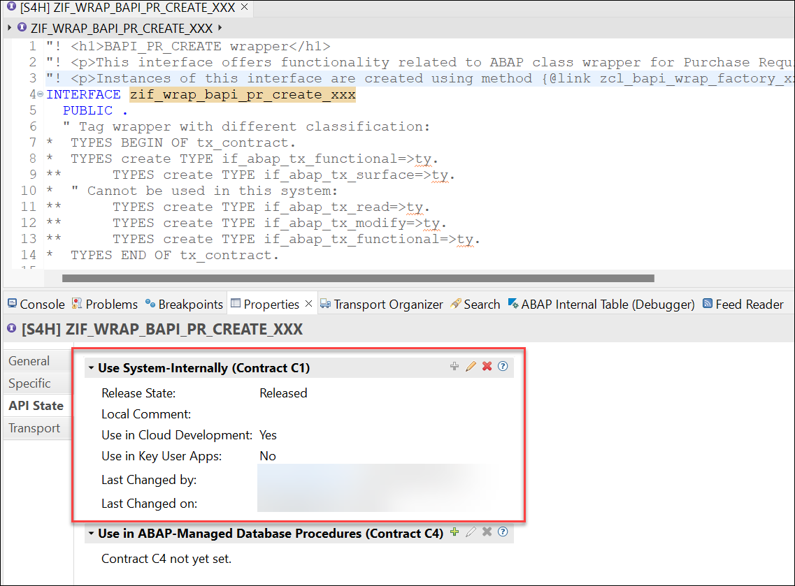

Repeat the same steps to release the factory class you created:

>When releasing this class, you will see an option in the wizard called 'Enable Configuration of Authorization Default Values' which allows you to define authorization default values while releasing the class. In the scope of this tutorial, we will not utilize this option, since at the moment we have no information on the needed authorization default values for `BAPI_PR_CREATE`. The handling of authorizations will be handled in a later tutorial of this series.


>You will not release the wrapper class.

### Run ATC checks and request exemptions

You will now need to run ATC checks on the objects you just released and request exemptions to use unreleased API.

To run the ATC checks right click on the `Z_PURCHASE_REQ_TIER2_XXX` package and select **Run As** > **ABAP Test Cockpit With...** and select your ATC check variant. Confirm by clicking on **OK**. The result of the ATC check will appear in the ATC Problems tab. As expected, you will get ATC check errors because you are using an unreleased API:

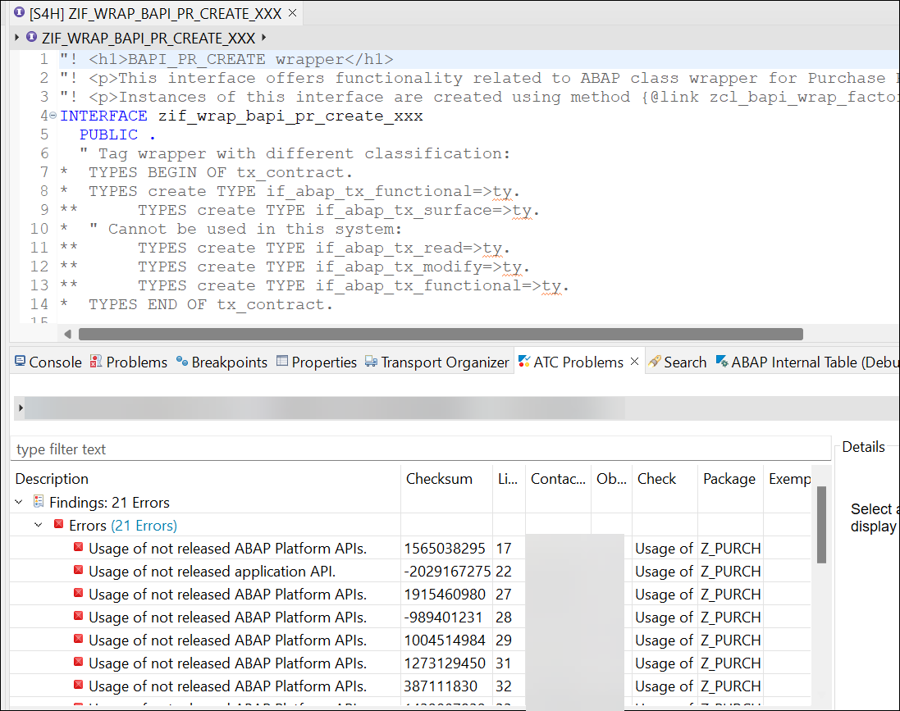

>Note that there are ATC checks errors for both the interface and the factory class. You will need to request an exemption for each of the two objects.

Right click on any one of the interface related errors in the ATC Problems tab and choose **Request Exemption**. You can then request an exemption for the whole interface by selecting `Interface (ABAP Objects)` under the `Apply exemption To` tab:

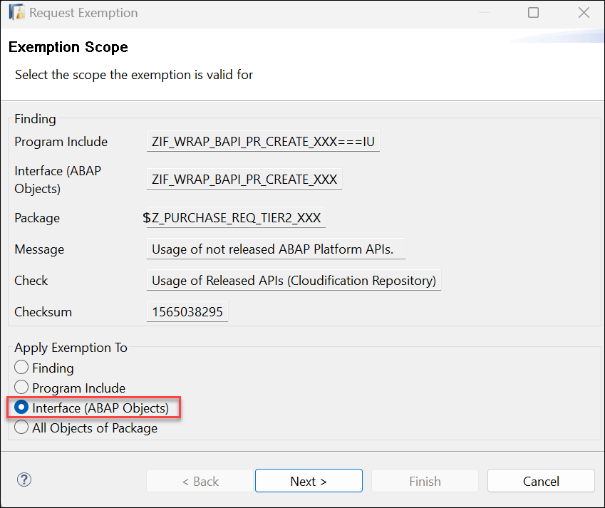

Click **Next**, choose a valid approver, a reason to request the exemptions and input a justification for it. Then click on **Finish**.

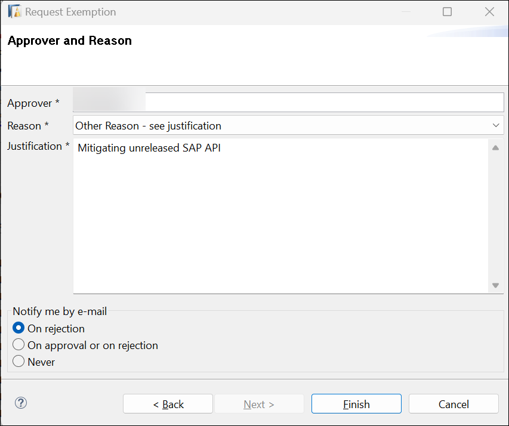

Proceed in the same way to request an exemption for the whole factory class.

>How to maintain approvers and how approve exemptions is beyond the scope of this tutorial. After a maintained approver has approved the exemption, you can verify it by running ATC checks again in ADT: no issue should arise.

### Test released wrapper with console application in tier 1

You can test that the wrapper was correctly released for consumption in tier 1 by running the console application class `ZCL_BAPI_WRAP_TEST_XXX`. First, the errors in the class should have disappeared now that you released the wrapper, so you can save and activate the class. Now you can run it: right click on the class and select **Run As** > **ABAP Application (Console)**. The class should now run without errors and the purchase requisition will be created and displayed in the console:

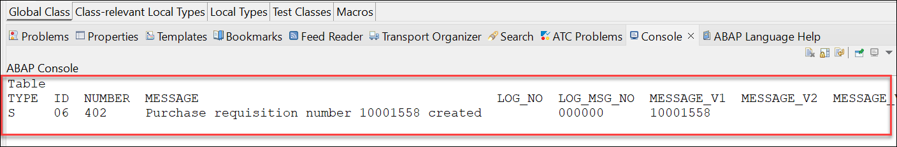

>The console application is a quick and simple way to check if the BAPI was correctly wrapped and released and if the wrapper works as intended. In the next tutorials of this group you will create an online shop Business Object and you will integrate the wrapper to create purchase requisitions for the shop entries.
### Test yourself

---