# Implement a Wrapper for the "Create Purchase Requisition" (BAPI_PR_CREATE) function module
<!-- description --> Learn how to wrap the BAPI_PR_CREATE in your SAP S/4HANA or SAP S/4HANA Cloud, private edition system and release it for consumption in ABAP Cloud Development.

## Prerequisites
- In this tutorial series, it is assumed that your system is running on the SAP S/4HANA 2023 release with feature pack stack 3 installed. 
- You have completed the previous tutorials in this group to [learn about the clean core extensibility model](abap-s4hanacloud-purchasereq-understand-scenario) and connect to your SAP S/4HANA system.


## You will learn
- How to create a wrapper interface, a wrapper class and a factory class for the `BAPI_PR_CREATE`.
- How to test that the wrapper objects have been released for consumption in ABAP Cloud Development.
- How to release the wrapper for consumption in ABAP Cloud Development.

## Intro
>Throughout this tutorial, wherever ### appears, use a number (e.g. 000). This tutorial is done with the placeholder 000.

In a previous tutorial of this group, you learned about the clean core extensibility model and got an overview of the sample scenario used for this tutorial group, which will include a Shopping Cart Business Object with purchase requisition creation capability.

In this tutorial we show how to deal with the case in which no convenient released API is available to create purchase requisitions. The [ABAP Cloud API Enablement Guidelines for SAP S/4HANA Cloud, private edition, and SAP S/4HANA](https://www.sap.com/documents/2023/05/b0bd8ae6-747e-0010-bca6-c68f7e60039b.html) documentation recommends to use a BAPI as an alternative to a released API, wrap it and then release the wrapper for consumption in ABAP Cloud Development. In a later tutorial you will then create a Shopping Cart RAP Business Object for the online shop application and integrate this wrapper to create purchase requisitions.


### Get to know the BAPI_PR_CREATE via the BAPI Explorer

The first step is to look for a suitable unreleased API to create purchase requisitions. You can use the BAPI Explorer for this purpose. Connect to the backend of your SAP S/4HANA system and start transaction `BAPI`. For the purpose of this tutorial, we will use the unreleased BAPI `BAPI_PR_CREATE`: switch to the **Alphabetical** view (1), look for the Business Object `PurchaseRequisition` (2), find and click on the method `CreateFromData1` (3). You can see that its function module is the `BAPI_PR_CREATE` (4).

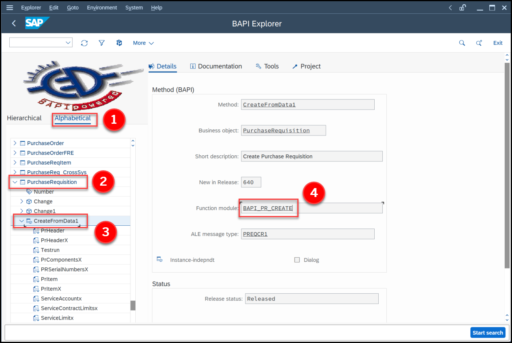

In the **Documentation** tab you can find more information on what the BAPI is used for (in this case: to create purchase requisitions) and you can find examples for various scenarios and how to fill the respective parameter values.

In the **Tools** section you can click on the **Function Builder** and then click on **Display** to see the required parameters:

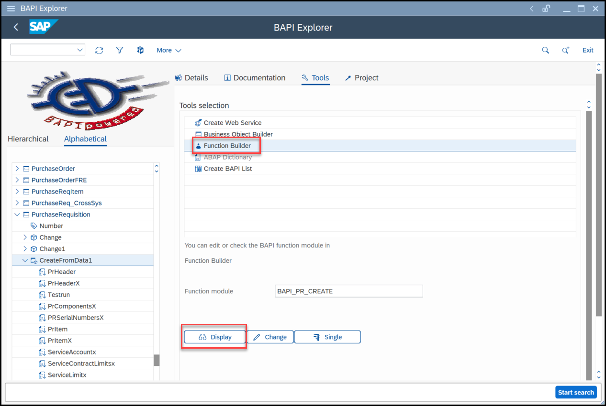

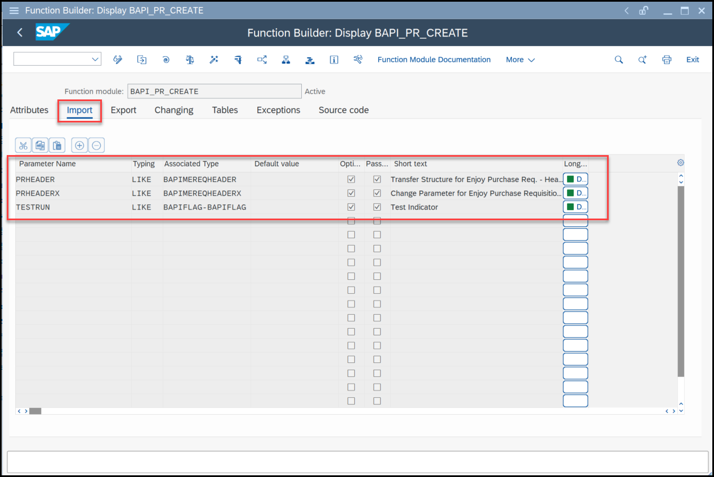

>The `BAPI_PR_CREATE` has a `TESTRUN` parameter that can be used to call the BAPI in validation mode. Some BAPI have a similar test mode that can be used to validate input data. It is best practice to make use of this test mode, if available, as we will address in more details in a later [tutorial](abap-s4hanacloud-purchasereq-integrate-wrapper) of this group.

### Create a development package

You will develop the wrapper in a dedicated package under the package `$TMP` in your SAP S/4HANA system.

In ADT, open your SAP S/4HANA system project folder, right click on it and select **New** > **ABAP Package** and input the Name `$Z_PURCHASE_REQ_CUST_WRAP_000` and a Description:

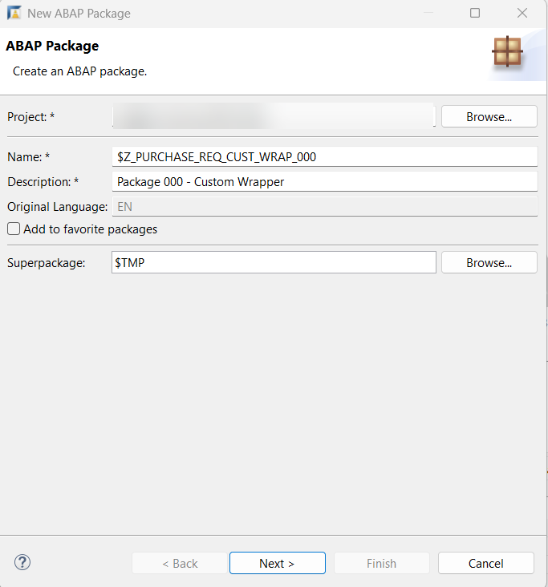

Select **Add to favorite packages** for easy access later on. Keep the Package Type as **Development** and click on **Next**. Do not change anything in the following wizard window, and click on **Next**, then click on **Finish**. The package will be created.

### Create a wrapper class, interface and factory class

You now want to wrap the API `BAPI_PR_CREATE`. For this we create a wrapper interface, a wrapper class and a factory class for the `BAPI_PR_CREATE`.

#### Create the wrapper interface

In order to create the wrapper interface, right click on your previously created package and select **New** > **ABAP Interface** and input the Name `ZIF_WRAP_BAPI_PR_CREATE_###`

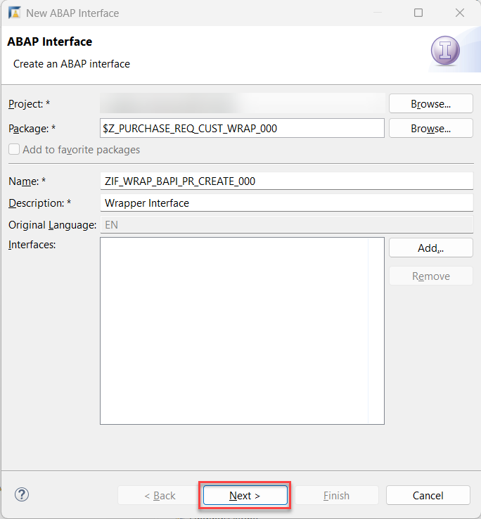

Copy and paste the following code into your previously created interface:

```ABAP
        INTERFACE zif_wrap_bapi_pr_create_###
      PUBLIC.

      TYPES:
        BEGIN OF bapimereqheader,
          preq_no         TYPE banfn,
          pr_type         TYPE bsart,
          ctrl_ind        TYPE bsakz,
          general_release TYPE gsfrg,
          create_ind      TYPE estkz,
          item_intvl      TYPE pincr,
          last_item       TYPE lponr,
          auto_source     TYPE kzzuo,
          memory          TYPE membf,
          hold_complete   TYPE bapimereqpostflag,
          hold_uncomplete TYPE bapimereqpostflag,
          park_complete   TYPE bapimereqpostflag,
          park_uncomplete TYPE bapimereqpostflag,
          memorytype      TYPE memorytype,
        END OF bapimereqheader.

      TYPES:
        BEGIN OF bapimereqheaderx,
          preq_no         TYPE bapiupdate,
          pr_type         TYPE bapiupdate,
          ctrl_ind        TYPE bapiupdate,
          general_release TYPE bapiupdate,
          create_ind      TYPE bapiupdate,
          item_intvl      TYPE bapiupdate,
          last_item       TYPE bapiupdate,
          auto_source     TYPE bapiupdate,
          memory          TYPE bapiupdate,
          hold_complete   TYPE bapiupdate,
          hold_uncomplete TYPE bapiupdate,
          park_complete   TYPE bapiupdate,
          park_uncomplete TYPE bapiupdate,
          memorytype      TYPE bapiupdate,
        END OF bapimereqheaderx.
      TYPES:
        char1             TYPE c LENGTH 000001.

      TYPES:
        _bapiparex        TYPE STANDARD TABLE OF bapiparex WITH DEFAULT KEY.

      TYPES:
        BEGIN OF bapimereqaccountx,
          preq_item        TYPE bnfpo,
          serial_no        TYPE dzekkn,
          preq_itemx       TYPE bapiupdate,
          serial_nox       TYPE bapiupdate,
          delete_ind       TYPE bapiupdate,
          creat_date       TYPE bapiupdate,
          quantity         TYPE bapiupdate,
          distr_perc       TYPE bapiupdate,
          net_value        TYPE bapiupdate,
          gl_account       TYPE bapiupdate,
          bus_area         TYPE bapiupdate,
          costcenter       TYPE bapiupdate,
          sd_doc           TYPE bapiupdate,
          itm_number       TYPE bapiupdate,
          sched_line       TYPE bapiupdate,
          asset_no         TYPE bapiupdate,
          sub_number       TYPE bapiupdate,
          orderid          TYPE bapiupdate,
          gr_rcpt          TYPE bapiupdate,
          unload_pt        TYPE bapiupdate,
          co_area          TYPE bapiupdate,
          costobject       TYPE bapiupdate,
          profit_ctr       TYPE bapiupdate,
          wbs_element      TYPE bapiupdate,
          network          TYPE bapiupdate,
          rl_est_key       TYPE bapiupdate,
          part_acct        TYPE bapiupdate,
          cmmt_item        TYPE bapiupdate,
          rec_ind          TYPE bapiupdate,
          funds_ctr        TYPE bapiupdate,
          fund             TYPE bapiupdate,
          func_area        TYPE bapiupdate,
          ref_date         TYPE bapiupdate,
          tax_code         TYPE bapiupdate,
          taxjurcode       TYPE bapiupdate,
          nond_itax        TYPE bapiupdate,
          acttype          TYPE bapiupdate,
          co_busproc       TYPE bapiupdate,
          res_doc          TYPE bapiupdate,
          res_item         TYPE bapiupdate,
          activity         TYPE bapiupdate,
          grant_nbr        TYPE bapiupdate,
          cmmt_item_long   TYPE bapiupdate,
          func_area_long   TYPE bapiupdate,
          budget_period    TYPE bapiupdate,
          service_doc      TYPE bapiupdate,
          service_item     TYPE bapiupdate,
          service_doc_type TYPE bapiupdate,
        END OF bapimereqaccountx.
      TYPES:
        _bapimereqaccountx TYPE STANDARD TABLE OF bapimereqaccountx WITH DEFAULT KEY.

      TYPES:
        BEGIN OF bapimereqitemimp ,
          preq_item                     TYPE bnfpo,
          ctrl_ind                      TYPE bsakz,
          delete_ind                    TYPE eloek,
          pur_group                     TYPE ekgrp,
          preq_name                     TYPE afnam,
          short_text                    TYPE txz01,
          material                      TYPE matnr18,
          material_external             TYPE mgv_material_external,
          material_guid                 TYPE mgv_material_guid,
          material_version              TYPE mgv_material_version,
          pur_mat                       TYPE ematn18,
          pur_mat_external              TYPE mgv_pur_mat_external,
          pur_mat_guid                  TYPE mgv_pur_mat_guid,
          pur_mat_version               TYPE mgv_pur_mat_version,
          plant                         TYPE ewerk,
          store_loc                     TYPE lgort_d,
          trackingno                    TYPE bednr,
          matl_group                    TYPE matkl,
          suppl_plnt                    TYPE reswk,
          quantity                      TYPE bamng,
          unit                          TYPE bamei,
          preq_unit_iso                 TYPE bamei_iso,
          preq_date                     TYPE badat,
          del_datcat_ext                TYPE lpein,
          deliv_date                    TYPE eindt,
          rel_date                      TYPE frgdt,
          gr_pr_time                    TYPE webaz,
          preq_price                    TYPE bapicurext,
          price_unit                    TYPE epein,
          item_cat                      TYPE pstyp,
          acctasscat                    TYPE knttp,
          distrib                       TYPE vrtkz,
          part_inv                      TYPE twrkz,
          gr_ind                        TYPE wepos,
          gr_non_val                    TYPE weunb,
          ir_ind                        TYPE repos,
          des_vendor                    TYPE wlief,
          fixed_vend                    TYPE flief,
          purch_org                     TYPE ekorg,
          agreement                     TYPE konnr,
          agmt_item                     TYPE ktpnr,
          info_rec                      TYPE infnr,
          mrp_ctrler                    TYPE dispo,
          bomexpl_no                    TYPE sernr,
          val_type                      TYPE bwtar_d,
          commitment                    TYPE xoblr,
          closed                        TYPE ebakz,
          reserv_no                     TYPE rsnum,
          fixed                         TYPE bafix,
          po_unit                       TYPE bstme,
          po_unit_iso                   TYPE bstme_iso,
          rev_lev                       TYPE revlv,
          pckg_no                       TYPE packno,
          kanban_ind                    TYPE kbnkz,
          po_price                      TYPE bpueb,
          int_obj_no                    TYPE cuobj,
          promotion                     TYPE waktion,
          batch                         TYPE charg_d,
          cmmt_item                     TYPE fipos,
          funds_ctr                     TYPE fistl,
          fund                          TYPE bp_geber,
          matl_cat                      TYPE attyp,
          address2                      TYPE adrnr_mm,
          address                       TYPE adrn2,
          customer                      TYPE ekunnr,
          supp_vendor                   TYPE emlif,
          sc_vendor                     TYPE lblkz,
          valuation_spec_stock          TYPE kzbws,
          currency                      TYPE waers,
          currency_iso                  TYPE bapiisocd,
          vend_mat                      TYPE idnlf,
          manuf_prof                    TYPE mprof,
          langu                         TYPE spras,
          langu_iso                     TYPE spras_iso,
          validity_object               TYPE techs,
          fw_order                      TYPE sfordn,
          fw_order_item                 TYPE fordp,
          plnd_delry                    TYPE plifz,
          deliv_time                    TYPE lzeit,
          ref_req                       TYPE refbn,
          ref_req_item                  TYPE rfbps,
          grant_nbr                     TYPE gm_grant_nbr,
          func_area                     TYPE fkber,
          req_blocked                   TYPE blckd,
          reason_blocking               TYPE blckt,
          version                       TYPE revno,
          procuring_plant               TYPE beswk,
          ext_proc_prof                 TYPE meprofile,
          ext_proc_ref_doc              TYPE eprefdoc,
          ext_proc_ref_item             TYPE eprefitm,
          funds_res                     TYPE kblnr_fi,
          res_item                      TYPE kblpos,
          suppl_stloc                   TYPE reslo,
          prio_urgency                  TYPE prio_urg,
          prio_requirement              TYPE prio_req,
          new_bom_explosion             TYPE bom_expl,
          minremlife                    TYPE mhdrz,
          period_ind_expiration_date    TYPE dattp,
          budget_period                 TYPE fm_budget_period,
          bras_nbm                      TYPE j_1bnbmco1,
          matl_usage                    TYPE j_1bmatuse,
          mat_origin                    TYPE j_1bmatorg,
          in_house                      TYPE j_1bownpro,
          indus3                        TYPE j_1bindus3,
          req_segment                   TYPE sgt_rcat16,
          stk_segment                   TYPE sgt_scat16,
          avail_date                    TYPE dat00,
          material_long                 TYPE matnr40,
          pur_mat_long                  TYPE ematn40,
          req_seg_long                  TYPE sgt_rcat40,
          stk_seg_long                  TYPE sgt_scat40,
          expected_value                TYPE commitment,
          limit_amount                  TYPE sumlimit,
          producttype                   TYPE product_type,
          serviceperformer              TYPE serviceperformer,
          startdate                     TYPE mmpur_servproc_period_start,
          enddate                       TYPE mmpur_servproc_period_end,
          spe_crm_ref_so                TYPE /spe/ref_vbeln_crm,
          spe_crm_ref_item              TYPE /spe/ref_posnr_crm,
          expert_mode                   TYPE mmpur_pr_ssp_expert_mode,
          txs_business_transaction      TYPE txs_business_transaction,
          txs_usage_purpose             TYPE txs_usage_purpose,
          tax_code                      TYPE mwskz,
          delivery_address_type         TYPE purdeliveryaddrtype,
          contract_for_limit            TYPE ctr_for_limit,
          iscrreplicationbeforeapproval TYPE mmpur_pr_cen_reqn_repl_bfr_app,
          mmpur_pr_cen_reqn_app_rpld_pr TYPE mmpur_pr_cen_reqn_app_rpld_pr,
          ssp_author                    TYPE mmpur_req_d_author,
          ssp_requestor                 TYPE mmpur_req_d_requestor,
          ssp_catalogid                 TYPE bbp_ws_service_id,
          contract_item_for_limit       TYPE ctr_item_for_limit,
        END OF bapimereqitemimp.
      TYPES:
        _bapimereqitemimp               TYPE STANDARD TABLE OF bapimereqitemimp WITH DEFAULT KEY.

      TYPES:
        BEGIN OF bapimereqitemx ,
          preq_item                     TYPE bnfpo,
          preq_itemx                    TYPE bapiupdate,
          ctrl_ind                      TYPE bapiupdate,
          delete_ind                    TYPE bapiupdate,
          pur_group                     TYPE bapiupdate,
          preq_name                     TYPE bapiupdate,
          short_text                    TYPE bapiupdate,
          material                      TYPE bapiupdate,
          material_external             TYPE bapiupdate,
          material_guid                 TYPE bapiupdate,
          material_version              TYPE bapiupdate,
          pur_mat                       TYPE bapiupdate,
          pur_mat_external              TYPE bapiupdate,
          pur_mat_guid                  TYPE bapiupdate,
          pur_mat_version               TYPE bapiupdate,
          plant                         TYPE bapiupdate,
          store_loc                     TYPE bapiupdate,
          trackingno                    TYPE bapiupdate,
          matl_group                    TYPE bapiupdate,
          suppl_plnt                    TYPE bapiupdate,
          quantity                      TYPE bapiupdate,
          unit                          TYPE bapiupdate,
          preq_unit_iso                 TYPE bapiupdate,
          preq_date                     TYPE bapiupdate,
          del_datcat_ext                TYPE bapiupdate,
          deliv_date                    TYPE bapiupdate,
          rel_date                      TYPE bapiupdate,
          gr_pr_time                    TYPE bapiupdate,
          preq_price                    TYPE bapiupdate,
          price_unit                    TYPE bapiupdate,
          item_cat                      TYPE bapiupdate,
          acctasscat                    TYPE bapiupdate,
          distrib                       TYPE bapiupdate,
          part_inv                      TYPE bapiupdate,
          gr_ind                        TYPE bapiupdate,
          gr_non_val                    TYPE bapiupdate,
          ir_ind                        TYPE bapiupdate,
          des_vendor                    TYPE bapiupdate,
          fixed_vend                    TYPE bapiupdate,
          purch_org                     TYPE bapiupdate,
          agreement                     TYPE bapiupdate,
          agmt_item                     TYPE bapiupdate,
          info_rec                      TYPE bapiupdate,
          mrp_ctrler                    TYPE bapiupdate,
          bomexpl_no                    TYPE bapiupdate,
          val_type                      TYPE bapiupdate,
          commitment                    TYPE bapiupdate,
          closed                        TYPE bapiupdate,
          reserv_no                     TYPE bapiupdate,
          fixed                         TYPE bapiupdate,
          po_unit                       TYPE bapiupdate,
          po_unit_iso                   TYPE bapiupdate,
          rev_lev                       TYPE bapiupdate,
          pckg_no                       TYPE bapiupdate,
          kanban_ind                    TYPE bapiupdate,
          po_price                      TYPE bapiupdate,
          int_obj_no                    TYPE bapiupdate,
          promotion                     TYPE bapiupdate,
          batch                         TYPE bapiupdate,
          cmmt_item                     TYPE bapiupdate,
          funds_ctr                     TYPE bapiupdate,
          fund                          TYPE bapiupdate,
          matl_cat                      TYPE bapiupdate,
          address2                      TYPE bapiupdate,
          address                       TYPE bapiupdate,
          customer                      TYPE bapiupdate,
          supp_vendor                   TYPE bapiupdate,
          sc_vendor                     TYPE bapiupdate,
          valuation_spec_stock          TYPE bapiupdate,
          currency                      TYPE bapiupdate,
          currency_iso                  TYPE bapiupdate,
          vend_mat                      TYPE bapiupdate,
          manuf_prof                    TYPE bapiupdate,
          langu                         TYPE bapiupdate,
          langu_iso                     TYPE bapiupdate,
          validity_object               TYPE bapiupdate,
          fw_order                      TYPE bapiupdate,
          fw_order_item                 TYPE bapiupdate,
          plnd_delry                    TYPE bapiupdate,
          deliv_time                    TYPE bapiupdate,
          ref_req                       TYPE bapiupdate,
          ref_req_item                  TYPE bapiupdate,
          grant_nbr                     TYPE bapiupdate,
          func_area                     TYPE bapiupdate,
          req_blocked                   TYPE bapiupdate,
          reason_blocking               TYPE bapiupdate,
          version                       TYPE bapiupdate,
          procuring_plant               TYPE bapiupdate,
          ext_proc_prof                 TYPE bapiupdate,
          ext_proc_ref_doc              TYPE bapiupdate,
          ext_proc_ref_item             TYPE bapiupdate,
          funds_res                     TYPE bapiupdate,
          res_item                      TYPE bapiupdate,
          suppl_stloc                   TYPE bapiupdate,
          prio_urgency                  TYPE bapiupdate,
          prio_requirement              TYPE bapiupdate,
          new_bom_explosion             TYPE bapiupdate,
          minremlife                    TYPE bapiupdate,
          period_ind_expiration_date    TYPE bapiupdate,
          budget_period                 TYPE bapiupdate,
          bras_nbm                      TYPE bapiupdate,
          matl_usage                    TYPE bapiupdate,
          mat_origin                    TYPE bapiupdate,
          in_house                      TYPE bapiupdate,
          indus3                        TYPE bapiupdate,
          req_segment                   TYPE bapiupdate,
          stk_segment                   TYPE bapiupdate,
          avail_date                    TYPE bapiupdate,
          material_long                 TYPE bapiupdate,
          pur_mat_long                  TYPE bapiupdate,
          req_seg_long                  TYPE bapiupdate,
          stk_seg_long                  TYPE bapiupdate,
          expected_value                TYPE bapiupdate,
          limit_amount                  TYPE bapiupdate,
          producttype                   TYPE bapiupdate,
          serviceperformer              TYPE bapiupdate,
          startdate                     TYPE bapiupdate,
          enddate                       TYPE bapiupdate,
          spe_crm_ref_so                TYPE bapiupdate,
          spe_crm_ref_item              TYPE bapiupdate,
          expert_mode                   TYPE bapiupdate,
          tax_code                      TYPE bapiupdate,
          delivery_address_type         TYPE bapiupdate,
          contract_for_limit            TYPE bapiupdate,
          iscrreplicationbeforeapproval TYPE bapiupdate,
          mmpur_pr_cen_reqn_app_rpld_pr TYPE bapiupdate,
          ssp_author                    TYPE bapiupdate,
          ssp_requestor                 TYPE bapiupdate,
          ssp_catalogid                 TYPE bapiupdate,
          contract_item_for_limit       TYPE bapiupdate,
        END OF bapimereqitemx.
      TYPES:
        _bapimereqitemx TYPE STANDARD TABLE OF bapimereqitemx WITH DEFAULT KEY.

      TYPES:
        _bapiret2       TYPE STANDARD TABLE OF bapiret2 WITH DEFAULT KEY.

      METHODS bapi_pr_create
        IMPORTING
          !prheader    TYPE bapimereqheader OPTIONAL
          !prheaderx   TYPE bapimereqheaderx OPTIONAL
          !testrun     TYPE char1 OPTIONAL
        EXPORTING
          !number      TYPE banfn
          !prheaderexp TYPE bapimereqheader
            CHANGING
          !pritem      TYPE _bapimereqitemimp
          !pritemx     TYPE _bapimereqitemx OPTIONAL
          !return      TYPE _bapiret2 OPTIONAL.
      ENDINTERFACE.
```

#### Create the wrapper factory class

Next, create the wrapper factory class. Right click on your package `$Z_PURCHASE_REQ_CUST_WRAP_###` and select **New** > **ABAP Class** and input the Name `ZCL_BAPI_WRAP_FACTORY_###`: 

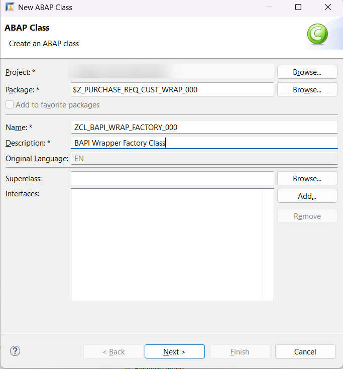

Copy and paste the following code into your previously created factory class:

```ABAP
    CLASS zcl_bapi_wrap_factory_### DEFINITION
    PUBLIC
    FINAL
    CREATE PRIVATE.

    PUBLIC SECTION.

      CLASS-METHODS create_instance
        IMPORTING
          !destination  TYPE rfcdest OPTIONAL
        RETURNING
          VALUE(result) TYPE REF TO zif_wrap_bapi_pr_create_###.
    PROTECTED SECTION.
    PRIVATE SECTION.

      METHODS constructor.
  ENDCLASS.

  CLASS zcl_bapi_wrap_factory_### IMPLEMENTATION.

    METHOD constructor.
    ENDMETHOD.

    METHOD create_instance.
      result = NEW zcl_bapi_pr_wrapper_###( destination = destination  ).
    ENDMETHOD.
  ENDCLASS.
```

**Hint**:<br> 
At this point, it is not yet possible to save and activate the class. To achieve this, the wrapper class described in the next section must first be created. Once the wrapper class is created, the factory class can also be saved and activated.

#### Create the BAPI Wrapper Class

Now create the BAPI wrapper class. Right click on your package `$Z_PURCHASE_REQ_CUST_WRAP_###` and select **New** > **ABAP Class** and input the Name `ZCL_BAPI_PR_WRAPPER_###`:

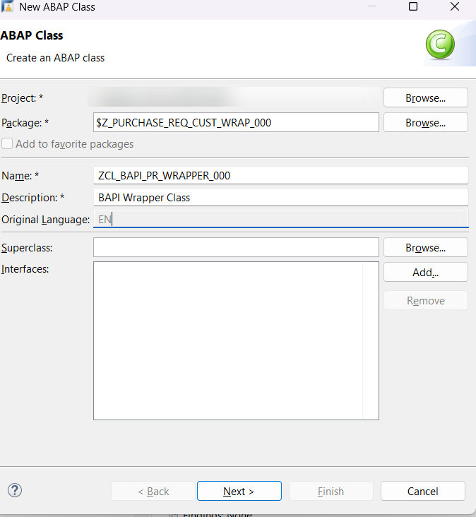

Copy and paste the following code into your previously created wrapper class:

```ABAP
  CLASS zcl_bapi_pr_wrapper_### DEFINITION
    PUBLIC
    CREATE PRIVATE

    GLOBAL FRIENDS zcl_bapi_wrap_factory_### .

    PUBLIC SECTION.


      INTERFACES zif_wrap_bapi_pr_create_### .
    PROTECTED SECTION.

      DATA destination TYPE rfcdest .
    PRIVATE SECTION.

      METHODS call_bapi_pr_create
        IMPORTING
          !prheader     TYPE zif_wrap_bapi_pr_create_###~bapimereqheader OPTIONAL
          !prheaderx    TYPE zif_wrap_bapi_pr_create_###~bapimereqheaderx OPTIONAL
          !testrun      TYPE zif_wrap_bapi_pr_create_###~char1 OPTIONAL
        EXPORTING
          !number       TYPE banfn
          !prheaderexp  TYPE zif_wrap_bapi_pr_create_###~bapimereqheader
        CHANGING
          !extensionin  TYPE zif_wrap_bapi_pr_create_###~_bapiparex OPTIONAL
          !extensionout TYPE zif_wrap_bapi_pr_create_###~_bapiparex OPTIONAL
          !praccountx   TYPE zif_wrap_bapi_pr_create_###~_bapimereqaccountx OPTIONAL
          !pritem       TYPE zif_wrap_bapi_pr_create_###~_bapimereqitemimp
          !pritemx      TYPE zif_wrap_bapi_pr_create_###~_bapimereqitemx OPTIONAL
          !return       TYPE zif_wrap_bapi_pr_create_###~_bapiret2 OPTIONAL

        RAISING
          cx_root.

      METHODS constructor
        IMPORTING
          !destination TYPE rfcdest .
  ENDCLASS.

  CLASS zcl_bapi_pr_wrapper_### IMPLEMENTATION.


    METHOD call_bapi_pr_create.
      DATA: _rfc_message_ TYPE c LENGTH 255.
      CALL FUNCTION 'BAPI_PR_CREATE' DESTINATION me->destination
        EXPORTING
          prheader              = prheader
          prheaderx             = prheaderx
          testrun               = testrun
        IMPORTING
          number                = number
          prheaderexp           = prheaderexp
        TABLES
          extensionin           = extensionin
          extensionout          = extensionout
          praccountx            = praccountx
          pritem                = pritem
          pritemx               = pritemx
          return                = return.
    ENDMETHOD.

    METHOD constructor.
      me->destination = destination.
    ENDMETHOD.

    METHOD zif_wrap_bapi_pr_create_###~bapi_pr_create.
      TRY.
          me->call_bapi_pr_create(
          EXPORTING
            prheader = prheader
            prheaderx = prheaderx
            testrun = testrun
          IMPORTING
            number = number
            prheaderexp = prheaderexp
          CHANGING
            return = return
            pritemx = pritemx
            pritem = pritem

        ).
        CATCH cx_root INTO DATA(lx_root_pr_create).

      ENDTRY.
    ENDMETHOD.
  ENDCLASS.
```
    
### Test unreleased wrapper with console application in ABAP Cloud Development

The wrapper you just created is currently not released for consumption in ABAP Cloud Development. You can test this by creating a console application in ABAP Cloud Development to call the (unreleased) wrapper. We suggest to create a dedicated package under the ABAP Cloud Development `ZLOCAL` package in your SAP S/4HANA System for this test.

In ADT, open your SAP S/4HANA system project folder, navigate to the `ZLOCAL` structure package, right click on it and select **New** > **ABAP Package** and input the Name `Z_PURCHASE_REQ_TEST_###` and a Description:

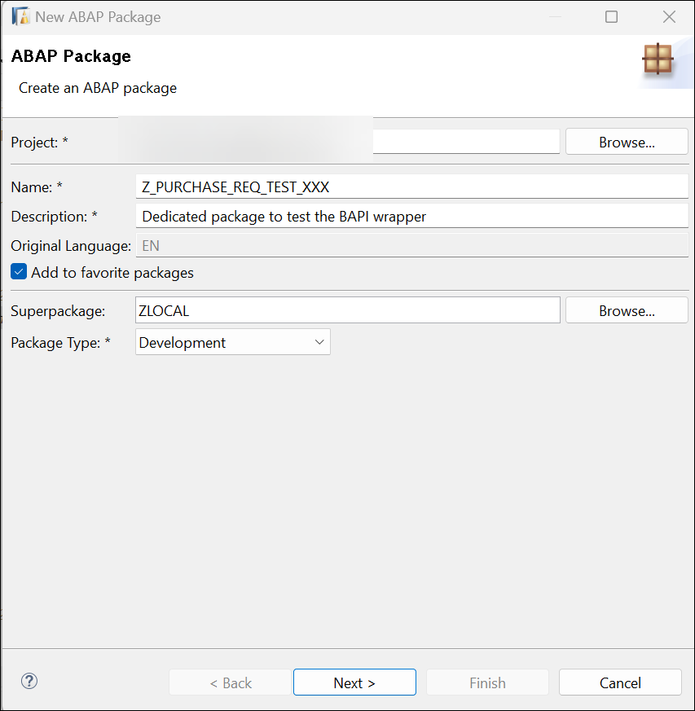

Click on **Next** and then **Next** again. Select a suitable transport request (or create a new one if needed) and then click on **Finish**. Now you can create the class for the console application. Right click on the newly created package and select **New** > **ABAP Class** and input the Name `ZCL_BAPI_WRAP_TEST_###` and a Description:

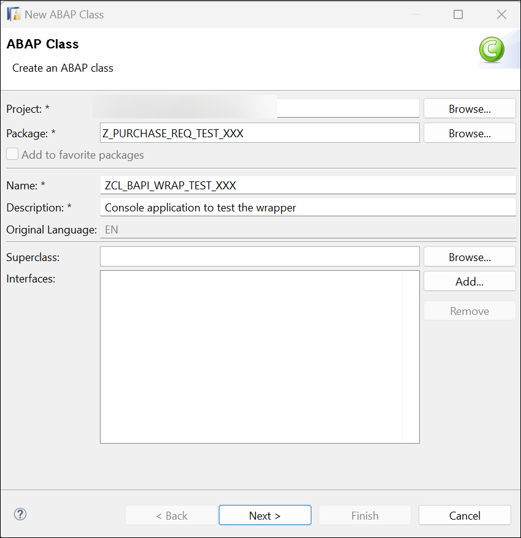

Click on **Next**, select a suitable transport request (or create a new one if needed) and then click on **Finish**.

You can check that the newly created class is an ABAP Cloud Development class by checking that the **ABAP Language Version** is `ABAP Language for Cloud Development` in the **Properties** > **General** tab:

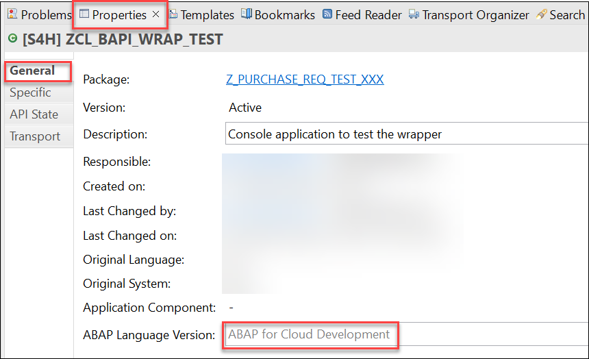

Implement the newly created class as follows:

```ABAP
    CLASS zcl_bapi_wrap_test_### DEFINITION
      PUBLIC
      FINAL
      CREATE PUBLIC .

      PUBLIC SECTION.
      INTERFACES if_oo_adt_classrun .
      PROTECTED SECTION.
      PRIVATE SECTION.
    ENDCLASS.

    CLASS zcl_bapi_wrap_test_### IMPLEMENTATION.
    METHOD if_oo_adt_classrun~main.

        DATA pr_returns TYPE bapirettab.
        DATA number  TYPE banfn  .

        "if the data element banfn is not released for the use in cloud develoment in your system
        "you have to use the shadow type zif_wrap_bapi_pr_create_###=>banfn

        "DATA number  TYPE zif_wrap_bapi_pr_create_###=>banfn  .
        DATA prheader TYPE zif_wrap_bapi_pr_create_###=>bapimereqheader .
        DATA prheaderx TYPE zif_wrap_bapi_pr_create_###=>bapimereqheaderx .       
        DATA pritem  TYPE zif_wrap_bapi_pr_create_###=>_bapimereqitemimp .
        DATA pritemx  TYPE zif_wrap_bapi_pr_create_###=>_bapimereqitemx  .
        DATA prheaderexp  TYPE zif_wrap_bapi_pr_create_###=>bapimereqheader .

        DATA(myclass) = zcl_bapi_wrap_factory_###=>create_instance( ).

        prheader = VALUE #( pr_type = 'NB' ).
        prheaderx = VALUE #( pr_type = 'X' ).

        pritem           = VALUE #( (
                          preq_item  = '00010'
                          plant      = '1010'
                          acctasscat = 'U'
                          currency   = 'EUR'
                          deliv_date = cl_abap_context_info=>get_system_date(  ) + 14   "format: yyyy-mm-dd (at least 10 days)
                          material   = 'ZPRINTER01'
                          matl_group = 'A001'
                          preq_price = '100.00'
                          quantity   = '1'
                          unit       = 'ST'
                          pur_group = '001'
                          purch_org = '1010'
                          short_text = 'ZPRINTER01'
                        ) ).

        pritemx           = VALUE #( (
                          preq_item  = '00010'
                          plant      = 'X'
                          acctasscat = 'X'
                          currency   = 'X'
                          deliv_date = 'X'
                          material   = 'X'
                          matl_group = 'X'
                          preq_price = 'X'
                          quantity   = 'X'
                          unit       = 'X'
                          pur_group = 'X'
                          purch_org = 'X'
                          short_text = 'X'
                        ) ).

        TRY.
            myclass->bapi_pr_create(
              EXPORTING
                prheader = prheader
                prheaderx = prheaderx
                testrun = abap_false
              IMPORTING
                number   = number
                prheaderexp = prheaderexp
              CHANGING
                pritem = pritem
                pritemx = pritemx
                return = pr_returns
        )
            .
          CATCH cx_root into data(error)
            "handle exception            
        ENDTRY.
        out->write( |purchase requisition number: { number  } | ).
        LOOP AT pr_returns INTO DATA(bapiret2_line).
          out->write( |bapi_return: { bapiret2_line-message } | ).
        ENDLOOP.
      ENDMETHOD.
    ENDCLASS.
```
Save it.

The class calls the wrapper factory class and, given some input parameter values like the delivery date and the item price, creates a purchase requisition for that specific item and prints the information to the console. Since the wrapper is not released for consumption in ABAP Cloud Development, when you try to activate the class you will get an error message.

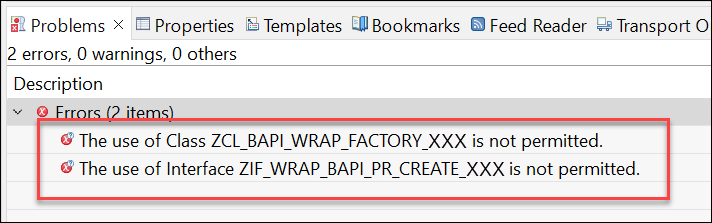

>The class calls the method `create_instance` of the BAPI, which will create an instance of the Shopping Cart Business Object and the relative purchase requisition. In the context of this tutorial group, this is of course done for educational purposes, to show the creation of a purchase requisition and test the wrapper via console application. If for any reason you do not wish to create an instance of the Shopping Cart Business Object at this point, you can instead make use of the BAPI method `check`.

### Release the wrapper interface and factory class

Now you need to release the wrapper interface and wrapper factory class for consumption in ABAP Cloud Development. To do this, you need to add a Release Contract (C1) to both objects for use system-internally and use in Cloud Development.

In your Project Explorer open the ABAP Interface you created. In the **Properties** tab click on the **API State** tab and then click on the green plus icon next to the **Use System-Internally (Contract C1)**.

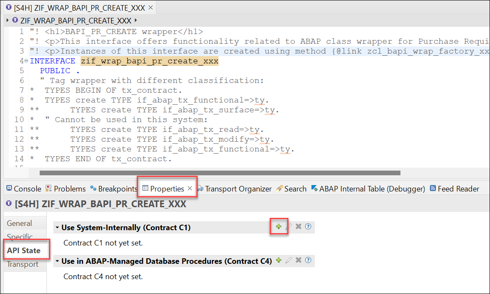

Make sure the **Release State** is set to **Released** and check the option **Use in Cloud Development**:


Click on **Next**. The changes will be validated. No issues should arise:

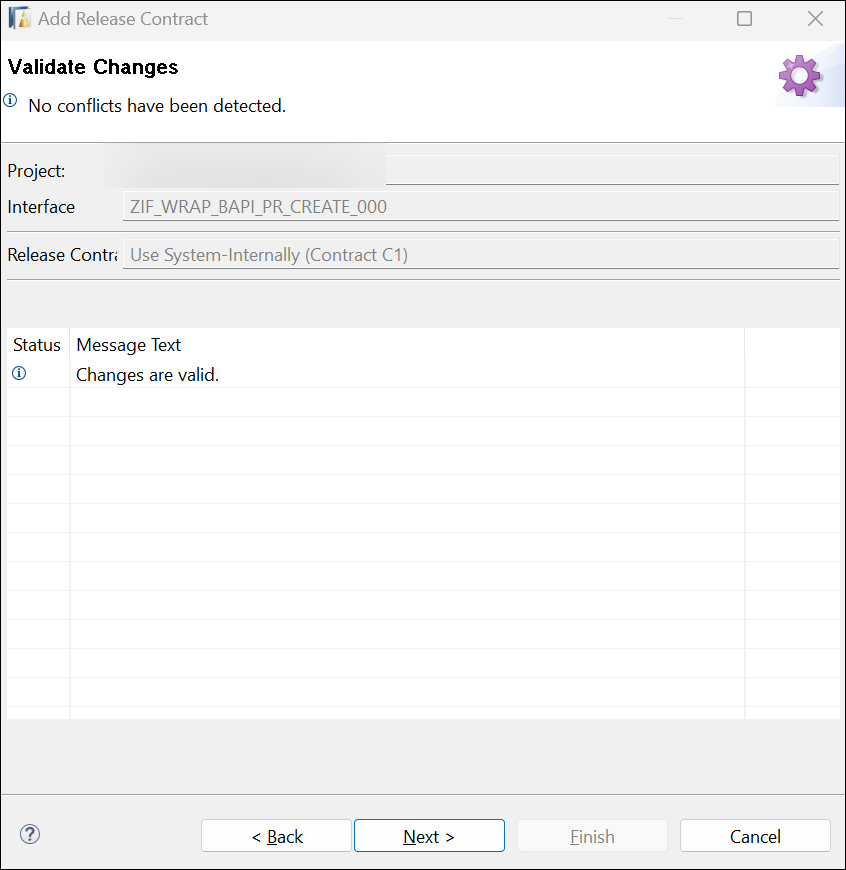

Click on **Next** and then click on **Finish**.

The API State tab will now show the new Release State:

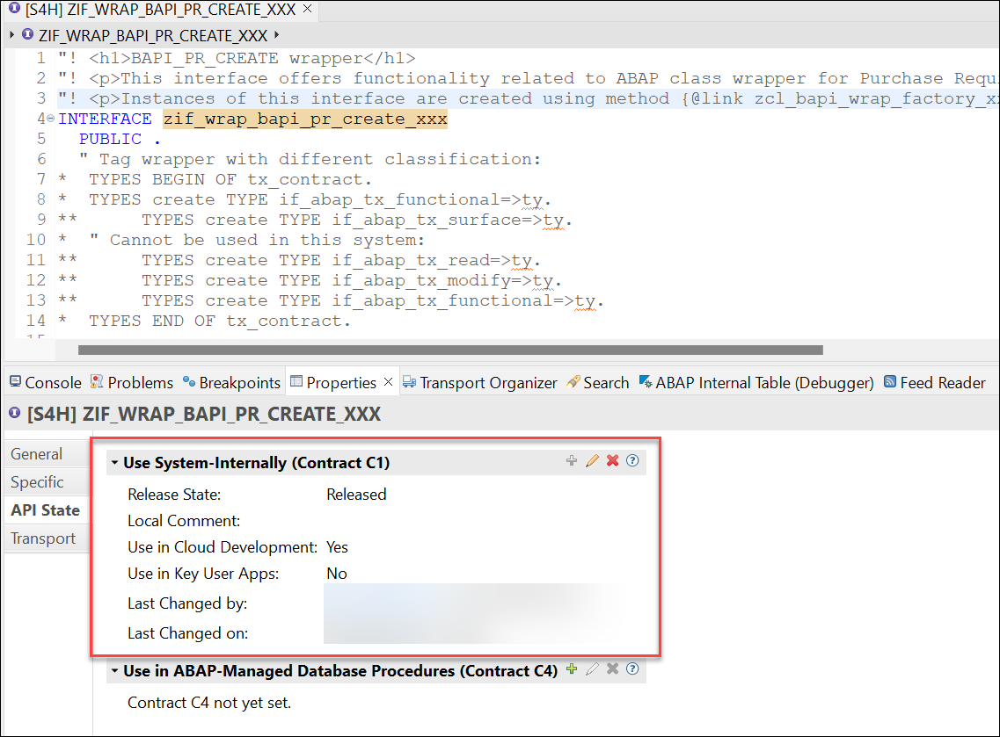

Repeat the same steps to release the factory class you created:

>When releasing this class, you will see an option in the wizard called 'Enable Configuration of Authorization Default Values' which allows you to define authorization default values while releasing the class. In the scope of this tutorial, we will not utilize this option, since at the moment we have no information on the needed authorization default values for `BAPI_PR_CREATE`. The handling of authorizations will be handled in a later tutorial of this series.

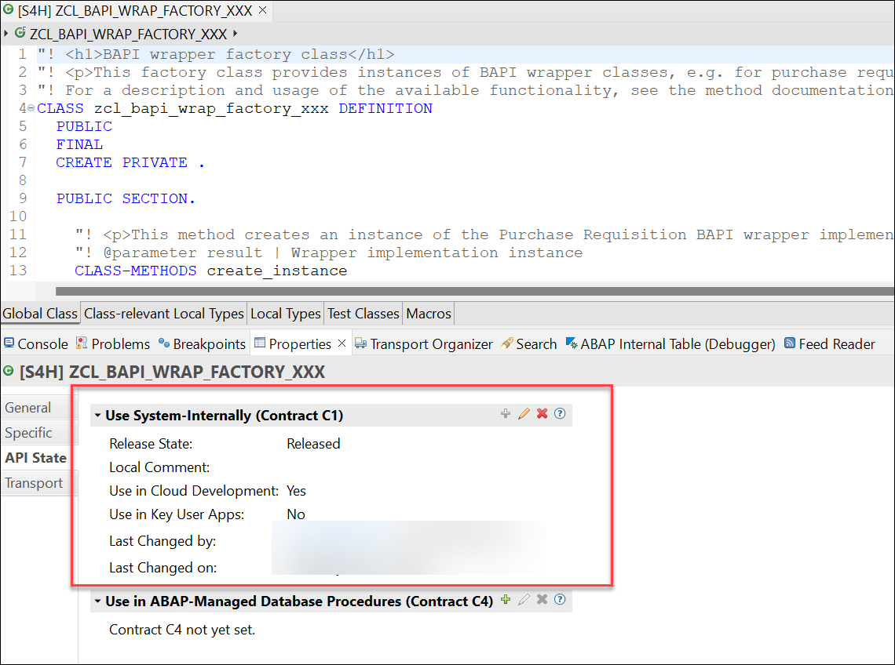

>You will not release the wrapper class.

### Optional Step - Run ATC checks and request exemptions

> **Important!** If you execute ATC checks (as described below) on your package $Z_PURCHASE_REQ_CUST_WRAP_000 using the check variant you created for Clean Core Extensibility (as described in Step 4 [Verify technical requirements](abap-s4hanacloud-purchasereq-understand-scenario) of the first tutorial in this group), you will receive no findings: 
> 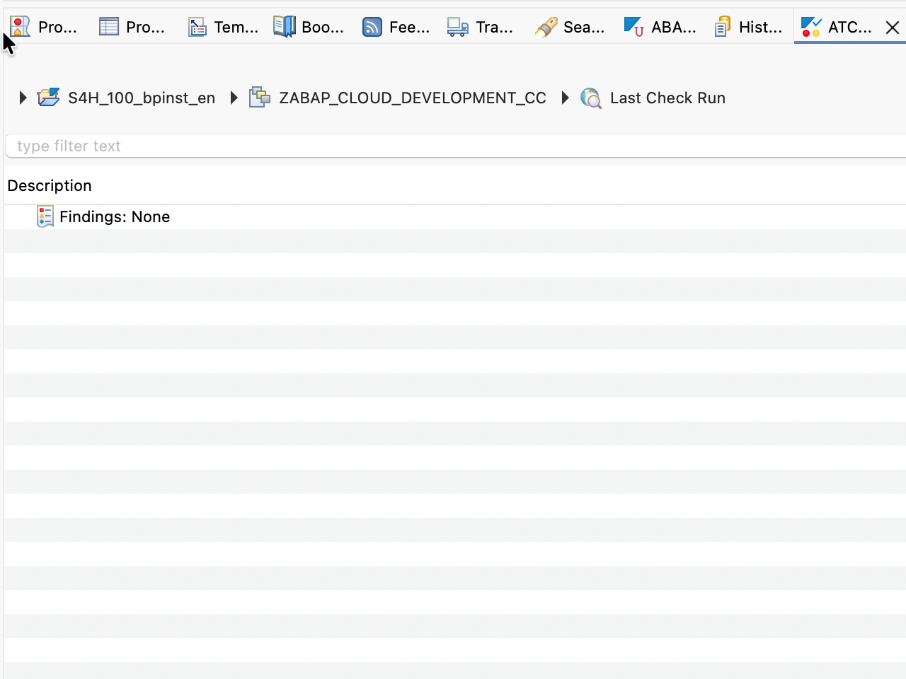

> **Note:** The next step is **not** required for this tutorial. It outlines the procedure for requesting ATC exemptions for your created wrapper objects, which is only applicable when using a non-classic API; **not applicable in this tutorial**. There is no need to request an exemption for a classic API. For more information, please refer to [note 3565942](https://me.sap.com/notes/3565942). This step is provided solely to illustrate the process that would be necessary if a non-classic API were used.

> You will need to run ATC checks on the objects you created and request exemptions to use the non classic API.

> To run the ATC checks right click on the `$Z_PURCHASE_REQ_CUST_WRAP_000` package and select **Run As** > **ABAP Test Cockpit With...** and select your ATC check variant. Confirm by clicking on **OK**. The result of the ATC check will appear in the ATC Problems tab. As expected, you will get ATC check errors because you are using an unreleased API:

>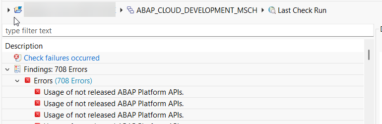

> Note that there are ATC checks errors for both the interface and the wrapper class. You will need to request an exemption for each of the two objects.

> Right click on any one of the class related errors in the ATC Problems tab and choose **Request Exemption**. You can then request an exemption for the whole class by selecting `Class (ABAP Objects)` under the `Apply exemption To` tab:

>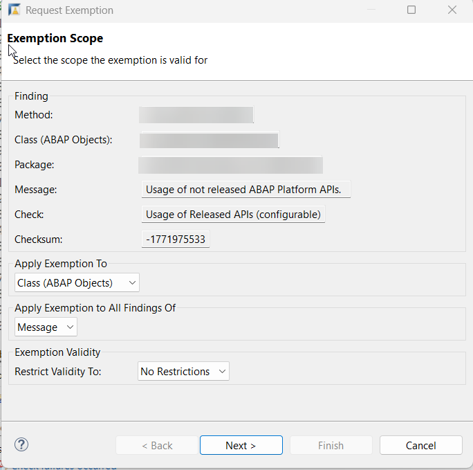

> Click **Next**, choose a valid approver, a reason to request the exemptions and input a justification for it. Then click on **Finish**.

>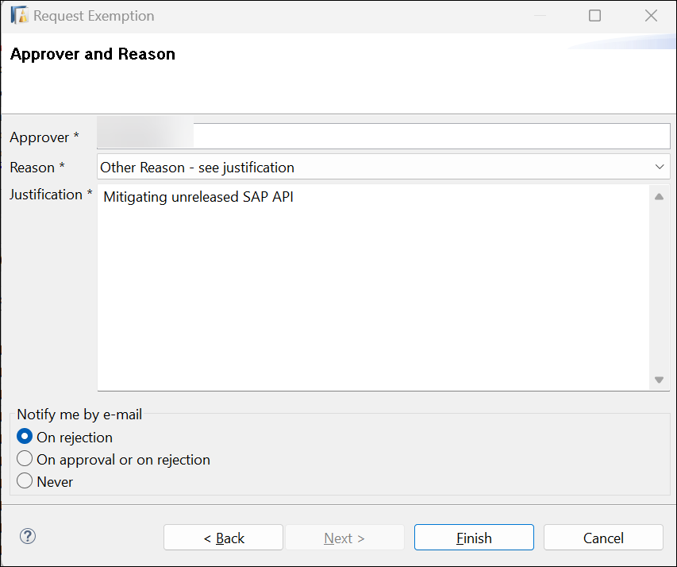

> Proceed in the same way to request an exemption for the whole wrapper class.

> How to maintain approvers and how to approve exemptions is beyond the scope of this tutorial. After a maintained approver has approved the exemptions, you can verify it by running ATC checks again in ADT: no issue should arise.

### Test released wrapper with console application in ABAP Cloud Development

You can test that the wrapper was correctly released for consumption in ABAP Cloud Development by running the console application class `ZCL_BAPI_WRAP_TEST_###`. First, the errors in the class should have disappeared now that you released the wrapper, so you can save and activate the class. Now you can run it: right click on the class and select **Run As** > **ABAP Application (Console)**. The class should now run without errors and the purchase requisition will be created and displayed in the console:

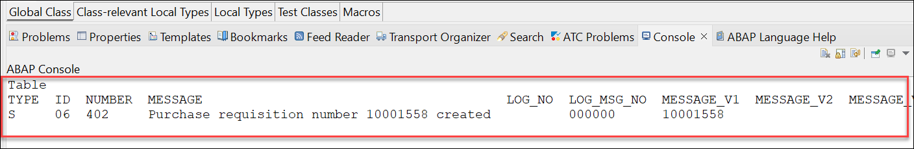

>The console application is a quick and simple way to check if the BAPI was correctly wrapped and released and if the wrapper works as intended. In the next tutorials of this group you will create a Shopping Cart Business Object and you will integrate the wrapper to create purchase requisitions for the shopping cart entries.

---