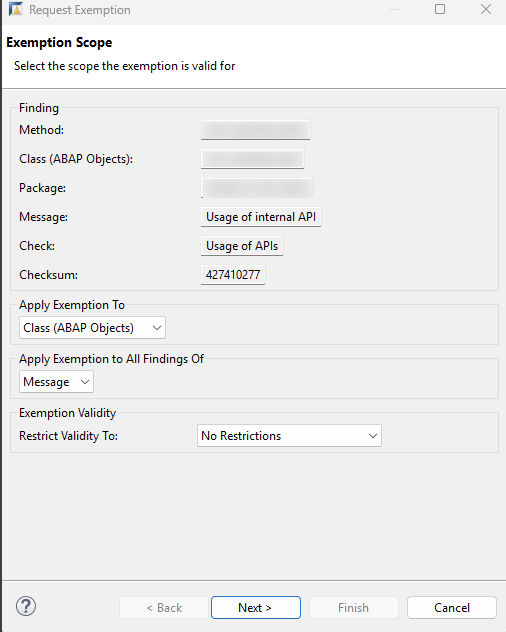

# Implement a Wrapper for the "Create Purchase Requisition" (BAPI_PR_CREATE) function module
<!-- description --> Learn how to wrap the BAPI_PR_CREATE in your SAP S/4HANA or SAP S/4HANA Cloud, private edition system and release it for consumption in tier 1.

## Prerequisites
- You have completed the previous tutorials in this group to [learn about the 3-tier extensibility model](abap-s4hanacloud-purchasereq-understand-scenario) and connect to your SAP S/4HANA system.
- You have imported the following notes
-- SAP Note 3444292 - ACO Proxy creates unnecessary shadow types
-- SAP Note 3457580 - SAP ACO - Duplicate Types for Table Parameters
-- SAP Note 3518177 - SAP ACO Proxy Improvements
-- SAP Note 3519098 - F4: fix function module value help (only relevant for SAP S/4 HANA 2023)
-- SAP Note 3565942 - ATC Checks "Usage of APIs" and "Allowed Enhancement Technologies"

## You will learn
- How to generate a wrapper interface, a wrapper class and a factory class for the `BAPI_PR_CREATE` using transaction `ACO_PROXY`.
- How to test that the wrapper objects have been released for consumption in tier 1.
- How to release the wrapper for consumption in tier 1.

## Intro
>Throughout this tutorial, wherever ### appears, use a number (e.g. 000). This tutorial is done with the placeholder 000.

In a previous tutorial of this group, you learned about the 3-tier extensibility model and got an overview of the sample scenario used for this tutorial group, which will include a Shopping Cart Business Object with purchase requisition creation capability.

In this tutorial we show how to deal with the case in which no convenient released API is available to create purchase requisitions. The [ABAP Cloud API Enablement Guidelines for SAP S/4HANA Cloud, private edition, and SAP S/4HANA](https://www.sap.com/documents/2023/05/b0bd8ae6-747e-0010-bca6-c68f7e60039b.html) documentation recommends to use a BAPI as an alternative to a released API, wrap it and then release the wrapper for consumption in tier 1. In a later tutorial you will then create a Shopping Cart RAP Business Object for the online shop application and integrate this wrapper to create purchase requisitions.

### Get to know the BAPI_PR_CREATE via the BAPI Explorer

The first step is to look for a suitable unreleased API to create purchase requisitions. You can use the BAPI Explorer for this purpose. Connect to the backend of your SAP S/4HANA system and start transaction `BAPI`. For the purpose of this tutorial, we will use the unreleased BAPI `BAPI_PR_CREATE`: switch to the **Alphabetical** view (1), look for the Business Object `PurchaseRequisition` (2), find and click on the method `CreateFromData1` (3). You can see that its function module is the `BAPI_PR_CREATE` (4).


In the **Documentation** tab you can find more information on what the BAPI is used for (in this case: to create purchase requisitions) and you can find examples for various scenarios and how to fill the respective parameter values.

In the **Tools** section you can click on the **Function Builder** and then click on **Display** to see the required parameters:


>The `BAPI_PR_CREATE` has a `TESTRUN` parameter that can be used to call the BAPI in validation mode. Some BAPI have a similar test mode that can be used to validate input data. It is best practice to make use of this test mode, if available, as we will address in more details in a later [tutorial](abap-s4hanacloud-purchasereq-integrate-wrapper) of this group.

### Create a development package

You will develop the wrapper in a dedicated package under the package `$TMP` in your SAP S/4HANA system.

In ADT, open your SAP S/4HANA system project folder, right click on it and select **New** > **ABAP Package** and input the Name `$Z_PURCHASE_REQ_TIER2_###` and a Description:


Select **Add to favorite packages** for easy access later on. Keep the Package Type as **Development** and click on **Next**. Do not change anything in the following wizard window, and click on **Next**, then click on **Finish**. The package will be created.

### Create a wrapper class, interface and factory class

You now want to wrap the API `BAPI_PR_CREATE`. For this we use the transaction `ACO_PROXY` which has been enhanced so that it will generate the boiler plate coding for you to build a wrapper class.

In the following we will explain in short the best practices that are behind the options you will have to choose when using transaction `ACO_PROXY`.

1. To create the interface, the class and the factory class for your BAPI start transaction `ACO_PROXY`.

2. Enter the following values:

    - Function Modules: Here you can select one or more function modules that will be wrapped by one single class. Please enter here only `BAPI_PR_CREATE`.

    - Specify repository object names:

    | Object          | Name                           | Remark
| :-----          | :----------------------------- | :--------------------
| Proxy Class     | `ZCL_BAPI_PR_WRAPPER_###`      |
| Package         | `$Z_PURCHASE_REQ_TIER2_###`    |
| Interface       | `ZIF_WRAP_BAPI_PR_CREATE_###`  | Mark the check box (Create Interface)
| Factory Class   | `ZCL_BAPI_WRAP_FACTORY_###`    | Mark the check box (Create Factory Class)

    - Options

    <!-- border -->
    

    - Press the green check mark ✔ in the upper left corner or F8 to continue

    - Select optional values: Transaction `ACO_PROXY` offers you to un-select optional values that shall not be part of the public interface. Only leave the following optional parameters, of the `BAPI_PR_CREATE` selected:
    -- NUMBER
    -- PRHEADEREXP
    -- PRHEADER
    -- PRHEADERX
    -- TESTRUN
    -- PRITEMX
    -- RETURN

    <!-- border -->
    

    <!-- border -->
    

    - Check the generated artefacts.

    <!-- border -->
    

### Test unreleased wrapper with console application in tier 1

The wrapper you just created is currently not released for consumption in tier 1. You can test this by creating a console application in tier 1 to call the (unreleased) wrapper. We suggest to create a dedicated package under the tier 1 `ZLOCAL` package in your SAP S/4HANA System for this test.

In ADT, open your SAP S/4HANA system project folder, navigate to the `ZLOCAL` structure package, right click on it and select **New** > **ABAP Package** and input the Name `Z_PURCHASE_REQ_TEST_###` and a Description:


Click on **Next** and then **Next** again. Select a suitable transport request (or create a new one if needed) and then click on **Finish**. Now you can create the class for the console application. Right click on the newly created package and select **New** > **ABAP Class** and input the Name `ZCL_BAPI_WRAP_TEST_###` and a Description:


Click on **Next**, select a suitable transport request (or create a new one if needed) and then click on **Finish**.

You can check that the newly created class is a tier 1 class by checking that the **ABAP Language Version** is `ABAP Language for Cloud Development` in the **Properties** > **General** tab:


Implement the newly created class as follows:

```ABAP

CLASS zcl_bapi_wrap_test_### DEFINITION
  PUBLIC
  FINAL
  CREATE PUBLIC .

  PUBLIC SECTION.
  INTERFACES if_oo_adt_classrun .
  PROTECTED SECTION.
  PRIVATE SECTION.
ENDCLASS.


CLASS zcl_bapi_wrap_test_### IMPLEMENTATION.
METHOD if_oo_adt_classrun~main.

    DATA pr_returns TYPE bapirettab.
    DATA number  TYPE banfn  .

    "if the data element banfn is not released for the use in cloud develoment in your system
    "you have to use the shadow type zif_wrap_bapi_pr_create_###=>banfn

    "DATA number  TYPE zif_wrap_bapi_pr_create_###=>banfn  .
    DATA prheader TYPE zif_wrap_bapi_pr_create_###=>bapimereqheader .
    DATA prheaderx TYPE zif_wrap_bapi_pr_create_###=>bapimereqheaderx .       
    DATA pritem  TYPE zif_wrap_bapi_pr_create_###=>_bapimereqitemimp .
    DATA pritemx  TYPE zif_wrap_bapi_pr_create_###=>_bapimereqitemx  .
    DATA prheaderexp  TYPE zif_wrap_bapi_pr_create_###=>bapimereqheader .

    DATA(myclass) = zcl_bapi_wrap_factory_###=>create_instance( ).

    prheader = VALUE #( pr_type = 'NB' ).
    prheaderx = VALUE #( pr_type = 'X' ).

    pritem           = VALUE #( (
                      preq_item  = '00010'
                      plant      = '1010'
                      acctasscat = 'U'
                      currency   = 'EUR'
                      deliv_date = cl_abap_context_info=>get_system_date(  ) + 14   "format: yyyy-mm-dd (at least 10 days)
                      material   = 'ZPRINTER01'
                      matl_group = 'A001'
                      preq_price = '100.00'
                      quantity   = '1'
                      unit       = 'ST'
                      pur_group = '001'
                      purch_org = '1010'
                      short_text = 'ZPRINTER01'
                    ) ).

    pritemx           = VALUE #( (
                      preq_item  = '00010'
                      plant      = 'X'
                      acctasscat = 'X'
                      currency   = 'X'
                      deliv_date = 'X'
                      material   = 'X'
                      matl_group = 'X'
                      preq_price = 'X'
                      quantity   = 'X'
                      unit       = 'X'
                      pur_group = 'X'
                      purch_org = 'X'
                      short_text = 'X'
                    ) ).

    TRY.
        myclass->bapi_pr_create(
          EXPORTING
            prheader = prheader
            prheaderx = prheaderx
            testrun = abap_false
          IMPORTING
            number   = number
            prheaderexp = prheaderexp
          CHANGING
            pritem = pritem
            pritemx = pritemx
            return = pr_returns
     )
        .
      CATCH cx_aco_application_exception cx_aco_communication_failure cx_aco_system_failure INTO DATA(call_wrapper_exception).
        "handle exception
        out->write( |Exception occured: { call_wrapper_exception->get_text(  ) }| ).
    ENDTRY.
    out->write( |purchase requistion number: { number  } | ).
    LOOP AT pr_returns INTO DATA(bapiret2_line).
      out->write( |bapi_return: { bapiret2_line-message } | ).
    ENDLOOP.
  ENDMETHOD.
ENDCLASS.
```

Save it.

The class calls the wrapper factory class and, given some input parameter values like the delivery date and the item price, creates a purchase requisition for that specific item and prints the information to the console. Since the wrapper is not released for consumption in tier 1, when you try to activate the class you will get an error message.


>The class calls the method `create_instance` of the BAPI, which will create an instance of the Shopping Cart Business Object and the relative purchase requisition. In the context of this tutorial group, this is of course done for educational purposes, to show the creation of a purchase requisition and test the wrapper via console application. If for any reason you do not wish to create an instance of the Shopping Cart Business Object at this point, you can instead make use of the BAPI method `check`.

### Release the wrapper interface and factory class

Now you need to release the wrapper interface and wrapper factory class for consumption in tier 1. To do this, you need to add a Release Contract (C1) to both objects for use system-internally and use in Cloud Development.

In your Project Explorer open the ABAP Interface you created. In the **Properties** tab click on the **API State** tab and then click on the green plus icon next to the **Use System-Internally (Contract C1)**.


Make sure the **Release State** is set to **Released** and check the option **Use in Cloud Development**:


Click on **Next**. The changes will be validated. No issues should arise:


Click on **Next** and then click on **Finish**.

The API State tab will now show the new Release State:


Repeat the same steps to release the factory class you created:

>When releasing this class, you will see an option in the wizard called 'Enable Configuration of Authorization Default Values' which allows you to define authorization default values while releasing the class. In the scope of this tutorial, we will not utilize this option, since at the moment we have no information on the needed authorization default values for `BAPI_PR_CREATE`. The handling of authorizations will be handled in a later tutorial of this series.


>You will not release the wrapper class.

### Optional Step - Run ATC checks and request exemptions
> Note: The next step is **not** required for this tutorial. It outlines the procedure for requesting ATC exemptions for your created wrapper objects, which is only applicable when using a non-classic API—**not applicable in this tutorial**. There is no need to request an exemption for a classic API. For more information, please refer to [note 3565942](https://me.sap.com/notes/3565942). This step is provided solely to illustrate the process that would be necessary if a non-classic API were used.

> You will need to run ATC checks on the objects you created and request exemptions to use the non classic API.

> To run the ATC checks right click on the `$Z_PURCHASE_REQ_TIER2_###` package and select **Run As** > **ABAP Test Cockpit With...** and select your ATC check variant. Confirm by clicking on **OK**. The result of the ATC check will appear in the ATC Problems tab. As expected, you will get ATC check errors because you are using an unreleased API:

>

> Note that there are ATC checks errors for both the interface and the wrapper class. You will need to request an exemption for each of the two objects.

> Right click on any one of the class related errors in the ATC Problems tab and choose **Request Exemption**. You can then request an exemption for the whole class by selecting `Class (ABAP Objects)` under the `Apply exemption To` tab:

>

> Click **Next**, choose a valid approver, a reason to request the exemptions and input a justification for it. Then click on **Finish**.

>

> Proceed in the same way to request an exemption for the whole wrapper class.

> How to maintain approvers and how to approve exemptions is beyond the scope of this tutorial. After a maintained approver has approved the exemptions, you can verify it by running ATC checks again in ADT: no issue should arise.

### Test released wrapper with console application in tier 1

You can test that the wrapper was correctly released for consumption in tier 1 by running the console application class `ZCL_BAPI_WRAP_TEST_###`. First, the errors in the class should have disappeared now that you released the wrapper, so you can save and activate the class. Now you can run it: right click on the class and select **Run As** > **ABAP Application (Console)**. The class should now run without errors and the purchase requisition will be created and displayed in the console:


>The console application is a quick and simple way to check if the BAPI was correctly wrapped and released and if the wrapper works as intended. In the next tutorials of this group you will create a Shopping Cart Business Object and you will integrate the wrapper to create purchase requisitions for the shopping cart entries.
### Test yourself

---