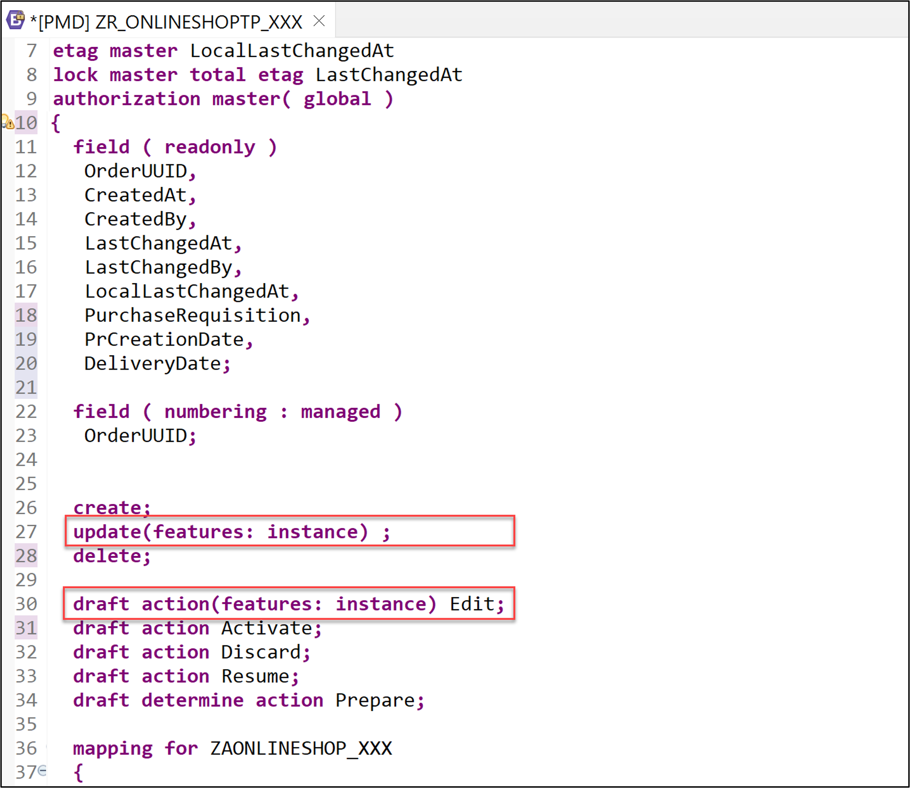
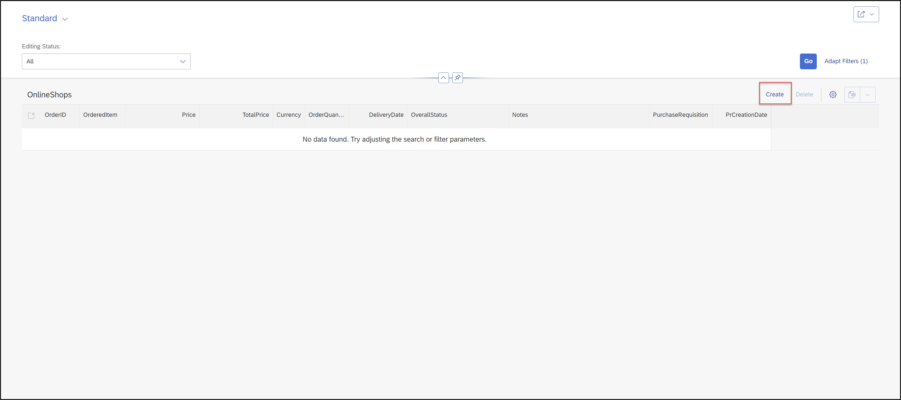

  
# Enhance the Behavior Defintion and Behavior Implementation of the Online Shop Business Object
<!-- description --> Create your first order in the online shop.

In the online shop, customers can order various items. Once an item is ordered, a new purchase requisition is created via purchase requisitions API.

 
## Prerequisites  
- This tutorial can be used in both SAP S/4HANA Cloud, private edition system and SAP S/4HANA on-premise system with release 2022 FPS01. We suggest using a [Fully-Activated Appliance] (https://blogs.sap.com/2018/12/12/sap-s4hana-fully-activated-appliance-create-your-sap-s4hana-1809-system-in-a-fraction-of-the-usual-setup-time/) in SAP Cloud Appliance Library for an easy start without the need for system setup.
- For SAP S/4HANA on-premise, create developer user with full development authorization 
- You have installed the latest [Eclipse with ADT](abap-install-adt).
- Business role `SAP_BR_PURCHASER` needs to be assign to your business user
- Use Starter Development Tenant in S/4HANA Cloud for the tutorial to have necessary sample data in place. See [3-System Landscape and Transport Management](https://help.sap.com/docs/SAP_S4HANA_CLOUD/a630d57fc5004c6383e7a81efee7a8bb/e022623ec1fc4d61abb398e411670200.html?state=DRAFT&version=2208.503).


## You will learn  
- How to enhance a behavior definition
- How to enhance a behavior implementation
- How to run the SAP Fiori Elements Preview

## Intro
In this tutorial, wherever X/XXX/#/### appears, use a number (e.g. 000).

---

### Enhance behavior definition of data model

**Hint:** In case of S/4HANA 2022 `FPS01`, strict(1) mode must be used.

**In this tutorial example, a SAP S/4HANA Cloud, ABAP environment system was used. The mode therefore is `strict (2)`.**

  1. Open your behavior definition **`ZR_ONLINESHOPTP_XXX`** to enhance it. Add the following statements to your behavior definition:

    ```ABAP
    update (features: instance);
    .
    .
    draft action(features: instance) Edit;
    ```

     

  2. Replace the following statements to your behavior definition:

    ```ABAP
    draft determine action Prepare { validation checkOrderedQuantity;  validation checkDeliveryDate;}
        determination setInitialOrderValues on modify { create; }
        determination calculateTotalPrice on modify { create; field Price; } 
      validation checkOrderedQuantity on save { create; field OrderQuantity; }
      validation checkDeliveryDate on save { create; field DeliveryDate; }
    ```
   
      

     **Hint:** Please replace **`#`**, **`X`** and **`XXX`** with your ID. 
 
  3. Check your behavior definition:

    ```ABAP
    managed implementation in class ZBP_ONLINESHOPTP_XXX unique;
    strict ( 2 );
    with draft;

    define behavior for ZR_ONLINESHOPTP_XXX alias OnlineShop
    persistent table zaonlineshop_xxx
    draft table ZDONLINESHOP_XXX
    etag master LocalLastChangedAt
    lock master total etag LastChangedAt
    authorization master( global )
    {
      field ( readonly ) 
      OrderUUID,
      CreatedAt,
      CreatedBy,
      LastChangedAt,
      LastChangedBy,
      LocalLastChangedAt,
      PurchaseRequisition,
      PrCreationDate,
      DeliveryDate;

      field ( numbering : managed )
      OrderUUID;

      create;
      update(features: instance) ;
      delete;

      draft action(features: instance) Edit;
      draft action Activate;
      draft action Discard; 
      draft action Resume;
      draft determine action Prepare { validation checkOrderedQuantity;  validation checkDeliveryDate;}
        determination setInitialOrderValues on modify { create; }
        determination calculateTotalPrice on modify { create; field Price; }
      validation checkOrderedQuantity on save { create; field OrderQuantity; }
      validation checkDeliveryDate on save { create; field DeliveryDate; }

      mapping for ZAONLINESHOP_XXX 
      {
        OrderUUID = order_uuid;
        OrderID = order_id;
        OrderedItem = ordered_item;
        Price = price;
        TotalPrice = total_price;
        Currency = currency;
        OrderQuantity = order_quantity;
        DeliveryDate = delivery_date;
        OverallStatus = overall_status;
        Notes = notes;
        CreatedBy = created_by;
        CreatedAt = created_at;
        LastChangedBy = last_changed_by;
        LastChangedAt = last_changed_at;
        LocalLastChangedAt = local_last_changed_at;
        PurchaseRequisition = purchase_requisition;
        PrCreationDate = pr_creation_date;
      }
    }
    ```

   4. Save and activate. 

 
### Enhance behavior implementation

**Hint:** Please replace **`X`**, **`#`** and **`XXX`** with your ID. 

  1. Open the behavior implementation **`ZBP_ONLINESHOPTP_XXX`**, add the constant `c_overall_status` to your behavior implementation. In your **Local Types**, replace your code with following:

    ```ABAP
    CLASS lsc_zr_onlineshoptp_xxx DEFINITION INHERITING FROM cl_abap_behavior_saver.

      PROTECTED SECTION.

    ENDCLASS.

    CLASS lsc_zr_onlineshoptp_xxx IMPLEMENTATION.

    ENDCLASS.

    CLASS lhc_onlineshop DEFINITION INHERITING FROM cl_abap_behavior_handler.
      PRIVATE SECTION.
        CONSTANTS:
          BEGIN OF c_overall_status,
            new       TYPE string VALUE 'New / Composing',
    *        composing  TYPE string VALUE 'Composing...',
            submitted TYPE string VALUE 'Submitted / Approved',
            cancelled TYPE string VALUE 'Cancelled',
          END OF c_overall_status.
        METHODS:
          get_global_authorizations FOR GLOBAL AUTHORIZATION
            IMPORTING
            REQUEST requested_authorizations FOR OnlineShop
            RESULT result,
          get_instance_features FOR INSTANCE FEATURES
            IMPORTING keys REQUEST requested_features FOR OnlineShop RESULT result.

        METHODS calculateTotalPrice FOR DETERMINE ON MODIFY
          IMPORTING keys FOR OnlineShop~calculateTotalPrice.

        METHODS setInitialOrderValues FOR DETERMINE ON MODIFY
          IMPORTING keys FOR OnlineShop~setInitialOrderValues.

        METHODS checkDeliveryDate FOR VALIDATE ON SAVE
          IMPORTING keys FOR OnlineShop~checkDeliveryDate.

        METHODS checkOrderedQuantity FOR VALIDATE ON SAVE
          IMPORTING keys FOR OnlineShop~checkOrderedQuantity.
    ENDCLASS.

    CLASS lhc_onlineshop IMPLEMENTATION.
      METHOD get_global_authorizations.
      ENDMETHOD.
      METHOD get_instance_features.

        " read relevant olineShop instance data
        READ ENTITIES OF zr_onlineshoptp_xxx IN LOCAL MODE
          ENTITY OnlineShop
            FIELDS ( OverallStatus )
            WITH CORRESPONDING #( keys )
          RESULT DATA(OnlineOrders)
          FAILED failed.

        "ToDo: dynamic feature control is currently not working for the action cancel order

        " evaluate condition, set operation state, and set result parameter
        " update and checkout shall not be allowed as soon as purchase requisition has been created
        result = VALUE #( FOR OnlineOrder IN OnlineOrders
                          ( %tky                   = OnlineOrder-%tky
                            %features-%update
                              = COND #( WHEN OnlineOrder-OverallStatus = c_overall_status-submitted  THEN if_abap_behv=>fc-o-disabled
                                        WHEN OnlineOrder-OverallStatus = c_overall_status-cancelled THEN if_abap_behv=>fc-o-disabled
                                        ELSE if_abap_behv=>fc-o-enabled   )
    *                         %features-%delete
    *                           = COND #( WHEN OnlineOrder-PurchaseRequisition IS NOT INITIAL THEN if_abap_behv=>fc-o-disabled
    *                                     WHEN OnlineOrder-OverallStatus = c_overall_status-cancelled THEN if_abap_behv=>fc-o-disabled
    *                                     ELSE if_abap_behv=>fc-o-enabled   )
                            %action-Edit
                              = COND #( WHEN OnlineOrder-OverallStatus = c_overall_status-submitted THEN if_abap_behv=>fc-o-disabled
                                        WHEN OnlineOrder-OverallStatus = c_overall_status-cancelled THEN if_abap_behv=>fc-o-disabled
                                        ELSE if_abap_behv=>fc-o-enabled   )

                            ) ).
      ENDMETHOD.

      METHOD calculateTotalPrice.
        DATA total_price TYPE zr_onlineshoptp_xxx-TotalPrice.

        " read transfered instances
        READ ENTITIES OF zr_onlineshoptp_xxx IN LOCAL MODE
          ENTITY OnlineShop
            FIELDS ( OrderID TotalPrice )
            WITH CORRESPONDING #( keys )
          RESULT DATA(OnlineOrders).

        LOOP AT OnlineOrders ASSIGNING FIELD-SYMBOL(<OnlineOrder>).
          " calculate total value
          <OnlineOrder>-TotalPrice = <OnlineOrder>-Price * <OnlineOrder>-OrderQuantity.
        ENDLOOP.

        "update instances
        MODIFY ENTITIES OF zr_onlineshoptp_xxx IN LOCAL MODE
          ENTITY OnlineShop
            UPDATE FIELDS ( TotalPrice )
            WITH VALUE #( FOR OnlineOrder IN OnlineOrders (
                              %tky       = OnlineOrder-%tky
                              TotalPrice = <OnlineOrder>-TotalPrice
                            ) ).
      ENDMETHOD.

      METHOD setInitialOrderValues.

        DATA delivery_date TYPE I_PurchaseReqnItemTP-DeliveryDate.
        DATA(creation_date) = cl_abap_context_info=>get_system_date(  ).
        "set delivery date proposal
        delivery_date = cl_abap_context_info=>get_system_date(  ) + 14.
        "read transfered instances
        READ ENTITIES OF ZR_ONLINESHOPTP_xxx IN LOCAL MODE
          ENTITY OnlineShop
            FIELDS ( OrderID OverallStatus  DeliveryDate )
            WITH CORRESPONDING #( keys )
          RESULT DATA(OnlineOrders).

        "delete entries with assigned order ID
        DELETE OnlineOrders WHERE OrderID IS NOT INITIAL.
        CHECK OnlineOrders IS NOT INITIAL.

        " **Dummy logic to determine order IDs**
        " get max order ID from the relevant active and draft table entries
        SELECT MAX( order_id ) FROM zaonlineshop_xxx INTO @DATA(max_order_id). "active table
        SELECT SINGLE FROM zdonlineshop_xxx FIELDS MAX( orderid ) INTO @DATA(max_orderid_draft). "draft table
        IF max_orderid_draft > max_order_id.
          max_order_id = max_orderid_draft.
        ENDIF.

        "set initial values of new instances
        MODIFY ENTITIES OF ZR_ONLINESHOPTP_xxx IN LOCAL MODE
          ENTITY OnlineShop
            UPDATE FIELDS ( OrderID OverallStatus  DeliveryDate Price  )
            WITH VALUE #( FOR order IN OnlineOrders INDEX INTO i (
                              %tky          = order-%tky
                              OrderID       = max_order_id + i
                              OverallStatus = c_overall_status-new  "'New / Composing'
                              DeliveryDate  = delivery_date
                              CreatedAt     = creation_date
                            ) ).
        .
      ENDMETHOD.

      METHOD checkDeliveryDate.

    *   " read transfered instances
        READ ENTITIES OF zr_onlineshoptp_xxx IN LOCAL MODE
          ENTITY OnlineShop
            FIELDS ( DeliveryDate )
            WITH CORRESPONDING #( keys )
          RESULT DATA(OnlineOrders).

        DATA(creation_date) = cl_abap_context_info=>get_system_date(  ).
        "raise msg if 0 > qty <= 10
        LOOP AT OnlineOrders INTO DATA(online_order).


          IF online_order-DeliveryDate IS INITIAL OR online_order-DeliveryDate = ' '.
            APPEND VALUE #( %tky = online_order-%tky ) TO failed-onlineshop.
            APPEND VALUE #( %tky         = online_order-%tky
                            %state_area   = 'VALIDATE_DELIVERYDATE'
                            %msg          = new_message_with_text(
                                    severity = if_abap_behv_message=>severity-error
                                    text     = 'Delivery Date cannot be initial' )
                          ) TO reported-onlineshop.

          ELSEIF  ( ( online_order-DeliveryDate ) - creation_date ) < 14.
            APPEND VALUE #(  %tky = online_order-%tky ) TO failed-onlineshop.
            APPEND VALUE #(  %tky          = online_order-%tky
                            %state_area   = 'VALIDATE_DELIVERYDATE'
                            %msg          = new_message_with_text(
                                    severity = if_abap_behv_message=>severity-error
                                    text     = 'Delivery Date should be atleast 14 days after the creation date'  )

                            %element-orderquantity  = if_abap_behv=>mk-on
                          ) TO reported-onlineshop.
          ENDIF.
        ENDLOOP.
      ENDMETHOD.

      METHOD checkOrderedQuantity.

        "read relevant order instance data
        READ ENTITIES OF zr_onlineshoptp_xxx IN LOCAL MODE
        ENTITY OnlineShop
        FIELDS ( OrderID OrderedItem OrderQuantity )
        WITH CORRESPONDING #( keys )
        RESULT DATA(OnlineOrders).

        "raise msg if 0 > qty <= 10
        LOOP AT OnlineOrders INTO DATA(OnlineOrder).
          APPEND VALUE #(  %tky           = OnlineOrder-%tky
                          %state_area    = 'VALIDATE_QUANTITY'
                        ) TO reported-onlineshop.

          IF OnlineOrder-OrderQuantity IS INITIAL OR OnlineOrder-OrderQuantity = ' '.
            APPEND VALUE #( %tky = OnlineOrder-%tky ) TO failed-onlineshop.
            APPEND VALUE #( %tky          = OnlineOrder-%tky
                            %state_area   = 'VALIDATE_QUANTITY'
                            %msg          = new_message_with_text(
                                    severity = if_abap_behv_message=>severity-error
                                    text     = 'Quantity cannot be empty' )
                            %element-orderquantity = if_abap_behv=>mk-on
                          ) TO reported-onlineshop.

          ELSEIF OnlineOrder-OrderQuantity > 10.
            APPEND VALUE #(  %tky = OnlineOrder-%tky ) TO failed-onlineshop.
            APPEND VALUE #(  %tky          = OnlineOrder-%tky
                            %state_area   = 'VALIDATE_QUANTITY'
                            %msg          = new_message_with_text(
                                    severity = if_abap_behv_message=>severity-error
                                    text     = 'Quantity should be below 10' )

                            %element-orderquantity  = if_abap_behv=>mk-on
                          ) TO reported-onlineshop.
          ENDIF.
        ENDLOOP.
      ENDMETHOD.
    ENDCLASS.
    ```

   3. Save and activate.

   4. Go back to your behavior definition `ZR_ONLINESHOPTP_XXX` and activate it again, if needed. 


### Run SAP Fiori Elements preview and create first order

 1. Select **`OnlineShop`** in your service binding and click **Preview** to open SAP Fiori Elements preview.

     

 2. Click **Create** to create a new entry.

     

 3. Fill in all mandatory fields like in the screenshot below and click **Create**.

     

 4. Your order is now created.

     

 
### Test yourself
  