### Enhance behavior definition of data model 

**Hint:** In case of S/4HANA 2022 `FPS01`, strict(1) mode must be used.

  1. Add the following action statement for `createPurchaseRequisitionItem ` to your behavior definition **`ZR_SHOPCARTTP_###`**.

    ```ABAP
    validation checkPurchaseRequisition on save { field OverallStatus; }
    action ( features : instance ) createPurchaseRequisitionItem result [1] $self;
    ```
   
     

     **Hint:** Please replace **`###`** with your ID. 

  2. Check your behavior definition:

    ```ABAP
    managed implementation in class ZBP_SHOPCARTTP_### unique;
    strict ( 2 );
    with draft;

    define behavior for ZR_SHOPCARTTP_### alias ShoppingCart
    persistent table zashopcart_###
    draft table ZDSHOPCART_###
    etag master LocalLastChangedAt
    lock master total etag LastChangedAt
    authorization master( global )

    {
      field ( readonly )
      OrderUUID,
      CreatedAt,
      CreatedBy,
      LastChangedAt,
      LastChangedBy,
      LocalLastChangedAt,
      PurchaseRequisition,
      PrCreationDate,
      DeliveryDate;

      field ( numbering : managed )
      OrderUUID;

      create;
      update(features: instance) ;
      delete;

      draft action(features: instance) Edit;
      draft action Activate;
      draft action Discard;
      draft action Resume;
      draft determine action Prepare { validation checkOrderedQuantity;  validation checkDeliveryDate;}
        determination setInitialOrderValues on modify { create; }
        determination calculateTotalPrice on modify { create; field Price; }
      validation checkOrderedQuantity on save { create; field OrderQuantity; }
      validation checkDeliveryDate on save { create; field DeliveryDate; }

      validation checkPurchaseRequisition on save { field OverallStatus; }
      action ( features : instance ) createPurchaseRequisitionItem result [1] $self;

      mapping for ZASHOPCART_###
      {
        OrderUUID = order_uuid;
        OrderID = order_id;
        OrderedItem = ordered_item;
        Price = price;
        TotalPrice = total_price;
        Currency = currency;
        OrderQuantity = order_quantity;
        DeliveryDate = delivery_date;
        OverallStatus = overall_status;
        Notes = notes;
        CreatedBy = created_by;
        CreatedAt = created_at;
        LastChangedBy = last_changed_by;
        LastChangedAt = last_changed_at;
        LocalLastChangedAt = local_last_changed_at;
        PurchaseRequisition = purchase_requisition;
        PrCreationDate = pr_creation_date;
      }
    }
    ```

   3. Save and activate. 

### Enhance behavior definition of projection view


  1. Open your behavior definition **`ZC_SHOPCARTTP_###`** to enhance it. Add action `createPurchaseRequisitionItem` to your behavior definition.

    ```ABAP
    use action createPurchaseRequisitionItem;
    ```
    
    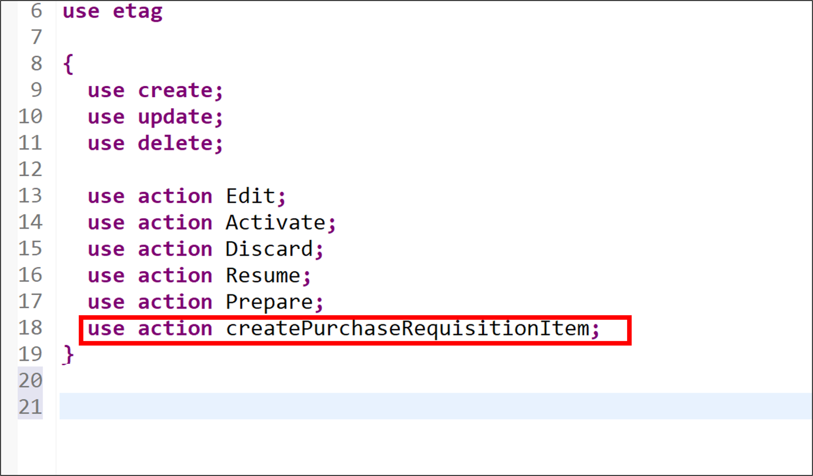

  2. Check your behavior definition:

    ```ABAP
    projection;
    strict ( 2 );
    use draft;

    define behavior for ZC_SHOPCARTTP_### alias ShoppingCart
    use etag
    {
      use create;
      use update;
      use delete;

      use action Edit;
      use action Activate;
      use action Discard;
      use action Resume;
      use action Prepare;
      use action createPurchaseRequisitionItem;
    }
    ```

   3. Save and activate.


### Enhance metadata extension

  1. Open your metadata extension **`ZC_SHOPCARTTP_###`** to enhance it. Add following annotation to `PurchaseRequisition`.

    ```ABAP
      @UI.lineItem: [ {
      position: 70 ,
      label: 'Purchase requisition number',
      importance: #HIGH
    },

    { type: #FOR_ACTION, dataAction: 'createPurchaseRequisitionItem', label: 'Create Purchase Requisition' } ]
    @UI.identification: [ { position: 70, label: 'Purchase Requisition Number' } , { type: #FOR_ACTION, dataAction: 'createPurchaseRequisitionItem', label: 'Create Purchase Requisition' } ]
    PurchaseRequisition;
    ```

    

  2. Check your metadata extension:

    ```ABAP
    @Metadata.layer: #CORE
    @UI: {
      headerInfo: {
        typeName: 'ShoppingCart', 
        typeNamePlural: 'ShoppingCarts'
      , title: {
          type: #STANDARD,
          label: 'ShoppingCart',
          value: 'orderid'
        }
      },
      presentationVariant: [ {
        sortOrder: [ {
          by: 'orderid',
          direction: #DESC
        } ],
        visualizations: [ {
          type: #AS_LINEITEM
        } ]
      } ]
    }
    annotate view ZC_SHOPCARTTP_### with
    {
      @UI.facet: [ {
        id: 'idIdentification', 
        type: #IDENTIFICATION_REFERENCE, 
        label: 'ShoppingCart', 
        position: 10 
      } ]
      @UI.hidden: true
      orderuuid;
      
      @UI.lineItem: [ {
        position: 20 ,
        importance: #HIGH,
        label: 'OrderID'
      } ]
      @UI.identification: [ {
        position: 20 ,
        label: 'OrderID'
      } ]
      @UI.selectionField: [ {
        position: 20
      } ]
      orderid;
      @Consumption.valueHelpDefinition: [{ entity: 
                    {name: 'ZI_PRODUCTS_###' , element: 'Item' },
                    additionalBinding: [{ localElement: 'price', element: 'Price', usage: #RESULT }
                                        ,
                                        { localElement: 'currency', element: 'Currency', usage: #RESULT }
                                        ]
                    }]
      
      @UI.lineItem: [ {
        position: 30 ,
        importance: #HIGH,
        label: 'Ordered Item'
      } ]
      @UI.identification: [ {
        position: 30 ,
        label: 'Ordered Item'
      } ]
      @UI.selectionField: [ {
        position: 30
      } ]
      ordereditem;
      
      @UI.lineItem: [ {
        position: 40 ,
        importance: #HIGH,
        label: 'Price'
      } ]
      @UI.identification: [ {
        position: 40 ,
        label: 'Price'
      } ]
      @UI.selectionField: [ {
        position: 40
      } ]
      price;
      
      @UI.lineItem: [ {
        position: 45 ,
        importance: #HIGH,
        label: 'Total Price'
      } ]
      @UI.identification: [ {
        position: 45 ,
        label: 'Total Price'
      } ]
      @UI.selectionField: [ {
        position: 50
      } ]
      totalprice;
      @Consumption.valueHelpDefinition: [ { entity: { name: 'I_Currency', element: 'Currency' } } ]
      @UI.lineItem: [ {
        position: 50 ,
        importance: #HIGH,
        label: 'currency'
      } ]
      @UI.identification: [ {
        position: 50 ,
        label: 'Currency'
      } ]
      @UI.selectionField: [ {
        position: 60
      } ]
      currency;
      
      @UI.lineItem: [ {
        position: 55 ,
        importance: #HIGH,
        label: 'Ordered Quantity'
      } ]
      @UI.identification: [ {
        position: 55 ,
        label: 'Ordered Quantity'
      } ]
      @UI.selectionField: [ {
        position: 65
      } ]
      orderquantity;
      
      @UI.lineItem: [ {
        position: 60 ,
        importance: #HIGH,
        label: 'Delivery Date'
      } ]
      @UI.identification: [ {
        position: 60 ,
        label: 'Delivery Date'
      } ]
      deliverydate;
      @UI.lineItem: [ {
        position: 65 ,
        importance: #HIGH,
        label: 'Overall Status'
      } ]
      @UI.identification: [ {
        position: 65 ,
        label: 'Overall Status'
      } ]
      overallstatus;
    @UI.lineItem: [ {
        position: 70 ,
        importance: #HIGH,
        label: 'Notes'
      } ]
      @UI.identification: [ {
        position: 70 ,
        label: 'Notes'
      } ]
      notes;
      
      @UI.hidden: true
      locallastchangedat;
      
      @UI.lineItem: [ {
        position: 70 ,
        label: 'Purchase requisition number',
        importance: #HIGH
      },

      { type: #FOR_ACTION, dataAction: 'createPurchaseRequisitionItem', label: 'Create Purchase Requisition Item' } ]
      @UI.identification: [ { position: 70, label: 'Purchase Requisition Number' } , { type: #FOR_ACTION, dataAction: 'createPurchaseRequisitionItem', label: 'Create Purchase Requisition Item' } ]
      purchaserequisition;
      
      @UI.lineItem: [ {
        position: 75 ,
        importance: #HIGH,
        label: 'PR Creation Date'
      } ]
      @UI.identification: [ {
        position: 75 ,
        label: 'PR Creation Date'
      } ]
      prcreationdate;
    }
    ```

   3. Save and activate.
 
### Implement unmanaged save and save_modified

In our scenario, we want to integrate the released purchase requisition API during the save sequence.

  1. Open the behavior definition `ZR_SHOPCARTTP_###`, delete the following line:
  
    ```ABAP
    persistent table zashopcart_### 
    ```
  
  2. In your behavior definition **`ZR_SHOPCARTTP_###`** add the `with unmanaged save` statement.

    ```ABAP
    with unmanaged save
    ```
    So that it looks as follows:

    ```ABAP
    managed implementation in class ZBP_SHOPCARTTP_### unique;
    strict ( 2 );
    with draft;

    define behavior for ZR_SHOPCARTTP_### alias ShoppingCart
    draft table ZDSHOPCART_###
    etag master LocalLastChangedAt
    lock master total etag LastChangedAt
    authorization master( global )
    with unmanaged save
    {
      field ( readonly )
      OrderUUID,
      CreatedAt,
      CreatedBy,
      LastChangedAt,
      LastChangedBy,
      LocalLastChangedAt,
      PurchaseRequisition,
      PrCreationDate,
      DeliveryDate;

      field ( numbering : managed )
      OrderUUID;

      create;
      update(features: instance) ;
      delete;

      draft action(features: instance) Edit;
      draft action Activate;
      draft action Discard;
      draft action Resume;
      draft determine action Prepare { validation checkOrderedQuantity;  validation checkDeliveryDate;}
        determination setInitialOrderValues on modify { create; }
        determination calculateTotalPrice on modify { create; field Price; }
      validation checkOrderedQuantity on save { create; field OrderQuantity; }
      validation checkDeliveryDate on save { create; field DeliveryDate; }

      validation checkPurchaseRequisition on save { field OverallStatus; }
      action ( features : instance ) createPurchaseRequisitionItem result [1] $self;

      mapping for ZASHOPCART_###
      {
        OrderUUID = order_uuid;
        OrderID = order_id;
        OrderedItem = ordered_item;
        Price = price;
        TotalPrice = total_price;
        Currency = currency;
        OrderQuantity = order_quantity;
        DeliveryDate = delivery_date;
        OverallStatus = overall_status;
        Notes = notes;
        CreatedBy = created_by;
        CreatedAt = created_at;
        LastChangedBy = last_changed_by;
        LastChangedAt = last_changed_at;
        LocalLastChangedAt = local_last_changed_at;
        PurchaseRequisition = purchase_requisition;
        PrCreationDate = pr_creation_date;
      }
    }
    ```

  3. Save and activate it. Position the cursor on the with unmanaged save statement and use the shortcut `ctrl + 1` to load the quick assist proposals, then double-click on Add required method `save_modified` in new local saver class to automatically create an empty implementation for the method. Implement it as follows:

    ```ABAP
    METHOD save_modified.
      DATA : lt_shopping_cart_as        TYPE STANDARD TABLE OF zashopcart_###.
      IF create-shoppingcart IS NOT INITIAL.
        lt_shopping_cart_as = CORRESPONDING #( create-shoppingcart MAPPING FROM ENTITY ).
        INSERT zashopcart_### FROM TABLE @lt_shopping_cart_as.
      ENDIF.
      IF update IS NOT INITIAL.
        CLEAR lt_shopping_cart_as.
        lt_shopping_cart_as = CORRESPONDING #( update-shoppingcart MAPPING FROM ENTITY ).
        LOOP AT update-shoppingcart  INTO DATA(shoppingcart) WHERE OrderUUID IS NOT INITIAL.
          MODIFY zashopcart_### FROM TABLE @lt_shopping_cart_as.
        ENDLOOP.
      ENDIF.

      IF update IS NOT INITIAL.
        DATA(creation_date) = cl_abap_context_info=>get_system_date(  ).

        LOOP AT update-shoppingcart INTO DATA(OnlineOrder1) WHERE %control-OverallStatus = if_abap_behv=>mk-on .
          LOOP AT zbp_shopcarttp_###=>purchase_requisition_details INTO DATA(purchase_reqn_via_eml) WHERE  pid IS NOT INITIAL AND order_uuid = onlineorder1-OrderUUID.
            CONVERT KEY OF i_purchaserequisitiontp FROM purchase_reqn_via_eml-pid TO DATA(ls_pr_key1).
            UPDATE zashopcart_### SET purchase_requisition = @ls_pr_key1-PurchaseRequisition,
                                          pr_creation_date = @creation_date
                                          WHERE order_uuid = @purchase_reqn_via_eml-Order_UUID.
          ENDLOOP.
        ENDLOOP.
      ENDIF.

      LOOP AT delete-shoppingcart INTO DATA(shoppingcart_delete) WHERE OrderUUID IS NOT INITIAL.
        DELETE FROM zashopcart_### WHERE order_uuid = @shoppingcart_delete-OrderUUID.
        DELETE FROM zdshopcart_### WHERE orderuuid = @shoppingcart_delete-OrderUUID.
      ENDLOOP.
    ENDMETHOD.
    ```

   4. Save, don't activate it yet!

>We use the unmanaged save option for our scenario, rather than the additional save option. This is because the additional save should only be used in case data needs to be saved in addition to BO data in a persistence outside the BO, as stated in the [Additional Save documentation](https://help.sap.com/docs/SAP_S4HANA_CLOUD/e5522a8a7b174979913c99268bc03f1a/ca7097c8ea404b11b1f1334fd54cdd15.html). Since this is not our use case (the purchase requisition is created and saved in the persistency of the shopping cart BO), we rely on the unmanaged save option.


### Enhance behavior implementation

**Hint:** Please replace **`###`** with your ID. 

**For S/4HANA on premise:** Material `D001` or similar needs to be created in system if S/4HANA on-premise is used. [More information](https://help.sap.com/docs/SAP_S4HANA_ON-PREMISE/f7fddfe4caca43dd967ac4c9ce6a70e4/23d6b8535c39b44ce10000000a174cb4.html?version=2022.000)


  1. In your **Global Class**, replace your code with following:

    ```ABAP
    class ZBP_SHOPCARTTP_### definition
      public
      abstract
      final
      for behavior of ZR_SHOPCARTTP_### .
    public section.
    TYPES: BEGIN OF ty_pr_details,
                pid        TYPE abp_behv_pid,
                cid        TYPE abp_behv_cid,
                pur_req    TYPE zashopcart_###-purchase_requisition,
                order_uuid TYPE zashopcart_###-order_uuid,
              END OF ty_pr_details.
        CLASS-DATA purchase_requisition_details TYPE TABLE OF ty_pr_details.
    protected section.
    private section.
    ENDCLASS.

    ***

    CLASS ZBP_SHOPCARTTP_### IMPLEMENTATION.
    ENDCLASS.
    ```

  2. Add the missing constant to your implementation, the `createPurchaseRequisitionItem` action and enhance the `save_modified` method. In your **Local Types**, replace your code with following:

    ```ABAP
    CLASS lsc_zr_shopcarttp_### DEFINITION INHERITING FROM cl_abap_behavior_saver.

      PROTECTED SECTION.

        METHODS save_modified REDEFINITION.

    ENDCLASS.

    CLASS lsc_zr_shopcarttp_### IMPLEMENTATION.

      METHOD save_modified.
        DATA : lt_shopping_cart_as        TYPE STANDARD TABLE OF zashopcart_###.
        IF create-shoppingcart IS NOT INITIAL.
          lt_shopping_cart_as = CORRESPONDING #( create-shoppingcart MAPPING FROM ENTITY ).
          INSERT zashopcart_### FROM TABLE @lt_shopping_cart_as.
        ENDIF.
        IF update IS NOT INITIAL.
          CLEAR lt_shopping_cart_as.
          lt_shopping_cart_as = CORRESPONDING #( update-shoppingcart MAPPING FROM ENTITY ).
          LOOP AT update-shoppingcart  INTO DATA(shoppingcart) WHERE OrderUUID IS NOT INITIAL.
            MODIFY zashopcart_### FROM TABLE @lt_shopping_cart_as.
          ENDLOOP.
        ENDIF.

    *************Add CONVERT KEY statement for Purchase Requisition create in case of EML implementation type**********

      IF update IS NOT INITIAL.
          DATA(creation_date) = cl_abap_context_info=>get_system_date(  ).

          LOOP AT update-shoppingcart INTO DATA(OnlineOrder1) WHERE %control-OverallStatus = if_abap_behv=>mk-on .
            LOOP AT zbp_shopcarttp_###=>purchase_requisition_details INTO DATA(purchase_reqn_via_eml) WHERE  pid IS NOT INITIAL AND order_uuid = onlineorder1-OrderUUID.
              CONVERT KEY OF i_purchaserequisitiontp FROM purchase_reqn_via_eml-pid TO DATA(ls_pr_key1).
              UPDATE zashopcart_### SET purchase_requisition = @ls_pr_key1-PurchaseRequisition,
                                            pr_creation_date = @creation_date
                                            WHERE order_uuid = @purchase_reqn_via_eml-Order_UUID.
            ENDLOOP.
          ENDLOOP.
        ENDIF.
    ************END of CONVER KEY EML code snippet******************

        LOOP AT delete-shoppingcart INTO DATA(shoppingcart_delete) WHERE OrderUUID IS NOT INITIAL.
          DELETE FROM zashopcart_### WHERE order_uuid = @shoppingcart_delete-OrderUUID.
          DELETE FROM zdshopcart_### WHERE orderuuid = @shoppingcart_delete-OrderUUID.
        ENDLOOP.
      ENDMETHOD.

    ENDCLASS.

    CLASS lhc_shopcart DEFINITION INHERITING FROM cl_abap_behavior_handler.
      PRIVATE SECTION.
        CONSTANTS:
          BEGIN OF c_overall_status,
            new       TYPE string VALUE 'New / Composing',
            submitted TYPE string VALUE 'Submitted / Approved',
            cancelled TYPE string VALUE 'Cancelled',
          END OF c_overall_status.
        METHODS:
          get_global_authorizations FOR GLOBAL AUTHORIZATION
            IMPORTING
            REQUEST requested_authorizations FOR ShoppingCart
            RESULT result,
          get_instance_features FOR INSTANCE FEATURES
            IMPORTING keys REQUEST requested_features FOR ShoppingCart RESULT result.

        METHODS calculateTotalPrice FOR DETERMINE ON MODIFY
          IMPORTING keys FOR ShoppingCart~calculateTotalPrice.

        METHODS setInitialOrderValues FOR DETERMINE ON MODIFY
          IMPORTING keys FOR ShoppingCart~setInitialOrderValues.

        METHODS checkDeliveryDate FOR VALIDATE ON SAVE
          IMPORTING keys FOR ShoppingCart~checkDeliveryDate.

        METHODS checkOrderedQuantity FOR VALIDATE ON SAVE
          IMPORTING keys FOR ShoppingCart~checkOrderedQuantity.

        METHODS createPurchaseRequisitionItem FOR MODIFY
          IMPORTING keys FOR ACTION ShoppingCart~createPurchaseRequisitionItem RESULT result.

        METHODS checkPurchaseRequisition FOR VALIDATE ON SAVE
          IMPORTING keys FOR ShoppingCart~checkPurchaseRequisition.

    ENDCLASS.

    CLASS lhc_shopcart IMPLEMENTATION.

      METHOD get_global_authorizations.
      ENDMETHOD.

      METHOD get_instance_features.
        " read relevant olineShop instance data
        READ ENTITIES OF zr_shopcarttp_### IN LOCAL MODE
          ENTITY ShoppingCart
            FIELDS ( OverallStatus )
            WITH CORRESPONDING #( keys )
          RESULT DATA(OnlineOrders)
          FAILED failed.

        " evaluate condition, set operation state, and set result parameter
        " update and checkout shall not be allowed as soon as purchase requisition has been created
        result = VALUE #( FOR OnlineOrder IN OnlineOrders
                          ( %tky                   = OnlineOrder-%tky
                            %features-%update
                              = COND #( WHEN OnlineOrder-OverallStatus = c_overall_status-submitted  THEN if_abap_behv=>fc-o-disabled
                                        WHEN OnlineOrder-OverallStatus = c_overall_status-cancelled THEN if_abap_behv=>fc-o-disabled
                                        ELSE if_abap_behv=>fc-o-enabled   )
                            %action-Edit
                              = COND #( WHEN OnlineOrder-OverallStatus = c_overall_status-submitted THEN if_abap_behv=>fc-o-disabled
                                        WHEN OnlineOrder-OverallStatus = c_overall_status-cancelled THEN if_abap_behv=>fc-o-disabled
                                        ELSE if_abap_behv=>fc-o-enabled   )
                            %action-createPurchaseRequisitionItem
                              = COND #( WHEN OnlineOrder-OverallStatus = c_overall_status-submitted OR OnlineOrder-%is_draft = if_abap_behv=>mk-on
                                        THEN if_abap_behv=>fc-o-disabled
                                        ELSE if_abap_behv=>fc-o-enabled )
                            ) ).
      ENDMETHOD.

      METHOD calculateTotalPrice.
        " read transfered instances
        READ ENTITIES OF zr_shopcarttp_### IN LOCAL MODE
          ENTITY ShoppingCart
            FIELDS ( OrderID TotalPrice Price OrderQuantity )
            WITH CORRESPONDING #( keys )
          RESULT DATA(OnlineOrders).

        LOOP AT OnlineOrders ASSIGNING FIELD-SYMBOL(<OnlineOrder>).
          " calculate total value
          <OnlineOrder>-TotalPrice = <OnlineOrder>-Price * <OnlineOrder>-OrderQuantity.
        ENDLOOP.

        "update instances
        MODIFY ENTITIES OF zr_shopcarttp_### IN LOCAL MODE
          ENTITY ShoppingCart
            UPDATE FIELDS ( TotalPrice )
            WITH VALUE #( FOR OnlineOrder IN OnlineOrders (
                              %tky       = OnlineOrder-%tky
                              TotalPrice = <OnlineOrder>-TotalPrice
                            ) ).
      ENDMETHOD.

      METHOD setInitialOrderValues.
        DATA delivery_date TYPE I_PurchaseReqnItemTP-DeliveryDate.
        DATA(creation_date) = cl_abap_context_info=>get_system_date(  ).
        "set delivery date proposal
        delivery_date = cl_abap_context_info=>get_system_date(  ) + 14.
        "read transfered instances
        READ ENTITIES OF ZR_shopcarttp_### IN LOCAL MODE
          ENTITY ShoppingCart
            FIELDS ( OrderID OverallStatus  DeliveryDate OrderQuantity  )
            WITH CORRESPONDING #( keys )
          RESULT DATA(OnlineOrders).

        "delete entries with assigned order ID
        DELETE OnlineOrders WHERE OrderID IS NOT INITIAL.
        CHECK OnlineOrders IS NOT INITIAL.

        " **Dummy logic to determine order IDs**
        " get max order ID from the relevant active and draft table entries
        SELECT MAX( order_id ) FROM zashopcart_### INTO @DATA(max_order_id). "active table
        SELECT SINGLE FROM zdshopcart_### FIELDS MAX( orderid ) INTO @DATA(max_orderid_draft). "draft table
        IF max_orderid_draft > max_order_id.
          max_order_id = max_orderid_draft.
        ENDIF.

        "set initial values of new instances
        MODIFY ENTITIES OF zr_shopcarttp_### IN LOCAL MODE
          ENTITY ShoppingCart
            UPDATE FIELDS ( OrderID OverallStatus  DeliveryDate   )
            WITH VALUE #( FOR order IN OnlineOrders INDEX INTO i (
                              %tky          = order-%tky
                              OrderID       = max_order_id + i
                              OverallStatus = c_overall_status-new  "'New / Composing'
    *                          Price         = COND #( WHEN order-OrderedItem = 'desktop' then 1500
    *                                                  when order-OrderedItem = 'laptop' then  2### )

                              DeliveryDate  = delivery_date
                              CreatedAt     = creation_date
                            ) ).
      ENDMETHOD.

      METHOD checkDeliveryDate.
    *   " read transfered instances
        READ ENTITIES OF zr_shopcarttp_### IN LOCAL MODE
          ENTITY ShoppingCart
            FIELDS ( DeliveryDate )
            WITH CORRESPONDING #( keys )
          RESULT DATA(OnlineOrders).

        DATA(creation_date) = cl_abap_context_info=>get_system_date(  ).
        "raise msg if 0 > qty <= 10
        LOOP AT OnlineOrders INTO DATA(online_order).
          IF online_order-DeliveryDate IS INITIAL OR online_order-DeliveryDate = ' '.
            APPEND VALUE #( %tky = online_order-%tky ) TO failed-ShoppingCart.
            APPEND VALUE #( %tky         = online_order-%tky
                            %state_area   = 'VALIDATE_DELIVERYDATE'
                            %msg          = new_message_with_text(
                                    severity = if_abap_behv_message=>severity-error
                                    text     = 'Delivery Date cannot be initial' )
                          ) TO reported-ShoppingCart.

          ELSEIF  ( ( online_order-DeliveryDate ) - creation_date ) < 14.
            APPEND VALUE #(  %tky = online_order-%tky ) TO failed-ShoppingCart.
            APPEND VALUE #(  %tky          = online_order-%tky
                            %state_area   = 'VALIDATE_DELIVERYDATE'
                            %msg          = new_message_with_text(
                                    severity = if_abap_behv_message=>severity-error
                                    text     = 'Delivery Date should be atleast 14 days after the creation date'  )

                            %element-orderquantity  = if_abap_behv=>mk-on
                          ) TO reported-ShoppingCart.
          ENDIF.
        ENDLOOP.
      ENDMETHOD.

      METHOD checkOrderedQuantity.
        "read relevant order instance data
        READ ENTITIES OF zr_shopcarttp_### IN LOCAL MODE
        ENTITY ShoppingCart
        FIELDS ( OrderID OrderedItem OrderQuantity )
        WITH CORRESPONDING #( keys )
        RESULT DATA(OnlineOrders).

        "raise msg if 0 > qty <= 10
        LOOP AT OnlineOrders INTO DATA(OnlineOrder).
          APPEND VALUE #(  %tky           = OnlineOrder-%tky
                          %state_area    = 'VALIDATE_QUANTITY'
                        ) TO reported-ShoppingCart.

          IF OnlineOrder-OrderQuantity IS INITIAL OR OnlineOrder-OrderQuantity = ' '.
            APPEND VALUE #( %tky = OnlineOrder-%tky ) TO failed-ShoppingCart.
            APPEND VALUE #( %tky          = OnlineOrder-%tky
                            %state_area   = 'VALIDATE_QUANTITY'
                            %msg          = new_message_with_text(
                                    severity = if_abap_behv_message=>severity-error
                                    text     = 'Quantity cannot be empty' )
                            %element-orderquantity = if_abap_behv=>mk-on
                          ) TO reported-ShoppingCart.

          ELSEIF OnlineOrder-OrderQuantity > 10.
            APPEND VALUE #(  %tky = OnlineOrder-%tky ) TO failed-ShoppingCart.
            APPEND VALUE #(  %tky          = OnlineOrder-%tky
                            %state_area   = 'VALIDATE_QUANTITY'
                            %msg          = new_message_with_text(
                                    severity = if_abap_behv_message=>severity-error
                                    text     = 'Quantity should be below 10' )

                            %element-orderquantity  = if_abap_behv=>mk-on
                          ) TO reported-ShoppingCart.
          ENDIF.
        ENDLOOP.
      ENDMETHOD.

      METHOD createpurchaserequisitionitem.
        READ ENTITIES OF zr_shopcarttp_### IN LOCAL MODE
        ENTITY ShoppingCart
          ALL FIELDS WITH
          CORRESPONDING #( keys )
        RESULT DATA(OnlineOrders).
    ***Integrate EML statement for Purchase Requisition create in case of released API implementation scenario ************
    ***Begin of Code Snippet********
        DATA: purchase_requisitions      TYPE TABLE FOR CREATE I_PurchaserequisitionTP,
              purchase_requisition       TYPE STRUCTURE FOR CREATE I_PurchaserequisitionTP,
              purchase_requisition_items TYPE TABLE FOR CREATE i_purchaserequisitionTP\_PurchaseRequisitionItem,
              purchase_requisition_item  TYPE STRUCTURE FOR CREATE i_purchaserequisitiontp\\purchaserequisition\_purchaserequisitionitem,
              delivery_date              TYPE I_PurchaseReqnItemTP-DeliveryDate,
              n                          TYPE i.
        LOOP AT onlineorders INTO DATA(onlineorder) WHERE OverallStatus = c_overall_status-new .
    *   SQL statement to include product and productgroup
          SELECT SINGLE FROM zi_products_### FIELDS product, productgroup WHERE ProductText = @onlineorder-OrderedItem INTO @DATA(productdata) .
    *
    *      delivery_date = cl_abap_context_info=>get_system_date(  ) .
          delivery_date = cl_abap_context_info=>get_system_date(  ) + 14 .
          n += 1.
          "purchase requisition
          DATA(cid) = onlineorder-OrderID && '_' && n.
          purchase_requisition = VALUE #(   %cid                      = cid
                                            purchaserequisitiontype   = 'NB'  ) .
          APPEND purchase_requisition TO purchase_requisitions.

          "purchase requisition item
          purchase_requisition_item = VALUE #(
                                            %cid_ref = cid
                                            %target  = VALUE #(  (
                                                          %cid                         = |My%ItemCID_{ n }|
                                                          plant                        = '1010'  "Plant 01 (DE)
                                                          accountassignmentcategory    = 'U'  "unknown
    *                                                       PurchaseRequisitionItemText =  . "retrieved automatically from maintained MaterialInfo
                                                          requestedquantity            = onlineorder-OrderQuantity
                                                          purchaserequisitionprice     = onlineorder-Price
                                                          purreqnitemcurrency          = onlineorder-Currency
                                                          Material                     = productdata-Product

                                                          materialgroup               = productdata-Productgroup
    *                                                        Material                  = 'laptop'
    *                                                       materialgroup              = 'system'
                                                          purchasinggroup             = '001'
    *                                                       purchasingorganization     = '1010'
                                                          DeliveryDate                = delivery_date   "delivery_date  "yyyy-mm-dd (at least 10 days)
                                                          CreatedByUser               = OnlineOrder-CreatedBy
                                                          ) ) ).
          APPEND purchase_requisition_item TO purchase_requisition_items.
        ENDLOOP.
        IF keys IS NOT INITIAL .
          "purchase requisition
          MODIFY ENTITIES OF i_purchaserequisitiontp
            ENTITY purchaserequisition
              CREATE FIELDS ( purchaserequisitiontype )
              WITH purchase_requisitions
            "purchase requisition item
            CREATE BY \_purchaserequisitionitem
              FIELDS ( plant
    *                  purchaserequisitionitemtext
                      accountassignmentcategory
                      requestedquantity
                      baseunit
                      purchaserequisitionprice
                      purreqnitemcurrency
                      Material
                      materialgroup
                      purchasinggroup
                      purchasingorganization
                      DeliveryDate

                    )
            WITH purchase_requisition_items
          REPORTED DATA(reported_create_pr)
          MAPPED DATA(mapped_create_pr)
          FAILED DATA(failed_create_pr).
          READ ENTITIES OF I_PurchaseRequisitionTP
          ENTITY PurchaseRequisition
          ALL FIELDS WITH CORRESPONDING #( mapped_create_pr-purchaserequisition )
          RESULT DATA(pr_result)
          FAILED DATA(pr_failed)
          REPORTED DATA(pr_reported).
        ENDIF.

        IF mapped_create_pr IS NOT INITIAL.
          LOOP AT onlineorders INTO DATA(onlineorder1) WHERE OverallStatus = c_overall_status-new .
            LOOP AT mapped_create_pr-purchaserequisition INTO DATA(purchaserequisition_details)   .
              IF onlineorder1-OrderID = substring_before( val = purchaserequisition_details-%cid sub = '_' ).

                APPEND VALUE #( cid                = purchaserequisition_details-%cid
                                pid                = purchaserequisition_details-%pid
                                order_uuid         = onlineorder1-OrderuuID  ) TO zbp_shopcarttp_###=>purchase_requisition_details .
                DELETE ADJACENT DUPLICATES FROM zbp_shopcarttp_###=>purchase_requisition_details COMPARING pid.
              ENDIF.
            ENDLOOP.
          ENDLOOP.
        ENDIF.
    ***End of EML Code Snippet********

        MODIFY ENTITIES OF zr_shopcarttp_### IN LOCAL MODE
          ENTITY ShoppingCart
              UPDATE FIELDS ( OverallStatus )
                WITH VALUE #( FOR key IN keys (
                  OrderUUID = key-OrderUUID
                  OverallStatus = c_overall_status-submitted
              ) ).

        "Read the changed data for action result
        READ ENTITIES OF zr_shopcarttp_### IN LOCAL MODE
          ENTITY ShoppingCart
            ALL FIELDS WITH
            CORRESPONDING #( keys )
          RESULT DATA(result_read).
        "return result entities
        result = VALUE #( FOR result_order IN result_read ( %tky   = result_order-%tky
                                                            %param = result_order ) ).

      ENDMETHOD.

      METHOD checkpurchaserequisition.
      ENDMETHOD.

    ENDCLASS.
    ```

   3. Save and activate.

    >**HINT:** The option **internal** can be set before the action name to only provide an action for the same BO. An internal action can only be accessed from the business logic inside the business object implementation such as from a determination or from another action.

   4. Go back to your behavior definition `ZR_SHOPCARTTP_###` and activate it again, if needed.

### Open documentation

You have 2 options to open the documentation inside ADT.

> **Option 1**:

>  1. Open your ABAP class **`zbp_shopcarttp_###`**, search for `i_purchaserequisitiontp`, press CTRL and click on it.
      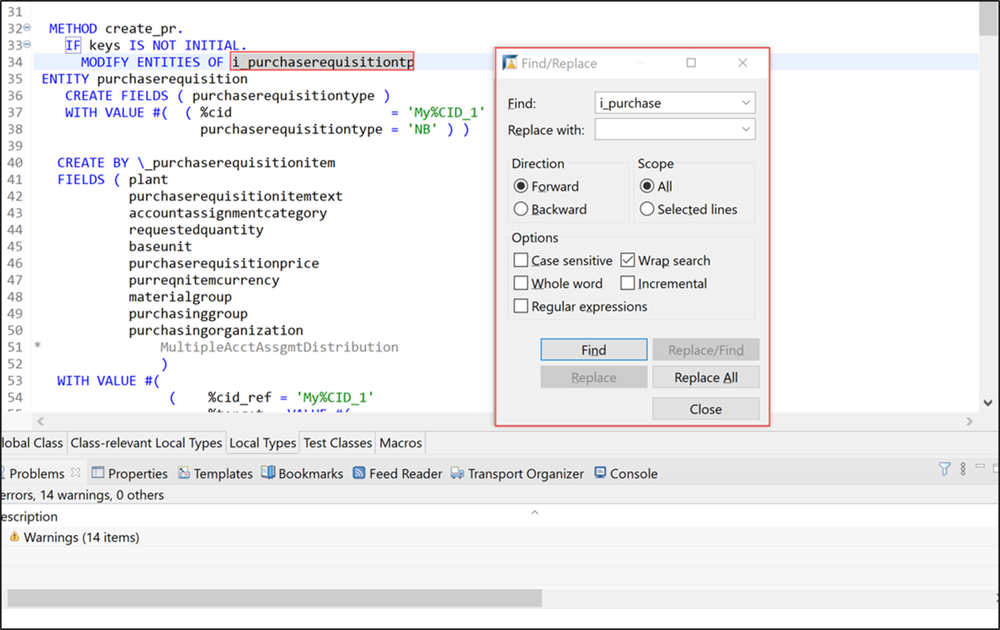
>  2. Now you are in the released object `i_purchaserequisitiontp`.
     Click **Open Documentation** to open it.
      
>  3. Now you are able to read the documentation.
      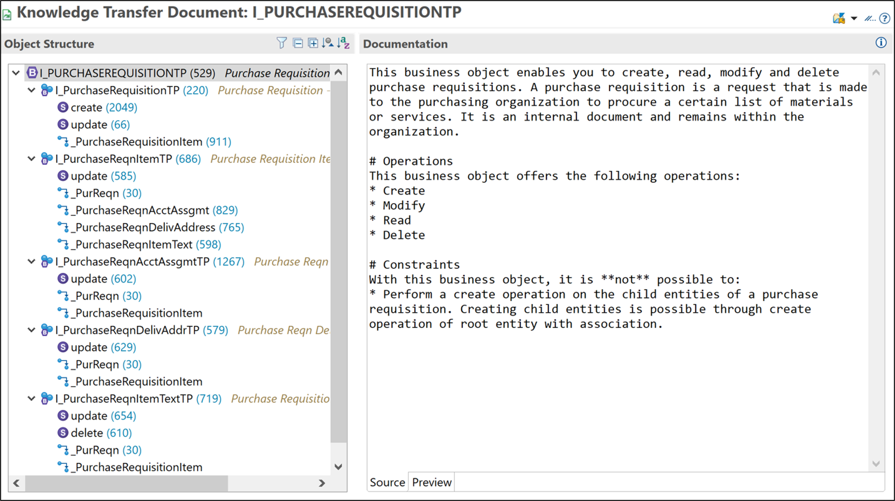
> **HINT:** You can also open the Element Info by clicking `i_purchaserequisitiontp` and pressing **`F2`**.
  > 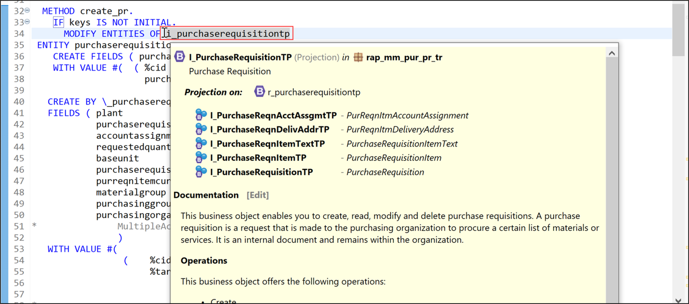
> You can also switch to different layers inside the Element Info.  
  > 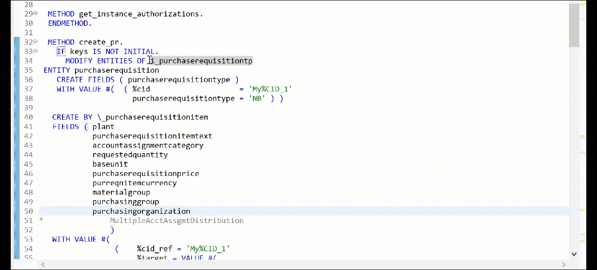

> **Option 2**:

> 1. Go back to tab `i_purchaserequisitiontp`. You are now able to see the behavior definition folder of the released object `i_purchaserequisitiontp`  in the project explorer. Now navigate to the documentation `i_purchaserequisitiontp` and open it.
      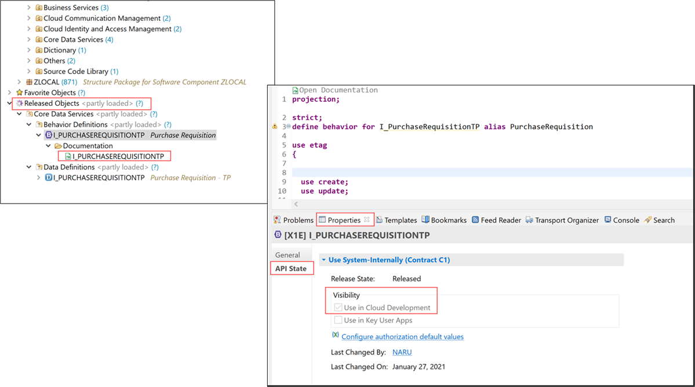
>**HINT**: You can also check the API State of released object and see its visibility by selecting the properties.
> 2. Now you can see the documentation.
      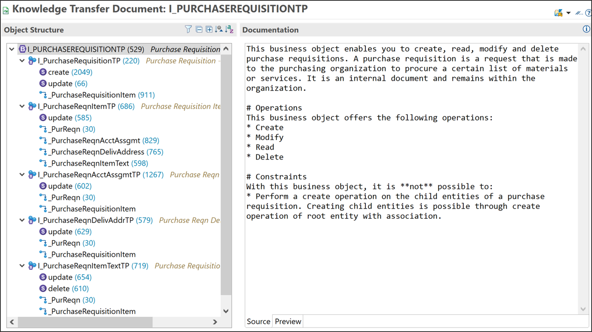

### Run SAP Fiori Elements preview

 1. Open the SAP Fiori preview, select your order entry and click **Create purchase requisition item**.

     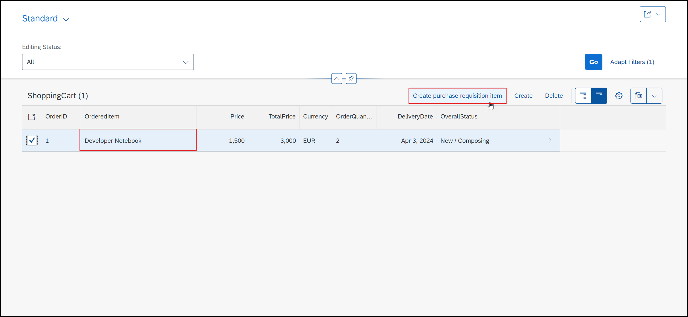

 2. Now a purchase requisition item got created. Copy the purchase requisition item number for later use.

     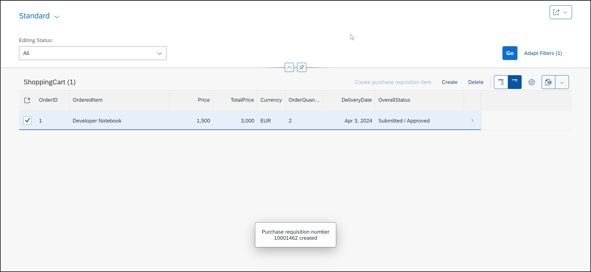
 


### Check purchase requisition


 1. In the Project Explorer, select your system and right click on **Properties**.
 
     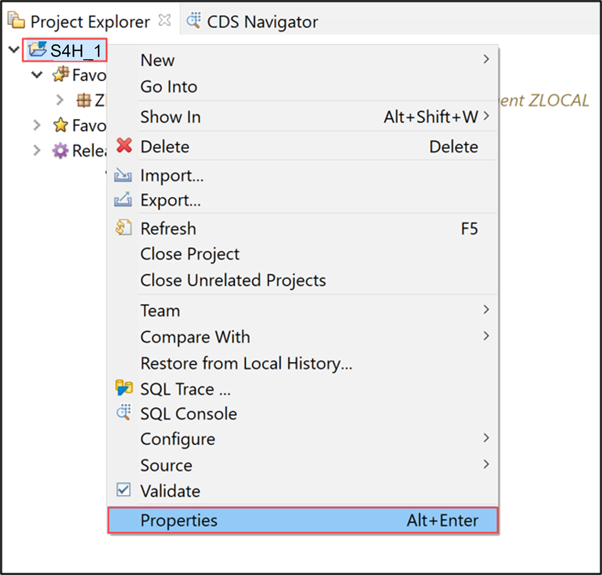

 1. Select **ABAP Development** and copy the system URL without `-api`, paste it in a browser and **log in**.

     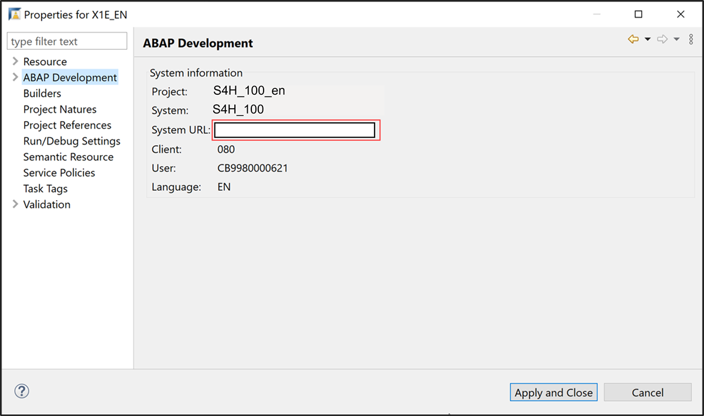

 2. Select the **Manage Purchase Requisitions** tile.

     

 3. Search for your purchase requisition id and select your purchase requisition. 

     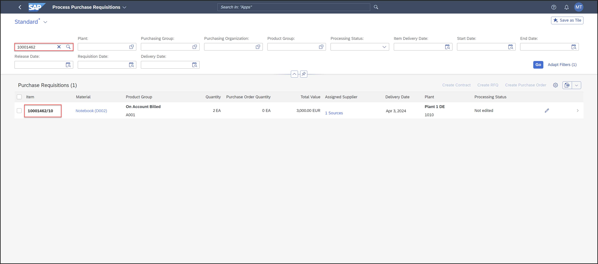


### Test yourself
