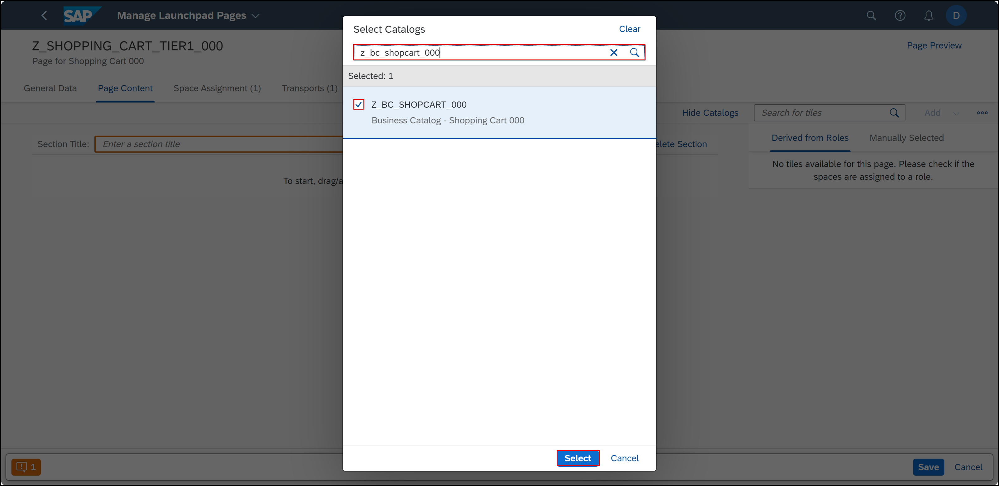

### Create a semantic object

  1.  Open **SAP Logon** and log into your system. Execute following transaction to create a semantic object **`/ui2/semobj`**. You also need to add **`/n`** before your transaction.

      

  2. Click **Edit** and select the check mark.

      

  3. Click **New Entries**.

      

  4. Add your **semantic object**:
     - Semantic Object: **`z_shopping_cart_tier1_###`** 
     - Semantic Object Name: **`z_shopping_cart_tier1_###`** 
     - Semantic Object Description: Shopping Cart ###
     
      Click **Save**.
   
       

  5. Select and confirm your transport request.
   
       

### Create SAP Fiori business catalog 

Find here the documentation on [Best Practices for Managing Catalogs](https://help.sap.com/docs/SAP%20Fiori%20launchpad/d4650bf68a9f4f67a1fda673f09926a9/af35d42e7d4f49d7b8e46080cd01c299.html?version=753.04).
 
In this step, you will create a business catalog. The SAP Fiori business catalog is client-dependent, so it is part of the customizing. 

  1. Execute following transaction to create a business catalog **`/ui2/flpcm_cust`**. You also need to add **`/n`** before your transaction.

      

  2. Search for technical catalog **`SAP_TC_UI5_REPO_UIAD`** and press **Go** to check the existing content.  
   
      

  3. Now you can see the existing content of generic technical catalog `SAP_TC_UI5_REPO_UIAD`. During UI deployment automatically an app descriptor item was created and assigned to this technical catalog. Click **Create** to create a new business catalog.

      
 
  4. Create a **new catalog**:
     - New ID: **`z_bc_shopcart_###`**
     - New Title: Business Catalog - Shopping Cart ###

      

      Select your transport request and description. Select the check mark.

    > **Hint**: The business catalog has the naming convention `BC`.

  5. Click **Add Tiles/Target Mappings** and select **`Add Tiles/TMs to Selected Catalog`**.

      

  6. Search for **`z_shopping_cart_tier1_###`**, press **Go**, select your entry and click **Add Tile/TM Reference**.
   
       

  7. Check your result.
   
      

### Create a business role and assign business catalog and business user

  1. Execute following transaction to create a business role and assign it to your user **`pfcg`**. 

         

  2. Enter **`Z_BR_SHOPCART_###`** as Role and click **Single Role**.

      

  3. Enter a description and click **Save**.

      

  4. Navigate to **Menu** and select **Transaction** > **SAP Fiori Launchpad** > **Launchpad Catalog**.

      

  5. Enter **`Z_BC_SHOPCART_###`** as Catalog ID, select the check mark and click save.

      

  6. Navigate to **Authorization** and select the edit icon for **Change Authorization Data**.

      

  7. Click the icon.

      

  8. Select the check mark.
   
      

  9. Go back.

      

 1.  Navigate to **User**, enter your user, click **Save** and click **User Comparison**.

      

### Run application via app finder

  1. Execute following transaction to run an app from SAP Fiori Launchpad **`/ui2/flp`**. You also need to add **`/n`** before your transaction.

     
    
  2. Log in with the user you assigned the business role `Z_BR_SHOPCART_###` to.

     

  3. Click your user on the top right corner and select **App Finder**.

     

  4. Search for **Shopping Cart ###** and press the + symbol.

     

  5. Select **My Home** to add your application to the my home page.

     

  6. Go to your home page and now you can see your application. Click your application and check your result.
   
     

### Create a space and page 
 
  1. Execute following transaction to create spaces and pages **`/ui2/flp`**. You also need to add **`/n`** before your transaction.

         

  2. Search **Manage Launchpad Spaces** and select it.
   
      

  3. Click **Create**.
 
       

  4. Create a **new space and page**:
     - Space ID: **`z_shopping_cart_tier1_###`**
     - Space Description: Space for Shopping Cart ### 
     - Space Title: Shopping Cart ### 
     - Check mark **Also create a page**
     - Page ID: **`z_shopping_cart_tier1_###`**
     - Page Description: Page for Shopping Cart ### 
     - Page Title: Shopping Cart ### 

      

      Select your transport request and click **Create** and assign your transport request.

  5. Click **Save**.
   
      

  6. Navigate to your page `z_shopping_cart_tier1_###`.

      

  7. Inside your page **`z_shopping_cart_tier1_###`** click **Edit** to add your page content.
   
      

 
  8. Select the menu and click **Select Catalogs**.
   
      

  9. Search for your catalog **`z_bc_shopcart_###`**, select it and click **Select**.

      

 10. Select your business catalog **`z_bc_shopcart_###`** and click **Add**.

      

 11. Enter the section title: **Shopping Cart Section** and click **Save**.

      

### Add space to business role

  1. Execute following transaction **`pfcg`** to open your business role and add the newly created space and page to it.

         

  2. Enter **`Z_BR_SHOPCART_###`** as Role and click the edit symbol.

      

  3. Go back and navigate to **Menu** again. Select the **arrow** > **SAP Fiori Launchpad** > **Launchpad Space**. 

      

  4. Enter **`Z_SHOPPING_CART_TIER1_###`** as Space ID and select the check mark.
   
      

  5. Add a description and click **Save**.
   
      

 
### Run an app from FLP

  1. Execute following transaction to run an app from SAP Fiori Launchpad **`/ui2/flp`**. You also need to add **`/n`** before your transaction.

     
    
  2. Navigate to **Shopping Cart ###** and select your tile to check your result.

     

### Test yourself

### More information

Find here the documentation on [SAP Fiori Launchpad](https://help.sap.com/docs/SAP_FIORI_LAUNCHPAD).