### Create a semantic object

  1.  Open **SAP Logon** and log into your system. Execute following transaction to create a semantic object **`/ui2/semobj`**. You also need to add **`/n`** before your transaction.

      

  2. Click **Edit** and select the check mark.

      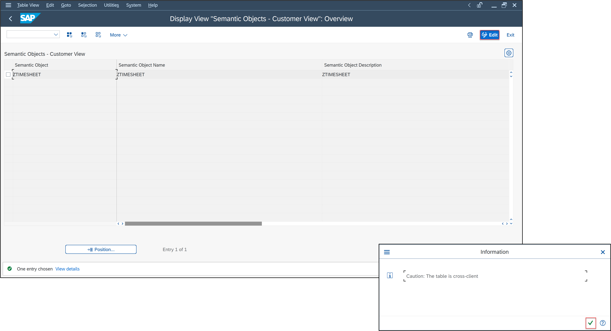

  3. Click **New Entries**.

      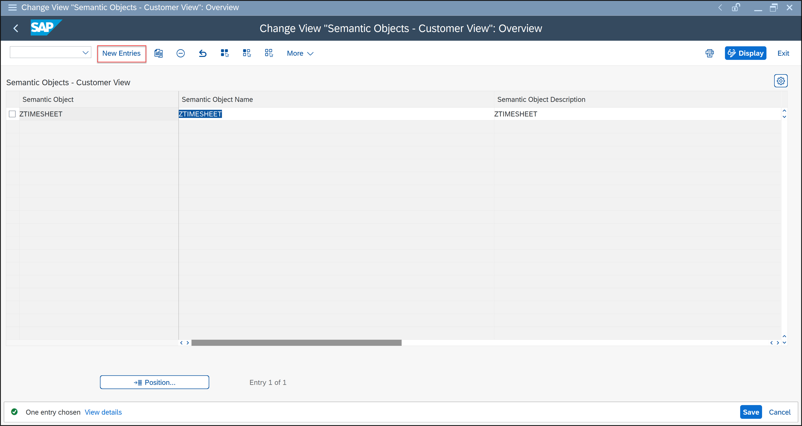

  4. Add your **semantic object**:
     - Semantic Object: **`z_purchase_req_tier3_xxx`** 
     - Semantic Object Name: **`z_purchase_req_tier3_xxx`** 
     - Semantic Object Description: Online Shop XXX
     
      Click **Save**.
   
       

  5. Select and confirm your transport request.
   
       

### Create a technical catalog 

Find here the documentation on [Best Practices for Managing Catalogs](https://help.sap.com/docs/SAP%20Fiori%20launchpad/d4650bf68a9f4f67a1fda673f09926a9/af35d42e7d4f49d7b8e46080cd01c299.html?version=753.04).

In this step, you will create a technical catalog. The technical catalog will be created only one and it references business catalogs. On top of this technical catalog, multiple business catalogs can be created. The technical catalog is client-independent, so it part of the configuration. 

  1. Execute following transaction to create a technical catalog **`/ui2/flpam`**. You also need to add **`/n`** before your transaction.

     

  2. Select the **Allow** button. You can also remember your decision.

      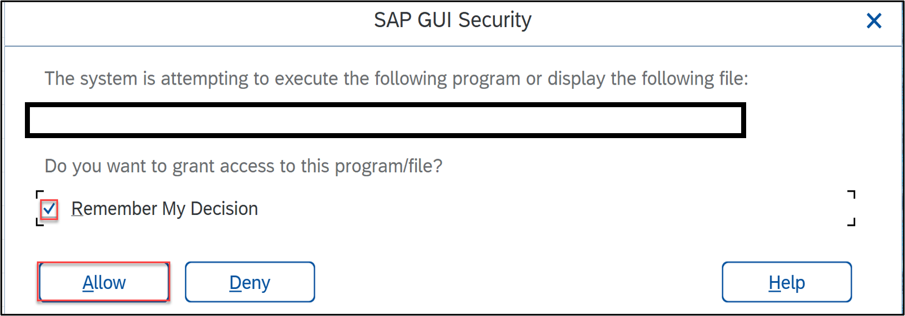
 
  3. Log into **SAP NetWeaver**.

      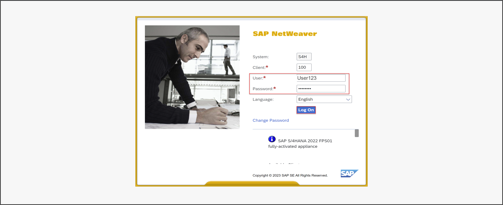

  4. Select **New Standard Catalog**.

     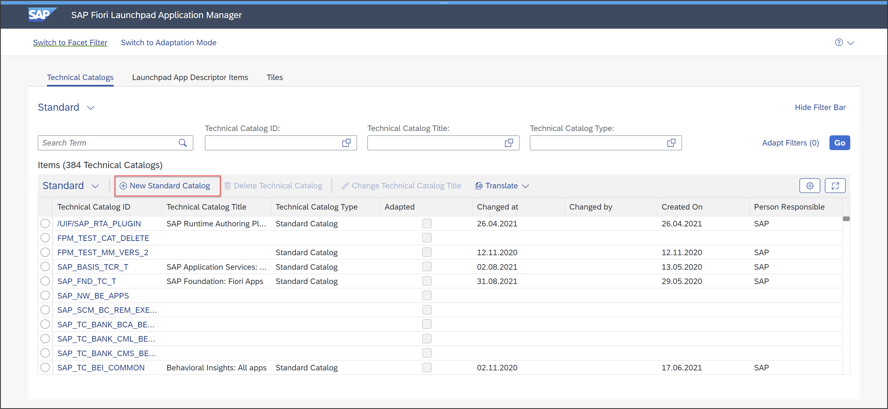

  5. Create a new **technical catalog**:
     - Technical Catalog ID: **`Z_TC_ONLINESHOP_XXX`**
     - Language: English
     - Technical Catalog Title: Online Shop XXX
     - Package: **`$Z_PURCHASE_REQ_TIER3_XXX`**
  
      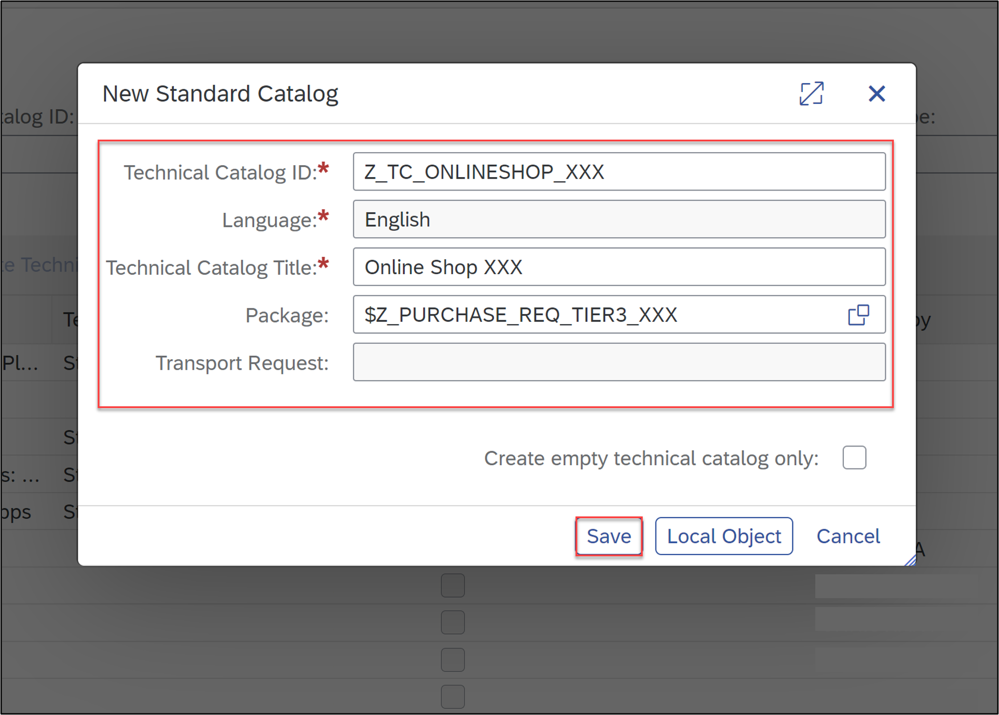
 
      Click **Save**. 

    > **Hint**: The technical catalog has the naming convention `TC`.

     Now the **SAP Fiori Launchpad Application Manager** opens.

     The technical catalog contains the launchpad app descriptor item, which will be added in the next step.

### Create a launchpad app descriptor item

  1. In the **SAP Fiori Launchpad Application Manager** click **Add App** and select **SAPUI5 Fiori App**.

      
    
    > **Hint:** The launchpad app descriptor item can be for e.g. an SAPUI5 Fiori app.

  2. Fill in the target application fields:
     - App Type: SAPUI5 Fiori App
     - Semantic Object: **`z_purchase_req_tier3_xxx`**
     - Action: display
     - SAPUI5 Component ID: **`zpurchasereqtier3xxx`**

      

      You can search for the SAPUI5 Component ID. To make sure you selected the right one, you can go to **SAP Business Application Studio**. In the **Application Information** overview you will find it as the application identifier.
      
      

      Click **Save**.

  3. Open your package in Eclipse and refresh your package if needed. You will now see the FLP technical catalog and launchpad app descriptor item listed.
  
      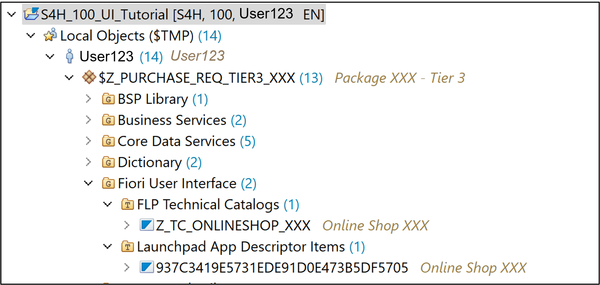

### Create SAP Fiori business catalog 

Find here the documentation on [Best Practices for Managing Catalogs](https://help.sap.com/docs/SAP%20Fiori%20launchpad/d4650bf68a9f4f67a1fda673f09926a9/af35d42e7d4f49d7b8e46080cd01c299.html?version=753.04).

In this step, you will create a business catalog. The SAP Fiori business catalog is client-dependent, so it is part of the customizing. 

  1. Execute following transaction to create a business catalog **`/ui2/flpcm_cust`**. You also need to add **`/n`** before your transaction.

      

  2. Search for technical catalog **`Z_TC_ONLINESHOP_XXX`** and press **Go** to check the existing content.  
  
      

  3. Now you can see the existing content of your technical catalog. Click **Create** to create a new business catalog.

      
 
  4. Create a **new catalog**:
     - New ID: **`z_bc_onlineshop_xxx`**
     - New Title: Business Catalog - Online Shop XXX

      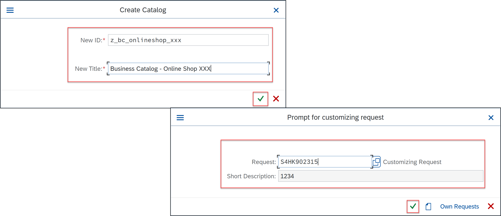

      Select your transport request and description. Select the check mark.

    > **Hint**: The technical catalog has the naming convention `BC`.

  5. Click **Add Tiles/Target Mappings** and select **`Add Tiles/TMs to Selected Catalog`**.

      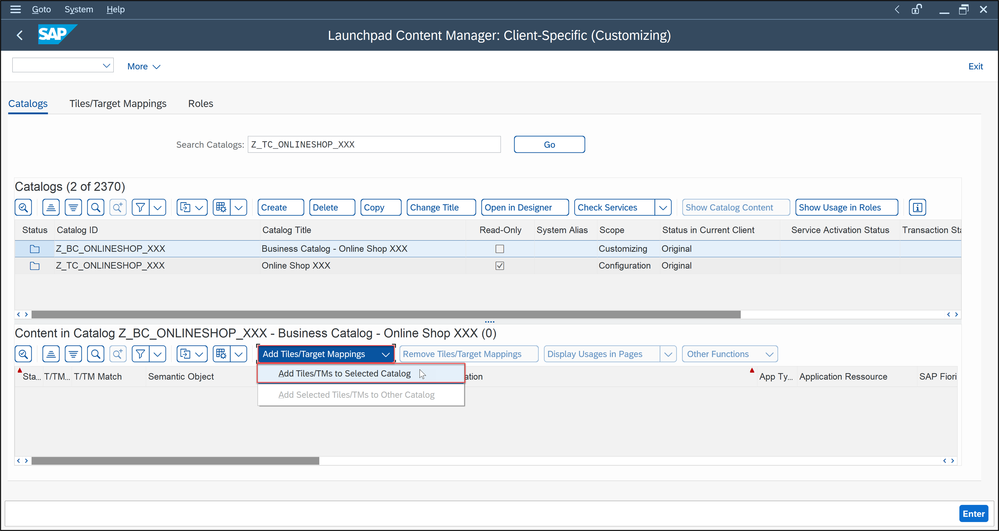

  6. Search for **`Z_PURCHASE_REQ_TIER3_XXX`**, press **Go**, select your entry and click **Add Tile/TM Reference**.
   
      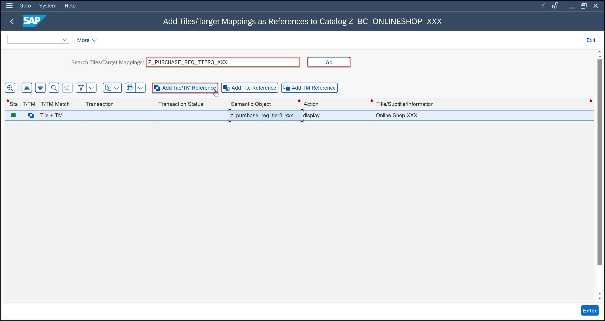 

  7. Check your result.
   
      

### Create a business role and assign business catalog and business user

  1. Execute following transaction to create a business role and assign it to your user **`pfcg`**. 

         

  2. Enter **`Z_BR_SHOP_XXX`** as Role and click **Single Role**.

      

  3. Enter a description and click **Save**.

      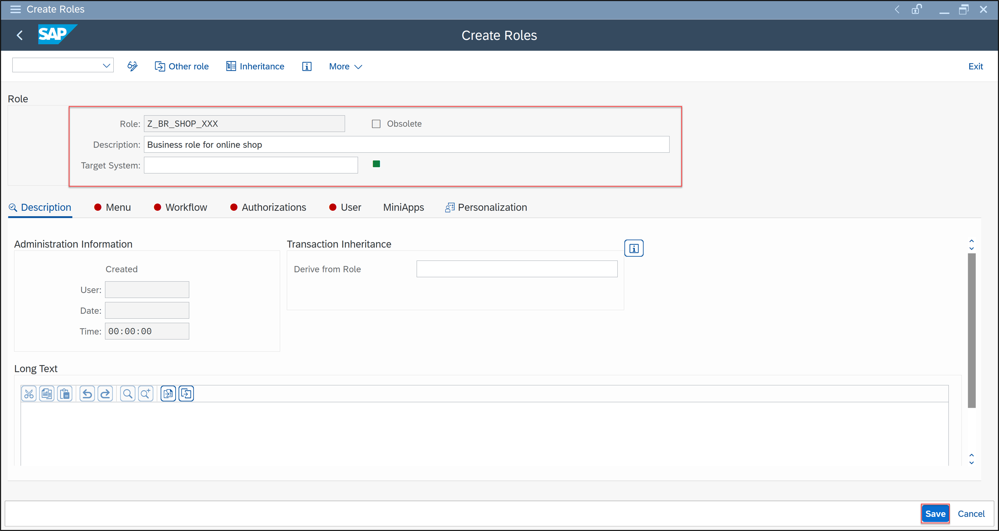

  4. Navigate to **Menu** and select **Transaction** > **SAP Fiori Launchpad** > **Launchpad Catalog**.

      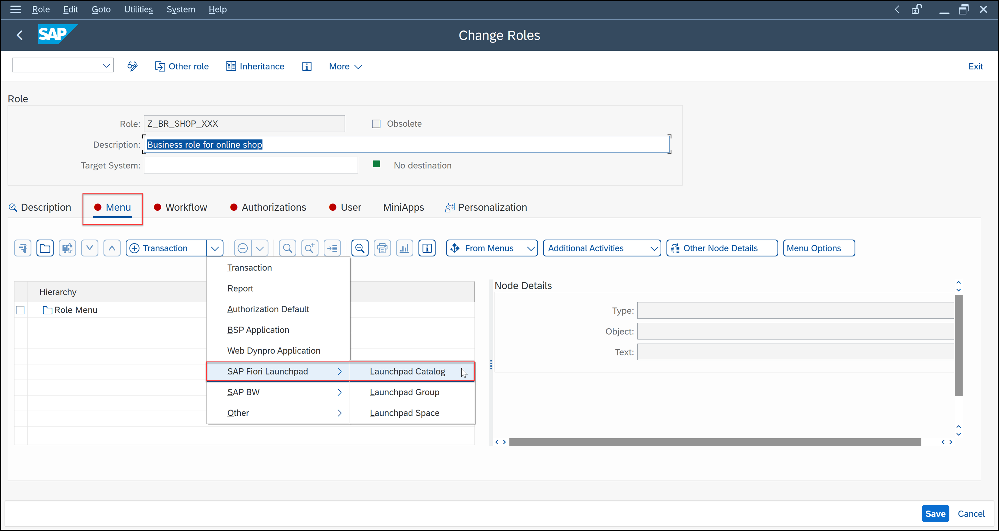

  5. Enter **`Z_BC_ONLINESHOP_XXX`** as Catalog ID, select the check mark and click save.

      

  6. Navigate to **Authorization** and select the edit icon for **Change Authorization Data**.

      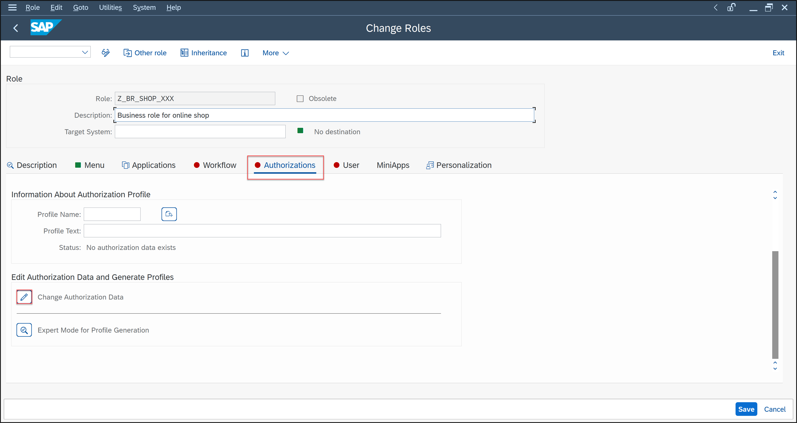

  7. Click the icon.

      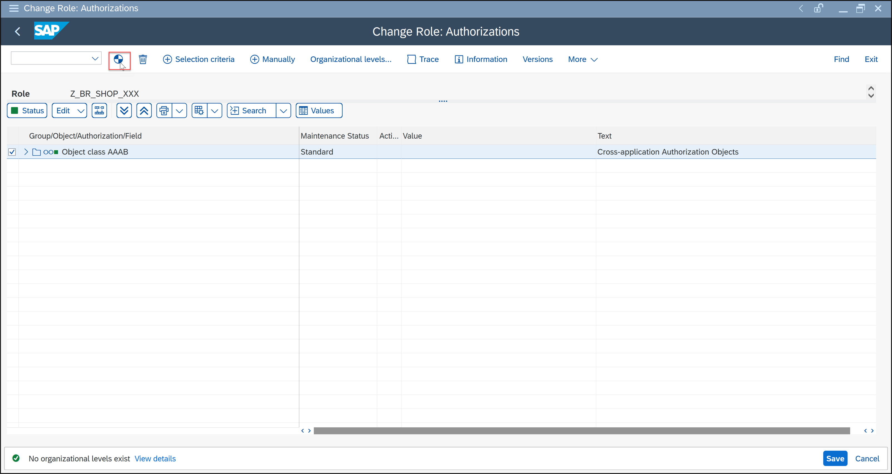

  8. Select the check mark.
   
      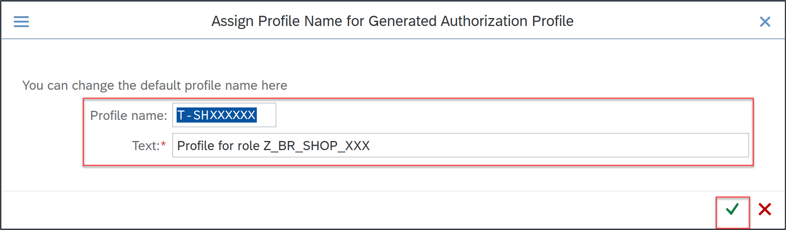

  9. Go back.

      

 10. Navigate to **User**, enter your user and click **Save**.

      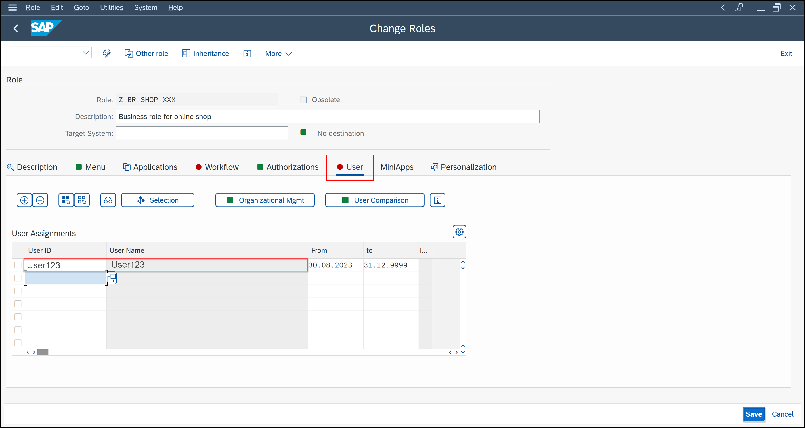

### Run application via app finder

  1. Execute following transaction to run an app from SAP Fiori Launchpad **`/ui2/flp`**. You also need to add **`/n`** before your transaction.

     
    
  2. Log in with the user you assigned the business role `Z_BR_SHOP_XXX` to.

     

  3. Click your user on the top right corner and select **App Finder**.

     

  4. Search for **Online Shop XXX** and press the + symbol.

     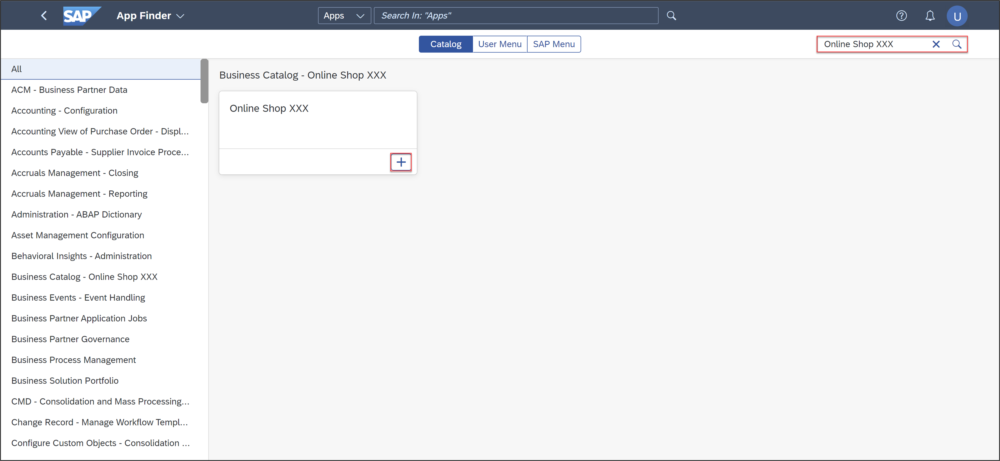

  5. Select **My Home** to add your application to the my home page.

     

  6. Go to your home page and now you can see your application. Click your application and check your result.
   
     

### Create a space and page 
 
  1. Execute following transaction to create spaces and pages **`/ui2/flp`**. You also need to add **`/n`** before your transaction.

         

  2. Click **Home** and select **SAP Fiori Launchpad: All Apps** > **Manage Launchpad Spaces**.

      

  3. Click **Create**.
 
      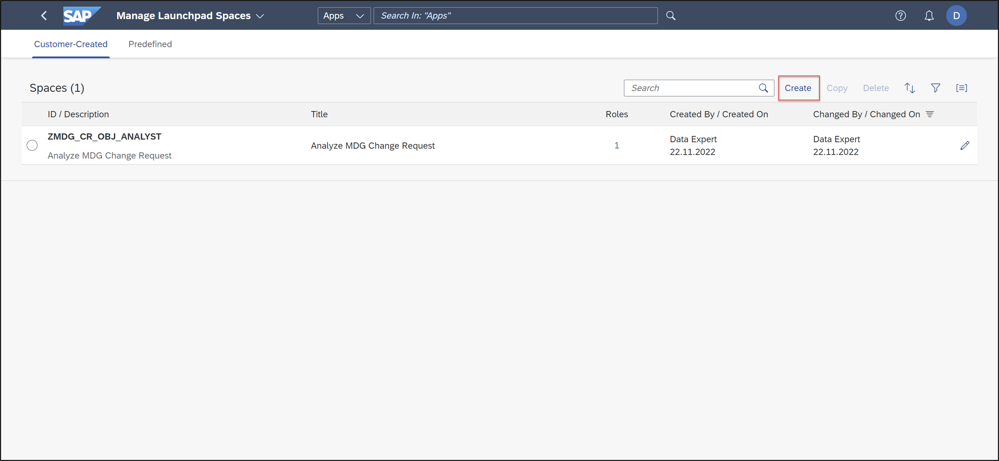 

  4. Create a **new space and page**:
     - Space ID: **`z_purchase_req_xxx`**
     - Space Description: Space for Online Shop XXX
     - Space Title: Online Shop XXX
     - Check mark **Also create a page**
     - Page ID: **`z_purchase_req_xxx`**
     - Page Description: Page for Online Shop XXX
     - Page Title: Online Shop XXX

      

      Select your transport request and click **Create** and assign your transport request.

  5. Click **Save**.
   
      

  6. Navigate to your page `Z_PURCHASE_REQ_XXX`.

      

  7. Inside your page **`Z_PURCHASE_REQ_XXX`** click **Edit** to add your page content.
   
      

 
  8. Select the menu and click **Catalogs**.
   
      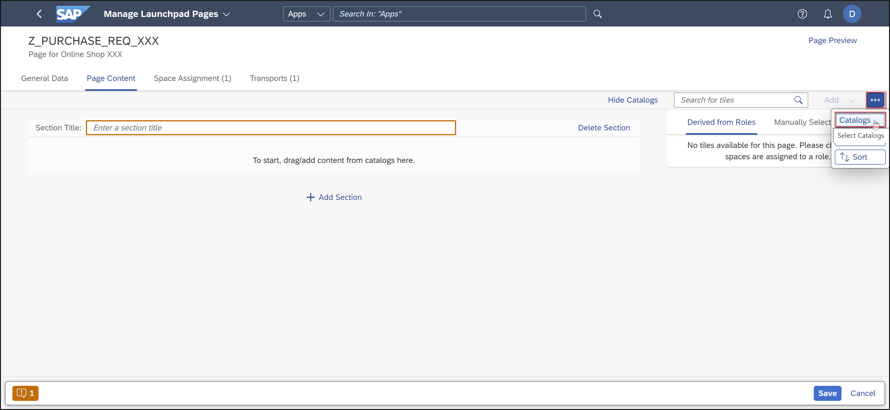

  9. Search for your catalog **`z_bc_onlineshop_xxx`**, select it and click **Select**.

      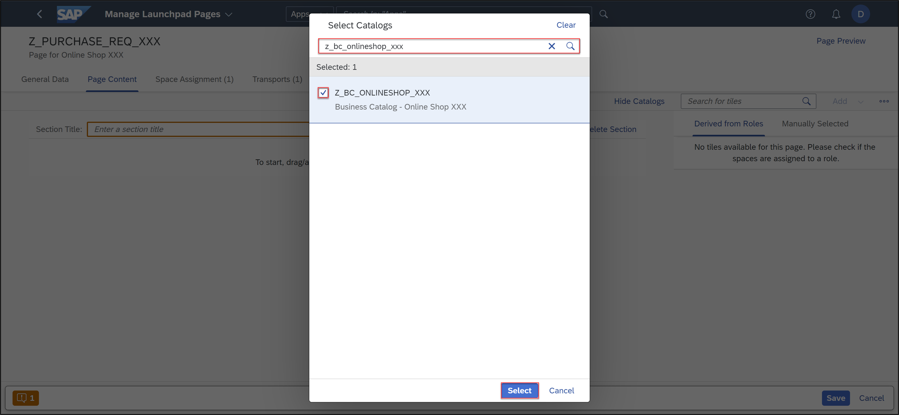

 10. Select your business catalog **`z_bc_onlineshop_xxx`** and click **Add**.

      

 11. Enter the section title: **Online Shop Section** and click **Save**.

      

### Add space and page to business role

  1. Execute following transaction **`pfcg`** to open your business role and add the newly created space and page to it.

         

  2. Enter **`Z_BR_SHOP_XXX`** as Role and click the edit symbol.

      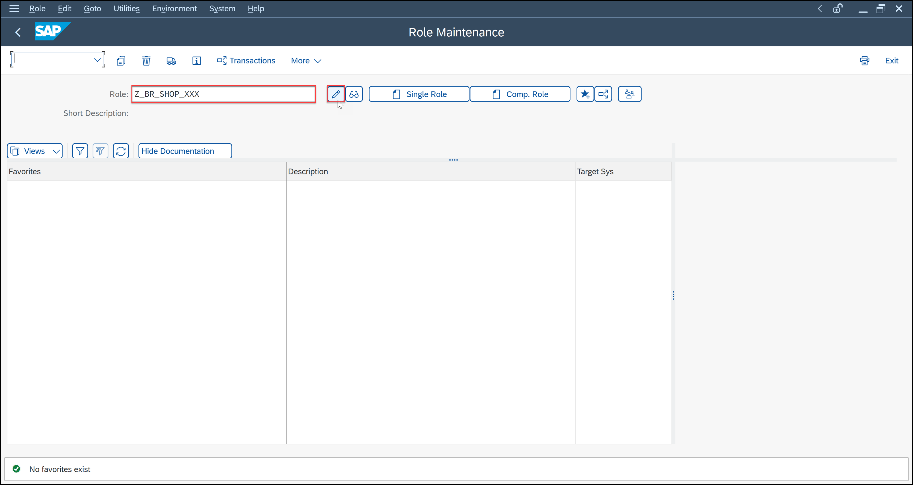

  3. Go back and navigate to **Menu** again. Select the **arrow** > **SAP Fiori Launchpad** > **Launchpad Space**. 

      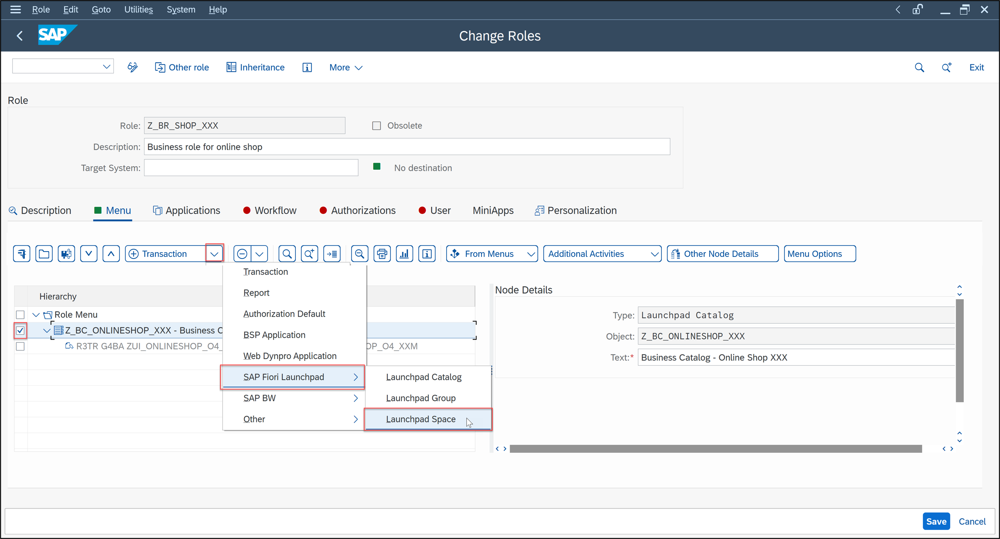

  4. Enter **`Z_PURCHASE_REQ_XXX`** as Space ID and select the check mark.
   
      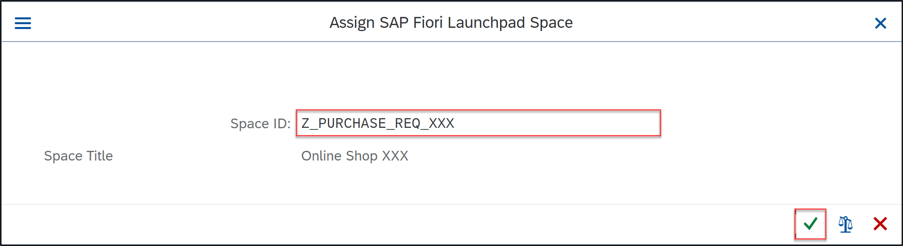

  6. Add a description and click **Save**.
   
      

 
### Run an app from FLP

  1. Execute following transaction to run an app from SAP Fiori Launchpad **`/ui2/flp`**. You also need to add **`/n`** before your transaction.

     
    
  2. Navigate to **Online Shop XXX** and select your tile to check your result.

     

### Test yourself

### More information

Find here the documentation on [SAP Fiori Launchpad](https://help.sap.com/docs/SAP_FIORI_LAUNCHPAD).