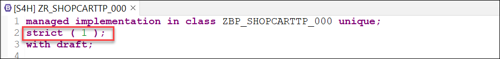
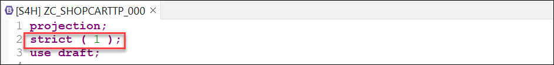
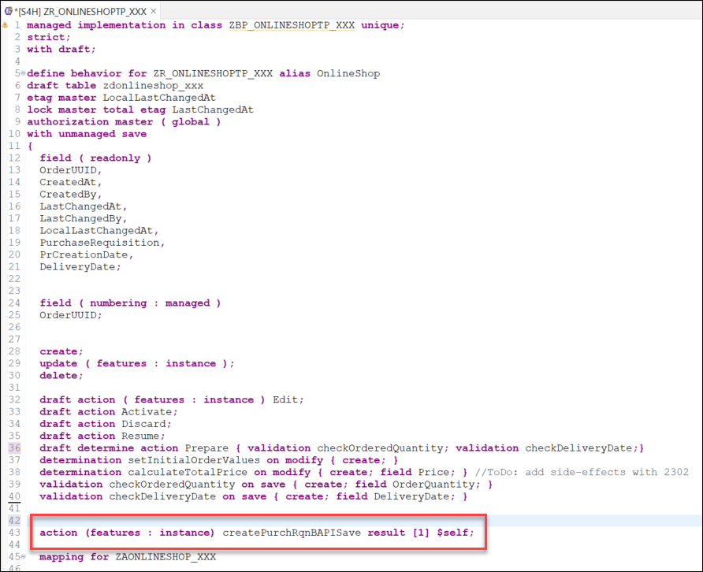
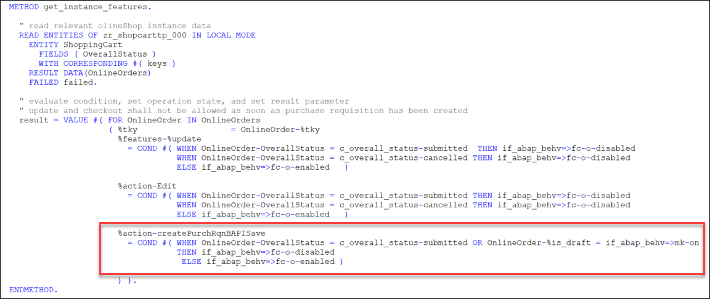
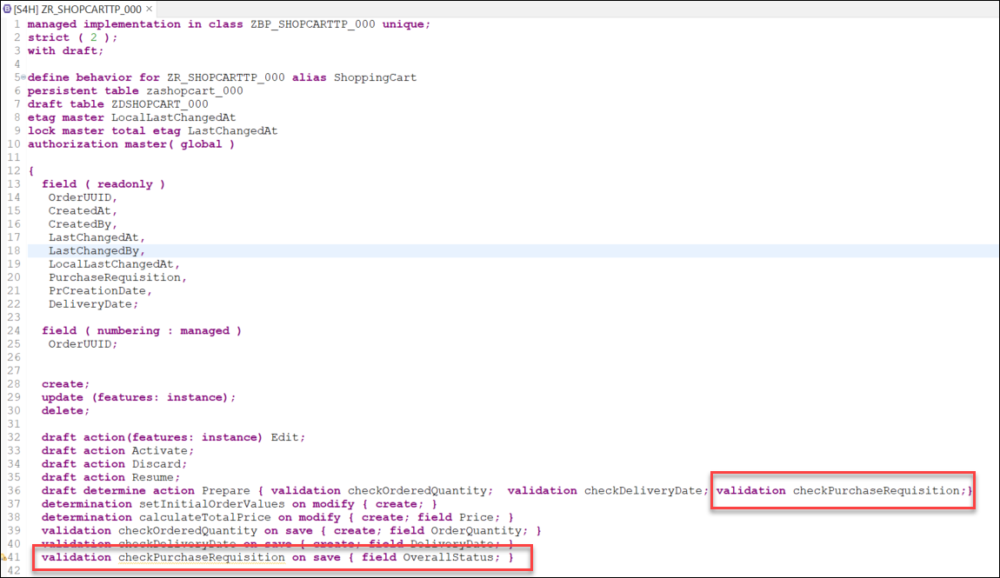
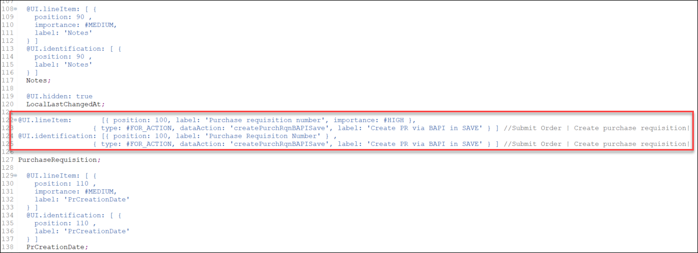
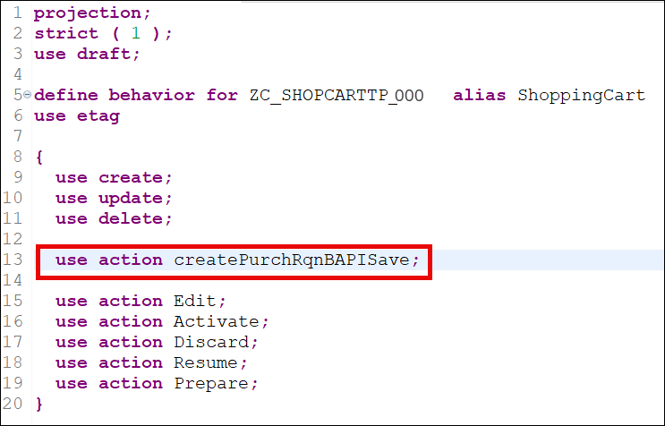
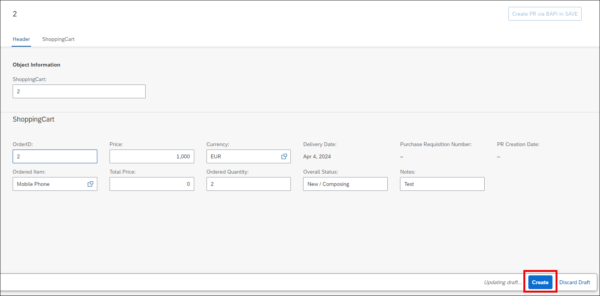
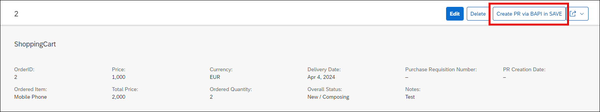
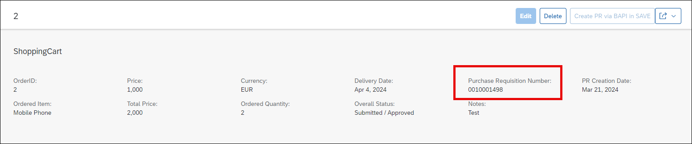

# Integrate the Wrapper into the Shopping Cart Business Object
<!-- description --> Learn how to integrate your wrapper in a RAP BO, implement a new action to call the wrapper during the save sequence phase and expose it via service binding

## Prerequisites
- You have completed the previous tutorials in this group to [create a wrapper for the BAPI `BAPI_PR_CREATE`](abap-s4hanacloud-purchasereq-create-wrapper) as well as [create a shopping cart business object](abap-s4hanacloud-procurement-purchasereq-shop) and [enhance it](abap-s4hanacloud-purchasereq-enhance-shop).
 - For the entirety of this tutorial, you will be using the same user with full development authorization you used in the previous tutorial of this mission.

## You will learn
- How to integrate a wrapper class in a RAP BO during the save sequence
- How to implement a new action in RAP BO to call the wrapper class and use it to create a purchase requisition
- How to expose the action via service binding

## Intro
>Throughout this tutorial, wherever ### appears, use a number (e.g. 000). This tutorial is done with the placeholder 000.

In this tutorial you will take the wrapper that you created and you will integrate it in your shopping cart RAP Business Object (RAP BO) to create purchase requisitions in your online shop application as indicated in the [Using BAPIs in RAP](https://blogs.sap.com/2022/11/30/using-bapis-in-rap/) blog post:

- You will implement a new action. The action shall change the status of the business object instance to "Submitted".
- You will implement a validation for the status. When the status is "Submitted", the validation will call the BAPI in test mode via the wrapper. It will return any error message raised by the BAPI. These error messages are then returned to the end user.
- You will adapt the RAP BO and turn it into a RAP BO with unmanaged save. In the corresponding `save_modified` method implementation, when the status of a business object instance is "Submitted", the wrapper will be called via the BAPI and a purchase requisition is created for that business object instance.

### Switch to strict (1) mode

Later in this tutorial we will implement a `save_modified` method in the RAP Business Object, which will invoke authorization checks during the save sequence. If the RAP behavior definition is implemented in ABAP for Cloud Development and the `strict(2)` mode is applied, this would lead to runtime errors. For this reason, we will switch to `strict(1)` mode. For more information, see [The RAP Transactional Model and the SAP LUW](https://help.sap.com/docs/abap-cloud/abap-rap/rap-transactional-model-and-sap-luw).

Connect to your system via ADT and navigate to the package `Z_PURCHASE_REQ_###` containing the RAP BO. Open the behavior definition `ZR_SHOPCARTTP_###` and change to `strict(1)` mode:



Save and activate it.

Open the behavior definition `ZC_SHOPCARTTP_###` and change to `strict(1)` mode there as well:



Save and activate it.

### Implement new action `createPurchRqnBAPISave`

You will now create a whole new action in the RAP BO, called `createPurchRqnBAPISave`. Open the behavior definition `ZR_SHOPCARTTP_###` and define a new action with the following code snippet:

```ABAP
  action ( features : instance ) createPurchRqnBAPISave result [1] $self;

```

Your behavior definition should look as follows:



Save and activate it.

Position the cursor on the newly defined action and use the shortcut `ctrl + 1` to load the quick assist proposals, then double-click on `add method for action createPurchRqnBAPISave of entity zr_shopcarttp_### in local class lhc_shopcart`. This will automatically create an empty method implementation in the `lhc_shopcart` class. Implement the method as follows:

``` ABAP
  METHOD createpurchrqnbapisave.
  "read transfered order instances
  READ ENTITIES OF zr_shopcarttp_### IN LOCAL MODE
    ENTITY ShoppingCart
      ALL FIELDS WITH
      CORRESPONDING #( keys )
    RESULT DATA(OnlineOrders).
 
  MODIFY ENTITIES OF zr_shopcarttp_### IN LOCAL MODE
     ENTITY ShoppingCart
        UPDATE FIELDS ( OverallStatus )
           WITH VALUE #( FOR key IN keys (
            OrderUUID = key-OrderUUID
            OverallStatus = c_overall_status-submitted
         ) ).
 
  "Read the changed data for action result
  READ ENTITIES OF zr_shopcarttp_### IN LOCAL MODE
    ENTITY ShoppingCart
      ALL FIELDS WITH
      CORRESPONDING #( keys )
    RESULT DATA(result_read).
  "return result entities
  result = VALUE #( FOR result_order IN result_read ( %tky   = result_order-%tky
                                                      %param = result_order ) ).
  ENDMETHOD.

```

Save and activate it.

This action will mark the orders where purchase requisition shall be created using the `OverallStatus` field. In a later step we will create the `save_modified` implementation and adapt it to use this `OverallStatus` field to filter the orders where purchase requisition shall be created. As a result, when the button for this action is clicked in the UI, a new purchase requisition will be created for the selected entity via the wrapper class.

You now need to adapt the `get_instance_features` method in the `lhc_shopcart` class of the behavior implementation by adding the following code snippet:

```ABAP
%action-createPurchRqnBAPISave 
= COND #( WHEN OnlineOrder-OverallStatus = c_overall_status-submitted OR OnlineOrder-%is_draft = if_abap_behv=>mk-on
          THEN if_abap_behv=>fc-o-disabled
          ELSE if_abap_behv=>fc-o-enabled )
```

So the method implementation now looks as follows:



Save and activate it.

### Implement on save validation using the BAPI test mode

As seen in the previous tutorial of this series, certain BAPI have a test mode that can be used to validate the input data. Depending on the type of BAPI, how you plan to integrate it in your RAP BO and your specific use case, it is recommended to use this test mode as a validation in your RAP BO. So, after the action `createPurchRqnBAPISave` is called, this validation can be used to check the input data (before the logic moves on to the `save_modified` step, where the entity is modified and the purchase requisition is created).

Open the behavior definition `ZR_SHOPCARTTP_###` and implement a new validation called `checkPurchaseRequisition`:

```ABAP
  draft determine action Prepare { validation checkOrderedQuantity; validation checkDeliveryDate; validation checkPurchaseRequisition;}
  .
  .
  validation checkPurchaseRequisition on save { field OverallStatus; }
```



Save and activate it. Then place the cursor on the newly created validation and use the shortcut `ctrl + 1` to load the quick assist proposals, then double-click on `Add method for validation checkpurchaserequisition of entity zr_shopcarttp_### in local class lhc_shopcart` and implement the method as follows:

``` ABAP
  METHOD checkpurchaserequisition.
    "read relevant order instance data
    READ ENTITIES OF zr_shopcarttp_### IN LOCAL MODE
      ENTITY ShoppingCart
        ALL FIELDS WITH
        CORRESPONDING #( keys )
      RESULT DATA(OnlineOrders).
 
    LOOP AT OnlineOrders INTO DATA(OnlineOrder) WHERE OverallStatus = c_overall_status-submitted.
      DATA(pr_returns) = zcl_bapi_wrap_factory_###=>create_instance( )->check(
          EXPORTING
            pr_header        = VALUE zif_wrap_bapi_pr_create_###=>pr_header( pr_type = 'NB' )
            pr_items         = VALUE zif_wrap_bapi_pr_create_###=>pr_items( (
              preq_item  = '00010'
              plant      = '1010'
              acctasscat = 'U'
              currency   = OnlineOrder-Currency
              deliv_date = OnlineOrder-DeliveryDate
              material   = 'ZPRINTER01'
              matl_group = 'A001'
              preq_price = OnlineOrder-Price
              quantity   = OnlineOrder-OrderQuantity
              unit       = 'ST'
              pur_group = '001'
              purch_org = '1010'
              short_text = OnlineOrder-OrderedItem
            ) )
            pr_item_accounts = VALUE zif_wrap_bapi_pr_create_###=>pr_item_accounts( (
                preq_item = '00010'
                costcenter = 'jwt-cost'
                gl_account = '0000400000'
                serial_no = '01'
            ) )
            pr_item_texts    = VALUE zif_wrap_bapi_pr_create_###=>pr_item_texts( (
              preq_item = '00010'
              text_line = OnlineOrder-Notes
              text_id   = 'b01'
            ) )
            pr_header_texts  = VALUE zif_wrap_bapi_pr_create_###=>pr_header_texts( (
              preq_item = '00010'
              text_line = | { sy-uname } - { OnlineOrder-OrderID  } |
              text_id   = 'B01'
            ) )
        ).
 
      LOOP AT pr_returns INTO DATA(pr_return_msg) WHERE type = 'E' OR type = 'W'.
        APPEND VALUE #(
          orderuuid = OnlineOrder-OrderUUID
          %msg = new_message(
                        id        = pr_return_msg-id
                        number    = pr_return_msg-number
                        severity  = COND #( WHEN pr_return_msg-type = 'E' THEN if_abap_behv_message=>severity-error
                                            WHEN pr_return_msg-type = 'W' THEN if_abap_behv_message=>severity-warning
                                             )
                         v1 = pr_return_msg-message_v1
                         v2 = pr_return_msg-message_v2
                         v3 = pr_return_msg-message_v3
                         v4 = pr_return_msg-message_v4  )
          %element-purchaserequisition = if_abap_behv=>mk-on
          %action-createPurchRqnBAPISave = if_abap_behv=>mk-on
           ) TO reported-shoppingcart.
 
        APPEND VALUE #(
         orderuuid = OnlineOrder-OrderUUID
         %fail = VALUE #( cause = if_abap_behv=>cause-unspecific )
        ) TO failed-shoppingcart.
      ENDLOOP.
    ENDLOOP.
  ENDMETHOD.
```
The method reads the entities of the RAP BO, checks the entries and triggers the BAPI test mode call for those orders where a purchase requisition is being created. The method also takes care of error handling: it filters for any error or warning raised from the BAPI call and passes it on to the UI which would display a pop-up error message if needed.

Save it and activate it.

>The parameter `FOR VALIDATE ON SAVE` means that the method will be used during the save sequence of the RAP BO. Which means that after the creation of a new entry, when the user will save it, this method will be called to check the validity of the input data.

>For the scope of this tutorial, we will use the material `ZPRINTER01`, which is automatically available in any [Fully-Activated Appliance](https://blogs.sap.com/2018/12/12/sap-s4hana-fully-activated-appliance-create-your-sap-s4hana-1809-system-in-a-fraction-of-the-usual-setup-time/) in SAP Cloud Appliance Library. If you are using a different system, you might have to create a material to use in the tutorial (see [Creating Materials](https://help.sap.com/docs/SAP_S4HANA_ON-PREMISE/f7fddfe4caca43dd967ac4c9ce6a70e4/23d6b8535c39b44ce10000000a174cb4.html?version=2022.000)).

### Implement `unmanaged_save`

In our scenario, we want to call the wrapper during the save sequence and therefore we need to switch to a RAP BO with unmanaged save, so that we can implement and adapt the `save_modified` method and call the wrapper therein.

Open the behavior definition `ZR_SHOPCARTTP_###`, delete the following line:

```ABAP
persistent table zashopcart_### 

```
and add the unmanaged save statement:

```ABAP
with unmanaged save

```


Save and activate it. Position the cursor on the `with unmanaged save` statement and use the shortcut `ctrl + 1` to load the quick assist proposals, then double-click on `Add required method save_modified in new local saver class` to automatically create an empty implementation for the method. Implement it as follows:

```ABAP
  METHOD save_modified.

    DATA : lt_shopping_cart_as        TYPE STANDARD TABLE OF zashopcart_###,
          ls_shopping_cart_as        TYPE                   zashopcart_###.
    IF create-shoppingcart IS NOT INITIAL.
      lt_shopping_cart_as = CORRESPONDING #( create-shoppingcart MAPPING FROM ENTITY ).
      INSERT zashopcart_### FROM TABLE @lt_shopping_cart_as.
    ENDIF.
    IF update IS NOT INITIAL.
      CLEAR lt_shopping_cart_as.
      lt_shopping_cart_as = CORRESPONDING #( update-shoppingcart MAPPING FROM ENTITY ).
      LOOP AT update-shoppingcart  INTO DATA(shoppingcart) WHERE OrderUUID IS NOT INITIAL.
        MODIFY zashopcart_### FROM TABLE @lt_shopping_cart_as.
      ENDLOOP.
    ENDIF.

    LOOP AT delete-shoppingcart INTO DATA(shoppingcart_delete) WHERE OrderUUID IS NOT INITIAL.
      DELETE FROM zashopcart_### WHERE order_uuid = @shoppingcart_delete-OrderUUID.
      DELETE FROM zdshopcart_### WHERE orderuuid = @shoppingcart_delete-OrderUUID.
    ENDLOOP.
  ENDMETHOD.

```

Save and activate it.

>We use the unmanaged save option for our scenario, rather than the additional save option. This is because the additional save should only be used in case data needs to be saved in addition to BO data in a persistence outside the BO, as stated in the [Additional Save documentation](https://help.sap.com/docs/SAP_S4HANA_CLOUD/e5522a8a7b174979913c99268bc03f1a/ca7097c8ea404b11b1f1334fd54cdd15.html). Since this is not our use case (the purchase requisition is created and saved in the persistency of the shopping cart BO), we rely on the unmanaged save option.

### Call wrapper class in unmanaged save implementation `save_modified`

As a final step, you now need to modify the `save_modified` method of the saver class, so that it calls the wrapper class (which creates the purchase requisition).

Open the `lsc_zr_shopcarttp_###` class of the behavior implementation and navigate to the `save_modified` method. Add the following code snippet:

```ABAP
    IF update IS NOT INITIAL.
      LOOP AT update-shoppingcart INTO DATA(OnlineOrder) WHERE %control-OverallStatus = if_abap_behv=>mk-on.
        DATA pr_returns TYPE zif_wrap_bapi_pr_create_###=>pr_returns.
        DATA(purchase_requisition) = zcl_bapi_wrap_factory_###=>create_instance( )->create(
          EXPORTING
            pr_header        = VALUE zif_wrap_bapi_pr_create_###=>pr_header( pr_type = 'NB' )
            pr_items         = VALUE zif_wrap_bapi_pr_create_###=>pr_items( (
              preq_item  = '00010'
              plant      = '1010'
              acctasscat = 'U'
              currency   = OnlineOrder-Currency
              deliv_date = OnlineOrder-DeliveryDate
              material   = 'ZPRINTER01'
              matl_group = 'A001'
              preq_price = OnlineOrder-Price
              quantity   = OnlineOrder-OrderQuantity
              unit       = 'ST'
              pur_group = '001'
              purch_org = '1010'
              short_text = OnlineOrder-OrderedItem
            ) )
            pr_item_accounts = VALUE zif_wrap_bapi_pr_create_###=>pr_item_accounts( (
                preq_item = '00010'
                costcenter = 'jwt-cost'
                gl_account = '0000400000'
                serial_no = '01'
            ) )
            pr_item_texts    = VALUE zif_wrap_bapi_pr_create_###=>pr_item_texts( (
              preq_item = '00010'
              text_line = OnlineOrder-Notes
              text_id   = 'b01'
            ) )
            pr_header_texts  = VALUE zif_wrap_bapi_pr_create_###=>pr_header_texts( (
              preq_item = '00010'
              text_line = | { sy-uname } - { OnlineOrder-OrderID  } |
              text_id   = 'B01'
            ) )
          IMPORTING
            pr_returns   = pr_returns
        ).

        ASSERT NOT line_exists( pr_returns[ type = 'E' ] ).

        DATA(creation_date) = cl_abap_context_info=>get_system_date(  ).

        UPDATE zashopcart_###
        SET purchase_requisition = @purchase_requisition,
            pr_creation_date = @creation_date
        WHERE order_uuid = @OnlineOrder-OrderUUID.
      ENDLOOP.
    ENDIF.
```

The `save_modified` method implementation should now look as follows:

```ABAP
  METHOD save_modified.
    DATA : lt_shopping_cart_as        TYPE STANDARD TABLE OF zashopcart_###,
           ls_shoppingcart_as        TYPE                   zashopcart_###.
    IF create-shoppingcart IS NOT INITIAL.
      lt_shopping_cart_as = CORRESPONDING #( create-shoppingcart MAPPING FROM ENTITY ).
      INSERT zashopcart_### FROM TABLE @lt_shopping_cart_as.
    ENDIF.
    IF update IS NOT INITIAL.
      CLEAR lt_shopping_cart_as.
      lt_shopping_cart_as = CORRESPONDING #( update-shoppingcart MAPPING FROM ENTITY ).
      LOOP AT update-shoppingcart  INTO DATA(shoppingcart) WHERE OrderUUID IS NOT INITIAL.
        MODIFY zashopcart_### FROM TABLE @lt_shopping_cart_as.
      ENDLOOP.
    ENDIF.

    IF update IS NOT INITIAL.
      LOOP AT update-shoppingcart INTO DATA(OnlineOrder) WHERE %control-OverallStatus = if_abap_behv=>mk-on.
        DATA pr_returns TYPE zif_wrap_bapi_pr_create_###=>pr_returns.
        DATA(purchase_requisition) = zcl_bapi_wrap_factory_###=>create_instance( )->create(
          EXPORTING
            pr_header        = VALUE zif_wrap_bapi_pr_create_###=>pr_header( pr_type = 'NB' )
            pr_items         = VALUE zif_wrap_bapi_pr_create_###=>pr_items( (
              preq_item  = '00010'
              plant      = '1010'
              acctasscat = 'U'
              currency   = OnlineOrder-Currency
              deliv_date = OnlineOrder-DeliveryDate
              material   = 'ZPRINTER01'
              matl_group = 'A001'
              preq_price = OnlineOrder-Price
              quantity   = OnlineOrder-OrderQuantity
              unit       = 'ST'
              pur_group = '001'
              purch_org = '1010'
              short_text = OnlineOrder-OrderedItem
            ) )
            pr_item_accounts = VALUE zif_wrap_bapi_pr_create_###=>pr_item_accounts( (
                preq_item = '00010'
                costcenter = 'jwt-cost'
                gl_account = '0000400000'
                serial_no = '01'
            ) )
            pr_item_texts    = VALUE zif_wrap_bapi_pr_create_###=>pr_item_texts( (
              preq_item = '00010'
              text_line = OnlineOrder-Notes
              text_id   = 'b01'
            ) )
            pr_header_texts  = VALUE zif_wrap_bapi_pr_create_###=>pr_header_texts( (
              preq_item = '00010'
              text_line = | { sy-uname } - { OnlineOrder-OrderID  } |
              text_id   = 'B01'
            ) )
          IMPORTING
            pr_returns    = pr_returns
        ).

        ASSERT NOT line_exists( pr_returns[ type = 'E' ] ).

        DATA(creation_date) = cl_abap_context_info=>get_system_date(  ).

        UPDATE zashopcart_###
        SET purchase_requisition = @purchase_requisition,
            pr_creation_date = @creation_date
        WHERE order_uuid = @OnlineOrder-OrderUUID.
      ENDLOOP.
    ENDIF.

    LOOP AT delete-shoppingcart INTO DATA(shoppingcart_delete) WHERE OrderUUID IS NOT INITIAL.
      DELETE FROM zashopcart_### WHERE order_uuid = @shoppingcart_delete-OrderUUID.
      DELETE FROM zdshopcart_### WHERE orderuuid = @shoppingcart_delete-OrderUUID.
    ENDLOOP.
  ENDMETHOD.
```
Save and activate it.

The logic is now fully implemented: when the new action is used, shopping cart orders are marked (similar to a checkbox) using the `OverallStatus` field, they are subsequently validated for purchase requisition creation and then used to create the actual purchase requisition in the unmanaged save implementation in the `save_modified` method.

>The BAPI wrapper call is implemented in the unmanaged save implementation `save_modified`, and not directly in the action implementation. The reason is for transactional consistency: during the BAPI call a `CALL FUNCTION IN UPDATE TASK` happens, and the update task is not allowed in the interaction phase or early-save phase and leads to a runtime error.

>You might notice that the `save_modified` now has two `IF update IS NOT INITIAL` sections, one from the original behavior implementation from the previous step (which is representative of a standard save sequence implementation for the `save_modified` method), and the new one we just implemented (which calls the wrapper to create a purchase requisition during the save sequence). This is not strictly necessary, and the logic could be combined, but for the sake of clarity and modularity we decided to keep it separated for this tutorial series (even if it is slightly redundant).

>Given our implementation, there is no way to handle errors at this phase, so the `ASSERT` statement is used as a contingency: it catches any error that was not caught during the validation phase and leads to a runtime error.

### Expose the new action

You will now expose the newly created action. To do this, you will modify the Metadata Extension and the Behavior Definition to expose the action.

Open the Metadata Extension `ZC_SHOPCARTTP_###` and substitute all the metadata content referring to the action `PurchaseRequisition` with the following code snippet referring to the new action:

```ABAP
  @UI.lineItem: [ {
    position: 100 ,
    label: 'Purchase requisition number',
    importance: #HIGH
  },

  { type: #FOR_ACTION, dataAction: 'createPurchRqnBAPISave', label: 'Create PR via BAPI in SAVE' } ]
  @UI.identification: [ { position: 100, label: 'Purchase Requisition Number' } , { type: #FOR_ACTION, dataAction: 'createPurchRqnBAPISave', label: 'Create PR via BAPI in SAVE' } ]
  PurchaseRequisition;
```

Your metadata implementation should look like this:



Save and activate it.

Open the Behavior Definition `ZC_SHOPCARTTP_###` and expose the new action with the code snippet:

```ABAP
  use action createPurchRqnBAPISave;

```
The Behavior Definition should now look as follows:



Save and activate it.

### Run SAP Fiori Elements Preview to test action

In ADT, open the Service Binding `ZUI_SHOPCART_O4_###` and click on the **Preview** button to start a preview of the UI of your RAP BO. You will be prompted to login. Create a new entry and then click on the button `Create PR via BAPI in SAVE` to create the purchase requisition:





The purchase requisition will be created:



### Test yourself

---
