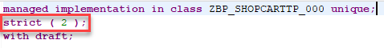
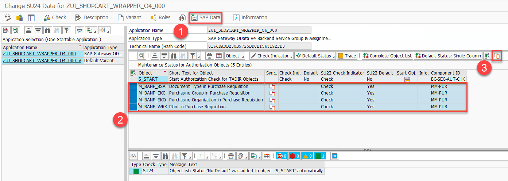

# Replace Wrapper by Released API

<!-- description --> Learn how to replace the wrapper for the `BAPI_PR_CREATE` function module with the released API `I_PurchaseRequisitionTp` business object interface and maintain the related authorization defaults.

## Prerequisites

- You have completed the previous tutorial in this group, integrated your wrapper in your RAP BO and provided authorizations to users for non-released authorization objects.

## You will learn

- How to replace the wrapper integration with an EML call to the released API.
- How to consequently adapt the action implementation as well as the unmanaged save implementation.
- How to change the BO to strict(2) mode.
- How to maintain the corresponding authorization defaults as indicated by the released API.

## Intro

> The complete scenario showing how to create a RAP BO and integrate a released purchase requisition API is presented in the tutorial group [Develop an SAP Fiori App to Trigger Purchase Requisitions API](group.sap-fiori-app-purchase-req). This tutorial specifically focuses on the transition from using the wrapper to using the released API.

In the previous tutorials of this group you learnt how to mitigate the case of a missing released API to create purchase requisitions, by creating a wrapper and integrating it into your shopping cart RAP business object (RAP BO).

When SAP provides a released API, then it is recommended to use that one.

Therefore, in this tutorial you will learn how to replace the wrapper for the `BAPI_PR_CREATE` function module with the released `I_PurchaseRequisitionTp` business object interface.

> Throughout this tutorial, wherever ### appears, use a number (e.g. 000). This tutorial is done with the placeholder 000.

### Adapt the Behavior Implementation

As explained in the previous tutorial of this series [Integrate the Wrapper into the Shopping Cart Business Object](https://developers.sap.com/tutorials/abap-s4hanacloud-purchasereq-integrate-wrapper.html#d4259d66-9362-4c3b-86df-9d2213091216) the logic works as follows:

When the `createpurchrqnbapisave` action is used, the shopping cart orders are marked (similar to a checkbox) using the `OverallStatus` field, and then the actual purchase requisition creation is handled in the unmanaged save implementation in the`save_modified` method.

Since in this tutorial we want to use the released API to create purchase requisitions (rather than the BAPI) you will now adapt the `createpurchrqnbapisave` method and the`save_modified` method to replace the call to the BAPI wrapper with an EML call to the released API.

Connect to the system via ADT and navigate to the package `Z_PURCAHSE_REQ_###` containing the RAP BO.

You will first declare some new needed data types and then you will modify the `createpurchrqnbapisave` method to handle the creation of a purchase requisition for a given shopping cart item using the released purchase requisition API.

Open the global class of the behavior implementation `ZBP_SHOPCARTTP_###` and add the following code snippet in the`public section`:

``` ABAP
TYPES: BEGIN OF ty_pr_details,
         pid        TYPE abp_behv_pid,
         cid        TYPE abp_behv_cid,
         pur_req    TYPE zashopcart_###-purchase_requisition,
         order_uuid TYPE zashopcart_###-order_uuid,
       END OF ty_pr_details.
CLASS-DATA purchase_requisition_details TYPE TABLE OF ty_pr_details.
```

You just defined a new table type, which will be used in the behavior implementation to store information on the purchase requisition of a given shopping cart entry. This information consist of a `pid`, or preliminary key (the released API uses late numbering, so when being called by the application it will only return this preliminary key which is converted into the final key in a later step), a `cid` (which is needed in the case in which the purchase requisition gets updated), a `pur_req` (which will store the actual purchase requisition number that will be created), and the `order_uuid` (which is the id of the given shopping cart entry for a which a purchase requisition number will be created).

Your global class should now look as follows:

<!-- border -->


Save it. Do NOT activate it yet.

The data type you just created will be used in the behavior implementation.

Open the `lhc_shopcart` class of the behavior implementation and navigate to the `createpurchrqnbapisave` method. Add the following code snippet after the first `READ entities` statement.

``` ABAP
DATA: purchase_requisitions      TYPE TABLE FOR CREATE I_PurchaserequisitionTP,
      purchase_requisition       TYPE STRUCTURE FOR CREATE I_PurchaserequisitionTP,
      purchase_requisition_items TYPE TABLE FOR CREATE i_purchaserequisitionTP\_PurchaseRequisitionItem,
      purchase_requisition_item  TYPE STRUCTURE FOR CREATE i_purchaserequisitiontp\\purchaserequisition\_purchaserequisitionitem,
      delivery_date              TYPE I_PurchaseReqnItemTP-DeliveryDate,
      n                          TYPE i.
LOOP AT onlineorders INTO DATA(onlineorder) WHERE OverallStatus = c_overall_status-new .

  delivery_date = cl_abap_context_info=>get_system_date( ) + 14.

  n += 1.
  "purchase requisition
  DATA(cid) = onlineorder-OrderID && '_' && n.
  purchase_requisition = VALUE #( %cid = cid
  purchaserequisitiontype = 'NB' ) .
  APPEND purchase_requisition TO purchase_requisitions.

  "purchase requisition item
  purchase_requisition_item = VALUE #(
  %cid_ref = cid
  %target = VALUE #( (
  %cid = |My%ItemCID_{ n }|
  plant = '1010' "Plant 01 (DE)
  accountassignmentcategory = 'U' "unknown
* PurchaseRequisitionItemText = . "retrieved automatically from maintained MaterialInfo
  requestedquantity = '1'
  purchaserequisitionprice = '100'
  purreqnitemcurrency = 'EUR'
  Material = 'D001'
  materialgroup = 'A001'
  purchasinggroup = '001'
  purchasingorganization = '1010'
  DeliveryDate = delivery_date "delivery_date "yyyy-mm-dd (at least 10 days)
  CreatedByUser = OnlineOrder-CreatedBy
  ) ) ).
  APPEND purchase_requisition_item TO purchase_requisition_items.
ENDLOOP.
IF keys IS NOT INITIAL .
  "purchase reqn
  MODIFY ENTITIES OF i_purchaserequisitiontp
  ENTITY purchaserequisition
  CREATE FIELDS ( purchaserequisitiontype )
  WITH purchase_requisitions
  "purchase reqn item
  CREATE BY \_purchaserequisitionitem
  FIELDS ( plant
* purchaserequisitionitemtext
  accountassignmentcategory
  requestedquantity
  baseunit
  purchaserequisitionprice
  purreqnitemcurrency
  Material
  materialgroup
  purchasinggroup
  purchasingorganization
  DeliveryDate

  )
  WITH purchase_requisition_items
  REPORTED DATA(reported_create_pr)
  MAPPED DATA(mapped_create_pr)
  FAILED DATA(failed_create_pr).
ENDIF.

IF mapped_create_pr IS NOT INITIAL.
  LOOP AT onlineorders INTO DATA(onlineorder1) WHERE OverallStatus = c_overall_status-new.
    LOOP AT mapped_create_pr-purchaserequisition INTO DATA(purchaserequisition_details) .
      IF onlineorder1-OrderID = substring_before( val = purchaserequisition_details-%cid sub = '_' ).

        APPEND VALUE #( cid = purchaserequisition_details-%cid
        pid = purchaserequisition_details-%pid
        order_uuid = onlineorder1-OrderuuID ) TO zbp_shopcarttp_###=>purchase_requisition_details .
        DELETE ADJACENT DUPLICATES FROM zbp_shopcarttp_###=>purchase_requisition_details COMPARING pid.
      ENDIF.
    ENDLOOP.
  ENDLOOP.
ENDIF.
```

The `createpurchrqnbapisave` method handles the creation of a purchase requisition for a given shopping cart entry via released API. In the case of mass creation of multiple purchase requisitions, the `purchaserequisition_details` table handles the mapping between purchase requisition number and its corresponding shopping cart entry.

The `createpurchrqnbapisave` method should now look like this:

<!-- border -->


You will now navigate to the `save_modified` method, remove the call to the BAPI wrapper and insert the following code snippet with an EML call to the released API:

``` ABAP
IF update IS NOT INITIAL.
  DATA(creation_date) = cl_abap_context_info=>get_system_date( ).

  LOOP AT update-shoppingcart INTO DATA(OnlineOrder1) WHERE %control-OverallStatus = if_abap_behv=>mk-on .
    LOOP AT zbp_shopcarttp_###=>purchase_requisition_details INTO DATA(purchase_reqn_via_eml) WHERE pid IS NOT INITIAL AND order_uuid = onlineorder1-OrderUUID.
      CONVERT KEY OF i_purchaserequisitiontp FROM purchase_reqn_via_eml-pid TO DATA(ls_pr_key1).
      UPDATE zashopcart_### SET purchase_requisition = @ls_pr_key1-PurchaseRequisition,
      pr_creation_date = @creation_date
      WHERE order_uuid = @purchase_reqn_via_eml-Order_UUID.
    ENDLOOP.
  ENDLOOP.
ENDIF.
```

As previously explained, the released API `I_PurchaserequisitionTP` uses late numbering and so, when being called by the application, it will only return a preliminary key `%pid`. In order to retrieve the final key you have to use the `CONVERT KEY` keyword.

The `save_modified` method should now look as follows:

<!-- border -->


Save and activate it.

### Remove `checkPurchaseRequisition` method

As explained in a previous tutorial [Integrate the Wrapper into the Shopping Cart Business Object](https://developers.sap.com/tutorials/abap-s4hanacloud-purchasereq-integrate-wrapper.html) it is recommended to use the BAPI test mode as a validation in your RAP BO to check the input data before the entity is modified and the purchase requisition is created. However, this is not needed any longer since the check is done implicitly by the released API.

You will now remove the `checkPurchaseRequisition` method: open the `lhc_shopcart` class of your behavior implementation and navigate to the `checkpurchaserequisiton` method. Comment it out:

<!-- border -->


Save and activate it.

### Switch to strict(2) mode

Since you now removed the `checkpurchaserequisiton` method, no authorization checks are invoked during the save sequence anymore. This means that the RAP BO can be switched to strict(2) mode.

Open the behavior definition `ZR_SHOPCARTTP_###` and change to strict(2) mode:

<!-- border -->


Save and activate it.

Open the behavior definition `ZC_SHOPCARTTP_###` and change to strict(2) mode there as well:
<!-- border -->


Save and activate it.

### Run SAP Fiori Elements Preview

In ADT, open the Service Binding `ZUI_SHOPCART_O4_###` and click on the **Preview** button to start a preview of the UI of your RAP BO. You will be prompted to login. Create a new entry and then click on the button **Create PR via BAPI in SAVE** to create the purchase requisition via released API:

<!-- border -->


The purchase requisition will be created:

<!-- border -->


### Maintain Authorization Defaults

In a previous tutorial of this group [Provide Authorizations to Users for non-Released Authorization Objects checked by the "Create Purchase Requisition" function module](https://developers.sap.com/tutorials/abap-s4hanacloud-purchasereq-provide-authorization.html) you provided authorization to users for the case in which you want authorizations to be checked upon the creation of a purchase requisition while using a wrapper. The scenario assumed that related authorization objects were not released, and so you mitigated  this by creating an authorization default variant.

In the case of a released API, the authorization objects are released as well and so the mitigation is no longer necessary. In this case you can follow the standard procedure: you will first identify the necessary authorization objects, then you will maintain the corresponding authorization defaults.

For simplicity and continuity, you will use the `Z_USER_###` user with the `ZR_SHOPCART_###` and the `ZAP_BC_ABAP_DEVELOPER_5_###` roles created in the previous tutorial [Provide Authorizations to Users for non-Released Authorization Objects checked by the "Create Purchase Requisition" function module](https://developers.sap.com/tutorials/abap-s4hanacloud-purchasereq-provide-authorization.html). Remove any other additional role from the `Z_USER_###` user and, in the `ZR_SHOPCART_###` role, make sure to select the Authorization Default for `ZUI_SHOPCART_WRAPPER_O4_###` (NOT the variant).

1. The first step is to find out the needed authorization objects for the released API: logon to ADT and click on `Navigate`->`Open ABAP Development Object` and search for the purchase requisition behavior definition `I_PURCHASEREQUISITIONTP`. Open it. From the `Properties` tab navigate to `API State`: from here you can open the **Authorization Default Values** and get information on the needed authorization objects and relative field values (for more information check the Purchase Requisition API documentation). In this case, the needed authorization objects and field values are:

    | Object       | Field Name     | Value
| :-----       | :------------- | :-------------
| `M_BANF_BSA` | `ACTVT`        | 01
|              |                | 02
|              |                | 03
|              |                | 08
|              | `BSART`        | *
| `M_BANF_EKG` | `ACTVT`        | 01
|              |                | 02
|              |                | 03
|              |                | 08
|              | `EKGRP`        | `$EKGRP`
| `M_BANF_EKO` | `ACTVT`        | 01
|              |                | 02
|              |                | 03
|              |                | 08
|              | `EKORG`        | `$EKORG`
| `M_BANF_WRK` | `ACTVT`        | 01
|              |                | 02
|              |                | 03
|              |                | 08
|              | `WERKS`        | `$WERKS`

2. Logon to the system via SAP GUI, start transaction `SU22` and select `SAP Gateway OData V4 Backend Service Group and Assignments` from the dropdown menu of the `Type of Application` field. In the `Object Name` field input your Service Binding name (`ZUI_SHOPCART_WRAPPER_O4_###`) and click on the `Execute` button.

3. In this step switch to edit mode and click on `Object`-->`Add Objects (Manually)`. In the pop-up window add the needed authorization objects and click on `Continue`. The authorization objects will be added but you still need to maintain the relative Authorization Default Values (for more information, please refer to the Purchase Requisition API documentation). Do so and then save it. The warning, which is shown, indicates that Full authorization for authorization object `M_BANF_BSA` field `BSART` is granted. It can be ignored in the context of this tutorial. (For more explanation see the long text). The service binding should now look like this:

    <!-- border -->
    

4. Start transaction `SU24` and select `SAP Gateway OData V4 Backend Service Group and Assignments` from the dropdown menu of the `Type of Application` field. In the `Object Name` field input your Service Binding name (`ZUI_SHOPCART_WRAPPER_O4_###`) and click on the `Execute` button. Switch to edit mode and click on the `SAP Data` icon (1), mark the needed authorization objects (2), and then click on `Copy SAP Data to SU24` icon (3) in the Maintenance Status for Authorization Objects tab .
    <!-- border -->
    
This will copy the authorization objects, but you still need to copy the authorization defaults values for each object. To do this, click on the `Synchronize with SAP data` icon (1) for all the authorization objects and then click on the `Copy SAP Data to SU24` icon (2) in the `Authorization Default Values` tab.

    <!-- border -->
    

    Save it and select a suitable transport request (or create a new one if needed).

5. Start transaction `PFCG`, open the role `ZR_SHOPCART_###` in Edit mode, navigate to the `Authorizations` tab and click on `Expert Mode for Profile Generation` and in the pop-up select `Read old status and merge with new data` and click on `execute`. You will see that all the authorization objects are automatically added and all the field values are set. Save (1) and then click on the `Generate` (2) icon to generate the authorization profile.

    <!-- border -->
    

Now the `Z_USER_###` user has the role assigned which contains the service binding and  the necessary authorizations to create a purchase requisition via the released API.

You can test it: open the service binding using the `Z_USER_###` user credentials (we suggest to open it in incognito mode, so that you will be prompted to log in) and try to create a purchase requisition by clicking on the `Create PR via BAPI in SAVE` button, it should work without errors.

### Test yourself

---
