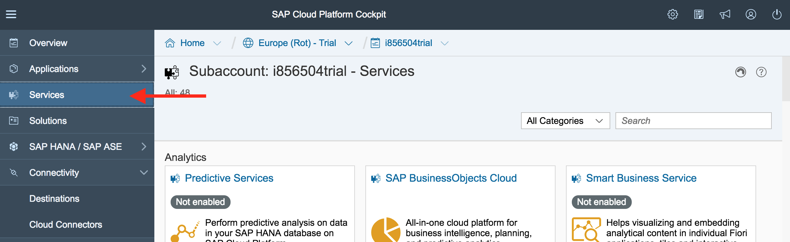
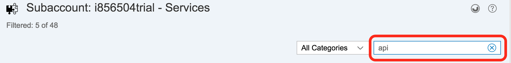
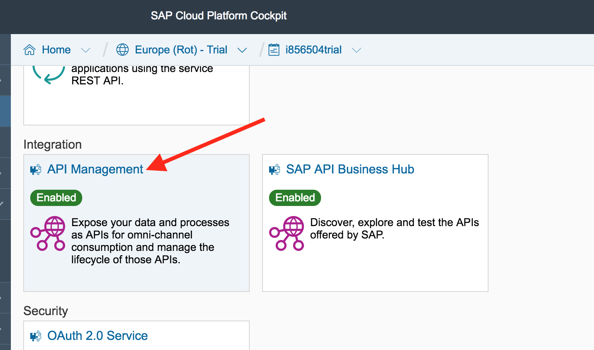
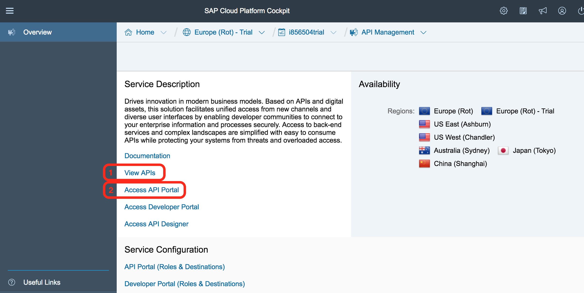
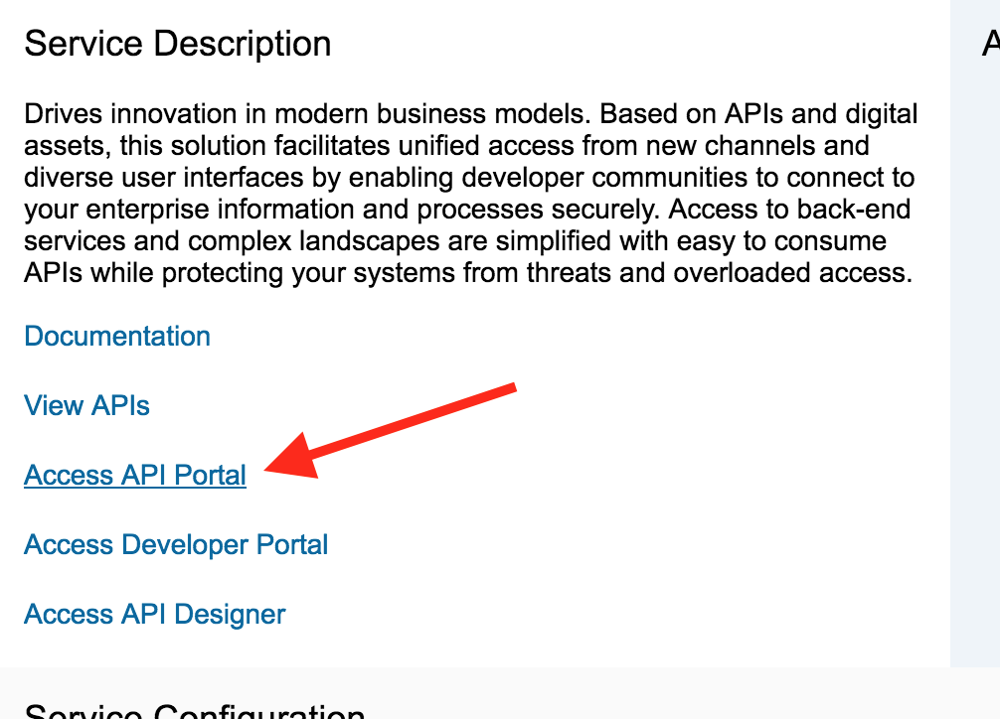
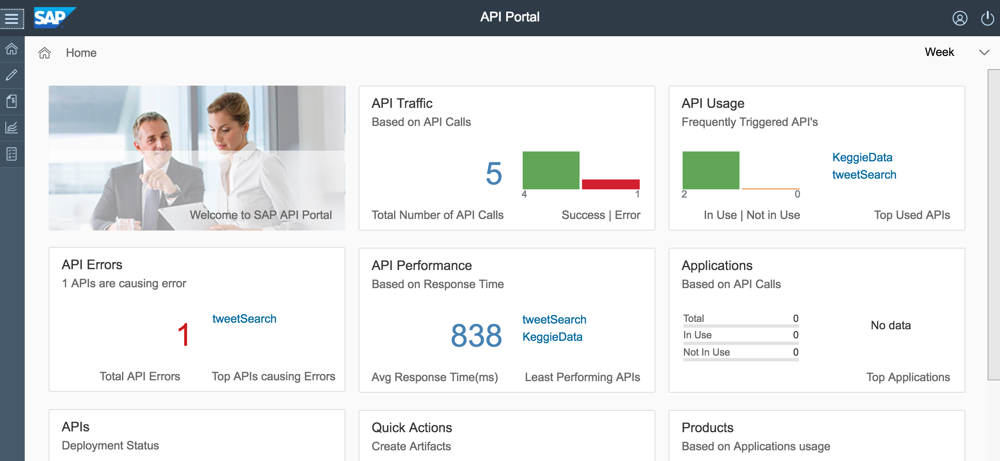
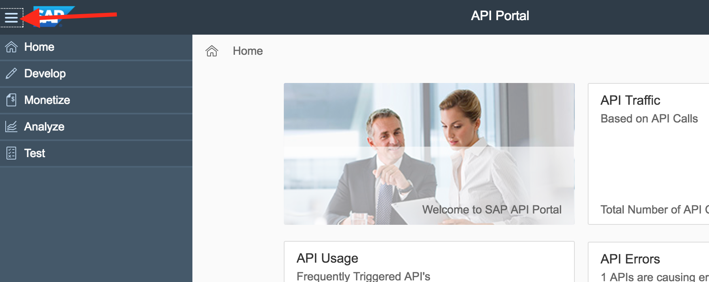

# Getting Started with SAP API Management
<!-- description --> Where to find SAP API Management in SAP Cloud Platform

## Prerequisites  
 - **Proficiency:**  Intermediate
 - **Tutorials:** [Do this tutorial first](https://developers.sap.com/tutorials/hcp-create-trial-account.html)

## You will learn  
This tutorial will show you were to find the SAP API Management service available from the SAP Cloud Platform and help you understand the capabilities of API Management
## Time to Complete
**5 Min**

---

### Open your SAP Cloud Platform

To get started, **open or return to your SAP Cloud Platform account**. If you need to sign up for a free, trial account, visit the [Sign up for an SAP Cloud Platform Trial tutorial](https://developers.sap.com/tutorials/hcp-create-trial-account.html).

In your SAP Cloud Platform Cockpit, select **Services** from the side menu.

### Go to the API Management service

On the **Services** page, search for _API_ in the search box.

In the search results, find the **Integration** section. This is where you will find the API Management service.

Click on **API Management** to open the service.

### Explore the API Management tools

On the API Management Overview page, you will notice a bunch on links. Certain links will take you to different SAP API products and catalogs.

In the image above, _box #1_ is a link to the SAP API Business Hub, which is a central catalog for both APIs and Business Services provided by both SAP and select partners. To learn more about the SAP API Business Hub, try this [Getting Started with the API Hub tutorial](https://developers.sap.com/tutorials/hcp-abh-getting-started.html).

In the image above, _box #2_ is a link to the landing page for the SAP API Portal, or one of SAP's API Management tools. The API Portal enables you to develop, analyze, monetize, and test APIs.

### Open the API Portal

Click on the **Access API Portal** link.

This will open the API Portal.

In the **API Portal**, you can manage your APIs in many ways, including analyzing deployed APIs, developing new APIs, and testing your APIs. Clicking on the 3 lines in the upper left hand corner will show you the different options you have.

Click on the different items to explore the features more!

