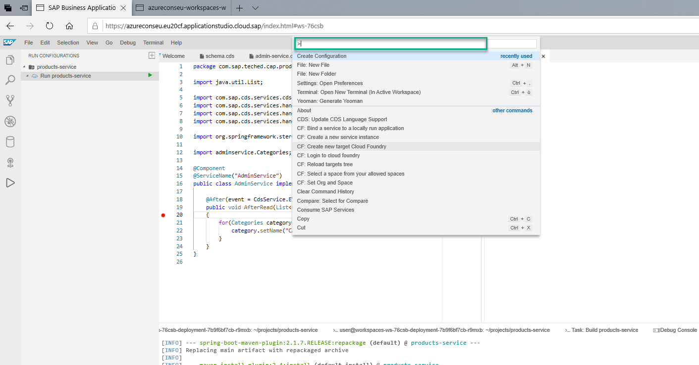
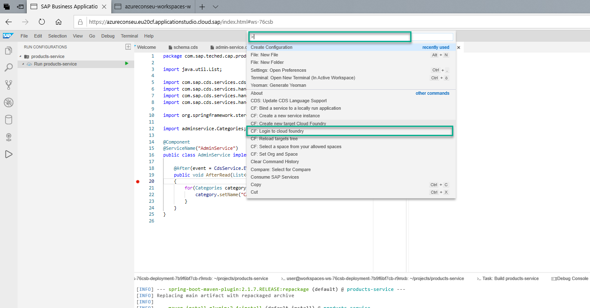
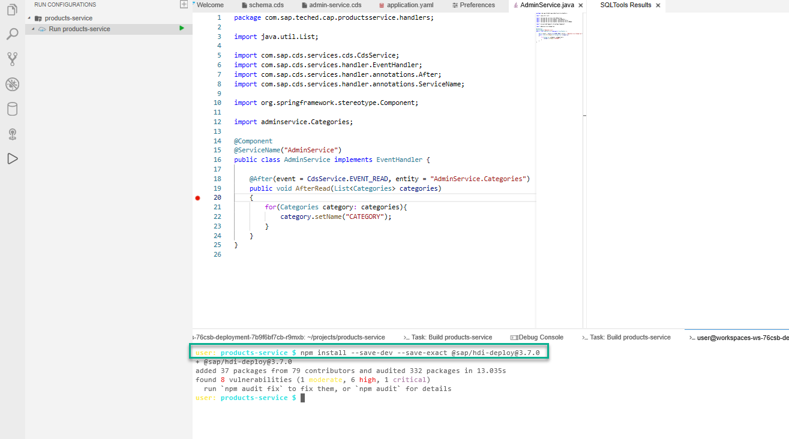
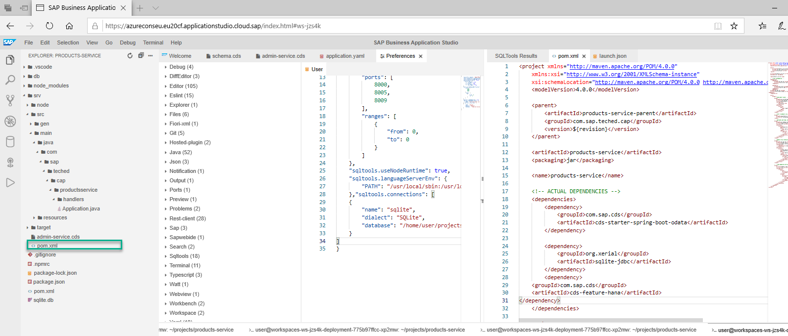
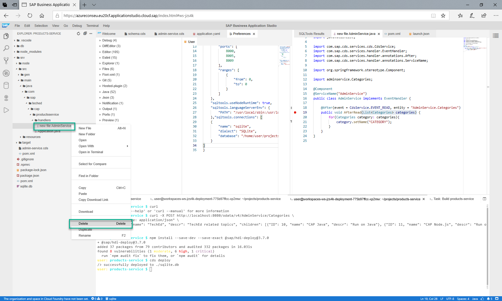
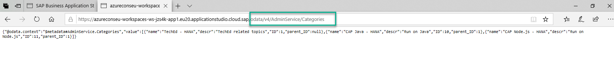

# Run your service with SAP HANA database
<!-- description --> Deploy your data model to SAP HANA and test your service locally

## Prerequisites
## You will learn
  - How to connect to Cloud Foundry from **`AppStudio`**
  -	How to deploy the data model to an SAP HANA database.
  -	How to run your service locally with a connection to a remote SAP HANA database.


---

### Connect to Cloud Foundry

1. From the main menu, choose **View > Find Command** to open the command palette.

    

2. Choose **CF: Login to cloud foundry**.

    

3. Choose the desired API end-point.

4. Provide your Cloud Foundry your credentials.

5. Choose your organization.

6. Choose your space.


### Deploy to SAP HANA Database

1.	Open a **new Terminal**.
2.	Run the command **`npm install --save-dev --save-exact @sap/hdi-deploy@3.7.0 `** in the terminal.

    

3.	Run the command **`cds deploy --to hana:productsservice-hana`**.

This command creates the SAP HANA service instance and initializes the HDI container.


### Run your service locally with connection to a remote database

**Configure your application to use SAP HANA locally**

1.	Edit the pom.xml file in the `srv` directory (not the pom.xml file located in the root project folder) and add the following dependency under the <dependencies> tag:
```
<dependency>
    <groupId>com.sap.cds</groupId>
    <artifactId>cds-feature-hana</artifactId>
</dependency>
```



### Run

1.	Before starting your application, make sure you **stop** any running instances using the terminal or the Debug view.
2. Go to `srv/src/main/java/com/sap/teched/cap/productsservice/AdminService.java`.

3. Select the AdminService.java file and **delete** it. (We deploy the application without the custom code.)

    

4.	Make sure that you are in the **root** of the project.
5.	Start your application by running **`mvn spring-boot:run -Dspring.profiles.active=cloud`**
> Note: The Java system property-Dspring.profiles.active=cloud ensures that the default configuration using SQLite as the database, which is still defined in the application.yaml file, does not get activated. The following log lines indicate that the SAP HANA configuration was picked up:
    - Load default-env.json from directory `/home/user/projects/products-service`.
    - Register `DataSource` bean definition for connected service `productsservice-hana`.

6. Run a request to test the service from a new terminal.
```
curl -X POST http://localhost:8080/odata/v4/AdminService/Categories \
-H "Content-Type: application/json" \
-d '{"ID": 1, "name": "TechEd - HANA", "descr": "TechEd related topics", "children": [{"ID": 10, "name": "CAP Java - HANA", "descr": "Run on Java"}, {"ID": 11, "name": "CAP Node.js - HANA", "descr": "Run on Node.js"}]}'
```

7. Open your application in the browser and add **`/odata/v4/AdminService/Categories`** to your URL.

    


---
