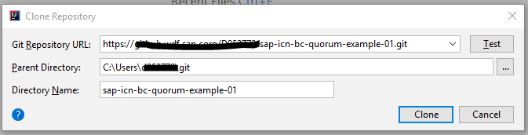
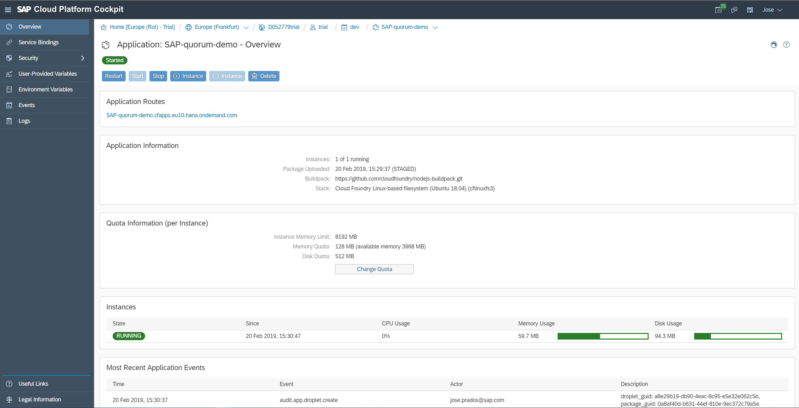
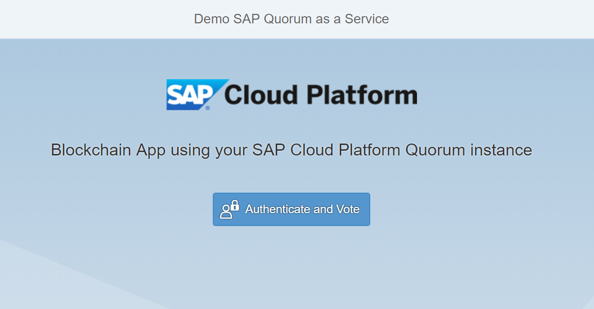
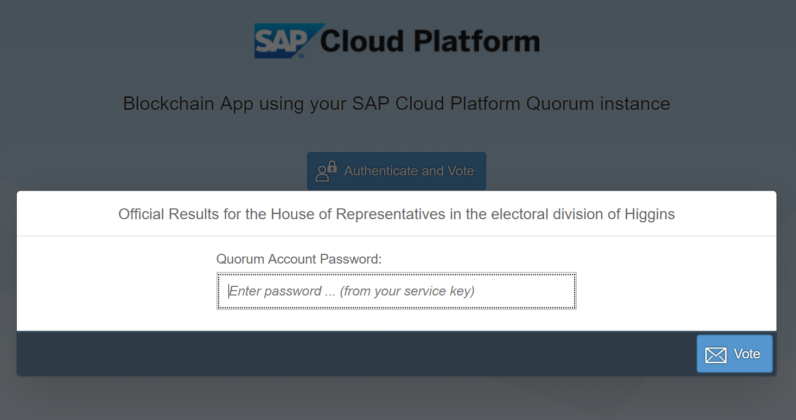
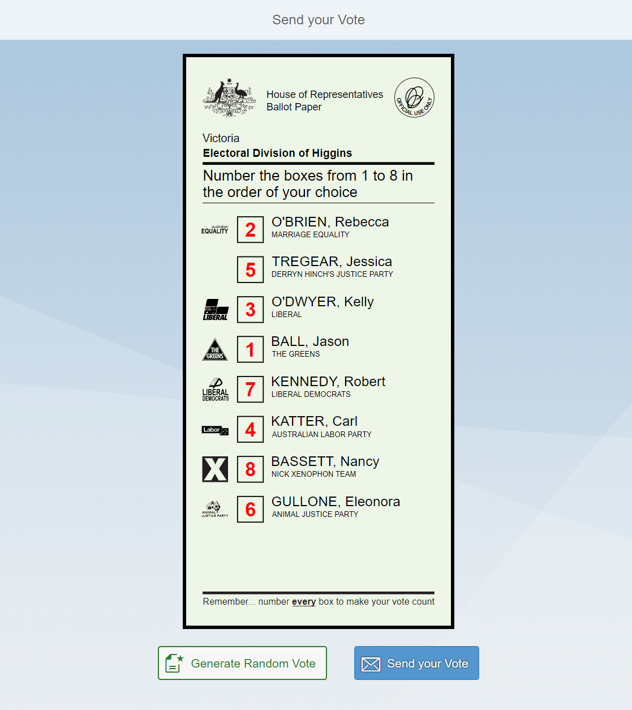
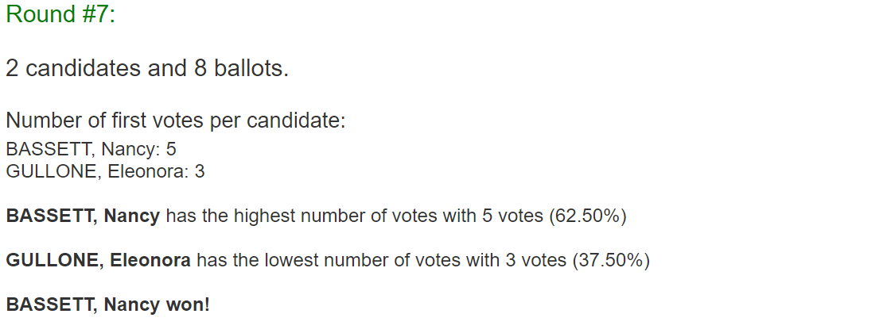

# Consume Quorum Node from a Cloud Application
<!-- description --> Use the Quorum service from a cloud application deployed on SAP Cloud Platform.

## Prerequisites
 - Access to Git Command Line: Install from [Git Command Line ](https://git-scm.com/downloads)
 - Access to Node JS: Install from [Node.js](https://nodejs.org/en/download/)
 - Access to Cloud Foundry Command Line interface: Install from [Cloud Foundry Command Line](https://docs.cloudfoundry.org/cf-cli/install-go-cli.html)
 - Access to a text editor
 - Access to a Quorum development node on SAP Cloud Platform - (Link)

## You will learn
  - How to use the Quorum service in a cloud application
  - How to consume a Solidity smart contract from a cloud application
---

### Quorum on the SAP Cloud Platform


Quorum is a code fork of `Ethereum` by `JPMorgan Chase`, available as an [open source project on GitHub](https://github.com/jpmorganchase/quorum). Unlike `Ethereum`, Quorum enables private and `permissioned` blockchain.

At a glance, Quorum offers:

* **`Permissioned` networks:** Quorum introduced a whitelist to prevent unwanted peers to connect to the blockchain network.
* **Private transactions:** Quorum introduced a privacy layer that allows to send private transactions between peers.
* **High throughput and instant transaction finality:** According to the Istanbul EIP, Quorum allows higher transaction throughputs than `Ethereum` as well as the prevention of forks.
* **Less energy consumption:** Traditional Proof of Work requires additional energy consumption that is not required for private blockchain in most cases. Quorum introduces two consensus mechanisms: Istanbul BFT and Raft. SAP Cloud Platform's Quorum service only supports Istanbul BFT.
* **No Gas price:** While the concepts of Gas and Gas limits still exist in Quorum, the Gas is free.

The Quorum service is integrated into SAP Cloud Platform via a service broker. The service broker supports several node types as service plans.

**Development Nodes**

 The simplest node type is a development node. This is effectively an environment with all relevant APIs for developing and testing of Solidity smart contracts on a fixed network with shared nodes. This node type has private transactions disabled because of the nature of shared nodes.


**`Testnet` Nodes**

For more complex testing of real-world scenarios, `Testnet` nodes are supported. In this network, the Quorum nodes are part of a cross organizational test network available for developing and testing distributed applications, including private transactions. Partners and customers can provision single nodes into this network creating a testing a specific private test scenario using private transactions.


**Connect Your Own Network**

The Connect Your Own Network (`CYON`) plan supports consortium cases where the complete Quorum network is provisioned and operated outside of the SAP Cloud platform (for example centrally by the consortium), and where the external node needs to be made accessible from SAP Cloud Platform. This service plan enables the transparent connection of SAP business processes onto this external network.


You will be deploying a smart contract to your Quorum instance on SAP Cloud Platform using a sample cloud application written on [Node.js](https://nodejs.org/en/download/), understanding the basic end-to-end process of compiling and deploying a smart contract.


### Clone GitHub repository of cloud application


Open the [SAP GitHub home page](https://github.com/sap) and search for repository `sap-icn-bc-quorum-example-01`. On the repository page get the repository URL by clicking on **Clone or download**.


Save this URL locally or keep the GitHub repository page open.

On a code editor of your choice, clone the GitHub repository using the previous URL.



After cloning the repository the cloud application `sap-icn-bc-quorum-example-01` should be appear in your code editor with the following structure:

```ruby
> sap-icn-bc-quorum-example-01  
 > config
 > contracts
 > index.js
 > manifest.yml
 > package.json
 > package-lock.json
 > public
```


### Install npm modules


Once the GitHub repository is cloned you need to install all the `packages` (modules) declared as dependencies in file `package.json`:
```json
{
  "name": "sap-app-voting-quorum",
  "version": "0.1.0",
  "main": "index.js",
  "scripts": {
    "start": "node index.js"
  },
  "author": "SAP SE",
  "dependencies": {
    "cfenv": "^1.0.4",
    "express": "^4.16.2",
    "request": "^2.81.0",
    "cors": "^2.8.4",
    "body-parser": "^1.18.2",
    "web3": "1.0.0-beta.34"
  }
}
```
For this, from the Terminal session or Command Prompt session with , run first (*with administrative rights*):

```ruby
> npm --add-python-to-path='true' --debug install --global windows-build-tools
```
and then:
```ruby
> npm install
```
to download the necessary node modules.


### Configure cloud application to use your Quorum instance

Once the necessary modules have been installed, you need to provide the RPC endpoint and account address of the Quorum node you want to connect to.
For this open the file `quorum_node.json` in folder `/config` and provide the following information:

* **RPC endpoint (RPC)** of your Quorum node from the service key maintained on the SAP Cloud Platform
* **Account address (account)** of your Quorum node from the service key maintained on the SAP Cloud Platform
```json
{
    "rpc": "https://brrtz-2.qaas-prod-eu.quorum.icn.engineering/WNGZ1dhyCHmRFSYvjc2sjc9gJRj-wdMfwF3vQ7ZKK0o=",
    "account": "0xe36E57C7E4134740f309aE6E83D5d09579D09b86",
    "contract": {
        "abi": [
            { ... }
        ],
        "bytecode":"608060405234801561001057600080fd5b50610afe8061..."
    }
}
```

In this file you can find also the **ABI (Application Binary Interface)** and the **Bytecode** of smart contract to be deployed to your Quorum instance.


### Connecting to your Quorum instance


We will now inspect the source code to understand how to deploy a smart contract from this cloud application. For this open the file `index.js`.
In this file we first import the modules and files required by the cloud application:

```ruby
    var express = require("express");
    var bodyParser = require("body-parser");
    var request = require("request");
    var Web3 = require("web3");
    var cfenv = require('cfenv');
    var config_node = require('./config/quorum_node.json');
```

Relevant to deploy and interact with smart contracts is the [`Web3.js` library**](https://github.com/ethereum/web3.js/), which is a collection of libraries which allow you to interact with, in this case, your Quorum node, using a HTTP or IPC connection.
To connect to your Quorum instance we create a new `Web3` instance using the `RPC endpoint` of your Quorum node as provider. For this, see function `handleInitialize`:

```ruby  
    web3 = new Web3(new Web3.providers.HttpProvider(baas_options.rpc));
```

In addition the function `handleInitialize` is responsible for deploying the smart contract to your Quorum instance after unlocking the Quorum account you have maintained in the service key on the SAP Cloud Platform:
```ruby  
	web3.eth.personal.unlockAccount(config_node.account, sPwd, 0).then(function () {
		console.log(">> Quorum Account unlocked!");

		var contractInfo = {
			bytecode: config_node.contract.bytecode,
			abi: config_node.contract.abi
		}
		var contract = new web3.eth.Contract(contractInfo.abi);
		contract.deploy({
			data: "0x" + contractInfo.bytecode,
			arguments: [0],
		}).send({
			from: config_node.account,
			gas: 9990000
		}).then((newContractInstance) => {
			chainName = newContractInstance.options.address;
			console.log(">> Contract creation confirmed. Address: " + newContractInstance.options.address);
			respJSON = {
				"contractAddress": newContractInstance.options.address
			};
			res.status = 200;
			res.send(respJSON);
		}).catch((reason) => {
			respJSON = {
				"error": reason
			};
			res.status = 500;
			res.send(respJSON);
			console.log(">> Error when creating contract: ", reason);
		});
	});
```


### How to interact with the smart contract


Interacting with the smart contract means invoking the functions defined in it. For this tutorial we are using the following smart contract already compiled, that means we know the corresponding `ABI (Application Binary Interface)` and the `Bytecode` (see `file config_quorum.json`).

Before invoking a smart contract function we have to create a new contract instance with all its methods and events defined in its `ABI`.
For this, see function `getContract` in `file index.js`:

```ruby
function getContract() {
	var contractInfo = {
		bytecode: config_node.contract.bytecode,
		abi: config_node.contract.abi
	}
	return new web3.eth.Contract(contractInfo.abi, chainName);
}
```

Once the contract instance is created we can now invoke the functions defined in its `ABI`. The application function `handlePATCH` invokes the smart contract function `update` to store a new update to an object identified by a given key.

**Smart Contract Function**
```ruby
function update(string memory key, string memory value) public {
  if (availableHistories[key] == false) {
       emit WriteAttempt(404);
  } else {
       histories[key].push(History({timestamp: now, value: value}));
       emit WriteAttempt(201);
  }
}
```

**Application function invoking contract**    
```ruby
function handlePATCH(req, res) {
	var respJSON = {};
	var contract = getContract();

	contract.methods.update(req.params.key, JSON.stringify(req.body)).estimateGas({
		from: config_node.account
	}).then(function (estimatedGas) {
		console.log(">>Estimated gas for Update History: ", estimatedGas);
		contract.methods.update(req.params.key, JSON.stringify(req.body)).send({
			gas: estimatedGas,
			from: config_node.account
		}).then((receipt) => {
			if (receipt.events && receipt.events.WriteAttempt && receipt.events.WriteAttempt.returnValues &&
				receipt.events.WriteAttempt.returnValues.statusCode) {
				if (receipt.events.WriteAttempt.returnValues.statusCode == 201) {
					respJSON = {
						"transactionId": receipt.transactionHash
					};
					res.status = receipt.events.WriteAttempt.returnValues.statusCode;
					res.send(respJSON);
				} else {
					console.log(">> unexpected receipt format", receipt.events.WriteAttempt.returnValues.statusCode);
					respJSON = {
						"error": "Invalid Quorum response"
					};
					res.status = 500;
					res.send(respJSON);
				}
			}
		}).catch((err) => {
			console.log(">> unexpected receipt format", err);
			respJSON = {
				"error": "Invalid Quorum response"
			};
			res.status = 500;
			res.send(respJSON);
		});
	});
}
```
You can estimate the gas a method execution will take when executed in the EVM.
The estimation can differ from the actual gas used when later sending a transaction, as the state of the smart contract can be different at that time.

Invoking the contract function `update` with the required parameters `key` and `value` will send a transaction to the smart contract and execute its method. This will alter the smart contract state.
Note that you are invoking this contract function with the account `address (from)` of your Quorum instance and the `gas` you estimated previously.

As a result the `transaction receipt` is available containing the events fired when invoking this contract function. In this case the event `WriteAttempt` is fired with the resulting status code.


### Deploying the cloud application to Cloud Foundry


You can now deploy the application to Cloud Foundry using the Cloud Foundry Command Line Interface.
First you should login to the API Endpoint on Cloud Foundry running the following command from the command prompt of your terminal session. You will be requested to enter Email or Username, Password and to select an organization, i.e. subaccount:

```ruby
> cf login -a <API Endpoint on Clouid Foundry>
```

You can find out the API Endpoint accessing your Subaccount on your the SAP Cloud Platform account.

Once logged in, you can deploy the cloud application on Cloud Foundry running the command:
```ruby
> cf push
```

If successfully deployed you will see such a success message in the Terminal session displaying the URL to start the application:
```ruby
requested state: started
instances: 1/1
usage: 128M x 1 instances
urls: SAP-quorum-demo.cfapps.eu10.hana.ondemand.com
last uploaded: Wed Feb 20 14:29:37 UTC 2019
stack: cflinuxfs3
buildpack: https://github.com/cloudfoundry/nodejs-buildpack.git

     state     since                    cpu    memory      disk        details
#0   running   2019-02-20 03:30:47 PM   0.0%   0 of 128M   0 of 512M
```


### Starting the cloud application


####About the business scenario
In this tutorial we will use this cloud application for supporting an e-voting scenario. E-voting allows voters to use electronic media to participate in votes and elections. Voters currently vote in person at the ballot boxes or by mail. Using e-voting solutions makes them possible to vote online by smartphone, tablet or computer anytime and anywhere.

Using the blockchain as a database, the ballots will be saved on a distributed network and all voters will be able to view voting results as they progress. Also, it would make sure people do not vote twice or delete votes, because of the immutable record of their vote and their identity. People responsible for counting votes would have a final record of every vote counted that could be checked by regulators or auditors at any time.

In particular, the scenario based on the **Australian Electoral Division Higgins in Victoria for the Australian House of Representatives**.
The system of voting used in elections for the House of Representatives in Australia is preferential, that is, voters have to rank all candidates in order of preference—they may not just vote for one candidate.

####Running the application on SAP Cloud Platform
Once the cloud application is deployed to Cloud Foundry you can run it from your space on the SAP cloud Platform. For this on the SAP cloud Platform, navigate to the space you deployed the application and click on **Applications**. You should see the cloud application with the state **Started**.


Click on the application name to navigate to the overview page of this particular application.



Now you can start the application clicking on the URL in **Application Routes**.

When starting the application you will routed to entry page **Blockchain App using your SAP Cloud Platform Quorum instance**.



In this screen you have to authenticate with the password you have maintained for the Quorum account when creating the service key on the SAP Cloud Platform. This action will trigger a request for unlocking your Quorum account (function `handleInitialize`) before starting casting ballots.

```ruby
function handleInitialize(req, res) {
...
    web3.eth.personal.unlockAccount(config_node.account, sPwd, 0).then(...);
...
}
```


Now you can simulate the Elections for the House of Representatives (`Division of Higgings`) in Victoria State in Australia by first `Generating a Random Vote`, this will generate a new Voter and a random ballot, and then `Sending your Vote`.

After that the ballot will be stored on the blockchain, invoking the contract function `update` and cannot be manipulated anymore.

Repeat these two steps, in this order, 10 times.



After having sending several 'Send your Vote'- requests you can know take a look at the results clicking on  on the top right.
You can now figure out which candidate and after how many rounds would win this election.

In my case, having cast 8 ballots it was: **Nancy BASSET** after seven rounds!



**Note** that when counting the ballots the application invokes the contract functions `get` and `getHistorySize` for retrieving all the votes related to this election.

```ruby
function handleReadSize(req, res) {
	var respJSON = {};
	var contract = getContract();

	contract.methods.getHistorySize(req.params.key).call().then((value) => {
		respJSON = {
			"size": parseInt(value, 10)
		};
		res.status = 200;
		res.send(respJSON);
	}).catch((err) => {
		console.log(">> Error when getting history: ", err);
		respJSON = {
			"error": " Error when getting history"
		};
		res.status = 500;
		res.send(respJSON);
	});
}

function handleRead(req, res) {
	var respJSON = {};
	var contract = getContract();
	var iIndex = parseInt(req.body.index, 10);

	contract.methods.get(req.params.key, iIndex).call().then((value) => {
		if (value === "0") {
			respJSON = {
				"error": "No History found for this object"
			};
			res.status = 404;
			res.send(respJSON);
		} else {
			respJSON = {
				"history": value
			};
			res.status = 200;
			res.send(respJSON);
		}
	}).catch((err) => {
		console.log(">> Error when getting history: ", err);
		respJSON = {
			"error": " Error when getting history"
		};
		res.status = 500;
		res.send(respJSON);
	});
}
```  


