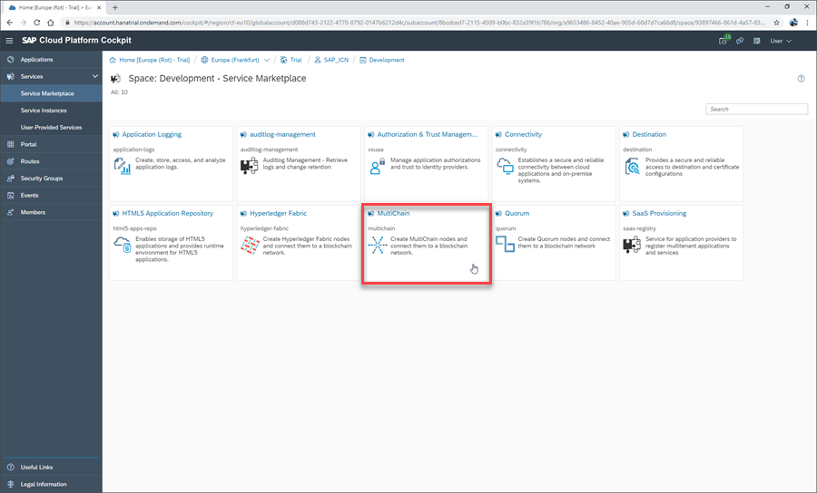
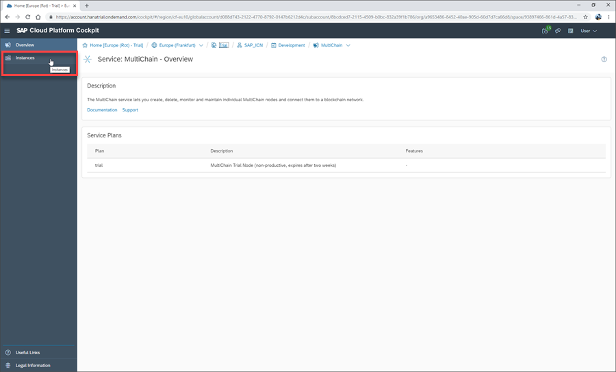
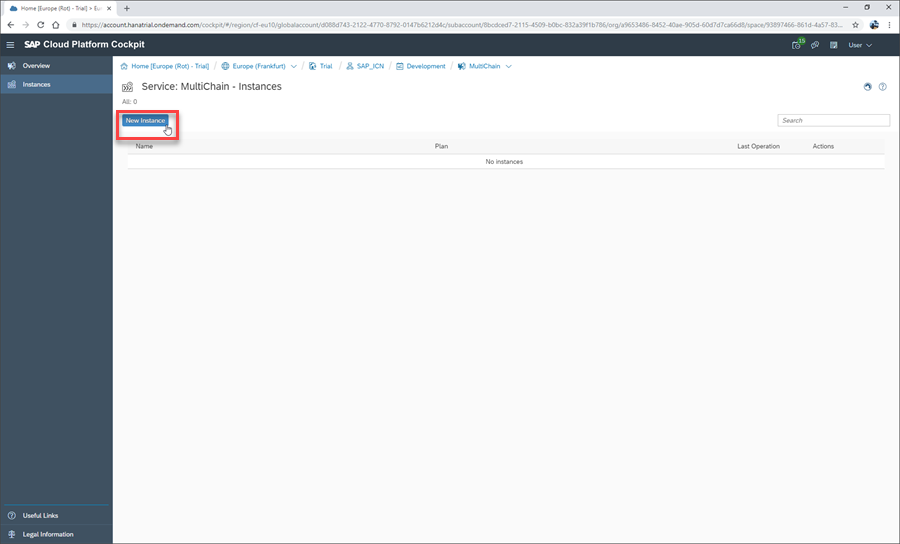
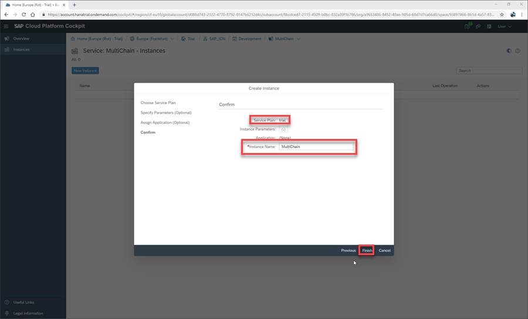
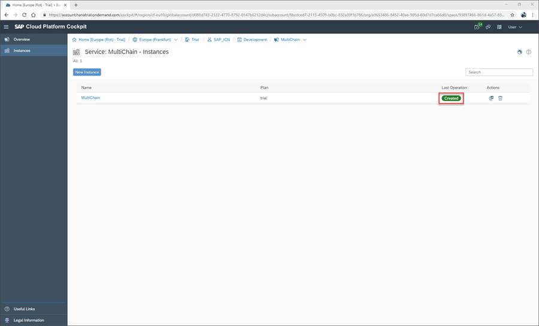

# Create MultiChain Trial Node
<!-- description --> Learn how to create a MultiChain trial node on SAP Cloud Platform, enabling you to build and test a MultiChain blockchain network

## You will learn
  - How to provision a MultiChain trial node on SAP Cloud Platform

---

### Understand MultiChain on SAP Cloud Platform

The MultiChain service on SAP Cloud Platform lets you create, delete, monitor, and maintain individual MultiChain nodes and then connect them to a blockchain network.

This service is supported by Small, Medium, Large, and Connect Your Own Network productive service plans.

In addition to productive service plans, we also offer a Trial service plan on the trial landscape. This plan comes with the following conditions:

- One trial service instance per SAP Cloud Platform Global Account

- Service instances expire after 14 days, including the loss of the blockchain data (if not synced to a wider network), wallet data (public and private keys), and external IP addresses used to connect to other nodes.

- An existing service instance, whether expired or not, must be deleted before a new service instance can be provisioned within the Global Account.

### Open the MultiChain Service

Once on the SAP Cloud Platform Service Marketplace, locate and open the MultiChain service by clicking the relevant service tile:

### Navigate to Instances

Once in the MultiChain service, you will see a service description and the available plans. In this tutorial you will create a trial node. This allows you to provision a single testing node for a 14 day period.

Click the **Instances** tab on the side menu, opening an overview of available MultiChain instances in your subaccount:

### Create New Instance

Once on your MultiChain instances overview, click **New Instance** to open the service instance wizard:

### Choose Service Instance Settings

Navigate through the service instance wizard, selecting the following settings:

Field | Value
:------|:--------
**Plan**  | `trial`
Specify Parameters | N/A
Assign Application | N/A
**Name** | `MultiChain`

After selecting the settings, click **Finish**.

### Confirm Creation of Node

Your trial node will now be provisioned (which may take a few moments) and displayed on the overview of available service instances.

