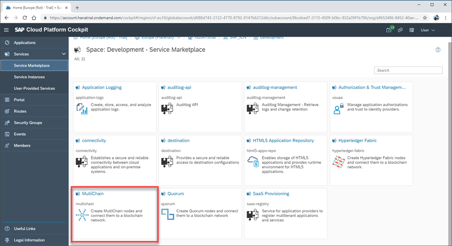

# Navigate to MultiChain Service on SAP Cloud Platform
<!-- description --> Learn how to navigate to the MultiChain service on SAP Cloud Platform

## Prerequisites
 - Access to an SAP Cloud Platform global account (trial or paid), with sub-account and space defined. (When registering for an SAP Cloud Platform trial account, both a sub-account and space are automatically created for you.)

## You will learn
- An overview of SAP Cloud Platform, its environments, and wider infrastructure
- An understanding of how blockchain services are represented on SAP Cloud Platform
- The difference between global accounts, sub-accounts, and spaces on SAP Cloud Platform
- How to navigate to SAP Cloud Platform Service Marketplace and locate the MultiChain service

---

### Understand SAP Cloud Platform

SAP Cloud Platform is effectively an umbrella over several cloud environments, providing the infrastructure for SAP and SAP's customers for enabling best-of-breed cloud experience.

SAP Cloud Platform supports the following environments: Cloud Foundry, Kubernetes, and ABAP.

- **Cloud Foundry**: Environment for scalable web applications running in the cloud
- **Kubernetes**: For hosting container landscapes
- **ABAP**: Complete ABAP systems running in a cloud environment

To achieve a worldwide footprint, SAP Cloud Platform uses different infrastructure providers:

- SAP own computer centers
- Amazon AWS
- Microsoft Azure
- Google GCP
- Alibaba

SAP Cloud Platform Blockchain service is available as a service within the Cloud Foundry environment, initially within two regions:

- Europe (EU10)
- US East (US10)

### Log on to SCP

To access SAP Cloud Platform and navigate to the Blockchain service, do the following:

1. Open a browser and navigate to SAP Cloud Platform homepage.

    <https://account.hanatrial.ondemand.com>

2. Click **Log On** and enter your account details when prompted.

    

This gives you access to your SAP Cloud Platform cockpit.

### Select your Global Account

Once in the SAP Cloud Platform cockpit, you can access global accounts. These often represent an entire company and can be viewed as an empty shell used for billing, recording data consumption, and grouping resources together. They can't be used to directly run applications or services, however.

Click the global account name to open its cockpit. In this example, we are using our `Trial Account` global account.

### Select your Subaccount

Once in your global account cockpit, you can access sub-accounts.

A sub-account is the selection of a specific environment, hosted at a specific provider in a specific region. As such, global accounts can house one to many sub-accounts at any one time.

Click your sub-account name to open its cockpit. In this example, we are using our `SAP_ICN` sub-account.

### Select your Space

Once in your sub-account, you can access your relevant space.

Spaces allow organizations to divide their sub-accounts into specific teams or projects, helping to map the structure of their organization into clearly defined areas.

One common example is to use one space for development, and another space for testing.

To access your spaces, click the **Spaces** tab on the side menu.

Select your space from the dashboard. In this example, we are using our **Development** space.

### Open Service Marketplace

Once inside your space, you have access to a number of features, including the Service Marketplace.

To access the Service Marketplace, click the  **Service Marketplace** tab on the side menu.

### Viewing the Service Marketplace

Within the Service Marketplace, all the supported services are available. For example, if an application requires a `MongoDB`, then within the Service Marketplace select the `MongoDB` service and provision an instance of this service within this Cloud Foundry space.

The SAP Cloud Platform Blockchain offering is available with the Service Marketplace as several services, each of which can be provisioned individually as required.

 At a technology level, there are services for Hyperledger Fabric, MultiChain, and Quorum. Any of these services can be used to provision the relevant blockchain technology. In addition, SAP offers a set of blockchain agnostic services, which are grouped within the Blockchain Application Enablement service. These services are for example a timestamp service, or integration with HANA database.

