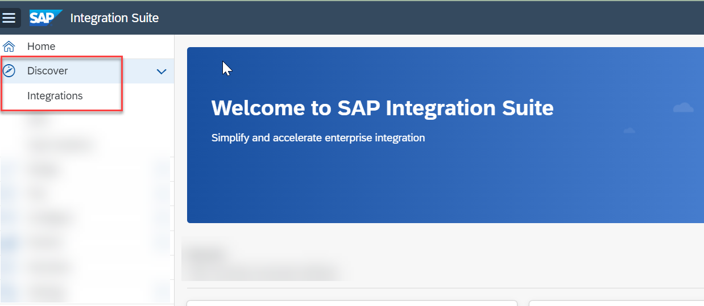
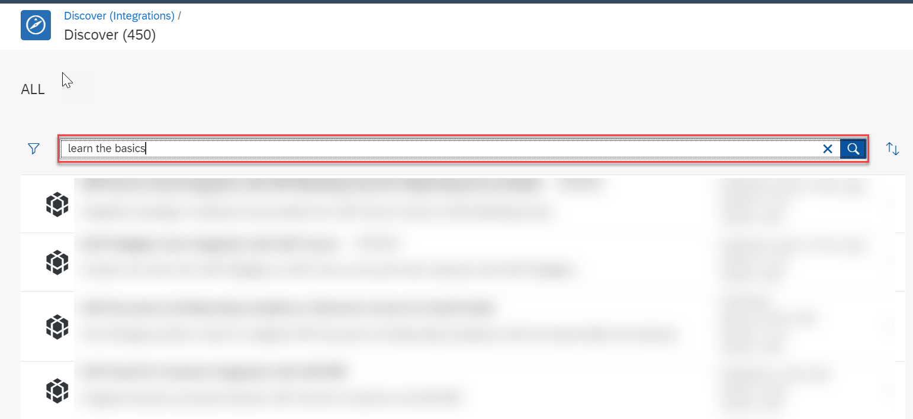
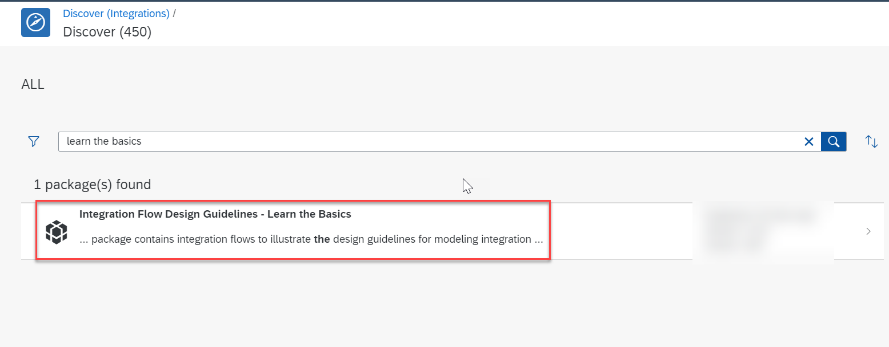
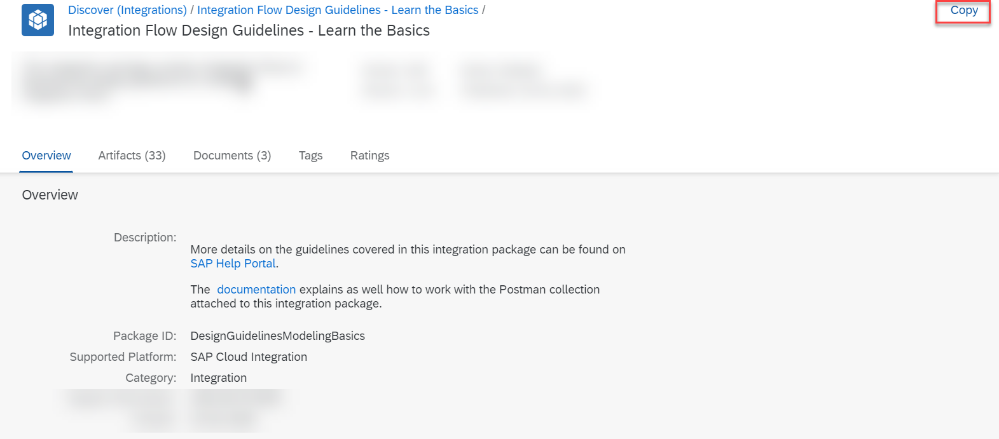
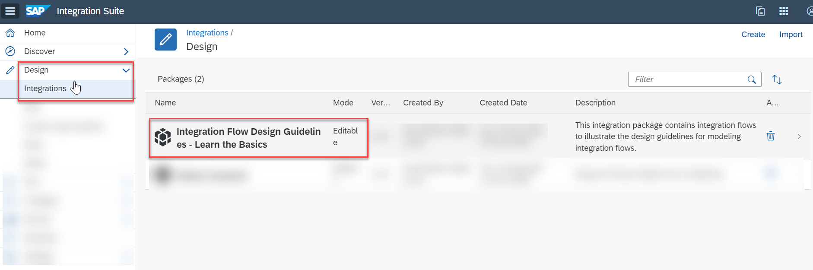
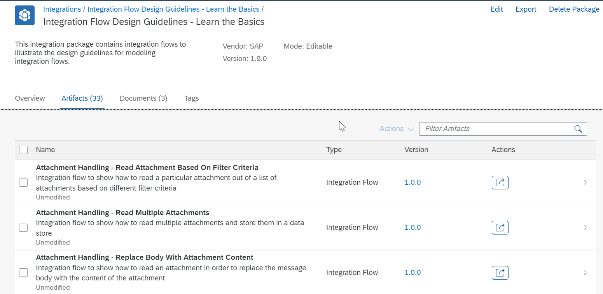
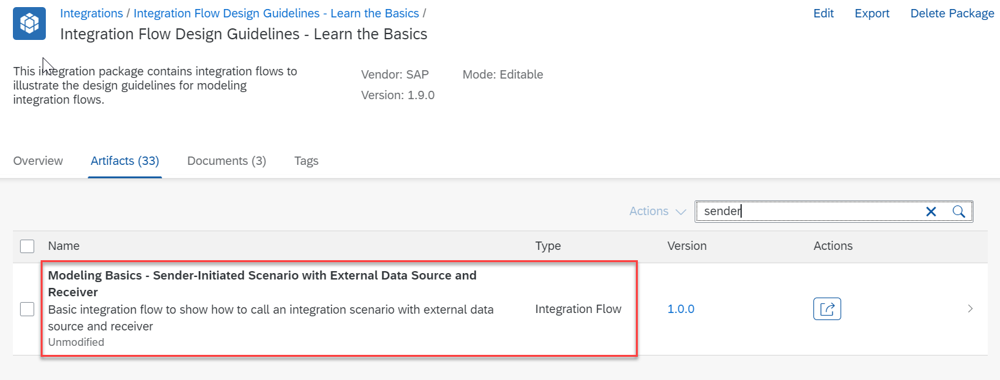
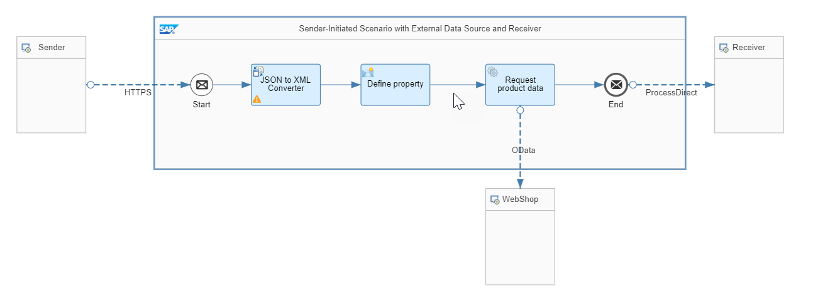
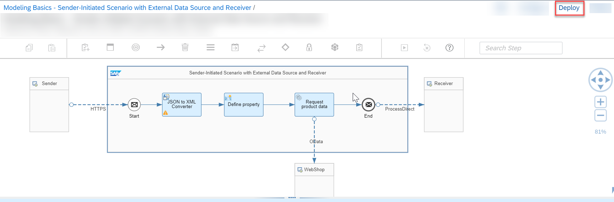
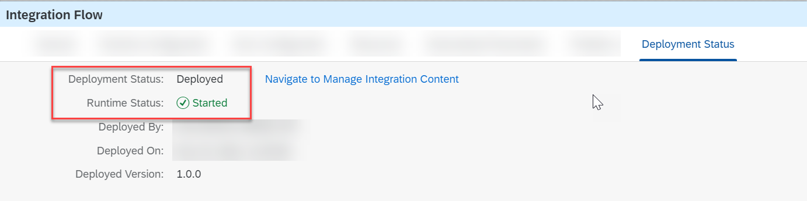

# Discover and Deploy An Integration Flow
<!-- description --> Discover a standard integration package that helps you solve an integration problem.

## Prerequisites
 - You have provisioned your SAP Integration Suite tenant in a free tier BTP account. For more information, see [Set up SAP Integration Suite, Free Tier](btp-integration-suite-free-tier-setup)

## You will learn
  - How to discover and reuse a standard integration package
  -	How to deploy an integration flow to a cloud-based runtime location and monitor the same
---

### Discover a Standard Pre-shipped Integration Package

SAP delivers rich and out of the box prepackaged integration content that enables you get started quickly. These integration packages are created for some of the commonly used business scenarios. They contain integration flows, value mappings, necessary documentation, and so on.

By using pre-shipped integration artifacts, you easily get started with minimal integration developer effort. These integration artifacts are designed in such a way that you only have to configure certain values.

To make it as easy as possible for you to develop this first integration flow, you don't need to set up a complicated receiver system. This integration flow works with the generic receiver that creates a data store entry and stands in as a receiver system.

1. Choose **Discover > Integrations**.

    <!-- border -->

2. In the search field, enter `learn the basics` and start search .

    <!-- border -->

3. Choose the integration package **Integration Flow Design Guidelines - Learn the Basics**.

    <!-- border -->

4. Choose **Copy**. The integration package gets copied to your design workspace.

    <!-- border -->

### Pick the Integration Flow for the Use Case

In this step, you reuse an existing integration flow from the copied package. This integration flow is designed to solve the use case mentioned in the [Integration Use Case for Free Tier](btp-integration-suite-free-tier-usecase).

1. Choose **Design > Integrations**. You can see that an editable version of the integration package **Integration Flow Design Guidelines - Learn the Basics** is available in your design workspace.

    <!-- border -->

2. Open the package and go to the **Artifacts** tab.

    <!-- border -->

3. In the filter field, enter `sender` and start search. You'll find an integration flow named **Modeling Basics - Sender-Initiated Scenario with External Data Source and Receiver**.

    <!-- border -->

4. Open the integration flow **Modeling Basics - Sender-Initiated Scenario with External Data Source and Receiver**.

    <!-- border -->

    The integration flow processes the message at runtime in the following way:

    - The HTTP client (represented by the Sender shape) sends an HTTP request to SAP Integration Suite through an HTTPS sender channel. The HTTPS request body, which is in JSON format, contains a product identifier.

    - The JSON-to-XML converter transforms the request body into XML format which can be processed in the following step by the Content Modifier.

    - The Content Modifier **Define property** defines the Data Store name:

        | Action | Name | Type | Value
        | --- | --- | --- | ---
        | Create | context | Constant | `ModelingBasics-SenderInitiated`

        It also creates an exchange property called `productIdentifier`, which is needed in the next step:

        | Action | Name | Type | Data Type | Value
        | --- | --- | --- | --- | ---
        | `Create` | `productIdentifier` | `XPath` | `java.lang.string` | `// productIdentifier`

      - The **Request Reply** step Request product data step passes the message to an external data source and retrieves data (about orders) from there.

      - An **OData Receiver** adapter is used for the connection to the OData source. To query for exactly 1 product, the header that was created in the preceding Content Modifier is used.

      - The OData API provides the details of one specific product, which is identified by the actual value of the `productIdentifier` field (provided with the inbound HTTP request).

      - As a last step, the **Process Direct** receiver adapter writes the data to the Data Store.

### Deploy the Integration Flow

 In this step, you deploy the integration flow to a cloud-based runtime location so that you trigger the message processing.

1. Choose **Deploy**.  Choose **Yes** in the confirmation dialog for deployment.

    <!-- border -->

2. Upon deployment confirmation, choose the **Deployment Status** tab in the property sheet. The expected deployment status is **Deployed** and runtime status is **Started**.

    <!-- border -->

---
