# Set up SAP Integration Suite, Free Tier
<!-- description --> Get onboarded to SAP Integration Suite with SAP BTP free tier account.

## Prerequisites
 - [Get an Account on SAP BTP to Try Out Free Tier Service Plans](btp-free-tier-account)
 - [Manage Entitlements Using the Cockpit](btp-cockpit-entitlements)

## You will learn
  - How to subscribe to the Integration Suite service
  -	How to subscribe to the service and assign user roles
  -	How to provision and activate the capabilities

---

### Subscribe to SAP Integration Suite

>**WHERE TO START**:

> - **Are you new to SAP BTP?** - skip the rest of the note and continue with the tutorial.

> - You already have a SAP BTP free tier account but new to SAP Integration Suite:

>     - If you have already activated Cloud Integration or API Management services in your subaccount:
          - **Option 1**:
          Create a **`New Subaccount`** and then proceed with the tutorial.
          For a new subaccount, you must assign entitlements by adding service plans and the quotas. For more information, see [Manage Entitlements Using the Cockpit](btp-cockpit-entitlements).        
          - **Option 2**:
          To continue with an existing subaccount, unsubscribe from Cloud Integration and API Management services, and then proceed with the tutorial.

> - If you have already subscribed to Integration Suite in your existing free tier account, proceed to **Step 2**. You can consume only one Integration Suite tenant per free tier account.

1. In your web browser, open your SAP BTP free tier global account. Then, navigate to your subaccount. You would have created a subaccount in the prerequisite. See: [Get an Account on SAP BTP to Try Out Free Tier Service Plans](btp-free-tier-account).

2. Choose **Services > Instances and Subscriptions** and then choose **Create**.

    <!-- border -->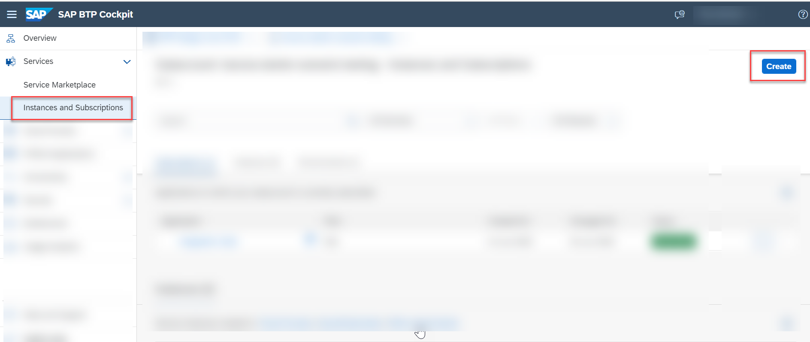

3. In the **New Instance or Subscription** dialog, choose **Integration Suite** from the list of services. Select the default plan which is **free**.

    >If Integration Suite is not visible in the **Services** list, you need to assign Integration Suite entitlements. To assign entitlements, see [Manage Entitlements Using the Cockpit](btp-cockpit-entitlements).

    <!-- border -->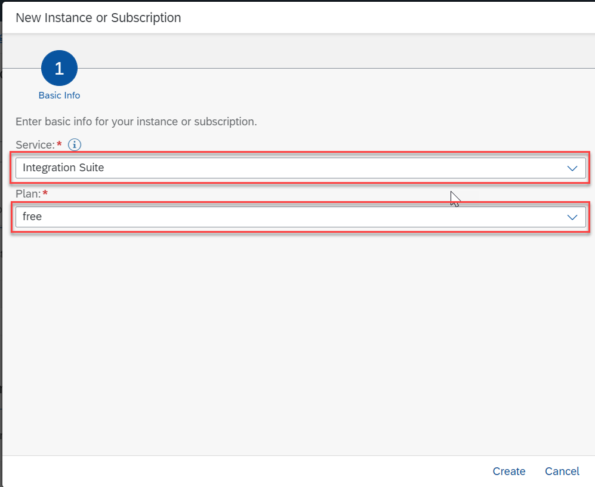

4.  Choose **Create**. You are subscribed to the service now.

    <!-- border -->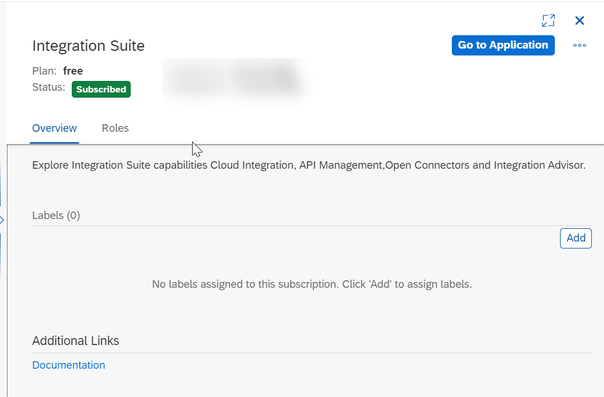

5. Choose **Security > Users**. Choose the entry against your name.

    <!-- border -->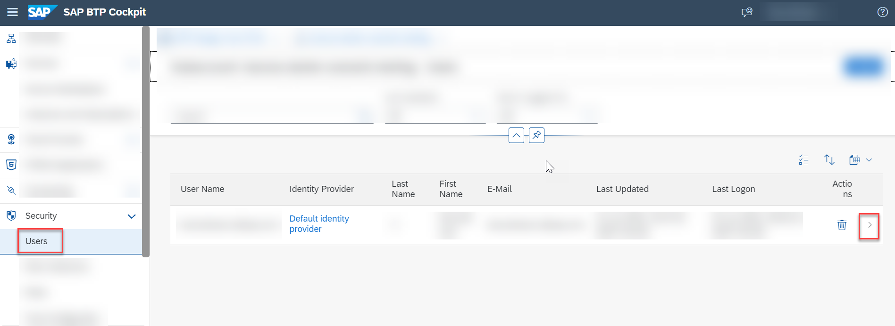

6. In the **Role Collections** section, choose **Assign Role Collection**.

    <!-- border -->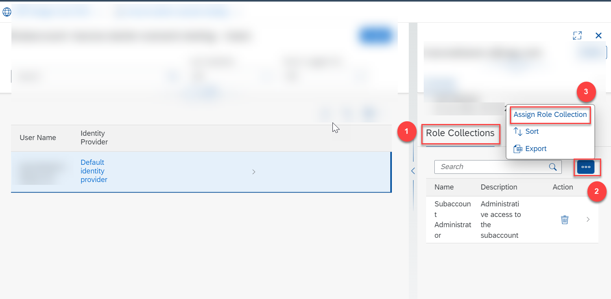

7. In the dialog that appears, select `Integration_Provisioner`. Choose **Assign Role Collection**.

    <!-- border -->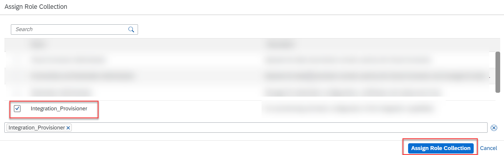

8. Navigate back to the **Instances and Subscriptions** page. Choose **Go to Application** for **Integration Suite**. Now you are directed to the Integration Suite home page.

    <!-- border -->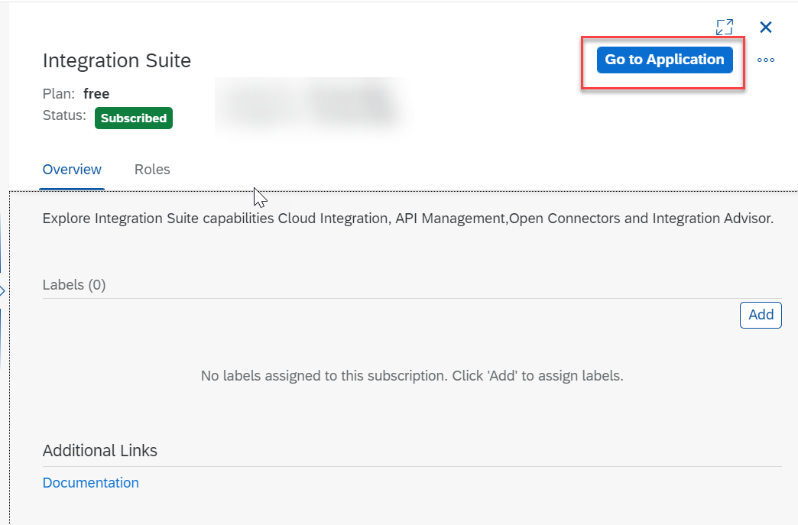

### Activate the capabilities

1. In the Integration Suite home page, choose **Add Capabilities** to activate the capabilities offered by Integration Suite.

    <!-- border -->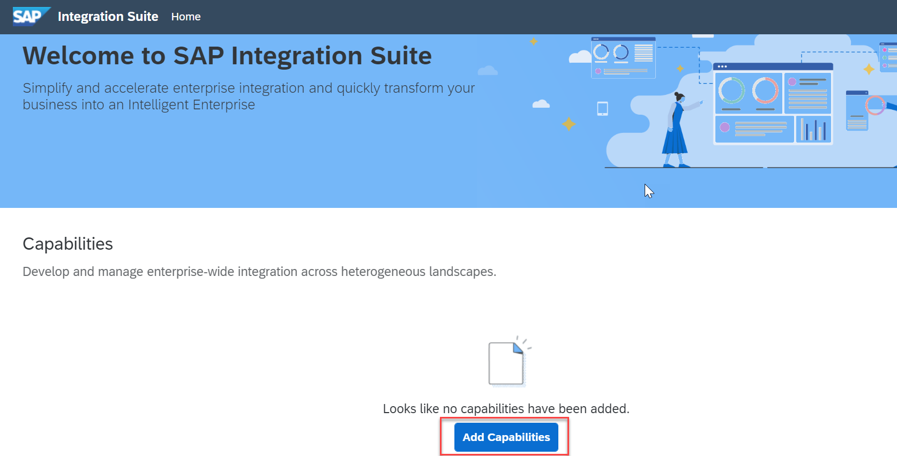

2. Select all the capabilities. Choose **Next**.

    <!-- border -->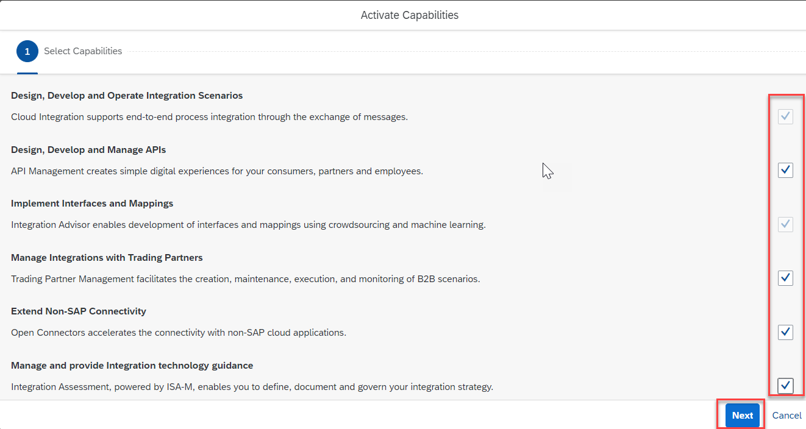

3. For **Cloud Integration**, choose **Next**.

    <!-- border -->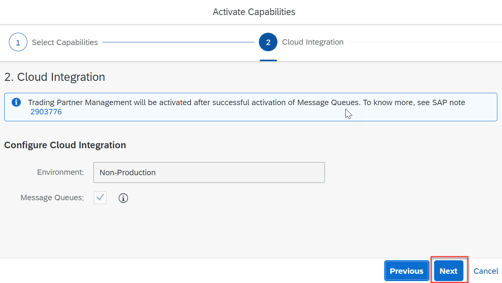

4. For **API Management**, choose **Enable API Business Hub Enterprise**. Choose **Next**.

    <!-- border -->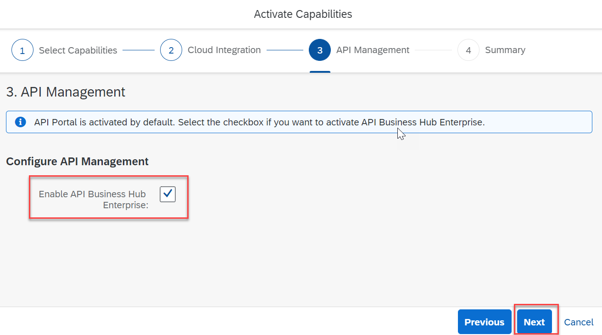

5. Choose **Activate** to provision the selected capabilities.

    <!-- border -->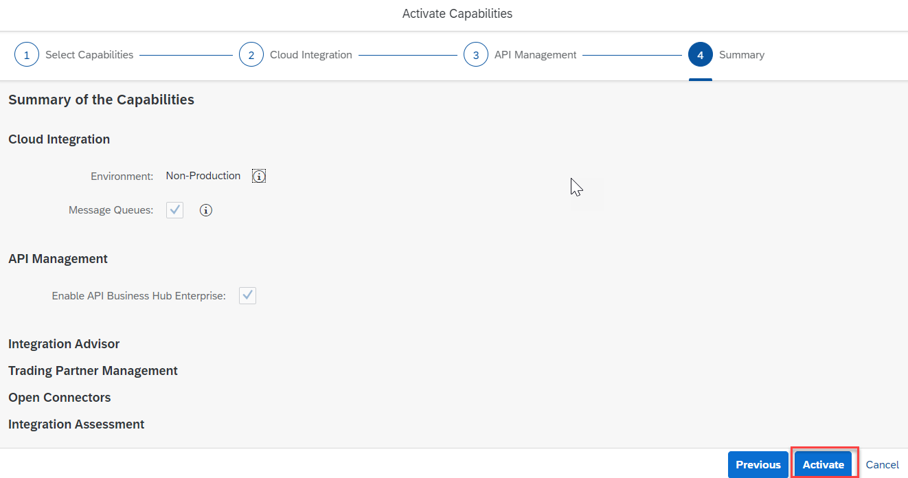

    The activation takes a while to complete.
    >**IMPORTANT**: Before you proceed to the next step, please wait for all the capabilities to be activated.

    >To access the features of each capability, you must first assign capability-specific roles which is explained in the next step.

### Assign roles for the activated capabilities

 In this step, you assign you the necessary roles to access and use the activated capabilities.

1. Navigate to your SAP BTP subaccount. Choose **Security > Users**. Choose the entry against your name.

2. In the **Role Collections** section, choose **Assign Role Collection**. The following role collections are available for each capability in Integration Suite. Based on your requirements, assign the necessary roles.

    |  Capability                   | Role Collection
    |  :-------------               | :-------------
    |  Cloud Integration            | `PI_Administrator`
    |  Cloud Integration            | `PI_Business_Expert`
    |  Cloud Integration            | `PI_Integration_Developer`
    |  API Management               | `APIPortal.Administrator`
    |  API Management               | `APIManagement.Selfservice.Administrator`
    |  Integration Advisor          | `iadv-content-developer`
    |  Open Connectors              | `OpenConnectors_User`
    |  Trading Partner Management   | `PI_Business_Expert`
    |  Integration Assessment       | `INTAS_Administrator`
    |  Integration Assessment       | `INTAS_BusinessDomainExpert`
    |  Integration Assessment       | `INTAS_EnterpriseArchitect`
    |  Integration Assessment       | `INTAS_IntegrationArchitect`

### Create a service instance

 A **service instance** defines how a service of SAP BTP (in our case, the **Process Integration Runtime** service) can be called from a remote component. In the context of Integration Suite, a service instance is the definition of an OAuth client. The service key generated out of the service instance contains credentials and other information that is required while executing and monitoring of integration artifacts.

 Create an instance of the **Process Integration Runtime** service to access the endpoints after deploying the integration artifacts.

1. Choose **Services > Instances and Subscriptions**.

2. Choose **Create**.

    <!-- border -->

3. In the **New Instance or Subscription** dialog, choose **Process Integration Runtime** from the list of services.

4. Choose **integration-flow** from the list of  plans.

5. Choose **Cloud Foundry** as the runtime environment.

6. Select a space in your Cloud Foundry org to create the instance.

7. Provide a name for your service instance, then choose **Create**. A service instance is created.

    <!-- border -->

### Verify the activated capabilities

1. Refresh the Integration Suite home page to see the capability-specific menu items being added to the left navigation.

    <!-- border -->

---
