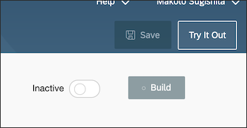
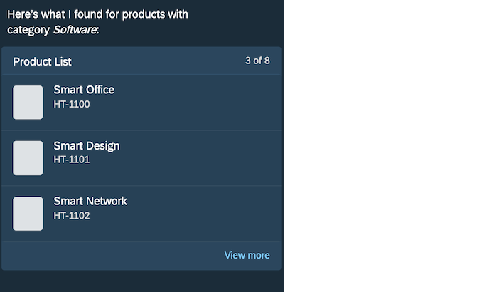
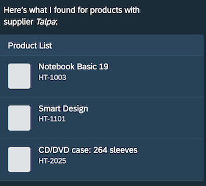

# Deploy an SAP CoPilot Skill and Test it
<!-- description --> how to deploy an SAP CoPilot skill and test it with the test tool of SAP CoPilot skill builder

<!---
## Prerequisites
 - [Configure Intent with SAP CoPilot Skill Builder](https://developers.sap.com/index.html)
-->

## You will learn
  - How to deploy the skill of SAP CoPilot
  - How to use test the skill with the test tool of SAP CoPilot Skill Builder

  ### Activate and build

  Click the radio button to activate.

  

  　　

  You will see some messages.

  

  　

<!---   After a while, you will see the success message.　　
  　-->

### Open test window

Click **Try It Out**.　　

　　
　　

### Search products

Enter **`Show me products`** and hit **Enter**.  

   
　　

The pictures are not shown in the test tool for now.
You can see it when you use SAP CoPilot from SAP Fiori Launchpad.

### Search products with filter

Enter **`Show me products with category software`** and hit **Enter**.

　　

Enter **`Show me products of supplier talpa`** and hit **Enter**.  

　　

