# Configure intent with SAP CoPilot Skill Builder
<!-- description --> Learn how to configure Query intent with SAP CoPilot Skill Builder for the data access and its response visualization

<!---
## Prerequisites
 - [Assign OData to the Skill](https://developers.sap.com/index.html)
-->

## You will learn
  - How to configure the parameters of Query intent
  - How to add utterance for an intent of SAP Copilot
  - How to configure response visualization for an intent of SAP Copilot

---

### Select an intent

Select OData intent **Query Product**  

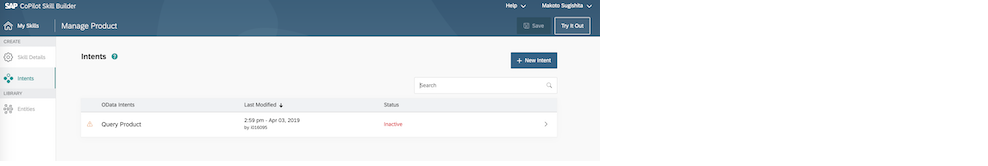

### Intent basic configuration

Under **What parameters are used to Filter Product?**,
click  **+ Add Parameter**.  

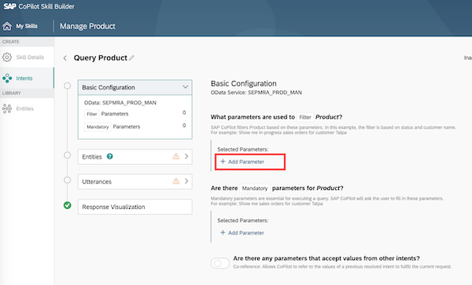

Select `Category` and `Supplier`.

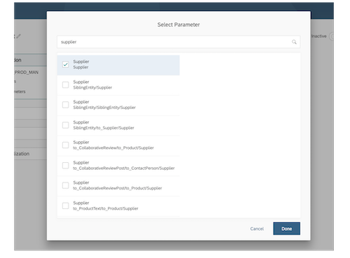
Click **Done**.

### Configure entities

Click **Entities**.  

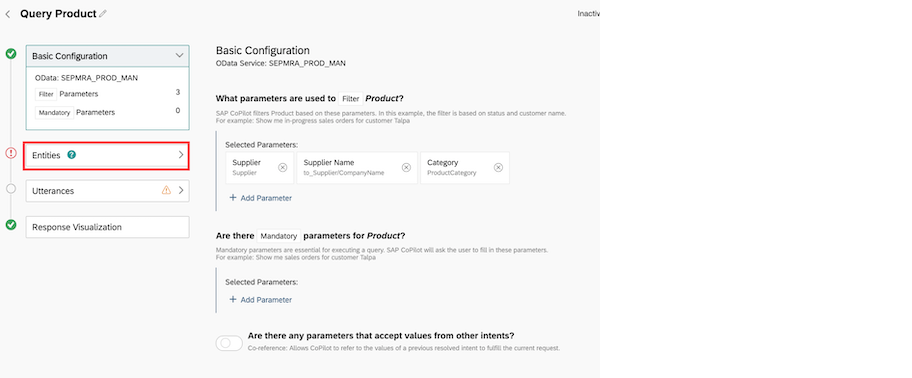
Click **+ Add Parameter** under `Select Parameters that identifies Category uniquely from the user's utterance`.  

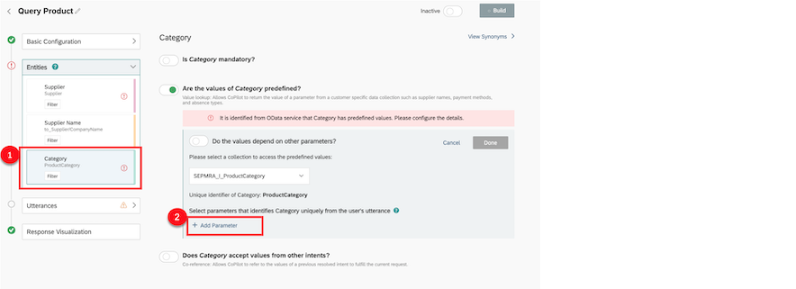
Select Category and Click **Done**.  

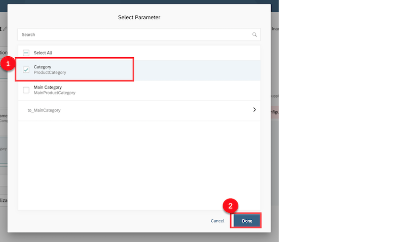
Click **Done** again here.  

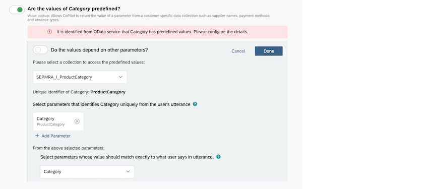
You will see the screen like this  

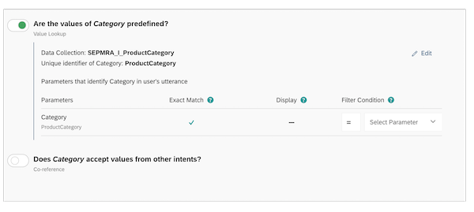
Repeat the same thing to the `Supplier`.  

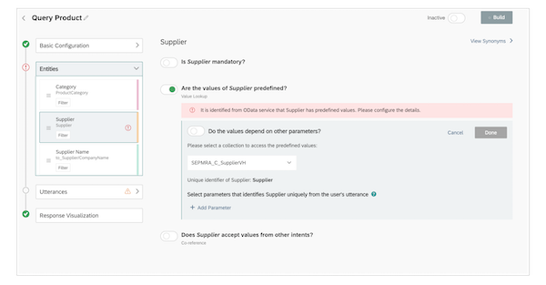
Choose `Supplier Name`.  

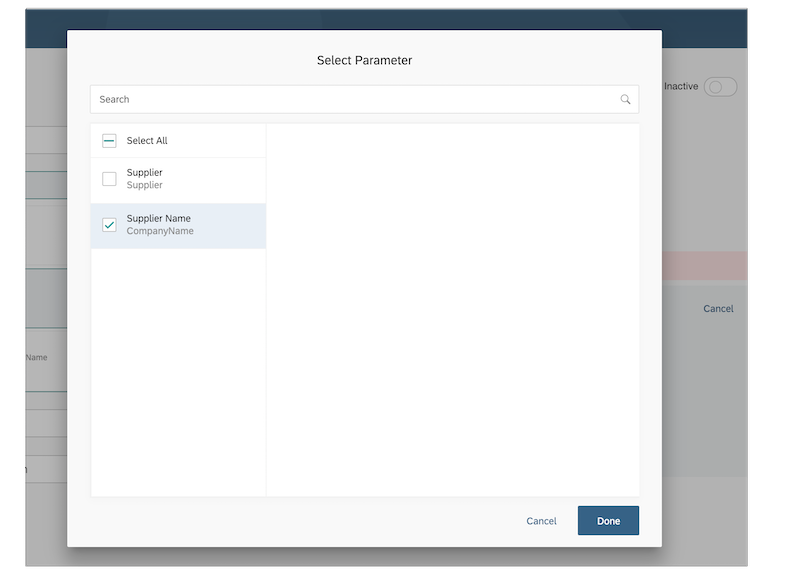

### Add utterance

Click **Utterances**.  

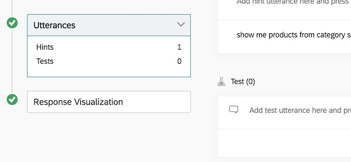

Enter **`Show me products from category software`** and hit **Enter**.  

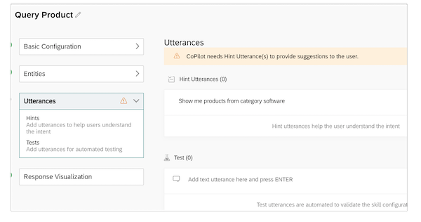

### Configure response visualization

Click **Response Visualization**.  

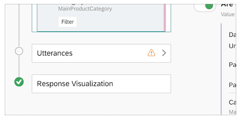

In **Thumbnail** field, enter thumbnail parameter.  

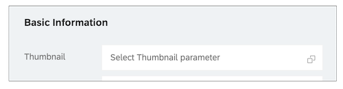

Click **Image Property**  and Select `Image(ProductPictureURL)`, Click **Add**.  

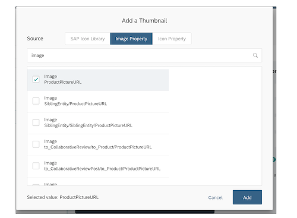

You can see the screen like this.  

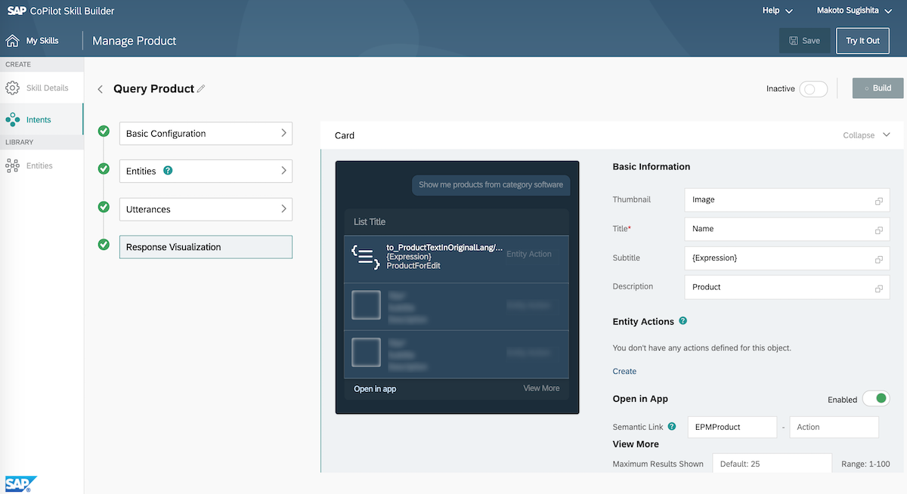

Click **Save**.  

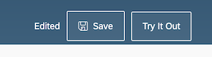

---
