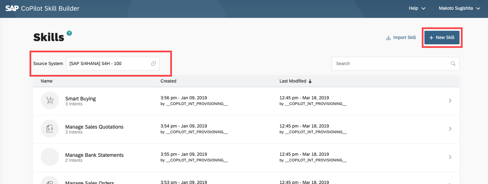
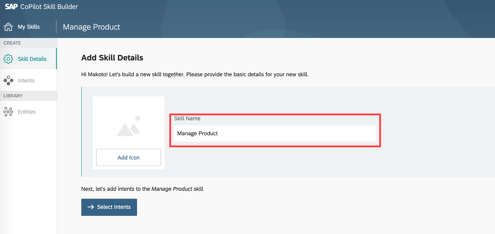
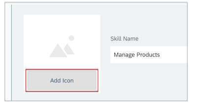
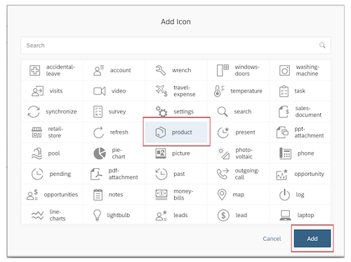
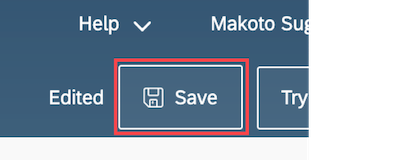

# Create New Skill with SAP CoPilot Skill Builder
<!-- description --> Learn how to create a new skill with CoPilot Skill Builder in order to add a new scenario to SAP CoPilot


## Prerequisites
 - **IMPORTANT** Paid License for the SAP CoPilot Subscription is required
 - Initial System Setup for CoPilot-S/4HANA Connectivity must be completed
   For more detail, see [SAP CoPilot configuration guide](https://help.sap.com/viewer/product/SAP_COPILOT)
 - Test data needs to be generated with transaction **`SEPM_DG`**
   For more detail, see [this blog](https://blogs.sap.com/2015/01/19/how-to-generate-and-import-ha300-epmmodel-in-hana/)

## You will learn
  - How to create a new skill for SAP CoPilot
  - How to add its name and an icon to the skill

---
### Log on to SAP CoPilot Skill Builder 

1.  Go to SAP CoPilot Skill Builder first page.
`https://<copilot host>/skillbuilder`

2. Enter user ID and password.
3. Click **Log On**.　　

### Create a new skill 

Select the Source System.
Click **+ New Skill**.

### Enter skill name 

Enter **`Manage Products`** as the skill name.

### Add an icon 

Click **Add Icon**.

Select **product** and click **Add**.

### Save the skill 

Click **Save** on the top right corner.

>When you complete all of the subsequent tutorials, the skill name and icon added in this tutorial will be used in the **`help`** of SAP Copilot

---
