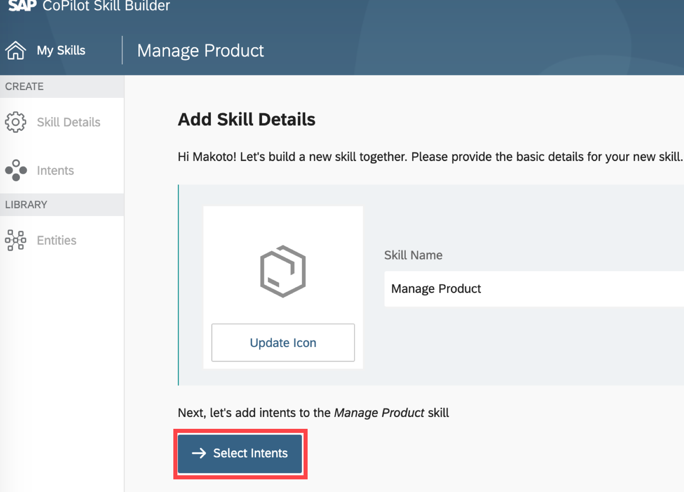
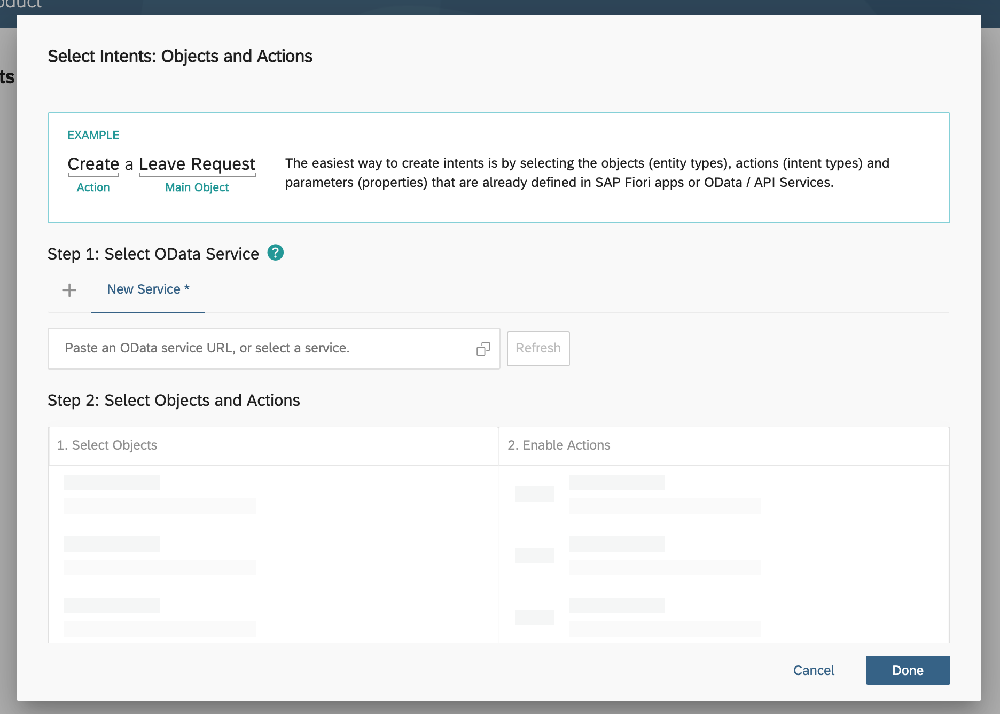
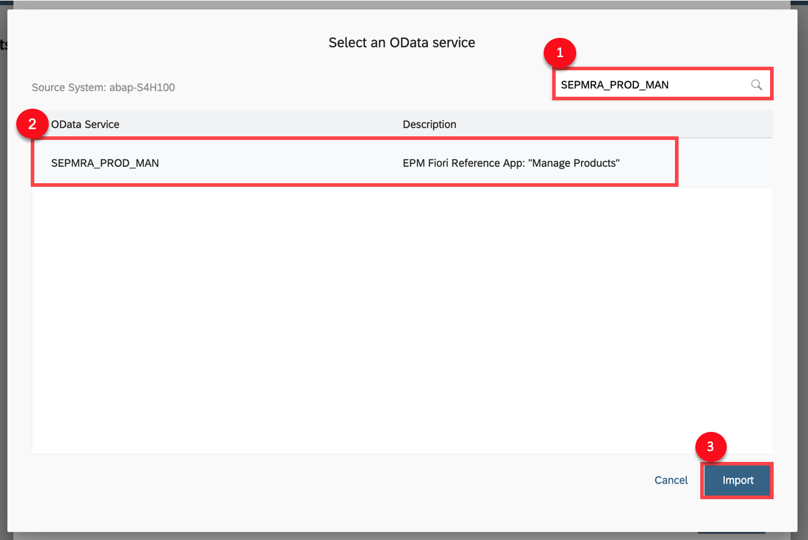
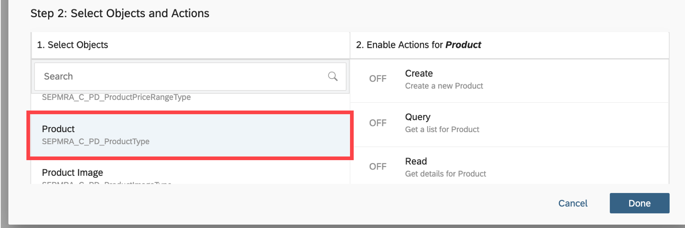
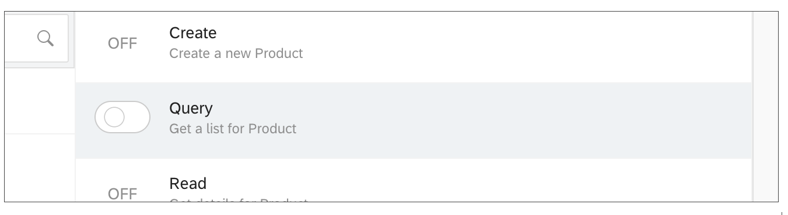
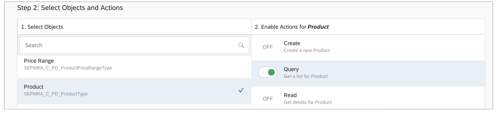
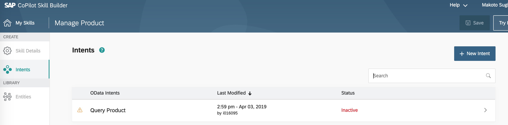

# Assign OData Service to the SAP CoPilot Skill
<!-- description --> Learn how to assign a new Odata service of S/4HANA to the SAP CoPilot Skill and add Query intent as the custom scenario

<!---
## Prerequisites
 - [Create New Skill with SAP CoPilot Skill Builder](https://developers.sap.com/index.html)
-->

## You will learn
  - How to assign OData service to the skill of SAP CoPilot
  - How to select OData object for the skill
  - How to activate OData action for the skill

---

### Go to intent of the skill

Click **Select Intents**.

### Search OData service

A popup screen appears and you will assign an OData Service to the skill here.

Click search button.

### Select the OData service

Enter `SEPMRA_PROD_MAN` in the search field.

Select `SEPMRA_PROD_MAN` and Click **Import**.
The OData Service is assigned to the skill.

### Select objects and actions

Under **Step 2: Select Objects and Actions**, Click **Product**.

Enable **Query** by clicking the switch.

You will see the **Query** is enabled like this.

Click **Done**

### Query intent was added 

You can see **Query Product** intent was added.

---
