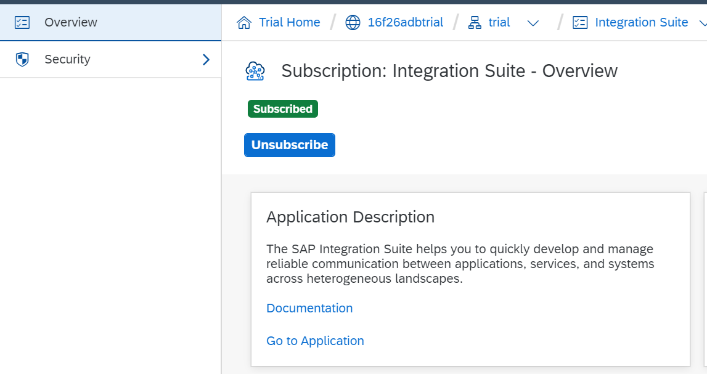
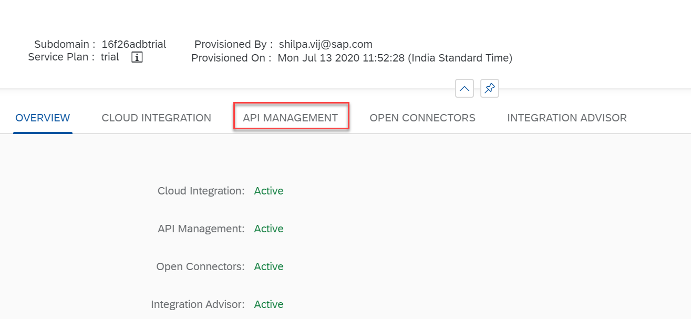
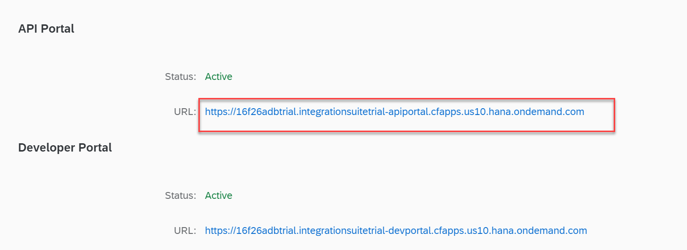
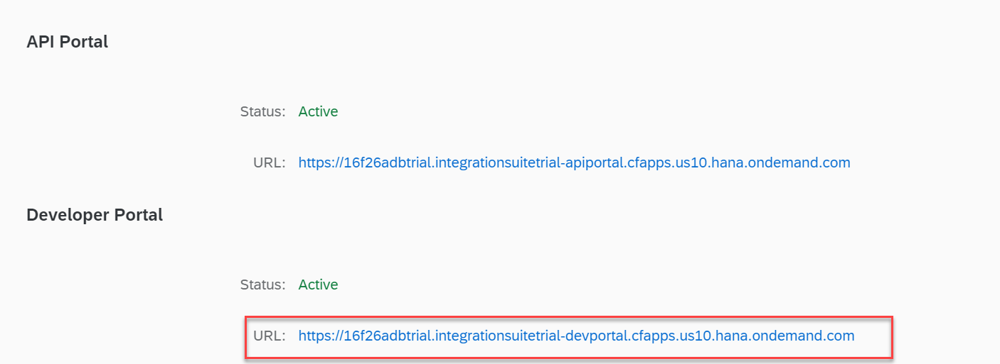

# Enable Services for Sales Tracker App
<!-- description --> Set up required services to build Sales Tracker app to demonstrate API Management and other technologies.

## Prerequisites
- **Tutorials:** [Sign up for an account](hcp-create-trial-account)

## Intro
- **Tutorials:** [Enable Integration Suite capabilities](cp-starter-isuite-onboard-subscribe)

- **Tutorials:** [Enable Mobile Services](fiori-ios-hcpms-setup)

## You will learn
  - How to access  API Management on trial account
  - How to access Mobile services on trial account

With this, you have your own instance of API Management and Mobile Services which allows you to create APIs, mobile apps and connect them to your systems (both SAP and non-SAP) and "play" with the available features.

---

### Access the  API Management portals

You now have access to the  API Management API Portal ...

... and the API Management Dev Portal

### Enable Mobile Services

In the **Integration** section, click  **Mobile Services**.

Click  **Enable**.

### Access Mobile Service

Click **Go to Service**.

---
