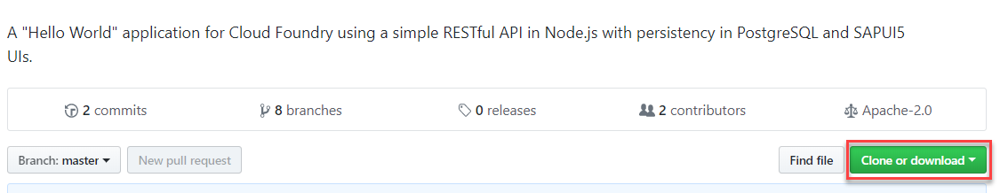
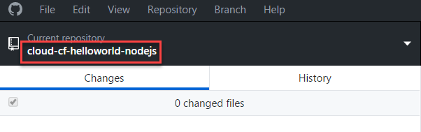

# Get ready to create a basic web service with persistency and authentication
<!-- description --> Set up your environment to create web services, including installing all the necessary tools.

## Prerequisites  
 - **Proficiency:** Beginner

## You will learn  
 - How to set up your NPM
 - How to download the tutorial project
## Prerequisites
 Before you start this tutorial, you will need:

 - An account on SAP Cloud Platform, for example, a trial account. See [Sign up for a free trial account on SAP Cloud Platform](https://developers.sap.com/tutorials/hcp-create-trial-account.html)
  - To perform the following steps on your account as described in [Getting Started with Cloud Foundry](https://help.sap.com/viewer/65de2977205c403bbc107264b8eccf4b/Cloud/en-US/b8ee7894fe0b4df5b78f61dd1ac178ee.html).
- A [GitHub](https://github.com/) account
- A basic knowledge of [Node.js:Development](https://help.sap.com/viewer/65de2977205c403bbc107264b8eccf4b/Cloud/en-US/3a7a0bece0d044eca59495965d8a0237.html), see [Create a Node.js Application](https://help.sap.com/viewer/65de2977205c403bbc107264b8eccf4b/Cloud/en-US/772b45ce6c46492b908d4c985add932a.html), and [Tips and Tricks for Node.js Applications](https://help.sap.com/viewer/65de2977205c403bbc107264b8eccf4b/Cloud/en-US/3a5fe887f6e64abb827494baac352059.html). Bookmark these pages.
 For more information about working with NPM registry, see this [blog](https://blogs.sap.com/2017/05/16/sap-npm-registry-launched-making-the-lives-of-node.js-developers-easier/).

## Time to Complete
**15 Min**

---

### Configure NPM on your machine


1. Open a command prompt, for example, enter `cmd` in the search field of your Windows machine.
2. Execute the following command:
```
npm config set @sap:registry https://npm.sap.com
```

### Clone the tutorial project to your local PC


1. Open the [tutorial project](https://github.com/SAP/cloud-cf-helloworld-nodejs) on [GitHub](https://github.com/).

2. On `https://desktop.github.com/`, choose **Clone or download** | **Open in Desktop** | **Download for `<your OS>`** | **Open when done**.
3. In the GitHub desktop, you will see the `cloud-cf-helloworld-nodejs` repository.


    > If the cloning did not go through, try this:

1.	Under **Clone or download**, copy the URL.
2.	In the GitHub desktop, open **File** | **Clone a repository** | **URL**, and enter the URL in the appropriate field.

---
