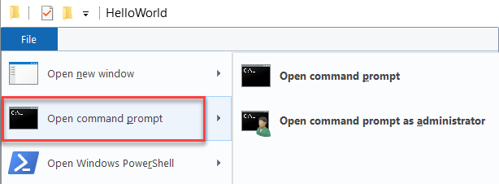
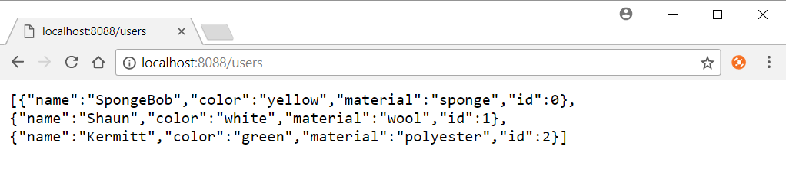
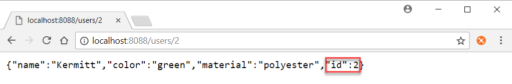
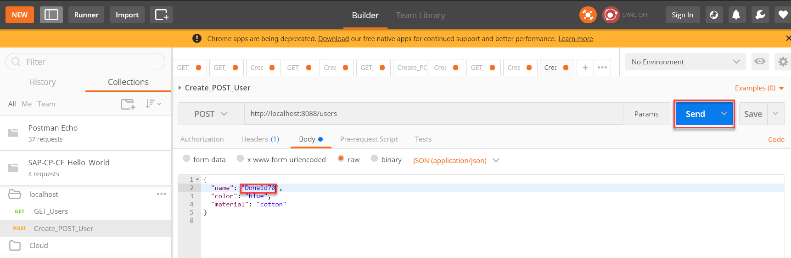
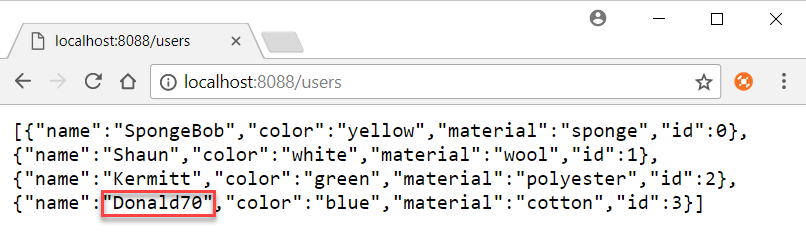
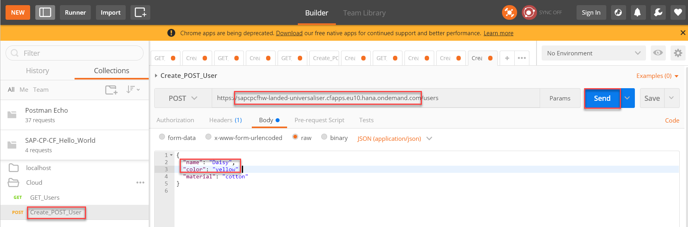
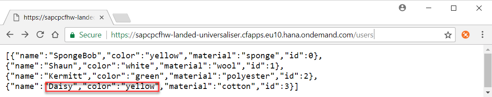

# Implement a basic Node.js web service
<!-- description --> Run a small Node.js web service on your local machine and deploy it to SAP Cloud Platform Cloud Foundry environment

## Prerequisites  
 - **Proficiency:** Beginner

## You will learn  
 - How to run your web service
 - How to push your service to the cloud environment
## Time to Complete
**15 Min**
---

### Run the service locally


1. In GitHub desktop, switch to the `1_REST_persist_in_Memory` branch under  **Current branch**.  
2. In the folder you cloned into, open command prompt.
<ol type="a"><li>Choose the down arrow next to the repository title.
</li><li>Select and right-click the tutorial.
</li><li>Choose `Show in Explorer`.
  
</li><li>To open a command prompt console on the selected folder, choose **File** | **Open Command Prompt**.
  

4. Execute the following command:
```
npm install
```
3. To start the server, execute the following command:
```
node server.js
```


### Test the service locally


1. To get all users or the details of one user, open `http://<ip>:8088/users` or `http://<ip>:8088/users/2` respectively.
  
  
2. To add another entry to the list of users using the POST operation, use, for example, the Postman extension of Chrome. (PUT and DELETE are not yet implemented). To test these operations, import the file `SAP-CP-CF_Hello_World.postman_collection.json` from this repository into Postman.
<ol type="a"><li>Start Postman in the browser, and choose **Import**.
</li><li>Open the explorer, select the `SAP-CP-CF_Hello_World.postman_collection.json` file and drag it to the **Import File** area in Postman.
</li><li>Choose **Replace**.
</li><li>Open **`localhost`**, and select `Create_POST_User`.
</li><li>Choose **Body**, and modify the displayed user name so you recognize your change later on.
</li><li>Choose **Send**.
  
</li><li>Open `http://<ip>:8088/users`.
  

3. To stop the server, go to your command prompt and execute the following command:
```
ctrl + C
```


### Push to cloud and run the service

1. To check which endpoint you use:
<ol type="a"><li>Log on to the [SAP Cloud Platform cockpit](https://account.hanatrial.ondemand.com/#/home/welcome).
</li><li>Choose **Cloud Foundry Trial** | **trial**, and check the value for **API Endpoint**.

2. In the command prompt, access your endpoint as determined above using the respective command:
```
cf api https://api.cf.eu10.hana.ondemand.com
```
```
cf api https://api.cf.us10.hana.ondemand.com
```
> If prompted, enter your logon information in the command prompt.

3. (Optional.) If you have access to more than one org or space, execute the following command:
```
cf target -o ORG -s SPACE
```
4. Deploy the application to the SAP Cloud Platform Cloud Foundry environment using the following command:
```
cf push --random-route
```
5. Check the output of this command, and write down the URL created for the application.

For more information on these commands, see [Getting Started with Cloud Foundry](https://help.sap.com/viewer/65de2977205c403bbc107264b8eccf4b/Cloud/en-US/b8ee7894fe0b4df5b78f61dd1ac178ee.html) and [Deploy Applications](https://help.sap.com/viewer/65de2977205c403bbc107264b8eccf4b/Cloud/en-US/4946ea5421374924963ce8575a5f3d05.html).

> As a result you should be able to browse `https://<URL for your app>/users`.
If you want to use the Postman collection above, adjust the URL for the requests in the cloud folder to the allocated `<URL for your app>`. To test, execute the following steps:
1. Open **Cloud**, and select `Create_POST_User`.
2. Replace `<host>` by your app URL.
3. Choose **Body**, and modify the displayed user name so you recognize your change later on.
4. Choose **Send**.

5. Open `http://<ip>:8088/users`, for example, `https://sapcpcfhw-landed-universaliser.cfapps.eu10.hana.ondemand.com/users`.



---
