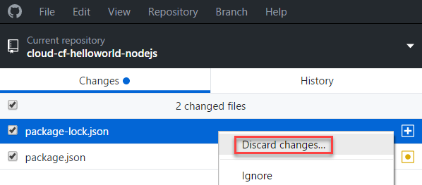
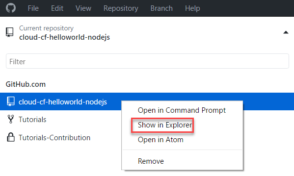
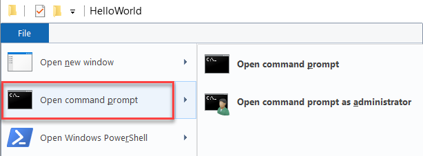

# Node.js RESTful API persists data in PostgreSQL DB
<!-- description --> Use a Node.js RESTful API to persist data in a PostgreSQL DB

## Prerequisites  
 - **Proficiency:** Beginner

## You will learn  
 - How to create a PostgreSQL service instance
 - How to push the instance to the cloud
## Time to Complete
**15 Min**

---
### Switch branch


1. Go to GitHub desktop, select all changes and choose **Discard changes...**.
  
2. Under **Current branch**, select `2_REST_persist_DB_postgres`.


### Create the PostgreSQL service instance


In your command prompt, perform the following command:
```
cf create-service postgresql v9.4-dev sapcpcfhw-db
```
For more information about this command, see the documentation at `docs.cloudfoundry.org`.

### Push to cloud and run the service


1. In the folder you cloned into, open command prompt.
<ol type="a"><li>Choose the down arrow next to the repository title.
</li><li>Select and right-click the tutorial.
</li><li>Choose `Show in Explorer`.
  
</li><li>To open a command prompt console on the selected folder, choose **File** | **Open Command Prompt**.
  

2. Execute the following command:
```
npm install
```

3. Push the application to the cloud using the following command:
```
cf push --random-route
```
4. Check the output of this command, and write down the URL created for the application.
You should be able to browse `https://<URL for your app>/users`.
5. Import the new version of the Postman collection, and replace `<host>` with the allocated `<URL for your app>` in the URL.
<ol type="a"><li>Start Postman in the browser, and choose **Import**.
</li><li>Open the explorer, select the `SAP-CP-CF_Hello_World.postman_collection.json` file and drag it to the **Import File** area in Postman.
</li><li>Choose **Replace**.
</li><li>Open **Cloud**, and select `Create_POST_User`.
</li><li>Replace `<host>` with the `<URL for your app>`.
</li><li>Choose **Body**, and modify the displayed user name so you recognize your change later on.
</li><li>Choose **Send**.
</li><li>Check the user list in your browser at `https://<URL for your app>/users`.

---
