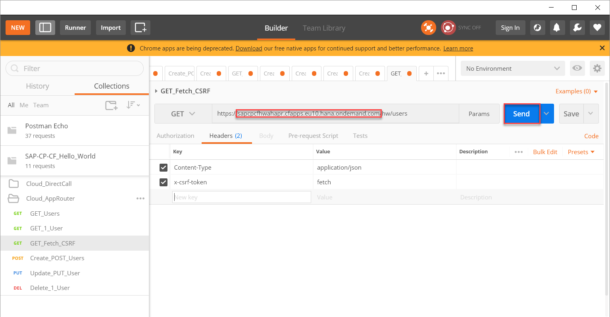
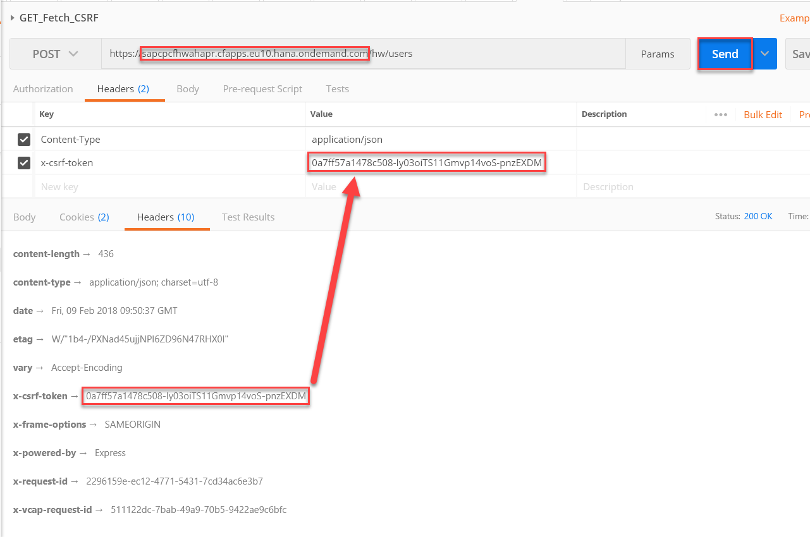

# Prepare authentication for Node.js RESTful API
<!-- description --> Prepare authentication for Node.js RESTful API

## Prerequisites  
 - **Proficiency:** Beginner

## You will learn   
 - Have a setup that allows you to enable authentication for your RESTful API.
 - You'll gain a basic knowledge about [User Identity Management on SAP Cloud Platform](https://blogs.sap.com/2017/05/16/user-identity-management-on-sap-cloud-platform/).
 - You'll learn about the [Application Router](https://help.sap.com/viewer/65de2977205c403bbc107264b8eccf4b/Cloud/en-US/01c5f9ba7d6847aaaf069d153b981b51.html) and how to use it to [Secure Node.js Applications](https://help.sap.com/viewer/65de2977205c403bbc107264b8eccf4b/Cloud/en-US/3a8e4372f8e74d05b4ed03a484865e08.html).
## Time to Complete
**15 Min**

---

### Switch branch


1. Go to GitHub desktop, select all changes and choose **Discard changes...**.
  
2. Under **Current branch**, select `3_Security_with_AppRouter`.

### Create the needed service instances


In the command prompt that you opened on the tutorial repository, perform the following commands:
```
cf create-service application-logs lite sapcpcfhw-al
```
```
cf create-service xsuaa application sapcpcfhw-uaa -c security/xs-security.json
```

### Download the app router


Download the application router using the following commands:
```
cd myApp
```
```
npm install
```
```
cd ../appRouter
```
```
npm install
```
```
cd ..
```

### Push the application


1. Perform the following command:
```
cf push
```
2. Check the output, and note down the URL for the application router.
3. A naming conflict might occur:
  
  <ol type="a"><li>Go to the Explorer and open the `manifest.yml` file.
  </li><li>Adjust and save all  occurrences of `sapcpcfhw` except for the entries in the services categories. These must remain stable, as you already created service instances using those names.
  
  </li><li>Push the application again using the following command:
    ```
    cf push
    ```
  </li><li>Look up the value in the `urls` field, and write down the URL for your application `<URL for the app router>` as you'll have to use it in all the activities below.</li></ol>

### Test accessing the application


1. Open `https://<URL for the app router>/hw/users`.
2. Log on with the e-mail address and the password you use to access your [SAP Cloud Platform account](https://account.hanatrial.ondemand.com/#/home/welcome).
3. Import the new version of the `SAP-CP-CF_Hello_World.postman_collection.json` file.
<ol type="a"><li>Start Postman, and switch the Postman Interceptor on.
</li><li>Choose **Import**.
</li><li>Open the explorer, select the `SAP-CP-CF_Hello_World.postman_collection.json` file and drag it to the **Import File** area in Postman.
</li><li>Choose **Replace**.</li></ol>

4. To fetch a CSRF token, open the Postman collection `Cloud_AppRouter` and select the `GET_Fetch_CSRF` template.
  Replace the URL with `<URL for the app router>` and choose **Send**.
  
  For more information on CSRF in the application router, see [Application Descriptor](https://help.sap.com/viewer/65de2977205c403bbc107264b8eccf4b/Cloud/en-US/c19f165084d742e096c5d1625cecd2d4.html#loioc19f165084d742e096c5d1625cecd2d4__section_xj4_pcg_2z).
5. To also test change operations using the Postman extension, execute these steps:
  <ol type="a"><li>Check the headers in the **Response** of the call above, and copy the value for the `X-CSRF-Token` header.
  </li><li>Paste the CSRF token value in the appropriate field in the header of any of the change operations: POST, PUT, DELETE, adjust the URL using the `<URL for the app router>` and choose **Send**.
  
  </li><li>Log in to `https://<URL for the app router>/hw/users` and check your change.</li></ol>

> Note: Please keep in mind that it is still possible to access your application without authentication, as described in the previous chapter, performing calls to `https://<URL for your app>/users`, where `<URL for your app>` is the URL you noted down after checking the output of the `cf push` operation above. For information about how to protect this kind of access, see the next chapters.

---
