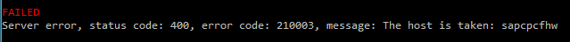
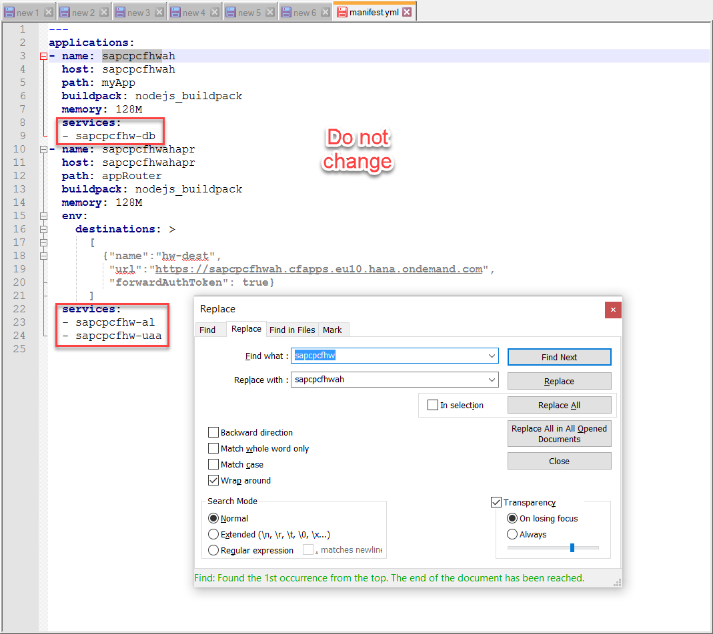
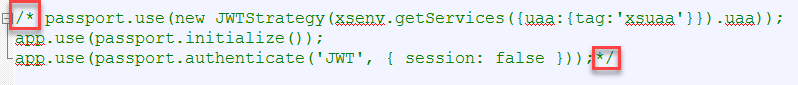

# Secure the application
<!-- description --> Security insight

## Prerequisites  
 - **Proficiency:** Beginner

## You will learn  
 the basics of how security and authentication work in the SAP Cloud Platform Cloud Foundry Environment and of some libraries that support you in developing secure applications.
## Time to Complete
**15 Min**

---
### Switch branch


1. Go to GitHub desktop, select all changes and choose **Discard changes...**.
  
2. Under **Current branch**, select `4_Secure_Application_Mandatory_Authentication`.


### Avoid naming conflict

3. To avoid a naming conflict redo the changes to the `manifest.yml` file:
  
  <ol type="a"><li>Go to the Explorer and open the `manifest.yml` file.
  </li><li>Adjust and save all  occurrences of `sapcpcfhw` except for the entries in the services categories. These must remain stable, as you already created service instances using those names.
  


### Download the needed libraries and push


1. Perform the following commands:
```
cd myApp
```
```
npm install
```
```
cd ..
```
```
cf push
```
2. To test, access the URL: `https://<URL for the app router>/hw/users` with your e-mail address and the password you use to access your [SAP Cloud Platform account](https://account.hanatrial.ondemand.com/#/home/welcome).

### Check the JSON Web Token (JWT)

To check the output of the `logJWT()` function, execute the following command:
```
cf logs sapcpcfhw --recent
```

Remember to use the app name you defined in the `manifest.yml` file.
You see information about your user and the JWT token. For more information about JWT and for a Web app to decode it, see the [https://jwt.io/](https://jwt.io/).   

>Note: Browsing the application `https://<URL for your app>/users` still works, as already pointed out in the previous tutorial.


### Protect the application


1. Activate the passport-related code:
  <ol type="a"><li>In the Explorer, open the tutorial folder, and then the `myApp` folder.
  </li><li>Open the `server.js` file, for example, with `Notepad ++`.
  </li><li>Remove the comment marks in the three lines containing passport-related code.
  

2. Push the application again using the following command:
```
cf push
```
3. In your browser, open the application `https://<URL for your app>/users`.
  You will receive the message `401 Unauthorized`. That means, the three lines ensure that only authenticated calls (using the application router) reach the application.
4. Open `https://<URL for the app router>/hw/users` again.
  The call will work.
5. To check the logs, execute the following command:
```
cf logs sapcpcfhw --recent
```
  Remember to use the app name you defined in the `manifest.yml` file.
  You'll see information about the `SecurityContext Object` provided by the [Client Security Library](https://help.sap.com/viewer/4505d0bdaf4948449b7f7379d24d0f0d/2.0.02/en-US/54513272339246049bf438a03a8095e4.html#loio54513272339246049bf438a03a8095e4__section_atx_2vt_vt).


---
