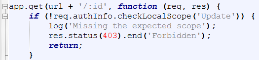

# Authorization - runtime checks
<!-- description --> Extend the static checks implemented by coded checks executed during runtime

## Prerequisites  
 - **Proficiency:** Beginner- Test

## You will learn  
  How to extend the static checks implemented in the previous tutorial by coded checks executed during runtime to ensure that only authorized users execute a certain routine.
  This is relevant if the scope check done by the app router should be extended by checks in the application itself. For example, if a more granular scope check is needed. In this example, we assume that the **Display** scope is no longer sufficient to get details on one particular user. Instead the operation requires the **Update** scope.
## Time to Complete
**15 Min**

---

### Switch branch


1. Go to GitHub desktop.
2. Under **Current branch**, select `6_Secure_Application_Authorization_Runtime_Check`.

### Prepare the configuration and test before push


1. Log on to the [SAP Cloud Platform cockpit](https://account.hanatrial.ondemand.com/#/home/welcome), and choose **`<own Trial account>`** | **trial Subaccount** | **Security** | **Trust Configuration** | **SAP ID Service**.
2. Enter your e-mail address in the **User** field, and choose **Show Assignments**.
3. Delete the assignment to the **`ManagerRC`** collection.
4. Add an assignment to the **`ViewerRC`** collection.
5. Restart the browser, and open `https://<URL for the app router>/hw/users`.
6. Log on.
   The result is displayed.
7. Open `https://<URL for the app router>/hw/users/<ID of a user>`.
   Now, this also works and the user is displayed.

### Push and test again


1. Push the application again using the following command:
```
cf push
```
2. Restart the browser, and open `https://<URL for the app router>/hw/users`.
3. To display the result, log on.
4. Open `https://<URL for the app router>/hw/users/<ID of a user>`.
   Now, this no longer works. Check the log using `cf logs sapcpcfhw --recent`. Remember to use the app name you defined in the `manifest.yml` file. The log contains the error message `Missing the expected scope`. This error message is produced by an additional check in `myApp\server.js`. `Missing the expected scope` means that the scope you defined in the `myApp\server.js` file is missing:
  

---
