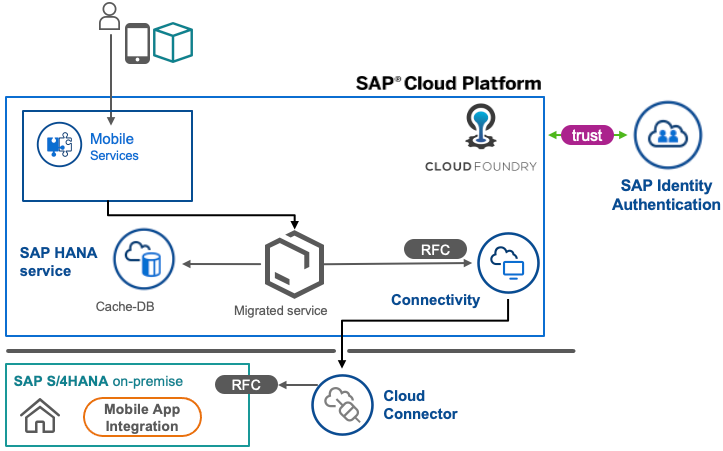
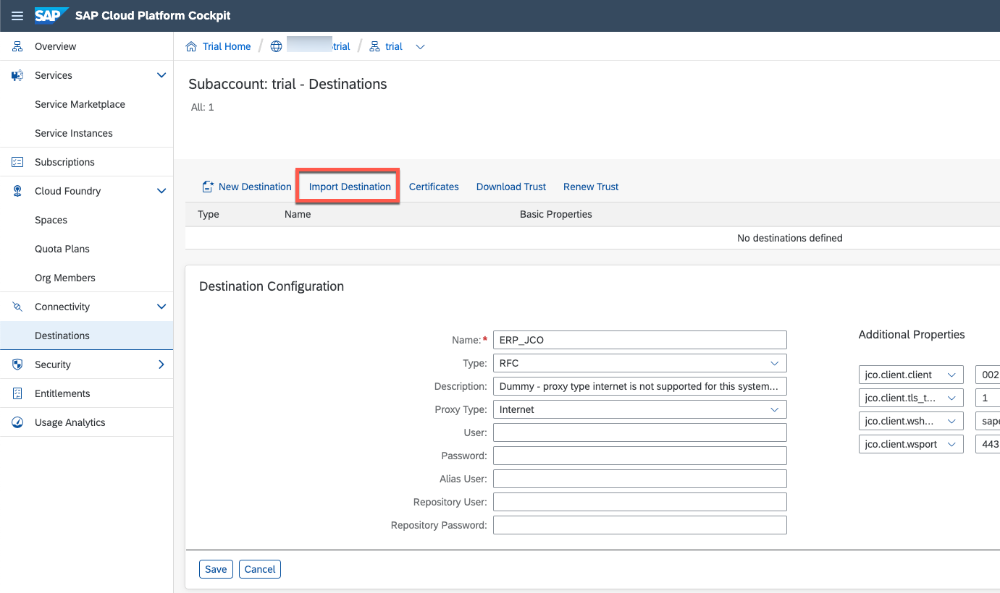
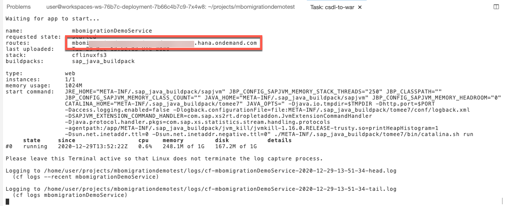
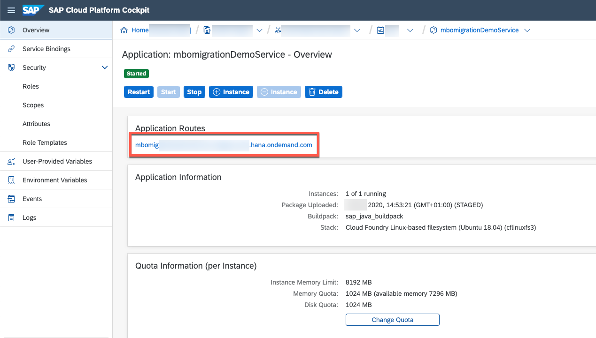
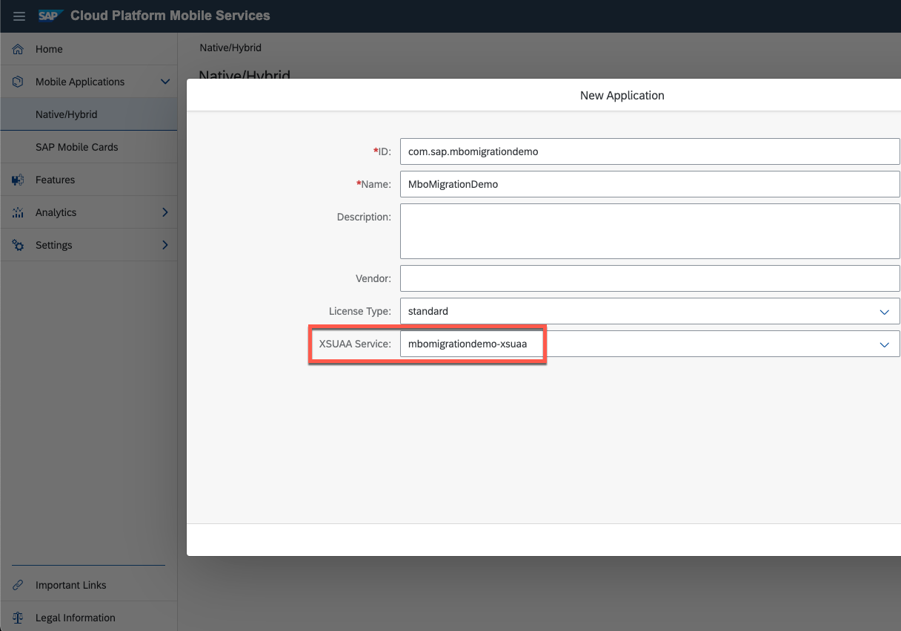
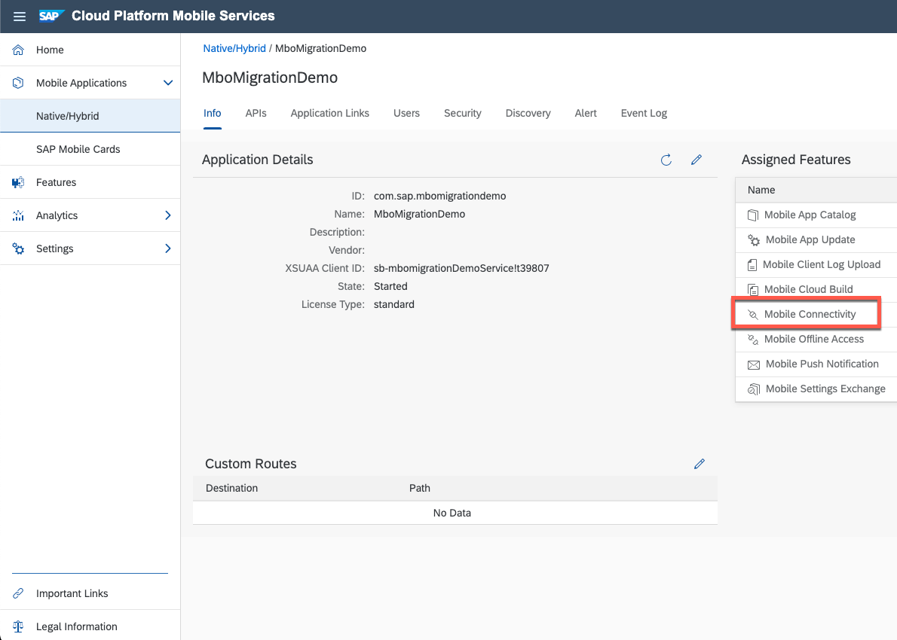
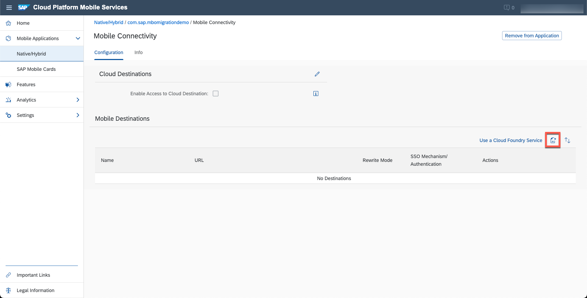
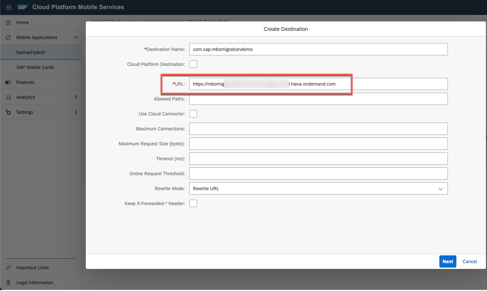
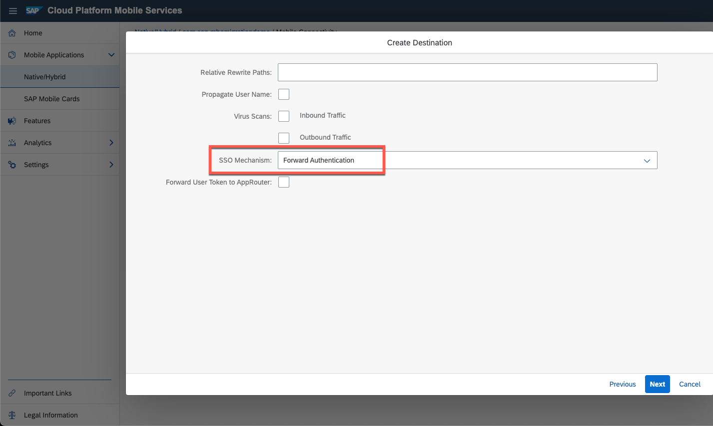

# Convert Mobile Business Object package to OData Service
<!-- description --> Convert a mobile business object (MBO) application's package with SAP Cloud Platform Mobile Services, mobile back-End tools (MBT) to OData technology, leveraging no/low-code environment, attach it to a cache-database and preserve existing backend integration to allow consumption via SAP Cloud Platform Mobile Services and corresponding SDKs.

## Prerequisites
 - Basic XML and OData CSDL (metadata) knowledge
 - SAP Cloud Connector and Destination basics
 - (For testing the project) Accessible ABAP platform-based installation, e.g. SAP S/4HANA or SAP Business Suite
 - Basic command line experience
 - This tutorial assumes that you have already [Setup your SAP Business Application Studio environment for Mobile](cp-mobile-bas-setup)
 - This tutorial assumes that you have already [enabled SAP Cloud Platform Mobile Services and got access to it](https://help.sap.com/doc/f53c64b93e5140918d676b927a3cd65b/Cloud/en-US/docs-en/guides/getting-started/account.html)

## You will learn
  - How to convert MBO Models to OData CSDL
  - Basics of mobile back-end tools (MBT)
  - Basics of MBT-based cached OData services


### Motivation and recap about MBO


Mobile Business Objects (MBO) is a technology, allowing to integrate mobile scenarios with offline capabilities into existing systems and business processes.
It consists of an SAP Mobile Platform runtime and native mobile client libraries included in MBO Toolkit.

To migrate an application from Mobile Business Objects to OData for usage with SAP Cloud Platform Mobile Services, there are multiple options available. Key of the migration part is the conversion of the data model to OData. Any toolkit providing OData(V2)-compliant services can be supported- though most require re-development and may not support efficient delta processing out of the box.

> **This tutorial is focused on conversion using SAP Mobile Backend Tools and does not cover other approaches.**

>To simplify backend conversion, SAP is offering a conversion tools as part of the mobile back-end tools that allow converting an MBO package into a full-featured and delta-enabled OData service that can leverage the existing backend integration implementation, e.g. via JDBC, SAP Java Connector (JCo)/Remote function call (RFC) or data change notification (DCN).

A typical MBO leverages a consolidated database on MBO runtime to cache data and manage synchronising it to subscribed devices. MBT now offers to reuse this scheme and expose the model's data and logic via OData, making MBO components obsolete.

Compared to OData-enabling [MBO Facade](https://blogs.sap.com/2016/07/04/release-of-sap-mobile-platform-30-sp-11/) feature, a generated MBT service is capable of replacing the MBO runtime instead of building on top of it.

For every customer who already used MBO Facade to rebuild the mobile application with OData, this tutorial's essence might be the final step to shutdown MBO runtime - for others it might be the first step allowing the migration with one of the SAP Cloud Platform Mobile Services Software Development Kits.


### Define development environment


SAP Mobile Backend Tools are supported both in SAP Business Application Studio environment as well as in Visual Studio Code locally via [Marketplace extension](https://marketplace.visualstudio.com/items?itemName=SAPSE.vsc-extension-mbt). Depending on your requirements you should choose the environment.

  - If you plan to run the generated service in SAP Cloud Platform, SAP Business Application Studio will most of the times be the better choice, as you can leverage the same environment during design time and run time.
  - If you plan to run the generated service in an on premise architecture, you can still connect it via SAP Cloud Connector to mobile services, but you might want to generate and develop the service in an on-premise architecture leveraging the Visual Studio Code extension for mobile back-end tools
  - SAP Business Application Studio, as a cloud solution will run out of the box with the preset for "SAP Cloud Platform Mobile Services" and does not require a manual setup of development environment as well as being OS agnostic - while for Visual Studio Code you need to [setup your own environment locally](https://help.sap.com/doc/f53c64b93e5140918d676b927a3cd65b/Cloud/en-US/docs-en/guides/getting-started/mbt/setup.html#visual-studio-code-extension)

> **Note** If you migrate an MBO model that used to connect via JDBC to a database which is not SAP HANA, you might want to convert, develop and run your MBT-based service-application on premise in VS Code - as not all database types can be easily and securely exposed to SAP Cloud Platform via SAP Cloud Connector.

The following diagram depicts an exemplary target architecture after migration:



### Convert the data model


1. Open an empty workspace in SAP Business Application Studio. If your workspace is not empty, perform the following steps:

    - From the Terminal menu, select the New Terminal option.

    - After the $ prompt in the Terminal window, enter a `mkdir` command to create a project folder. For example:

    ```Terminal
    mkdir ~/projects/MboMigrationDemo
    ```

    - From the File menu, select the **Open...** option, and use it to open the project folder that was created in the Terminal window in the previous step.

2. Copy the following demo purpose AFX-document to a file named `deployment-unit.xml` in your workspace. In a real migration scenario, you would extract such a file from the MBO application in MBO Toolkit or via package export.
    <details>
    <summary> **Click to expand** - for purpose of this tutorial please use this simplified MBO package descriptor based on EPM-Demo-RFCs.</summary>
```xml
<!--AFX Document -->
<package name="MigrationPoC" product-version="3.0.17" version="1.0" check-interval="0" xmlns="http://www.sybase.com/sup/afx">
    <database name="migrationPoC1_0"/>
    <database-class name="MigrationPoCDB"/>
    <class name="BAPI_EPM_BP_CHANGE_HEADERDATA">
        <attribute name="BP_ID" type="string?" max-length="10"/>
        <attribute name="BP_ROLE" type="string?" max-length="3"/>
        <attribute name="EMAIL_ADDRESS" type="string?" max-length="255"/>
        <attribute name="PHONE_NUMBER" type="string?" max-length="30"/>
        <attribute name="FAX_NUMBER" type="string?" max-length="30"/>
        <attribute name="WEB_ADDRESS" type="string?" max-length="255"/>
        <attribute name="COMPANY_NAME" type="string?" max-length="80"/>
        <attribute name="LEGAL_FORM" type="string?" max-length="10"/>
        <attribute name="CURRENCY_CODE" type="string?" max-length="5"/>
        <attribute name="CITY" type="string?" max-length="40"/>
        <attribute name="POSTAL_CODE" type="string?" max-length="10"/>
        <attribute name="STREET" type="string?" max-length="60"/>
        <attribute name="BUILDING" type="string?" max-length="10"/>
        <attribute name="COUNTRY" type="string?" max-length="3"/>
        <attribute name="ADDRESS_TYPE" type="string?" max-length="2"/>
        <attribute name="ADDRESS_VAL_START_DATE" type="decimal?"/>
        <attribute name="ADDRESS_VAL_END_DATE" type="decimal?"/>
        <attribute name="CREATED_BY" type="string?" max-length="10"/>
        <attribute name="CREATED_AT" type="decimal?"/>
        <attribute name="CHANGED_BY" type="string?" max-length="10"/>
        <attribute name="CHANGED_AT" type="decimal?"/>
    </class>
    <class name="BAPI_EPM_BP_CHANGE_HEADERDATAX1">
        <attribute name="EMAIL_ADDRESS" type="string?" max-length="1"/>
        <attribute name="PHONE_NUMBER" type="string?" max-length="1"/>
        <attribute name="FAX_NUMBER" type="string?" max-length="1"/>
        <attribute name="WEB_ADDRESS" type="string?" max-length="1"/>
        <attribute name="BUILDING" type="string?" max-length="1"/>
        <attribute name="COUNTRY" type="string?" max-length="1"/>
        <attribute name="COMPANY_NAME" type="string?" max-length="1"/>
        <attribute name="LEGAL_FORM" type="string?" max-length="1"/>
    </class>
    <class name="BAPI_EPM_BP_CHANGE_BP_ID">
        <attribute name="BP_ID" type="string" max-length="10"/>
    </class>
    <entity name="BusinessPartner" alternate-key="BP_ID,BP_ROLE" key="surrogateKey" partition-by-requestor="false">
        <attribute name="BP_ID" type="string" max-length="10" cdb-column="BP_ID"/>
        <attribute name="BP_ROLE" type="string" max-length="3" cdb-column="BP_ROLE"/>
        <attribute name="EMAIL_ADDRESS" type="string?" max-length="255" cdb-column="EMAIL_ADDRESS"/>
        <attribute name="PHONE_NUMBER" type="string?" max-length="30" cdb-column="PHONE_NUMBER"/>
        <attribute name="FAX_NUMBER" type="string?" max-length="30" cdb-column="FAX_NUMBER"/>
        <attribute name="WEB_ADDRESS" type="string?" max-length="255" cdb-column="WEB_ADDRESS"/>
        <attribute name="COMPANY_NAME" type="string?" max-length="80" cdb-column="COMPANY_NAME"/>
        <attribute name="LEGAL_FORM" type="string?" max-length="10" cdb-column="LEGAL_FORM"/>
        <attribute name="CITY" type="string?" max-length="40" cdb-column="CITY"/>
        <attribute name="POSTAL_CODE" type="string?" max-length="10" cdb-column="POSTAL_CODE"/>
        <attribute name="STREET" type="string?" max-length="60" cdb-column="STREET"/>
        <attribute name="BUILDING" type="string?" max-length="10" cdb-column="BUILDING"/>
        <attribute name="COUNTRY" type="string?" max-length="3" cdb-column="COUNTRY"/>
        <attribute name="surrogateKey" type="long" generated="true"/>
        <permit-access roles="Everyone"/>
        <allow-dynamic-query enable="true"/>
        <publish with-replay="true"/>
        <query name="findAll" type="BusinessPartner*">
            <sql>SELECT x.* FROM BusinessPartner x</sql>
        </query>
        <query name="findByBP_ID" type="BusinessPartner*">
            <parameter name="BP_ID" type="string" max-length="10"/>
            <sql>SELECT x.* FROM BusinessPartner x
WHERE x.BP_ID = :BP_ID</sql>
        </query>
        <query name="findByBP_ROLE" type="BusinessPartner*">
            <parameter name="BP_ROLE" type="string" max-length="3"/>
            <sql>SELECT x.* FROM BusinessPartner x
WHERE x.BP_ROLE = :BP_ROLE</sql>
        </query>
        <query name="findByPrimaryKey" type="BusinessPartner">
            <parameter name="BP_ID" type="string" max-length="10"/>
            <parameter name="BP_ROLE" type="string" max-length="3"/>
            <sql>SELECT x.* FROM BusinessPartner x
WHERE x.BP_ID = :BP_ID
AND x.BP_ROLE = :BP_ROLE</sql>
        </query>
        <index name="findByPrimaryKeyIndex" attributes="BP_ID,BP_ROLE"/>
        <operation name="update" update="true" cache-effect-policy="apply-operation-results">
            <permit-access roles="Everyone"/>
            <local-var name="HEADERDATA_var" type="BAPI_EPM_BP_CHANGE_HEADERDATA" server-only="true"/>
            <server-code language="java">{
            HEADERDATA_var = null;
            java.lang.String var_text = "{\"BP_ROLE\":null,\"BUILDING\":null,\"ADDRESS_VAL_START_DATE\":null,\"COUNTRY\":null,\"COMPANY_NAME\":null,\"CHANGED_AT\":null,\"FAX_NUMBER\":null,\"STREET\":null,\"BP_ID\":null,\"PHONE_NUMBER\":null,\"CHANGED_BY\":null,\"CREATED_BY\":null,\"CREATED_AT\":null,\"WEB_ADDRESS\":null,\"ADDRESS_TYPE\":null,\"CITY\":null,\"POSTAL_CODE\":null,\"ADDRESS_VAL_END_DATE\":null,\"LEGAL_FORM\":null,\"CURRENCY_CODE\":null,\"EMAIL_ADDRESS\":null}";
            java.lang.Object var_json = com.sybase.afx.json.JsonReader.parse(var_text);
            HEADERDATA_var = MigrationPoC.server.BAPI_EPM_BP_CHANGE_HEADERDATA.fromJSON(var_json);
            if (HEADERDATA_var == null)
            {
                HEADERDATA_var = new MigrationPoC.server.BAPI_EPM_BP_CHANGE_HEADERDATA();
            }
        }</server-code>
            <local-var name="HEADERDATAX_var" type="BAPI_EPM_BP_CHANGE_HEADERDATAX1" server-only="true"/>
            <server-code language="java">{
            HEADERDATAX_var = null;
            java.lang.String var_text = "{\"BUILDING\":null,\"COUNTRY\":null,\"COMPANY_NAME\":null,\"WEB_ADDRESS\":null,\"FAX_NUMBER\":null,\"LEGAL_FORM\":null,\"PHONE_NUMBER\":null,\"EMAIL_ADDRESS\":null}";
            java.lang.Object var_json = com.sybase.afx.json.JsonReader.parse(var_text);
            HEADERDATAX_var = MigrationPoC.server.BAPI_EPM_BP_CHANGE_HEADERDATAX1.fromJSON(var_json);
            if (HEADERDATAX_var == null)
            {
                HEADERDATAX_var = new MigrationPoC.server.BAPI_EPM_BP_CHANGE_HEADERDATAX1();
            }
        }</server-code>
            <local-var name="BP_ID_var" type="BAPI_EPM_BP_CHANGE_BP_ID" server-only="true"/>
            <server-code language="java">{
            BP_ID_var = null;
            java.lang.String var_text = "{\"BP_ID\":\"\"}";
            java.lang.Object var_json = com.sybase.afx.json.JsonReader.parse(var_text);
            BP_ID_var = MigrationPoC.server.BAPI_EPM_BP_CHANGE_BP_ID.fromJSON(var_json);
            if (BP_ID_var == null)
            {
                BP_ID_var = new MigrationPoC.server.BAPI_EPM_BP_CHANGE_BP_ID();
            }
        }</server-code>
            <ds-operation>
                <input-record type="sap:BAPI_EPM_BP_CHANGE_INPUT">
                    <bind name="HEADERDATA" type="sap:BAPI_EPM_BP_CHANGE_HEADERDATA">
                        <bind name="BP_ID" type="string?" value="BP_ID" alternate-value="HEADERDATA_var.BP_ID"/>
                        <bind name="BP_ROLE" type="string?" value="BP_ROLE" alternate-value="HEADERDATA_var.BP_ROLE"/>
                        <bind name="EMAIL_ADDRESS" type="string?" value="EMAIL_ADDRESS" alternate-value="HEADERDATA_var.EMAIL_ADDRESS"/>
                        <bind name="PHONE_NUMBER" type="string?" value="PHONE_NUMBER" alternate-value="HEADERDATA_var.PHONE_NUMBER"/>
                        <bind name="FAX_NUMBER" type="string?" value="FAX_NUMBER" alternate-value="HEADERDATA_var.FAX_NUMBER"/>
                        <bind name="WEB_ADDRESS" type="string?" value="WEB_ADDRESS" alternate-value="HEADERDATA_var.WEB_ADDRESS"/>
                        <bind name="COMPANY_NAME" type="string?" value="COMPANY_NAME" alternate-value="HEADERDATA_var.COMPANY_NAME"/>
                        <bind name="LEGAL_FORM" type="string?" value="LEGAL_FORM" alternate-value="HEADERDATA_var.LEGAL_FORM"/>
                        <bind name="CURRENCY_CODE" type="string?" value="CITY" alternate-value="HEADERDATA_var.CURRENCY_CODE"/>
                        <bind name="CITY" type="string?" value="POSTAL_CODE" alternate-value="HEADERDATA_var.CITY"/>
                        <bind name="POSTAL_CODE" type="string?" value="STREET" alternate-value="HEADERDATA_var.POSTAL_CODE"/>
                        <bind name="STREET" type="string?" value="BUILDING" alternate-value="HEADERDATA_var.STREET"/>
                        <bind name="BUILDING" type="string?" value="COUNTRY" alternate-value="HEADERDATA_var.BUILDING"/>
                        <bind name="COUNTRY" type="string?" value="HEADERDATA_var.COUNTRY"/>
                        <bind name="ADDRESS_TYPE" type="string?" value="HEADERDATA_var.ADDRESS_TYPE"/>
                        <bind name="ADDRESS_VAL_START_DATE" type="decimal?" value="HEADERDATA_var.ADDRESS_VAL_START_DATE"/>
                        <bind name="ADDRESS_VAL_END_DATE" type="decimal?" value="HEADERDATA_var.ADDRESS_VAL_END_DATE"/>
                        <bind name="CREATED_BY" type="string?" value="HEADERDATA_var.CREATED_BY"/>
                        <bind name="CREATED_AT" type="decimal?" value="HEADERDATA_var.CREATED_AT"/>
                        <bind name="CHANGED_BY" type="string?" value="HEADERDATA_var.CHANGED_BY"/>
                        <bind name="CHANGED_AT" type="decimal?" value="HEADERDATA_var.CHANGED_AT"/>
                    </bind>
                    <bind name="HEADERDATAX" type="sap:BAPI_EPM_BP_CHANGE_HEADERDATAX">
                        <bind name="EMAIL_ADDRESS" type="string?" default-value="X" value="HEADERDATAX_var.EMAIL_ADDRESS"/>
                        <bind name="PHONE_NUMBER" type="string?" default-value="X" value="HEADERDATAX_var.PHONE_NUMBER"/>
                        <bind name="FAX_NUMBER" type="string?" default-value="X" value="HEADERDATAX_var.FAX_NUMBER"/>
                        <bind name="WEB_ADDRESS" type="string?" default-value="X" value="HEADERDATAX_var.WEB_ADDRESS"/>
                        <bind name="BUILDING" type="string?" default-value="X" value="HEADERDATAX_var.BUILDING"/>
                        <bind name="COUNTRY" type="string?" default-value="X" value="HEADERDATAX_var.COUNTRY"/>
                        <bind name="COMPANY_NAME" type="string?" default-value="X" value="HEADERDATAX_var.COMPANY_NAME"/>
                        <bind name="LEGAL_FORM" type="string?" default-value="X" value="HEADERDATAX_var.LEGAL_FORM"/>
                    </bind>
                    <bind name="BP_ID" type="sap:BAPI_EPM_BP_CHANGE_BP_ID">
                        <bind name="BP_ID" type="string?" value="BP_ID" default-value="" alternate-value="BP_ID_var.BP_ID"/>
                    </bind>
                </input-record>
                <ds-meta-data xmlns:interaction="http://www.sybase.com/sup/ds/schema/deployment/core/interaction" xmlns:sap="http://www.sybase.com/sup/ds/schema/deployment/sap">
                    <sap:dataSource name="ERP_JCO"/>
                    <sap:function name="BAPI_EPM_BP_CHANGE">
                        <sap:parameter name="HEADERDATA.BP_ID"/>
                        <sap:parameter name="HEADERDATA.BP_ROLE"/>
                        <sap:parameter name="HEADERDATA.EMAIL_ADDRESS"/>
                        <sap:parameter name="HEADERDATA.PHONE_NUMBER"/>
                        <sap:parameter name="HEADERDATA.FAX_NUMBER"/>
                        <sap:parameter name="HEADERDATA.WEB_ADDRESS"/>
                        <sap:parameter name="HEADERDATA.COMPANY_NAME"/>
                        <sap:parameter name="HEADERDATA.LEGAL_FORM"/>
                        <sap:parameter name="HEADERDATA.CURRENCY_CODE"/>
                        <sap:parameter name="HEADERDATA.CITY"/>
                        <sap:parameter name="HEADERDATA.POSTAL_CODE"/>
                        <sap:parameter name="HEADERDATA.STREET"/>
                        <sap:parameter name="HEADERDATA.BUILDING"/>
                        <sap:parameter name="HEADERDATA.COUNTRY"/>
                        <sap:parameter name="HEADERDATA.ADDRESS_TYPE"/>
                        <sap:parameter name="HEADERDATA.ADDRESS_VAL_START_DATE"/>
                        <sap:parameter name="HEADERDATA.ADDRESS_VAL_END_DATE"/>
                        <sap:parameter name="HEADERDATA.CREATED_BY"/>
                        <sap:parameter name="HEADERDATA.CREATED_AT"/>
                        <sap:parameter name="HEADERDATA.CHANGED_BY"/>
                        <sap:parameter name="HEADERDATA.CHANGED_AT"/>
                        <sap:parameter name="HEADERDATAX.EMAIL_ADDRESS"/>
                        <sap:parameter name="HEADERDATAX.PHONE_NUMBER"/>
                        <sap:parameter name="HEADERDATAX.FAX_NUMBER"/>
                        <sap:parameter name="HEADERDATAX.WEB_ADDRESS"/>
                        <sap:parameter name="HEADERDATAX.BUILDING"/>
                        <sap:parameter name="HEADERDATAX.COUNTRY"/>
                        <sap:parameter name="HEADERDATAX.COMPANY_NAME"/>
                        <sap:parameter name="HEADERDATAX.LEGAL_FORM"/>
                        <sap:parameter name="BP_ID.BP_ID"/>
                        <sap:resultChecker className="com.sybase.sap3.DefaultSAPOperationHandler"/>
                        <sap:requireCommit>true</sap:requireCommit>
                    </sap:function>
                </ds-meta-data>
            </ds-operation>
        </operation>
        <ds-meta-data xmlns:interaction="http://www.sybase.com/sup/ds/schema/deployment/core/interaction" xmlns:sap="http://www.sybase.com/sup/ds/schema/deployment/sap">
            <query name="updateQuery" xmlns="http://www.sybase.com/sup/ds/schema/deployment">
                <interaction:operation name="update"/>
                <interaction:map/>
            </query>
        </ds-meta-data>
        <operation name="getInputRecords_for_BusinessPartner" static="true" server-only="true" type="object*">
            <parameter name="userNameParameter" type="string"/>
            <parameter name="remoteIdParameter" type="string"/>
            <ds-operation>
                <input-record type="sap:BAPI_EPM_BP_GET_LIST_INPUT"/>
            </ds-operation>
        </operation>
        <ds-meta-data xmlns:interaction="http://www.sybase.com/sup/ds/schema/deployment/core/interaction" xmlns:sap="http://www.sybase.com/sup/ds/schema/deployment/sap">
            <query name="loadAllQuery" xmlns="http://www.sybase.com/sup/ds/schema/deployment">
                <interaction:operation name="loadAll"/>
                <interaction:map>
                    <interaction:column name="BP_ID" mappedName="BPHEADERDATA.BP_ID"/>
                    <interaction:column name="BP_ROLE" mappedName="BPHEADERDATA.BP_ROLE"/>
                    <interaction:column name="EMAIL_ADDRESS" mappedName="BPHEADERDATA.EMAIL_ADDRESS"/>
                    <interaction:column name="PHONE_NUMBER" mappedName="BPHEADERDATA.PHONE_NUMBER"/>
                    <interaction:column name="FAX_NUMBER" mappedName="BPHEADERDATA.FAX_NUMBER"/>
                    <interaction:column name="WEB_ADDRESS" mappedName="BPHEADERDATA.WEB_ADDRESS"/>
                    <interaction:column name="COMPANY_NAME" mappedName="BPHEADERDATA.COMPANY_NAME"/>
                    <interaction:column name="LEGAL_FORM" mappedName="BPHEADERDATA.LEGAL_FORM"/>
                    <interaction:column name="CITY" mappedName="BPHEADERDATA.CITY"/>
                    <interaction:column name="POSTAL_CODE" mappedName="BPHEADERDATA.POSTAL_CODE"/>
                    <interaction:column name="STREET" mappedName="BPHEADERDATA.STREET"/>
                    <interaction:column name="BUILDING" mappedName="BPHEADERDATA.BUILDING"/>
                    <interaction:column name="COUNTRY" mappedName="BPHEADERDATA.COUNTRY"/>
                </interaction:map>
            </query>
            <operation name="loadAll" unmanaged="false" xmlns="http://www.sybase.com/sup/ds/schema/deployment">
                <sap:dataSource name="ERP_JCO"/>
                <sap:function name="BAPI_EPM_BP_GET_LIST">
                    <sap:column key="BPHEADERDATA.BP_ID" name="BPHEADERDATA.BP_ID"/>
                    <sap:column key="BPHEADERDATA.BP_ROLE" name="BPHEADERDATA.BP_ROLE"/>
                    <sap:column key="BPHEADERDATA.EMAIL_ADDRESS" name="BPHEADERDATA.EMAIL_ADDRESS"/>
                    <sap:column key="BPHEADERDATA.PHONE_NUMBER" name="BPHEADERDATA.PHONE_NUMBER"/>
                    <sap:column key="BPHEADERDATA.FAX_NUMBER" name="BPHEADERDATA.FAX_NUMBER"/>
                    <sap:column key="BPHEADERDATA.WEB_ADDRESS" name="BPHEADERDATA.WEB_ADDRESS"/>
                    <sap:column key="BPHEADERDATA.COMPANY_NAME" name="BPHEADERDATA.COMPANY_NAME"/>
                    <sap:column key="BPHEADERDATA.LEGAL_FORM" name="BPHEADERDATA.LEGAL_FORM"/>
                    <sap:column key="BPHEADERDATA.CURRENCY_CODE" name="BPHEADERDATA.CURRENCY_CODE"/>
                    <sap:column key="BPHEADERDATA.CITY" name="BPHEADERDATA.CITY"/>
                    <sap:column key="BPHEADERDATA.POSTAL_CODE" name="BPHEADERDATA.POSTAL_CODE"/>
                    <sap:column key="BPHEADERDATA.STREET" name="BPHEADERDATA.STREET"/>
                    <sap:column key="BPHEADERDATA.BUILDING" name="BPHEADERDATA.BUILDING"/>
                    <sap:column key="BPHEADERDATA.COUNTRY" name="BPHEADERDATA.COUNTRY"/>
                    <sap:column key="BPHEADERDATA.ADDRESS_TYPE" name="BPHEADERDATA.ADDRESS_TYPE"/>
                    <sap:column key="BPHEADERDATA.ADDRESS_VAL_START_DATE" name="BPHEADERDATA.ADDRESS_VAL_START_DATE"/>
                    <sap:column key="BPHEADERDATA.ADDRESS_VAL_END_DATE" name="BPHEADERDATA.ADDRESS_VAL_END_DATE"/>
                    <sap:column key="BPHEADERDATA.CREATED_BY" name="BPHEADERDATA.CREATED_BY"/>
                    <sap:column key="BPHEADERDATA.CREATED_AT" name="BPHEADERDATA.CREATED_AT"/>
                    <sap:column key="BPHEADERDATA.CHANGED_BY" name="BPHEADERDATA.CHANGED_BY"/>
                    <sap:column key="BPHEADERDATA.CHANGED_AT" name="BPHEADERDATA.CHANGED_AT"/>
                    <sap:resultChecker className="com.sybase.sap3.DefaultSAPOperationHandler"/>
                    <sap:requireCommit>true</sap:requireCommit>
                </sap:function>
            </operation>
            <implementation xmlns="http://www.sybase.com/sup/ds/schema/deployment">
                <interaction:virtualTable loadAllQuery="loadAllQuery"/>
            </implementation>
        </ds-meta-data>
        <subscribe>
            <download-data>
                <synchronization-parameter name="CountryFilter" type="string?" max-length="3" default-value="" mapped-to-load="false" mapped-name="COUNTRY"/>
                <sql>SELECT x.* FROM BusinessPartner x WHERE ( (x.COUNTRY=:CountryFilter ) OR ( ( x.COUNTRY IS NULL ) AND (:CountryFilter IS NULL ) ) )</sql>
            </download-data>
        </subscribe>
    </entity>
    <ds-meta-data>
        <dep:cache name="Default" xmlns:dep="http://www.sybase.com/sup/ds/schema/deployment">
            <dep:loadGroup>
                <dep:inputRecordFactory class="MigrationPoC.server.BusinessPartner" method="getInputRecords_for_BusinessPartner"/>
                <dep:partition>
                    <dep:queryReference virtualTableName="BusinessPartner" queryName="loadAllQuery"/>
                    <dep:key/>
                </dep:partition>
            </dep:loadGroup>
            <dep:cacheAffectingOperation name="update" rootVirtualTableName="BusinessPartner" effect="upsert">
                <dep:queryReference virtualTableName="BusinessPartner" queryName="updateQuery"/>
            </dep:cacheAffectingOperation>
            <dep:cachedTable virtualTableName="BusinessPartner"/>
            <dep:policy>
                <dep:onDemand resultCache="false" coherenceWindow="PT0S"/>
            </dep:policy>
        </dep:cache>
    </ds-meta-data>
</package>
```
</details>

3. Open terminal in SAP Business Application Studio (via "Terminal" > "New Terminal") and run the following command:

    ```Terminal
    /tmp/vscode-unpacked/vscode_npm_@ext-mdkvsc-npm-rel_mbt-wing@1.3.50/extension/resources/server-odata-sdk/bin/afx-to-csdl.sh 2.0 deployment-unit.xml ./
    ```

    > Due to version dependency the path of "vscode_npm_@ext-mdkvsc-npm-rel_mbt-wing@1.3.50" might change - in case you can figure out the correct path via terminal using auto-complete or by executing the following in Terminal:

    ```Terminal
    find /tmp/vscode-unpacked -name afx-to-csdl.sh -print
    ```

    - Executing the script will generate an OData V2 (you can use V4 instead if you prefer) CSDL file including annotations reflecting the logic and interfaces translated from the MBO package

      <details>
      <summary>The deployment descriptor file included above results in the following OData metadata **Click to epxand** for double-checking with your result</summary>
```xml
<!--CSDL Document -->
<?xml version="1.0" encoding="utf-8"?>
<edmx:Edmx Version="1.0" xmlns:edmx="http://schemas.microsoft.com/ado/2007/06/edmx" xmlns:edmx4="http://docs.oasis-open.org/odata/ns/edmx" xmlns:m="http://schemas.microsoft.com/ado/2007/08/dataservices/metadata">
    <edmx4:Reference Uri="https://oasis-tcs.github.io/odata-vocabularies/vocabularies/Org.OData.Core.V1.xml">
        <edmx4:Include Namespace="Org.OData.Core.V1" Alias="Core"/>
    </edmx4:Reference>
    <edmx4:Reference Uri="vocabularies/com.sap.cloud.server.odata.cache.v1.xml">
        <edmx4:Include Namespace="com.sap.cloud.server.odata.cache.v1" Alias="Cache"/>
    </edmx4:Reference>
    <edmx4:Reference Uri="vocabularies/com.sap.cloud.server.odata.jco.v1.xml">
        <edmx4:Include Namespace="com.sap.cloud.server.odata.jco.v1" Alias="JCO"/>
    </edmx4:Reference>
    <edmx4:Reference Uri="vocabularies/com.sap.cloud.server.odata.sql.v1.xml">
        <edmx4:Include Namespace="com.sap.cloud.server.odata.sql.v1" Alias="SQL"/>
    </edmx4:Reference>
    <edmx:DataServices m:DataServiceVersion="2.0">
        <Schema Namespace="MigrationPoC" Alias="Self" xmlns="http://schemas.microsoft.com/ado/2008/09/edm">
            <EntityType Name="BusinessPartner">
                <Annotation Term="Cache.OnDemand" xmlns="http://docs.oasis-open.org/odata/ns/edm"/>
                <Annotation Term="Cache.RefreshBy" xmlns="http://docs.oasis-open.org/odata/ns/edm" String="loadAll"/>
                <Annotation Term="Cache.Timeout" xmlns="http://docs.oasis-open.org/odata/ns/edm" Duration="PT0S"/>
                <Annotation Term="JCO.Destination" xmlns="http://docs.oasis-open.org/odata/ns/edm" String="ERP_JCO"/>
                <Annotation Term="SQL.DownloadQuery" xmlns="http://docs.oasis-open.org/odata/ns/edm" String="
select entity.* from BusinessPartner entity, BusinessPartnerFilter filter
where ((entity.Country=filter.CountryFilter) or ((entity.Country IS NULL) and (filter.CountryFilter IS NULL)))
                    "/>
                <Key>
                    <PropertyRef Name="BpID"/>
                    <PropertyRef Name="BpRole"/>
                </Key>
                <Property Name="BpID" Type="Edm.String" Nullable="false" MaxLength="10"/>
                <Property Name="BpRole" Type="Edm.String" Nullable="false" MaxLength="3"/>
                <Property Name="Building" Type="Edm.String" Nullable="true" MaxLength="10"/>
                <Property Name="City" Type="Edm.String" Nullable="true" MaxLength="40"/>
                <Property Name="CompanyName" Type="Edm.String" Nullable="true" MaxLength="80"/>
                <Property Name="Country" Type="Edm.String" Nullable="true" MaxLength="3"/>
                <Property Name="EmailAddress" Type="Edm.String" Nullable="true" MaxLength="255"/>
                <Property Name="FaxNumber" Type="Edm.String" Nullable="true" MaxLength="30"/>
                <Property Name="LegalForm" Type="Edm.String" Nullable="true" MaxLength="10"/>
                <Property Name="PhoneNumber" Type="Edm.String" Nullable="true" MaxLength="30"/>
                <Property Name="PostalCode" Type="Edm.String" Nullable="true" MaxLength="10"/>
                <Property Name="Street" Type="Edm.String" Nullable="true" MaxLength="60"/>
                <Property Name="WebAddress" Type="Edm.String" Nullable="true" MaxLength="255"/>
                <Annotation Term="JCO.Function" Qualifier="loadAll" xmlns="http://docs.oasis-open.org/odata/ns/edm" String="BAPI_EPM_BP_GET_LIST">
                    <Annotation Term="JCO.OutputRecord" xmlns="http://docs.oasis-open.org/odata/ns/edm" String="
{
    &quot;BPHEADERDATA&quot;:
    [
        {
            &quot;BP_ID&quot;: &quot;${entity.BpID}&quot;,
            &quot;BP_ROLE&quot;: &quot;${entity.BpRole}&quot;,
            &quot;BUILDING&quot;: &quot;${entity.Building}&quot;,
            &quot;CITY&quot;: &quot;${entity.City}&quot;,
            &quot;COMPANY_NAME&quot;: &quot;${entity.CompanyName}&quot;,
            &quot;COUNTRY&quot;: &quot;${entity.Country}&quot;,
            &quot;EMAIL_ADDRESS&quot;: &quot;${entity.EmailAddress}&quot;,
            &quot;FAX_NUMBER&quot;: &quot;${entity.FaxNumber}&quot;,
            &quot;LEGAL_FORM&quot;: &quot;${entity.LegalForm}&quot;,
            &quot;PHONE_NUMBER&quot;: &quot;${entity.PhoneNumber}&quot;,
            &quot;POSTAL_CODE&quot;: &quot;${entity.PostalCode}&quot;,
            &quot;STREET&quot;: &quot;${entity.Street}&quot;,
            &quot;WEB_ADDRESS&quot;: &quot;${entity.WebAddress}&quot;
        }
    ]
}
                        "/>
                </Annotation>
                <Annotation Term="JCO.Function" Qualifier="updateEntity" xmlns="http://docs.oasis-open.org/odata/ns/edm" String="BAPI_EPM_BP_CHANGE">
                    <Annotation Term="JCO.InputRecord" xmlns="http://docs.oasis-open.org/odata/ns/edm" String="
{
    &quot;BP_ID&quot;:
    {
        &quot;BP_ID&quot;: &quot;${entity.BpID}&quot;
    },
    &quot;HEADERDATA&quot;:
    {
        &quot;ADDRESS_TYPE&quot;: null,
        &quot;ADDRESS_VAL_END_DATE&quot;: null,
        &quot;ADDRESS_VAL_START_DATE&quot;: null,
        &quot;BP_ID&quot;: &quot;${entity.BpID}&quot;,
        &quot;BP_ROLE&quot;: &quot;${entity.BpRole}&quot;,
        &quot;BUILDING&quot;: &quot;${entity.Country}&quot;,
        &quot;CHANGED_AT&quot;: null,
        &quot;CHANGED_BY&quot;: null,
        &quot;CITY&quot;: &quot;${entity.PostalCode}&quot;,
        &quot;COMPANY_NAME&quot;: &quot;${entity.CompanyName}&quot;,
        &quot;COUNTRY&quot;: null,
        &quot;CREATED_AT&quot;: null,
        &quot;CREATED_BY&quot;: null,
        &quot;CURRENCY_CODE&quot;: &quot;${entity.City}&quot;,
        &quot;EMAIL_ADDRESS&quot;: &quot;${entity.EmailAddress}&quot;,
        &quot;FAX_NUMBER&quot;: &quot;${entity.FaxNumber}&quot;,
        &quot;LEGAL_FORM&quot;: &quot;${entity.LegalForm}&quot;,
        &quot;PHONE_NUMBER&quot;: &quot;${entity.PhoneNumber}&quot;,
        &quot;POSTAL_CODE&quot;: &quot;${entity.Street}&quot;,
        &quot;STREET&quot;: &quot;${entity.Building}&quot;,
        &quot;WEB_ADDRESS&quot;: &quot;${entity.WebAddress}&quot;
    },
    &quot;HEADERDATAX&quot;:
    {
        &quot;BUILDING&quot;: &quot;X&quot;,
        &quot;COMPANY_NAME&quot;: &quot;X&quot;,
        &quot;COUNTRY&quot;: &quot;X&quot;,
        &quot;EMAIL_ADDRESS&quot;: &quot;X&quot;,
        &quot;FAX_NUMBER&quot;: &quot;X&quot;,
        &quot;LEGAL_FORM&quot;: &quot;X&quot;,
        &quot;PHONE_NUMBER&quot;: &quot;X&quot;,
        &quot;WEB_ADDRESS&quot;: &quot;X&quot;
    }
}
                        "/>
                </Annotation>
            </EntityType>
            <EntityType Name="BusinessPartnerFilter">
                <Annotation Term="SQL.ClientFilter" xmlns="http://docs.oasis-open.org/odata/ns/edm"/>
                <Key>
                    <PropertyRef Name="FilterID"/>
                </Key>
                <Property Name="CountryFilter" Type="Edm.String" Nullable="true" MaxLength="3"/>
                <Property Name="FilterID" Type="Edm.Int64" Nullable="false"/>
            </EntityType>
            <EntityType Name="ClientCredentials">
                <Key>
                    <PropertyRef Name="ClientID"/>
                </Key>
                <Property Name="ClientID" Type="Edm.Int64" Nullable="false"/>
            </EntityType>
            <EntityType Name="ClientRegistration">
                <Key>
                    <PropertyRef Name="ClientID"/>
                </Key>
                <Property Name="AuthorizedUser" Type="Edm.String" Nullable="true" MaxLength="200"/>
                <Property Name="ClientGUID" Type="Edm.Guid" Nullable="false">
                    <Annotation Term="Core.Immutable" xmlns="http://docs.oasis-open.org/odata/ns/edm"/>
                </Property>
                <Property Name="ClientID" Type="Edm.Int64" Nullable="false"/>
            </EntityType>
            <EntityContainer Name="EntityContainer" m:IsDefaultEntityContainer="true">
                <Annotation Term="SQL.CacheDatabase" xmlns="http://docs.oasis-open.org/odata/ns/edm"/>
                <Annotation Term="SQL.TrackChanges" xmlns="http://docs.oasis-open.org/odata/ns/edm"/>
                <Annotation Term="SQL.TrackDownloads" xmlns="http://docs.oasis-open.org/odata/ns/edm"/>
                <EntitySet Name="BusinessPartnerFilterSet" EntityType="Self.BusinessPartnerFilter"/>
                <EntitySet Name="BusinessPartnerSet" EntityType="Self.BusinessPartner"/>
                <EntitySet Name="ClientCredentialsSet" EntityType="Self.ClientCredentials"/>
                <EntitySet Name="ClientRegistrationSet" EntityType="Self.ClientRegistration"/>
            </EntityContainer>
        </Schema>
    </edmx:DataServices>
</edmx:Edmx>
```
  </details>

    >If you are using your own model, you might want to go through your metadata and check for errors or improvable parts. MBT annotations are more flexible than MBO in several areas.

5.	Make sure that all destinations exist in the environment which are targeting other systems from CSDL annotations. In MBT perspective, those are called "Entity Handlers" and can represent refresh- or write-operations on entity or entity-set level for http, JCo or JDBC. As JCo is used often to refresh data in MBO, this example is focusing on JCo. e.g.
    ```XML
    <Annotation Term="JCO.Destination" xmlns="http://docs.oasis-open.org/odata/ns/edm" String="ERP_JCO"/>
    ```
> Further information about entity handlers and bindings is available in the [documentation for MBT, Cache Databases](https://help.sap.com/doc/f53c64b93e5140918d676b927a3cd65b/Cloud/en-US/docs-en/guides/getting-started/mbt/cache-databases.html#)

    -	In SAP Cloud Platform environment, the service given in the example will require a SAP Cloud Platform destination of type "RFC" to be available with the name "ERP_JCO". If you do not have an ABAP platform-based system (e.g. SAP S/4HANA or SAP Business Suite) that you can connect via SAP Cloud Connector, you can also use the following dummy destination for this purpose:

    - If you do not have a system available to attach, you can use the following  destination properties (copy to file and import as destination in SAP Cloud Platform Cockpit) which will not actually work, but suffice for the service to not initially crash

    ```properties
    jco.destination.proxy_type=Internet
    jco.destination.description=Dummy - proxy type internet is not supported for this system type
    Name=ERP_JCO
    jco.client.client=002
    jco.client.tls_trust_all=1
    Type=RFC
    jco.client.wsport=443
    jco.client.wshost=sapes5.sapdevcenter.com
    ```

    

    -	In VS Code, it will be required to add dependencies to the local web server as well as define JCo configuration

6. Verify if any warning occurred during data model conversion. This might happen if e.g. one of the following limitations applies:

    *	Entities with only a generated key and no alternate-key will be ignored

    *	Operation parameters added as non-attributes cannot be mapped to an input record

>If you see such or similar warnings or errors, you can fix them in the AFX file and re-migrate with the -overwrite option. Alternatively, after getting understanding of MBT-based Cache-Databases you can perform the changes manually in the CSDL.

>Depending on the complexity of download logic in the MBO model, you might notice that in the converted OData CSDL document, entities like [`ClientRegistrationSet`](https://help.sap.com/doc/f53c64b93e5140918d676b927a3cd65b/Cloud/en-US/docs-en/guides/getting-started/mbt/client-registrations.html) and multiple "Filter"-entities (annotated with ``SQL.ClientFilter``) will appear- marked with specific annotations and required for reflecting the logic of download queries. Those entities must be served before first synchronisation.

>It can be a good practice to simplify the data model by unifying ``ClientFilter`` -related entities - in MBO there had to be an own Filter record for any entity using it in the download query - even if all of them had to store the same value - with MBT-based services it is possible to unify and re-use them across entities. This can reduce data model and onboarding complexity on client applications for larger models.


### Generate and run the service


If you run your generated service in SAP Cloud Platform, Cloud Foundry environment, you need to bind several service instances and manage authentication/authorisation. Deploy the service to the same space in which Mobile Services instance is running to simplify security.

>This tutorial will not cover app router configuration and therefore the service will only be accessible via mobile services, which usually is sufficient for mobile apps. Just keep this in mind when testing the service e.g. via browser or REST client. Possibilities for user propagation are explained in the following blog post: [How to configure SSO Mechanism in Mobile Connectivity](https://blogs.sap.com/2020/12/01/how-to-configure-sso-mechanism-in-mobile-connectivity-%e2%85%a0/)

Perform the following steps:

1. Login to Cloud Foundry CLI and follow the steps to select target Organisation and space (you can do this alternatively via clicking the home icon or Command `CF: Login`)
    ```Terminal
    cf login
    ```

2. Go to **View** |  **Find Command** (Alternatively you may press **Shift + CTRL/CMD + P** )

3. Type MBT and select **MBT: Create tasks.json file**

4. Confirm **Yes** for Cloud Foundry application

5. Enter application name, e.g. ``mbomigrationDemoService``

6. Confirm version 1.0.0 or modify to your requirements

7. Confirm **No** to keep in Java EE style

8. Select **H2 Database** as cache database
> This will be corresponding, explicit database for the MBT Cache. From logical perspective this matches the data tier of MBO runtime (SQL Anywhere). If you have got a package that used to refresh via JDBC, for the conversion still a cache database is required - you can alternatively generate a MBT-based service [on top of existing database tables](https://help.sap.com/doc/f53c64b93e5140918d676b927a3cd65b/Cloud/en-US/docs-en/guides/getting-started/mbt/existing-tables.html). For the sake of simplicity, for this tutorial's purpose an embedded H2 database type is used, which is not supported for productive use.

9. Confirm **Keep default** target folder

10. Select **No** for MTA support

11. Select your generated **metadata.csdl.xml** file

    

12. Open the file ``tasks.json`` from folder ``vscode`` and uncomment the line `"-login", "XSUAA",` in every of the configurations to require authentication and trigger generating `xs-security.json` file on run.

13. Execute the task `csdl-to-war-nodeploy` to check for design-time errors and generate the service's files.

14. Create XSUAA instance with application scope via terminal in SAP Business Application Studio to leverage generated **xs-security.json**
```Terminal
cf create-service xsuaa application mbomigrationdemo-xsuaa -c xs-security.json
```

15. Create service instances for destination and connectivity
```Terminal
cf create-service destination lite mbomigrationdemo-destination
```
```Terminal
cf create-service connectivity lite mbomigrationdemo-connectivity
```

16. Bind the service instances in ``manifest.yml`` and verify ``USE_JCO`` parameter is set to true in the buildpack environment as below in the following example.

    ```YAML
    ---
    applications:
      - buildpack: sap_java_buildpack
        name: mbomigrationDemoService
        path: target/odata-service-1.0.0.war
        env:    
          SET_LOGGING_LEVEL: '{odata: TRACE, sap.xs.console: TRACE, sap.xs.odata: TRACE}'
          TARGET_RUNTIME: tomee7
          USE_JCO: true
        services:    
          - mbomigrationdemo-xsuaa
          - mbomigrationdemo-destination
          - mbomigrationdemo-connectivity
    ```

17. Finally, run the task `csdl-to-war` to generate, deploy and run the service to your space. You might want to note down the application route displayed in the logs.
    

>If you receive the error ``The app cannot be mapped to route mbomigrationdemoservice.cfapps.eu10.hana.ondemand.com because the route exists in a different space.```, you will have to edit the name in **tasks.json** in line  ``-application", "myDemoMboMigrationService"``

>[In case you struggle on generating the service, you might find the general documentation helpful.](https://help.sap.com/doc/f53c64b93e5140918d676b927a3cd65b/Cloud/en-US/docs-en/guides/getting-started/mbt/generating.html)


### Reference the service in SAP Cloud Platform Mobile Services and start client development


1. If not noted down previously, find the application route assigned to the deployed application in the space of SAP Cloud Platform Cockpit
    

    >Do not be irritated that you cannot call the service directly from here via Browser. As it is deployed without App Router and does require XSUAA authentication, it will not be directly accessible.

    

2. Log in to SAP Cloud Platform Mobile Services Cockpit, e.g. [mobile-service-cockpit-web.cfapps.eu10.hana.ondemand.com](https://mobile-service-cockpit-web.cfapps.eu10.hana.ondemand.com/), depending on your landscape provider and region.
    - Select your Organisation and Space

3. Create new application in SAP Cloud Platform Mobile Services cockpit and make sure to bind it to the previously created XSUAA instances
    

4. Select type of application, e.g. Mobile Development Kit Application and press finish to proceed with default features.

5. Select Mobile Connectivity and create a new destination
    

    

6. Enter path (application route) to the deployed OData service application and hit next
    

7. Skip (press **Next**) for Custom Headers and Annotations. Select SSO Mechanism ``Forward Authentication`` and press **Finish**
    

8. Go back to feature **Mobile Connectivity** by clicking it in the navigation bar
    

8. Via "Launch in Browser" icon you can now test accessing the service document as well as metadata.
    


**Congratulations!** You have successfully converted and referenced an MBO package to OData Cache-Database and are now ready for client development. If you want to further verify the data refresh retrieval, make sure the backend has generated data for the demo EPM model also, e.g. with ABAP program ``SEPM_DG_EPM_STD_CHANNEL``.

>If you receive an error, you might have not created a destination as required. If you do not have a valid system, any RFC destination with the name ``ERP_JCO`` (even if unreachable) will suffice to avoid a crash at this point - while for an actual data refresh more is necessary.

---

### Additional information

>Before you can query the ``BusinessParter`` Entity Set and trigger a data refresh, you need to perform a client registration to the service. In order to retrieve results, also a Filter Entity is required in the example given. Details about client registrations are described in the documentation [Enabling Client Registrations](https://help.sap.com/doc/f53c64b93e5140918d676b927a3cd65b/Cloud/en-US/docs-en/guides/getting-started/mbt/client-registrations.html#registration-header)

- You can therefore perform a POST request to `/ClientRegistrationSet`, using following headers (`Client-Instance-Id` can be any `UUIDv4`-compliant string):

```HTTP Header
Client-Instance-Id: 751d1fd5-0d9c-4dd3-8287-48c9470f25ca
Content-Type: application/json
```

```JSON HTTP Body
{
  "ClientId": 1
}
```

- And another POST request to `/BusinessPartnerFilterSet` reflecting the same Client-Instance-Id header

```HTTP Header
Client-Instance-Id: 751d1fd5-0d9c-4dd3-8287-48c9470f25ca
Content-Type: application/json
```

```JSON HTTP Body
{
  "CountryFilter": "US"
}
```

- Then, sending a GET request to `BusinessPartnerSet` including the `Client-Instance-Id`-Header as above, should retrieve data coming from the attached system.

For migration of the User Interface you have different possibilities. You can either migrate and exchange only the Proxy Classes below the user interface, keeping your old code for the mobile application. In a lot of cases though, it might make sense to build a new application from scratch leveraging the SAP Cloud Platform SDK for Android/iOS or Mobile Development Kit.

Check out client development tutorials and stay tuned.


