# Configure SAP Cloud Connector for HTTP based Principal Propagation.
<!-- description --> Learn to configure the cloud connector to support principal propagation for SAP Cloud Platform Cloud Foundry

## Prerequisites
- **Subscriptions:** [SAP Cloud Platform] (http://cockpit.hanatrial.ondemand.com)

## You will learn
  - How to configure SAP Cloud Connector, SAP NetWeaver ABAP & Mobile Services for principal propagation from SAP Cloud Platform - Cloud Foundry
  - How to demonstrate successful principal propagation using the SAP Mobile Services client

  In order to access a data source that resides on-premise and in our context is an SAP system, when using services in the SAP CLoud Platform, we use the SAP Cloud Connector. the cloud connector allows the creation of a secure tunnel to the on-premise systems. It provides various capabilities that are described in detail here (Insert Link to SAP CC documentation).

  While access is one aspect, the other is of course maintaining the context of the user making the call or requesting data. In order to do so, the cloud connector offers the possibility of transporting the users identity from the cloud to the on-prem system. This process, using various mechanisms (tokens, certificates, etc...) is called Principal Propagation and that is what we are going to set up in this tutorial.

  For the SAP Cloud Platform NEO environment, please read this blog (add link to PP blog). In this mission we will focus on SAP Cloud Platform Cloud Foundry.

---

### Connect SAP Cloud Connector to your subaccount

In the left navigation pane, click **Connector**

<!-- border -->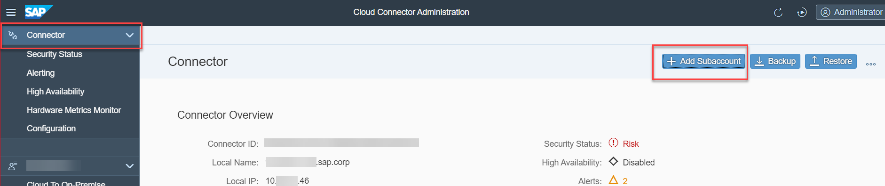

Provide the following information to connect to your Cloud Foundry subaccount.

| Field | Value |
|----|----|
|`Region`|`<Choose the region your account belongs to>` |
|`Subaccount` |`<This is the unique id of your subaccount>` |
|`Display Name` |`<This is an optional field>` |
|`Subaccount User` |`<Enter your cloud platform username (could be your email address)>` |
|`Password` |`<This requires no explanation, just your password>` |

Click **Save**.

<!-- border -->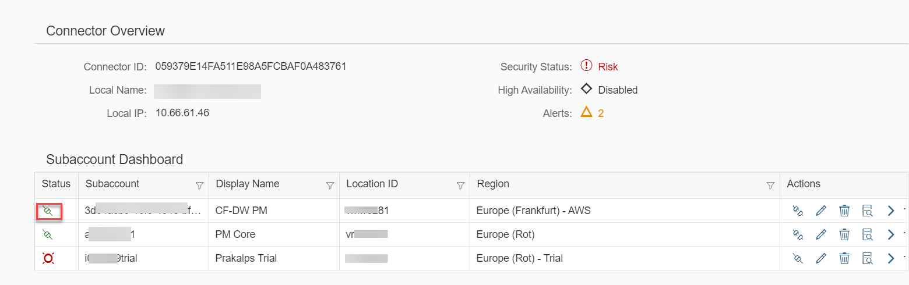

> The red box highlights the state which confirms that this particular connection has been made successfully.

### Update cloud connector certificates

Once we have connected successfully to the cloud platform, it is time to configure the Cloud Connector to be able to trust the ABAP backend  and vise versa.

In order to do this, we will replace the existing self signed certificates with certificates we have generated and signed using the tool as described here (Add link to XCA blog). It is of course not necessary to use exactly this tool, you can use the command like interface if you are comfortable with it or any other tool that will help you sign & generate the required certificates.

We are only doing this step in this manner to mimic a real life scenario. The principal propagation process will work equally well with self signed certificates too!

In the left navigation pane, click **Configuration**.
In the main window, click **On-Premise**

<!-- border -->

In the following steps we are going to create Certificate signing Requests (CSR's) and import the signed certificates for the System Certificate and the CA Certificate tabs respectively.

**System Certificate**

Click the first icon **Generate a certificate signing request** and then fill in the resulting form. The example below, only takes a few parameters. Your need may be different.

<!-- border -->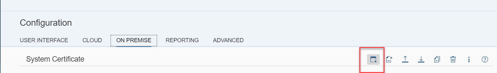

| Field | Value |
|----|----|
| `Common Name (CN)`| `<Choose an appropriate name. In this case we can use SCC for the cloud connector and SYS to indicate that this is the system certificate, resulting in SCCSYS as the CN>` |
| `Organizational Unit (OU)` | `<Here we will use PM for Product Management>` |
| `Organization (O)` | `<Here we can use SAP>` |
| `Country (C)` | `<Since we are writing this in Germany, lets use DE>` |

<!-- border -->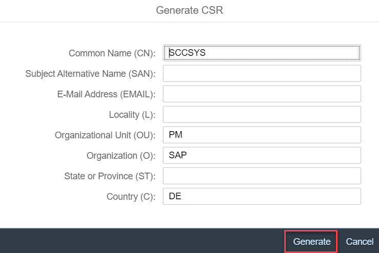

**CA Certificate**

Click the **Second** icon **Generate a certificate signing request** and then fill in the resulting form.

<!-- border -->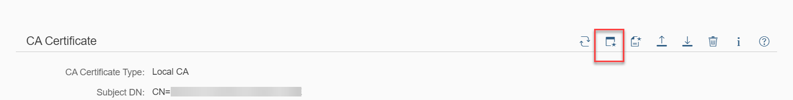

| Field | Value |
|----|----|
| `Common Name (CN)`| `<Choose an appropriate name. In this case we can use SCC for the cloud connector and CA to indicate that this is the CA certificate, resulting in SCCCA as the CN>` |
| `Organizational Unit (OU)` | `<Here we will use PM for Product Management>` |
| `Organization (O)` | `<Here we can use SAP>` |
| `Country (C)` | `<Since we are writing this in Germany, lets use DE>` |

<!-- border -->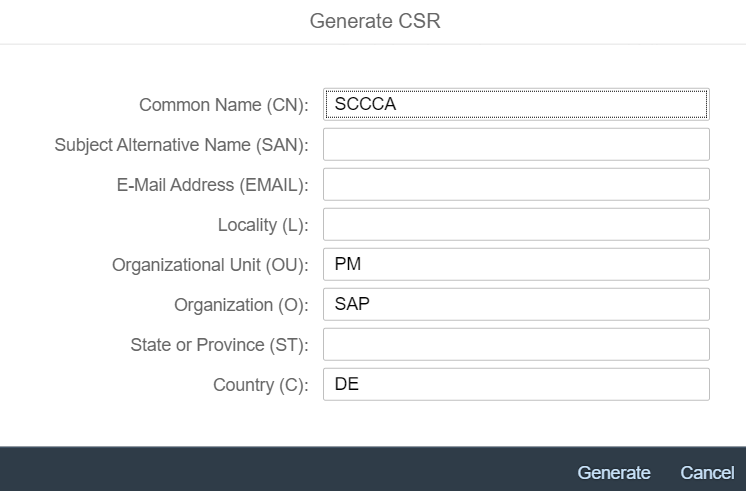

The CSR's should be downloaded to your local machine automatically.

> NOTE - Security configurations may apply. You may have to allow the file to be downloaded.

Once the CSR's are available, please sign them using the tool of your choice. In this case, we have used the graphical tool to execute this operation.

<!-- border -->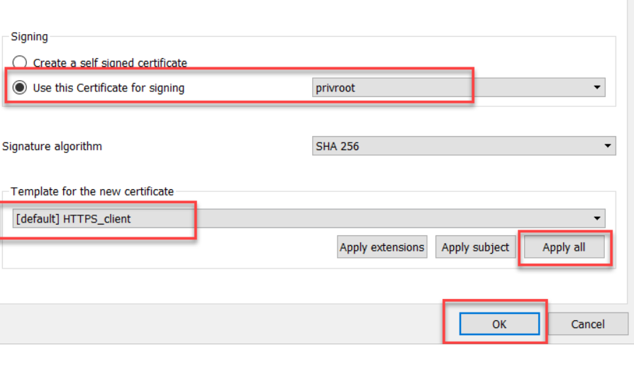

>This image is only for your reference. Many different tools can be used to sign certificates.

>If you need to use a graphical utility, refer to this blog where the process of creating and signing certificates is explained.

>Remember, Principal Propagation will work even with self signed certificates.

Once you have the certificates, import them into the cloud connector via the **third** & **fourth** icons respectively.

<!-- border -->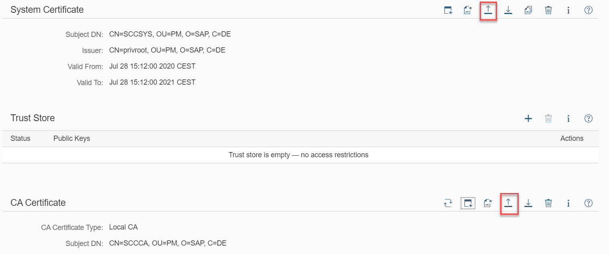

Optionally, you could now navigate to the **User Interface** tab and with the **third** icon in the UI Certificate section, copy the system Certificate to be used as the UI Certificate as well.

> The UI certificate configuration only servers to remove the warnings thrown by most modern browsers when faced with websites that present self signed certificates when being access using the HTTPS protocol.

### Define ABAP backend and Services

Once we are done with all the certificates, we are now ready to safely expose resources from the ABAP backend. the cloud connector offers a Access Control List type of whitelisting functionality where we can limit which backend resources are allowed to be access via the cloud connector.

First let us ensure that we are in the correct subaccount.

In the navigation panel on the left, we can see that the chosen subaccount is displayed. If you configure multiple subaccounts in one cloud connector, clicking on the subaccount name will open the overview page,

<!-- border -->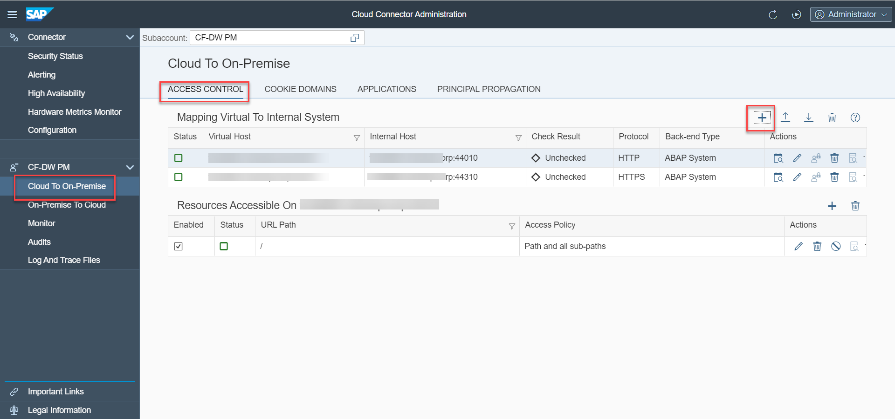

where, in the top left corner of the main panel, you will notice the subaccount label and it's associated field.

1. Clicking on the dropdown will show you the list of accounts connected.

2. Once you are certain that the correct subaccount has been chosen, click **Cloud to On-Premise** in the left navigation pane. Here we will configure the **access control** parameters.

3. Press the **+** sign in the **Mapping to Internal Systems** section and enter the appropriate details.

<!-- border -->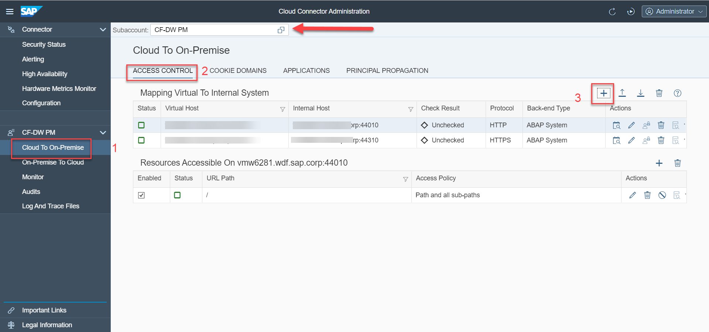

In the wizard, use the details below while clicking **Next** to progress to the next step or **Previous** to return to the preceding step.

<!-- border -->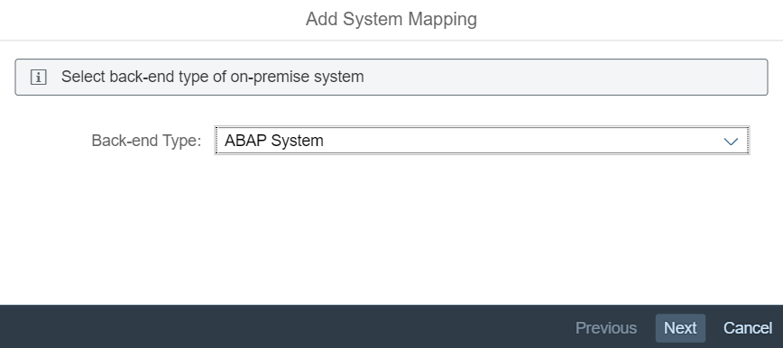

> It is not appropriate to add every step of the wizard here so only the first screen is shown. enter the values as described in the table below and press the next button to move through the wizard.

| Field | Value |
|----|----|
| `Back-End Type`| `Choose an appropriate system type. Here we have chosen`**ABAP** |
| `Protocol` | `Here we can choose between various options. We will use`**HTTPS** |
| `Internal Host` | `The FQDN of your SAP system, in our case, **mysaphostname.xyz.sap.com** ` |
| `Internal Port` | `The HTTPS port (since we made that choice earlier) in this case,`**44310** |
| `Virtual Host` | `The external name by which you want your SAP system, to be identified, in our case,`**ext.mysaphostname.xyz.sap.com** |
| `Virtual Port` | `The external HTTPS port (since we made that choice earlier) in this case, unchanged,`**44310**|
| `Principal type` | `X.509 Certificate General Usage (we will use the cloud connectors CA [remember the one we created a certificate for] to produce short lived certificates)`|
| `Description` | `This is an optional field`|
| `Description` | ``|

Finally, let us add resources that are exposed from this system.

The 'Resources' section allows us to define relative paths to expose specific services or use a blanket rule by simply entering '/' to indicate the root of the target system.

Here one may enable and disable existing rules as well as add new ones. Add one rule to begin with that allows access to the entire service tree as shown in the image below. You can tighten the scope as you get more comfortable with the settings.

<!-- border -->

For now, we cannot yet test the configuration to ascertain that data is indeed being retrieved. There are other dependencies that need to be fulfilled.
Even though there is no particular order, we will now move to configuring the ABAP backend.

Well Done! Now you are finished with setting up the access to your ABAP backend system.

---
