# Use an OData service created by Mobile Transaction Bridge to build a Mobile app.
<!-- description --> Using the MTB OData service we will build a Mobile App based on Mobile Development Kit client. The client is generated using wizards.

## Prerequisites
 - **Tutorial:** Set up ABAP
 - **Tutorial:** Set up Mobile Services
 - **Tutorial:** Create a Recording

## You will learn
  - How to build a Mobile Development Kit Client app in the Business Application Studio, using the provided template.## Introduction
Mobile Transaction Bridge, offers the end user full flexibility in the choice of the consumption vehicle for the OData service that has been published. One may build a Mobile app, a Web-App, deploy/publish the API endpoint from API Management Hub and so on. However, in order to remain true to the core of the tool, templates made available in Business Application Studio, aka. BAS (as well as WEBIDE) allow for creation of fully usable apps based on the Mobile Development Kit client (which is a metadata driven app with a bunch of cool features).
In this Tutorial we will primarily focus on using BAS and the related template.

### Open Business Application Studio (BAS) and login to the Cloud Foundry space

Log in to the SAP Cloud Platform Admin cockpit of your subaccount. In the navigation pane on the left, click on **Subscriptions**.

<!-- border -->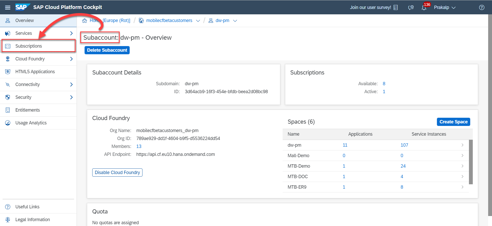

In the following screen, find and click on the **Go to Applications** link in the tile named **SAP Business Application Studio**.

<!-- border -->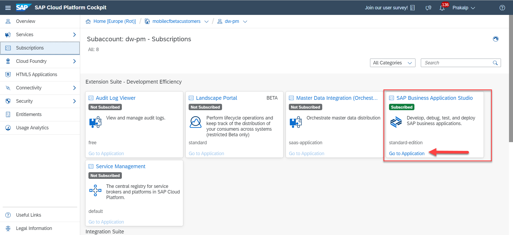

This **could** result in a logon as shown below …. If so, please login.

<!-- border -->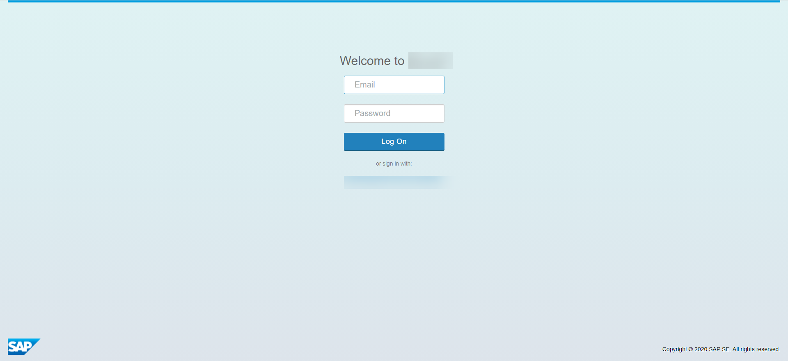

**OR** you could be directly logged into the application as shown below...

<!-- border -->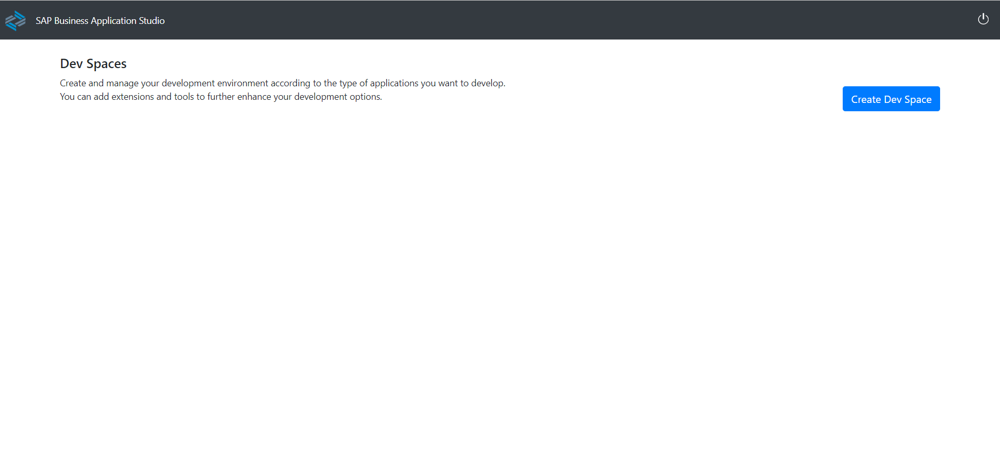

In the case above, you have most likely not created a dev space previously so press on the **Create Dev Space** button

<!-- border -->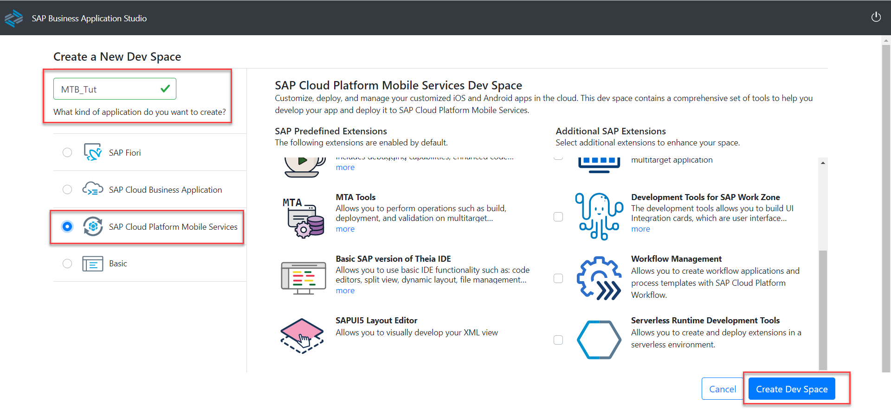

Enter an appropriate name for your space, Choose the radio button for **SAP cloud Platform Mobile Services** and then press the **Create Dev Space** button.

Now, you will see the space you have created appear in the list of Dev Spaces with the state **Starting**

<!-- border -->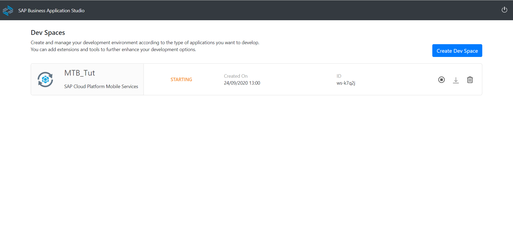

When the state changes to **Running**, click on the name of the Dev Space,

<!-- border -->

which is also a link and will take you into the space.
Here you will see the classical layout with an explorer in the left pane and the main work-area in the right pane (also referred to as the Master Detail view). Ideally, the **Welcome** page should be open.

<!-- border -->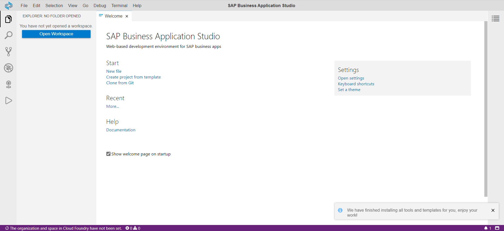

Now that we have successfully started our development environment in BAS, we will look at how to invoke the template wizard in Step 2.

### Setting up the workspace (for first time use) 

In the previous step we left it off with the Welcome page open in our BAS dev space. Assuming this is still the case,

Click on the **Create project from Template** link. Which will give us the following screen.

<!-- border -->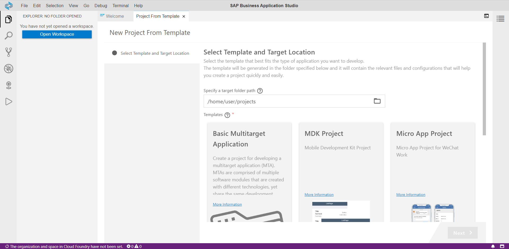

At which point we need to pause and evaluate what is being shown to us here as this is a fairly busy screen and there are a number of details to address.

1. The login information.
    1. You will see that the purple bar at the very bottom of the screen indicates some key data to be missing.
        1. The API should be pre-populated.
        2. The credentials for your cloud foundry account are required.
        3. Additionally, the Org & Space are requested.
2. The MTB Template tile, which is the one we click on to launch our wizard.
    <!-- border -->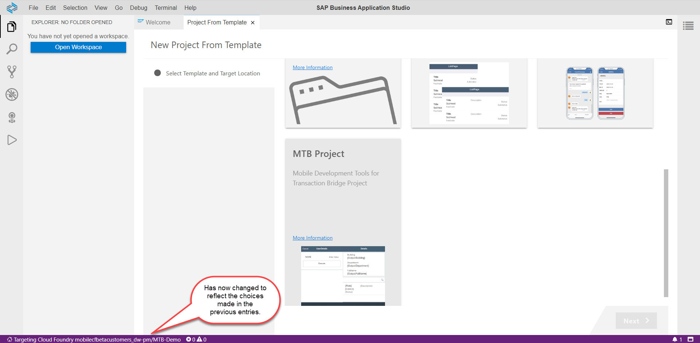
3. The workspace we will be using.
    1. Clicking the Open Workspace button will result in a folder browser. **If you are opening the workspace for the first time simply press the OPEN button.**
      <!-- border -->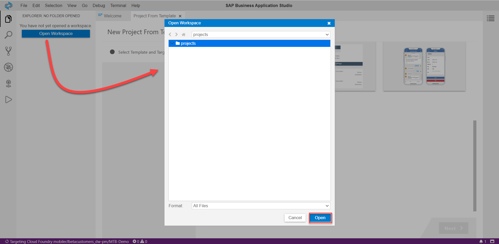
    And confirming the dialog will result in either a workspace being created for you or the workspace of your choice being opened.
        <!-- border -->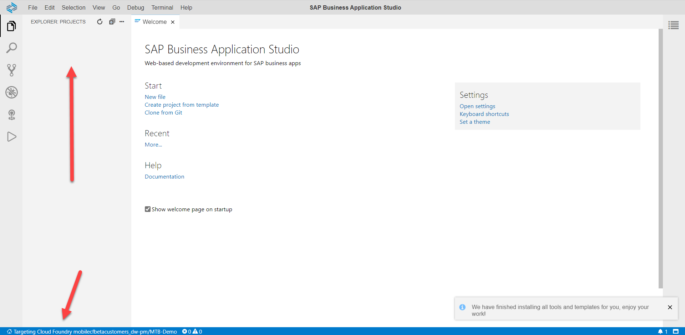 as well as returning you to the Welcome page.

Now that we have all the prerequisites let us try to get the ball rolling with the template.

### Invoking the template to create an MDK App

On the Welcome page, click on the **Create project from template** link again.

<!-- border -->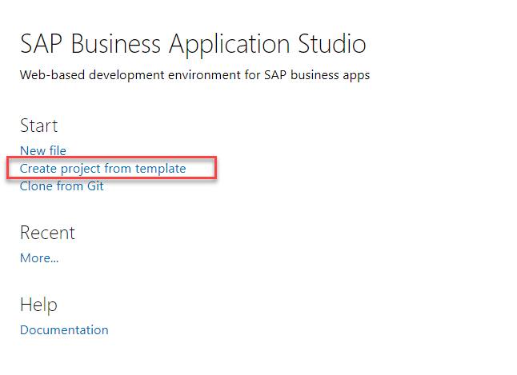

In the following screen, scroll down if you need to and click on the **MTB Project** tile and then the **Next** button.

<!-- border -->

This will kick off the wizard which feeds basic elements the template requires to generate our app.

NOTE: For the purposes of this wizard, unless otherwise specified, please press the **NEXT** or **FINISH** buttons as required.

1. Starting with a **Project** name
    <!-- border -->

2. Then the **Target** for our deployment. In this case, it is an Org called **DW-PM** and a Space called **MTB-Demo**. Your details **will** vary. The API details are picked up automatically and in our case i.e.. this tutorial, there is no need to edit this information.
    <!-- border -->

 3. When in the **Service Name** section,
    1. Give a name of your choice in the **Service File Name** field. You can safely replace the text "Sample Service" as this is simply a placeholder.
    2. Choose **Mobile Service** from the drop down in the **OData Source** field.
    3. If you do that, a list of apps from your Mobile Services instance will be displayed.
        <!-- border -->
    4. Choose the application you are using, in this case, it will be `com.sap.demo`

### Deploying the MDK Application

In the Previous step, we got as far as using the template / wizard, to create our application. Now it is time to deploy this application.

Since we are using the MDK project, deployment is a very simple process.
1. Expand the project
2. Find the file named `Application.app`
    <!-- border -->
3. Right click on the file and from the context menu click on **MDK Deploy**
    <!-- border -->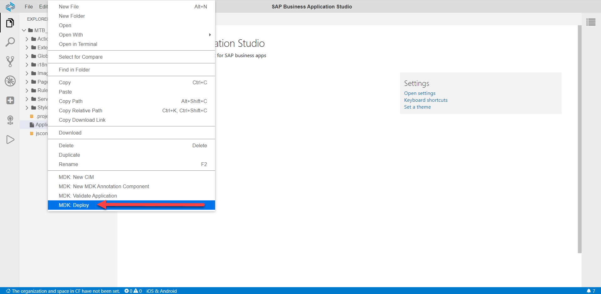
4. Doing so will give you a selection popup at the top of the main pane. In this case I am choosing Mobile Services since that is our starting point.
    <!-- border -->

As promised, deployment is a breeze. When the app has successfully deployed, you will see a success message in the bottom right hand corner of the main pane.

<!-- border -->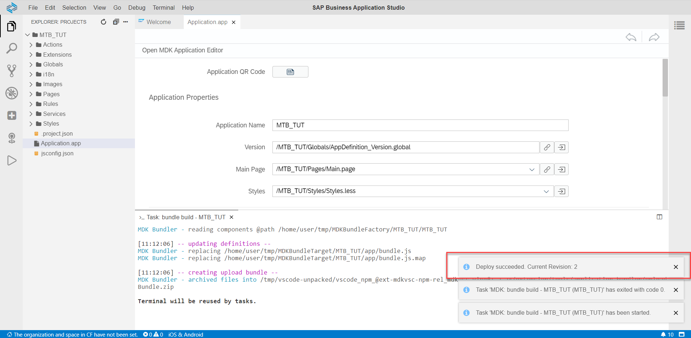

### Testing the app on a Mobile Device

The Mobile Development Kit Client is a metadata driven application, meaning the app container stays the same but all the content can be manipulated on the fly.

Given this nature of the app, we can onboard devices very simply by scanning a QR code.

1. Expand your **project** and find the **Application.app** file.
    <!-- border -->
2. Clicking on this file will open it in the main pane.
    1. Once open, find the **Application QR Code** label at the top of the file.
        <!-- border -->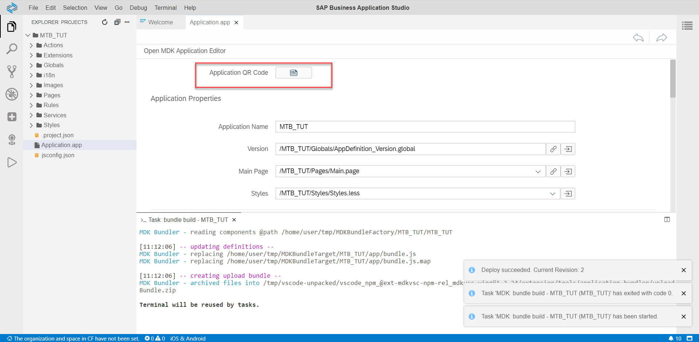
    2. This will open a modal popup with a QR code. If you have to, close the console at the bottom of your screen by clicking on the 'x' for each open tab.
        <!-- border -->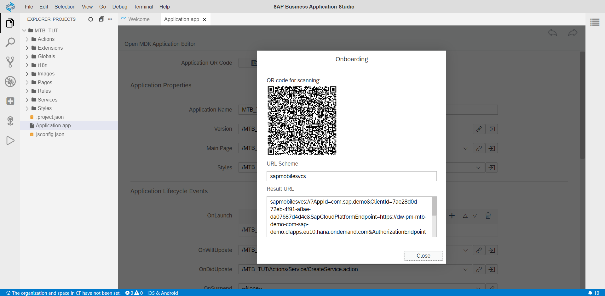
3. Now on your Mobile Device, install the Mobile Services Client app from the store of your choice.
    <!-- border -->

4. The first run will bring you to a license and T&C page. Press **Accept** if you wish to continue.

    <!-- border -->

5. The next screen provides a choice of working with a demo or point the app to a real app. This is of course our choice. Press the **Get Started** button.

    <!-- border -->

6. If this is the first time you are using the app, the only option displayed is **QR Code Scan**. If you previously have configured you will be asked if you want to load the current app or scan a QR code for a new app. In our case now, we need to scan the QR code from our **Application.app** file. Once done, press the **Continue** button.

    <!-- border -->

7. Next log in to your SAP Cloud Platform tenant.

    <!-- border -->

8. You may be asked to maintain a passcode and given the choice of using biometric id.
Once you are done, the app update feature will ask if you want to update. Press the **OK** button.
    <!-- border -->

9. Once the app is ready with the update, you will see a message at the bottom of your phone screen saying the service has been initialized. See the screenshot below as an example.
This is excellent, as we are now ready to use the application.
    <!-- border -->

Remember when we did the recording? We decided that we are going to search for a user.

10. Press the **Find** link in the app.

    <!-- border -->

11. In the resulting fields, choose any of the fields to fill out; Remember we unticked the **Mandatory** checkbox when creating the recording.

    <!-- border -->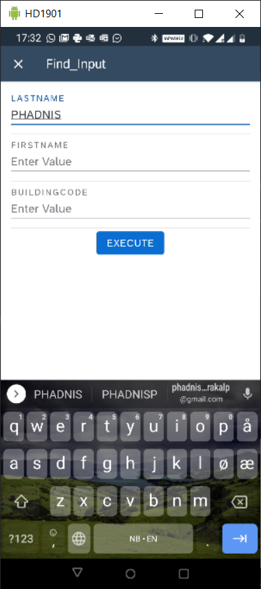

And voila! Here we have data from our backend ABAP system in a Mobile Application using the OData service we built using the Mobile Transaction Bridge.

---
