# Introduction to NSE
<!-- description --> The goal of the tutorial is to create a new XSA user

## Prerequisites
 - You must be connected to a Database before you begin this tutorial
 - Prerequisite 2


## You will learn
  - How to navigate the capabilities of NSE
  - Why this technology is helpful

## Intro
Add additional information: Background information, longer prerequisites

---

### Creating a New XSA User - optional


Open Web IDE and login with your admin user

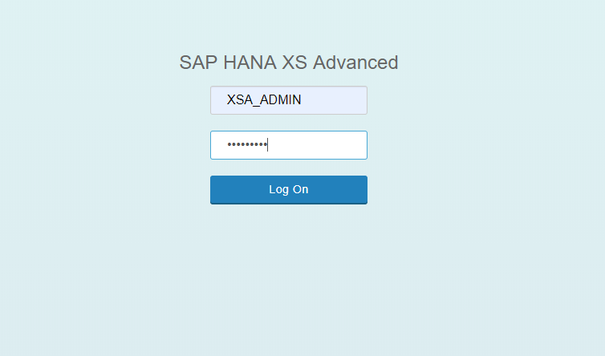

Navigate to the XSA Cockpit using the Tools menu found on the top of the page.

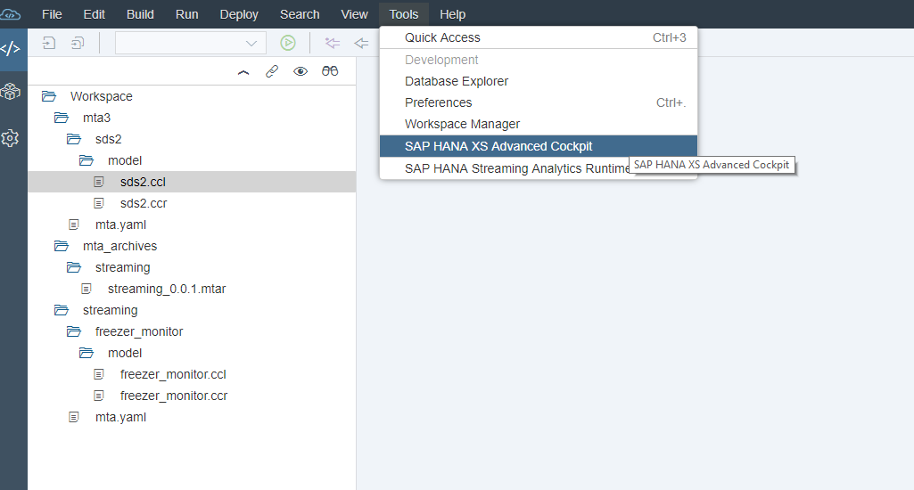


Once on the XSA Cockpit homepage, select **User Management**.

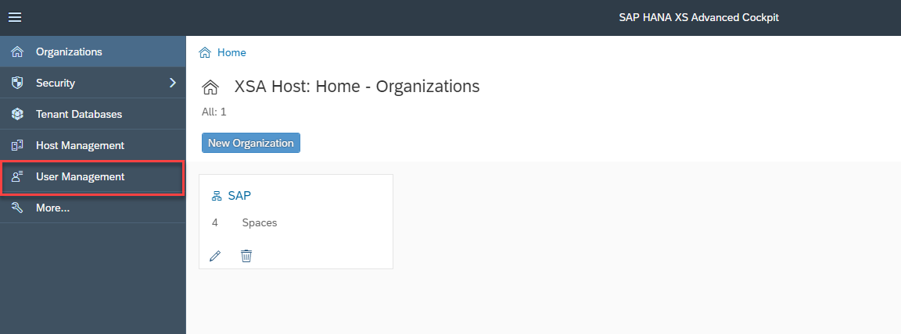


On the user management page select **New User**.

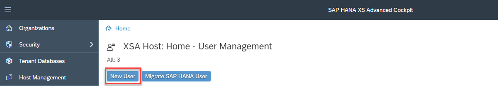


In the modal that appears complete the form and click create.

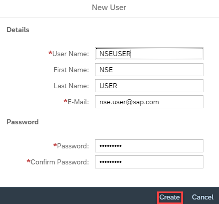


Give the new user **WEBIDE** permissions so that the rest of the exercises can be completed using this user.

Click the **Assign Role** Collections icon.

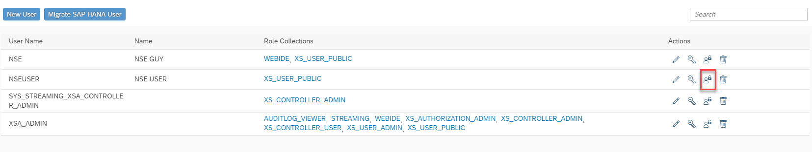


Click the **Add** button.

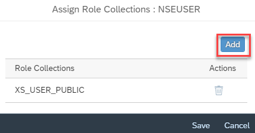


Select the **WEBIDE** role collection and click OK.

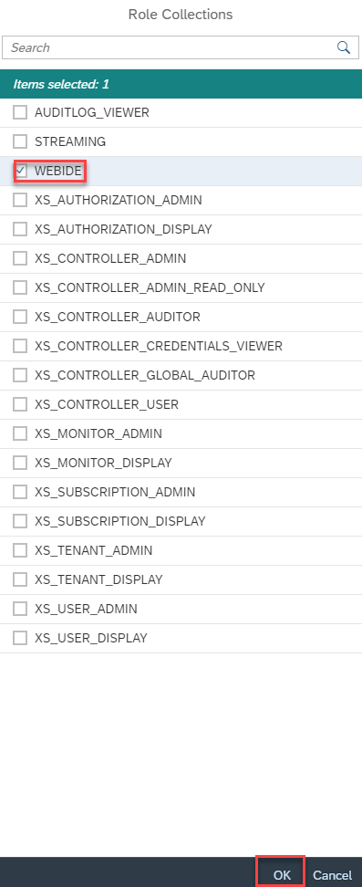


Click **SAVE**

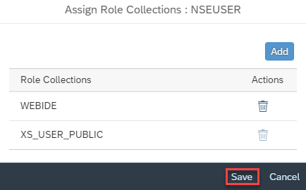


Now you can log out of your admin user and log back in as the user that was just created.


### Connecting to a Database

Open Web IDE and login with a user you have already setup


Navigate to the database explorer by click on the database explorer icon on the left side of the screen.

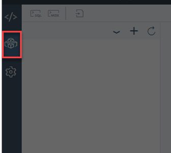

If you have not added a database by either selecting yes to the pop up modal.

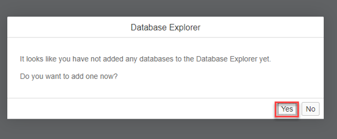

**OR** selecting the + symbol in the right hand corner of the side menu.

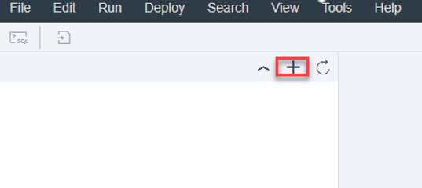

Enter the database connection information in the Add Database modal.

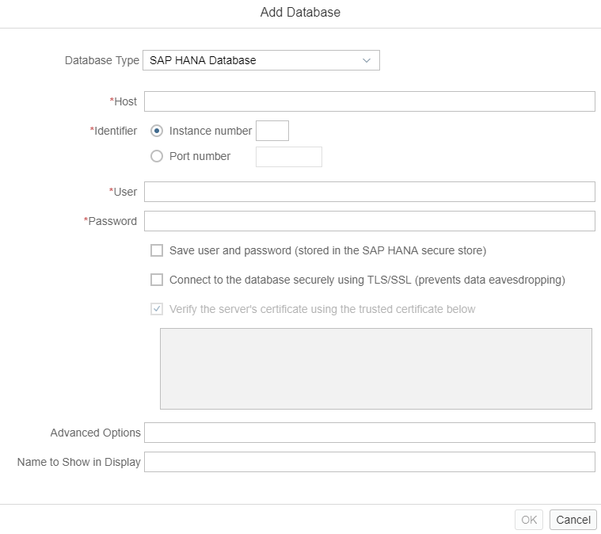

Once the database is connected right click on it in the side menu and select **Open SQL console**.

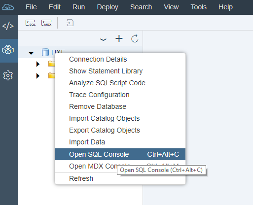

Your database is now connected and you are able to perform queries on it via the SQL console.


### Create Tables And Import Data

Download the data found at the following URL. Store data on your HANA system in the following directory:
```
/hana/shared/[SID]/HDB[instance number]/work/
```


Download link: (https://s3.amazonaws.com/sapiq/Dynamic+Tiering+Quick+Start+Guide/SAP+HANA+Dynamic+Tiering+Quick+Start+Guide+-+Supporting+Files.zip)

With the SQL console open run the following code. This code creates a Schema called NSE as well as two tables within that schema that we will use later.

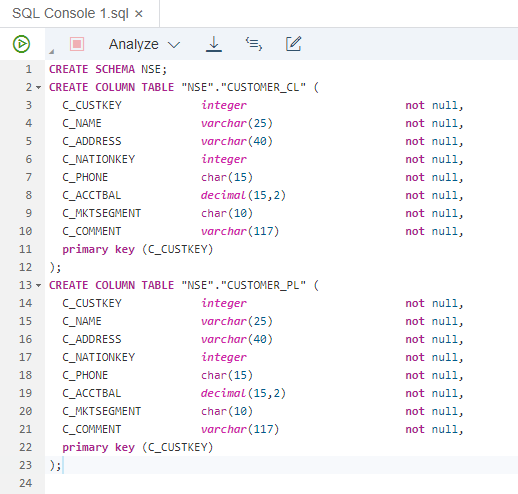

Make sure previous steps are completed before continuing. Run the following code in the SQL console to import the data into the tables that were created in previous step. Note: The file path shown in the code below should be adjusted to reflect your HANA system.
```
/hana/shared/[SID]/HDB[instance number]/work/
```
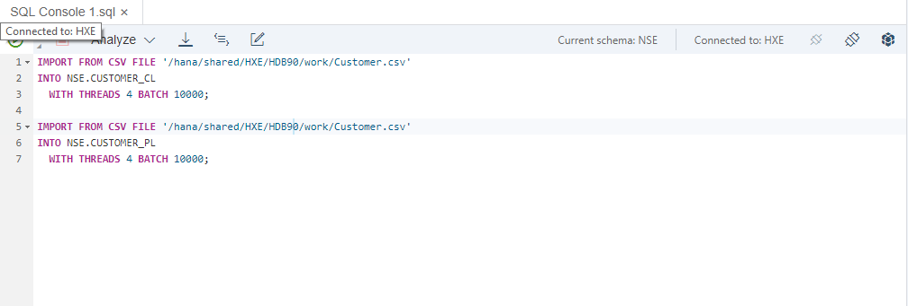

Using the left hand menu navigate to the tables that were created by selecting <DB Name> -> **Catalog** -> **NSE** -> **Tables**

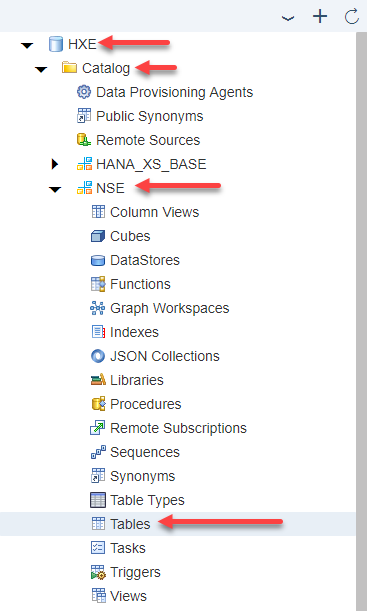

Verify the data was imported correctly by right click on a table and selecting open data.

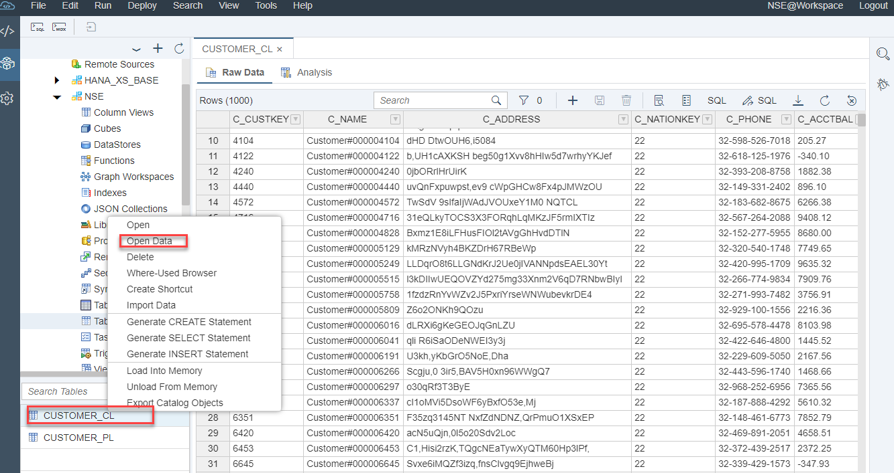

You should see that all your data was imported.


### Enable And Use NSE

Configure the buffer cache size. By default buffer the buffer cache size is set to be 10% of the size of the HANA system's memory. Run this code to alter it.

``` SQL
ALTER SYSTEM ALTER CONFIGURATION ('indexserver.ini', 'SYSTEM')
SET ('buffer_cache_cs', 'max_size') = <size in MB> with reconfigure;**
```


Note: The unit of measurement in the command is MB (buffer cache is set to 100000MB or 100GB in this example)
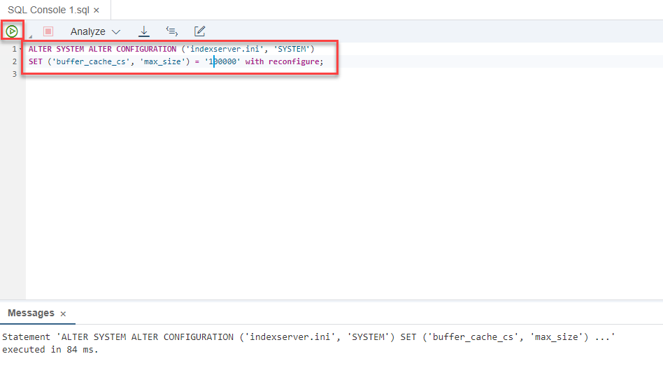

To check the size of your buffer cache you can run the following command.
``` SQL
SELECT ROUND(MAX_SIZE/1024/1024/1024,3) as MAX_SIZE, round(USED_SIZE/1024/1024/1024,3) as USED_SIZE from SYS.M_BUFFER_CACHE_STATISTICS_ where USED_SIZE > 0
```
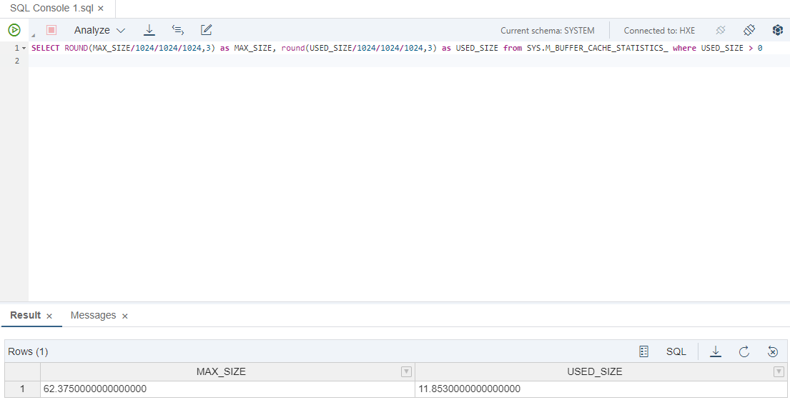

To monitor the SAP HANA NSE buffer cache you can run these commands and view the output.

``` SQL
SELECT * FROM M_BUFFER_CACHE_POOL_STATISTICS;

SELECT * FROM M_BUFFER_CACHE_STATISTICS;
```
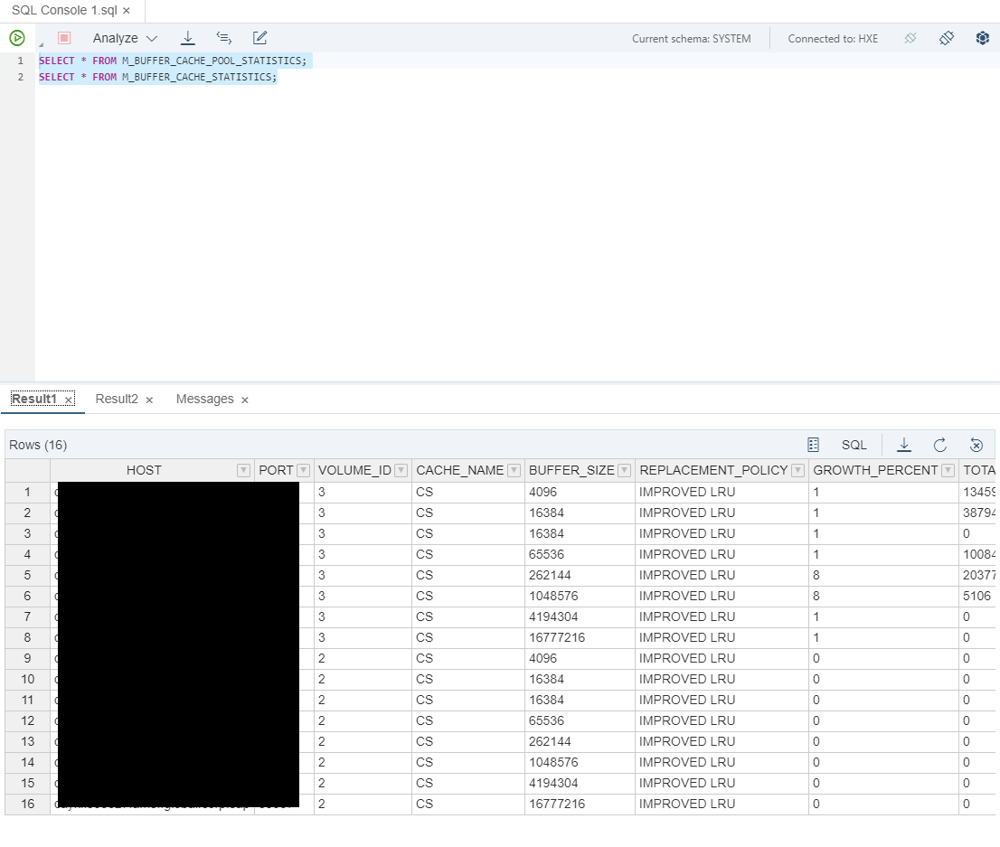

Now we are going to convert one of our tables to page loadable. This is so the HANA does not need to load the entire table into memory when a query is run against it. Instead, HANA only loads the columns that are required for the query. This improves warm data performance.
``` SQL
ALTER TABLE NASE.CUSTOMER_PL PAGE LOADABLE
```
**Work to be done for follow up steps!!!**


### Enable And Use Advisor

Navigate to your HANA Cockpit and log in.

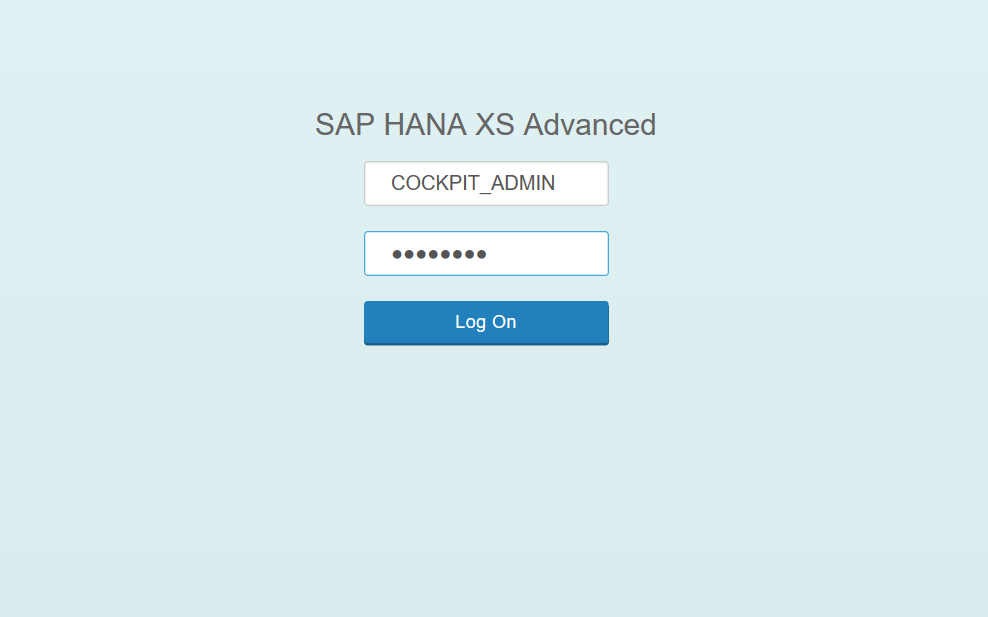

Navigate to your System Overview page, find the Recommendations tile and select Recommendations.


On the Recommendations page select Configure on the top right hand corner of the page.

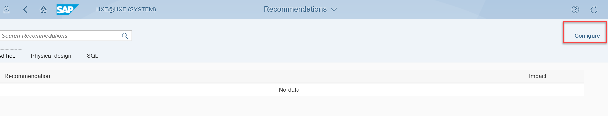

Turn on NSE Advisor by selecting the on button under Native Storage Extension (NSE) Advisor.

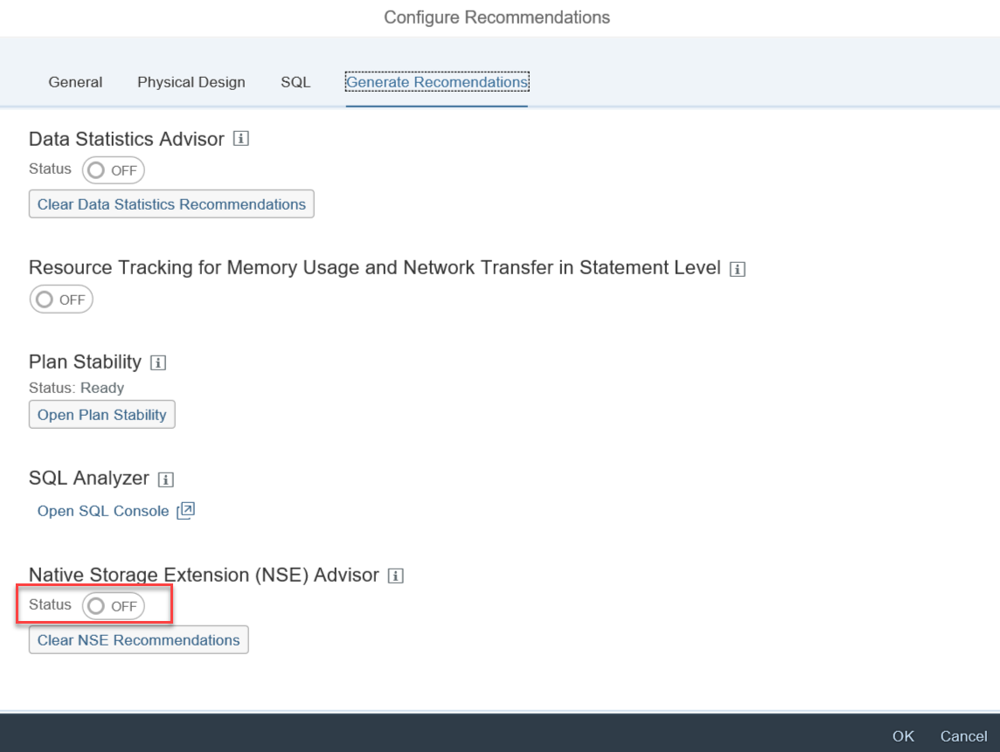

To get recommendations from the NSE advisor run a query against a table.
``` SQL
SELECT TOP 25 * FROM NSE.CUSTOMER_PL;
```
Note: The NSE advisor's suggestions get better with more queries. This example only runs a single query and therefore the NSE advisor's recommendation will not be as refined.

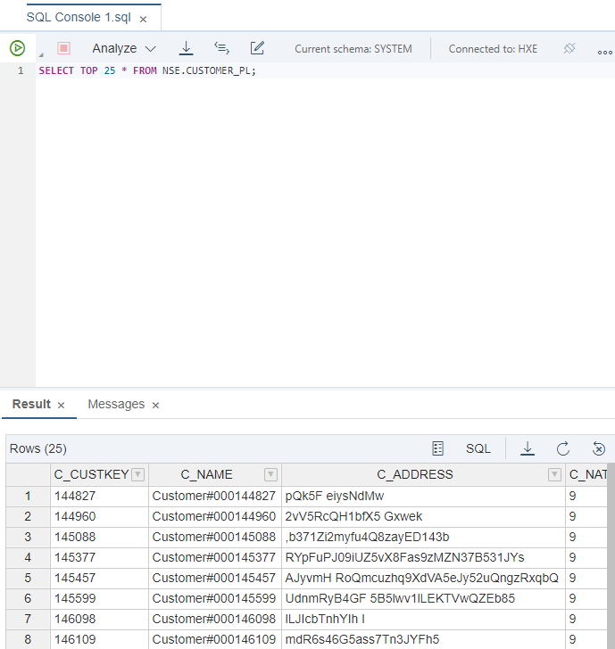

When you want to see any NSE recommendation you may have it is done through the HANA Cockpit.

From the Systems Overview Page, Find and click the recommendations tile.

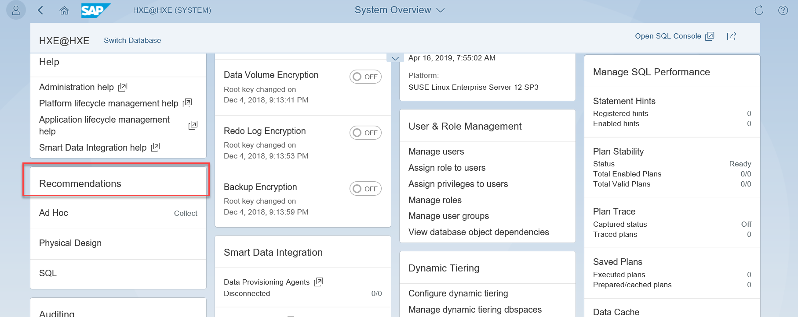
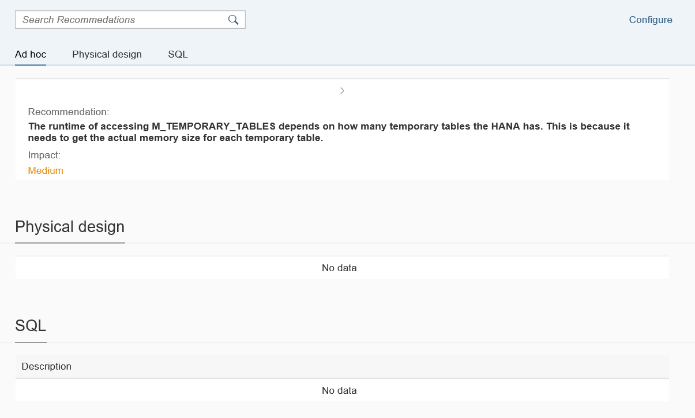


### NSE Enabled Partitioned Tables

Open a SQL console and the the following code. This will create a table that we are partitioning by a range.
Each partition will have its own load unit.
``` SQL
CREATE COLUMN TABLE "NSE"."CUSTOMER_PART" (
   C_CUSTKEY            integer                        not null,
   C_NAME               varchar(25)                    not null,
   C_ADDRESS            varchar(40)                    not null,
   C_NATIONKEY          integer                        not null,
   C_PHONE              char(15)                       not null,
   C_ACCTBAL            decimal(15,2)                  not null,
   C_MKTSEGMENT         char(10)                       not null,
   C_COMMENT            varchar(117)                   not null,
   primary key (C_CUSTKEY)
)
PARTITION BY RANGE (C_CUSTKEY)
((
	PARTITION 0 <= VALUES < 1500 PAGE LOADABLE,
	PARTITION 1500 <= VALUES < 3000 COLUMN LOADABLE,
	PARTITION OTHERS COLUMN LOADABLE
));
```
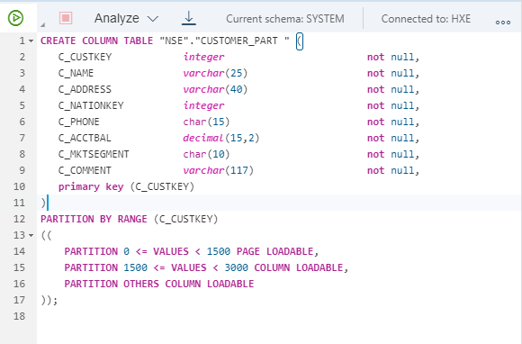

**Import our data to the table we just created with the following code.**
``` SQL
IMPORT FROM CSV FILE '/hana/shared/HXE/HDB90/work/Customer.csv'
INTO NSE.CUSTOMER_PART
  WITH THREADS 4 BATCH 10000;
```

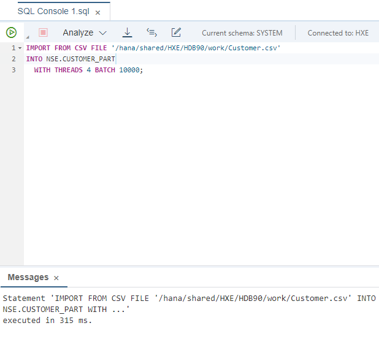

**If you want to alter the load unit of a partition you can run this code.**

``` SQL
ALTER TABLE NSE.CUSTOMER_PART ALTER PARTITION RANGE (C_CUSTKEY)
((PARTITION 1500 <= VALUES < 3000)) PAGE LOADABLE;
```
**We can verify our table partitions by running the following code.**
``` SQL
SELECT P.schema_name,P.table_name,P.partition,P.range,P.subpartition,P.subrange,
TP.part_id,TP.load_unit,TP.loaded,TP.record_count FROM M_CS_PARTITIONS P INNER JOIN M_TABLE_PARTITIONS TP
ON P.part_id = TP.part_id AND P.schema_name = TP.schema_name AND P.table_name = TP.table_name
WHERE P.table_name = 'CUSTOMER_PART';
```

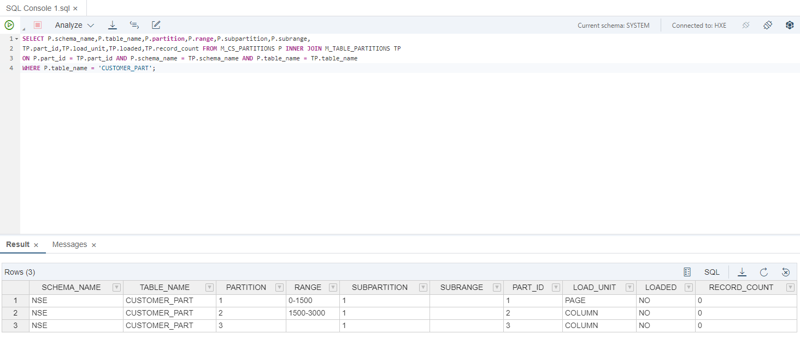

**Another way to change the load unit of a partition is by using the following command.**

``` SQL
ALTER TABLE <TABLE NAME> ALTER PARTITION <PARTITION NUMBER> <PAGE | COLUMN | DEFAULT> LOADABLE
```
**Note**: The partition number can be found in the "Partition" column of the results from the previous step.

You can also create Second-Level NSE-Enabled partitions. That is create partitions of a partition and assign their load unit.

Let's create a new table with the following command.

``` SQL
CREATE COLUMN TABLE "NSE"."CUSTOMER_PART2" (
   C_CUSTKEY            integer                        not null,
   C_NAME               varchar(25)                    not null,
   C_ADDRESS            varchar(40)                    not null,
   C_NATIONKEY          integer                        not null,
   C_PHONE              char(15)                       not null,
   C_ACCTBAL            decimal(15,2)                  not null,
   C_MKTSEGMENT         char(10)                       not null,
   C_COMMENT            varchar(117)                   not null,
   primary key (C_CUSTKEY)
)
PARTITION BY RANGE (C_CUSTKEY)
((
	PARTITION 0 <= VALUES < 1500 PAGE LOADABLE,
	PARTITION 1500 <= VALUES < 3000 COLUMN LOADABLE,
	PARTITION OTHERS COLUMN LOADABLE)
	SUBPARTITION BY RANGE (C_CUSTKEY)
	(PARTITION 0 <= VALUES < 100,
		PARTITION 100 <= VALUES < 200, PARTITION 200 <= VALUES < 300, PARTITION OTHERS
));
```
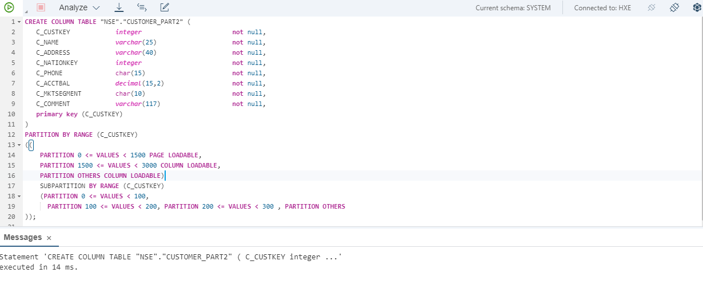

Run the follow command to see the ranges, sub-ranges, and their load unit.
``` SQL
SELECT P.schema_name,P.table_name,P.partition,P.range,P.subpartition,P.subrange,
TP.part_id,TP.load_unit,TP.loaded,TP.record_count FROM M_CS_PARTITIONS P INNER JOIN M_TABLE_PARTITIONS TP
ON P.part_id = TP.part_id AND P.schema_name = TP.schema_name AND P.table_name = TP.table_name
WHERE P.table_name = 'CUSTOMER_PART2';
```

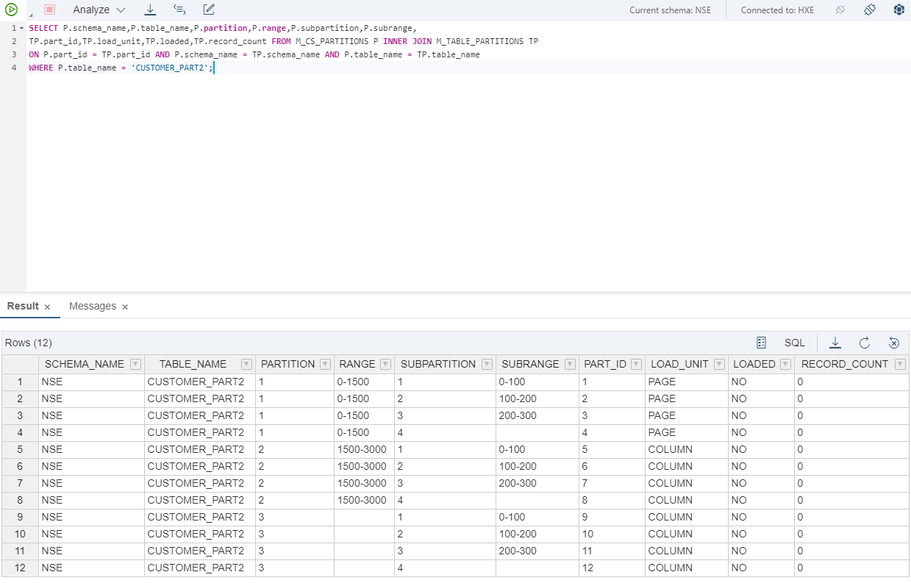

To change the load unit of a second level partition

``` SQL
ALTER TABLE NSE.CUSTOMER_PART2 ALTER PARTITION
RANGE (C_CUSTKEY) ((PARTITION 1500 <= VALUES < 3000)
SUBPARTITION BY RANGE(C_CUSTKEY) (PARTITION 200 <= VALUES < 300)) PAGE LOADABLE;
```

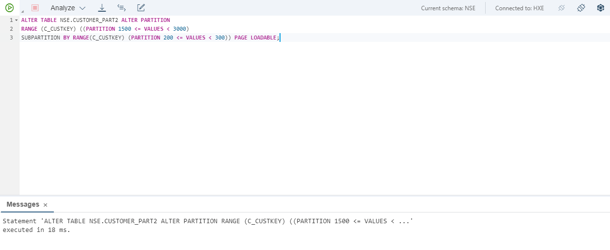

Run the script below (ran previously to see ranges, sub-ranges and their load units) and verify that the sub-partition's load unit has been altered to PAGE LOADABLE
``` SQL
SELECT P.schema_name,P.table_name,P.partition,P.range,P.subpartition,P.subrange,
TP.part_id,TP.load_unit,TP.loaded,TP.record_count FROM M_CS_PARTITIONS P INNER JOIN M_TABLE_PARTITIONS TP
ON P.part_id = TP.part_id AND P.schema_name = TP.schema_name AND P.table_name = TP.table_name
WHERE P.table_name = 'CUSTOMER_PART2';
```


---
